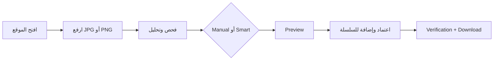

<div dir="rtl" align="right">

# 🩺 تشغيل مشروع طبيب الوثائق محلياً

> هذا الدليل مخصص لتشغيل النسخة الحالية من **Manuscript Doctor** على Windows أو Linux أو macOS باستخدام Flask وPython وOpenCV، دون Docker.

---

## 1. ما تحتاجه فعلياً

| المتطلب | الاستخدام |
| --- | --- |
| Python 3.11 أو أحدث | تشغيل Flask ووحدات المعالجة |
| `pip` | تثبيت الاعتماديات |
| متصفح حديث | تجربة الواجهة RTL والمعاينة |
| المشروع كاملاً | لأن Flask والواجهة وProcessing مترابطة |

لا تحتاج إلى Node.js لتشغيل الموقع. يستخدم Node اختيارياً فقط لفحص Syntax لملفات JavaScript.

---

## 2. بنية الملفات الضرورية

```text
image_project_split/
├── app.py
├── requirements.txt
├── pytest.ini
├── templates/
│   └── index.html
├── static/
│   ├── css/
│   │   ├── style.css
│   │   └── parts/
│   ├── js/
│   │   ├── main.js
│   │   └── parts/
│   └── assets/
├── processing/
│   └── ops/
│       ├── registry.py
│       └── super_resolution.py
├── storage/
│   ├── uploads/
│   ├── results/
│   └── preparation_previews/
├── tests/
├── tools/
├── evaluation/
└── docs/
```

| المجلد | هل يلزم لتشغيل الموقع؟ | وظيفته |
| --- | --- | --- |
| `app.py` | نعم | خادم Flask ومسارات API |
| `processing/` | نعم | التحليل، التوصيات، OpenCV، والعمليات |
| `templates/` | نعم | صفحة التطبيق الرئيسية |
| `static/` | نعم | CSS وJavaScript والأصول البصرية |
| `storage/` | نعم وقابل للكتابة | الصور والنتائج والمعاينات المؤقتة |
| `tests/` | لا للتشغيل | اختبارات الوحدات والتكامل |
| `evaluation/` | لا للتشغيل الأساسي | صور C05/C06 وملفات التقييم |
| `docs/` | لا للتشغيل | التوثيق الأكاديمي والتقني |
| `tools/` | لا للتشغيل الأساسي | أدوات QA والتجارب المساعدة |

لا تنقل `app.py` أو مجلد `processing` منفرداً؛ استخدم مجلد المشروع كاملاً.

---

## 3. إنشاء البيئة الافتراضية

افتح الطرفية داخل مجلد المشروع:

### Windows PowerShell

```powershell
py -3.11 -m venv .venv
.\.venv\Scripts\Activate.ps1
python -m pip install --upgrade pip
python -m pip install -r requirements.txt
```

إذا كان لديك Python 3.12 أو أحدث، يمكن استبدال `3.11` بالإصدار المثبت.

إذا منع PowerShell تشغيل البيئة، نفذ الأمر التالي مرة واحدة بحساب المستخدم:

```powershell
Set-ExecutionPolicy -Scope CurrentUser RemoteSigned
```

### Linux أو macOS

```bash
python3 -m venv .venv
source .venv/bin/activate
python -m pip install --upgrade pip
python -m pip install -r requirements.txt
```

للتأكد من أن البيئة الصحيحة مفعلة:

```bash
python --version
python -c "import cv2, numpy; print('OpenCV:', cv2.__version__); print('NumPy:', numpy.__version__)"
```

---

## 4. تشغيل Flask

بعد تفعيل البيئة وتثبيت الاعتماديات:

```bash
python -m flask --app app:create_app run --debug
```

ثم افتح:

```text
http://127.0.0.1:5000
```

لإيقاف الخادم اضغط `Ctrl+C`.

> استخدم صيغة `app:create_app` كما هي. لا تشغّل `app.py` مباشرة إذا لم تكن بحاجة إلى ذلك؛ نقطة التشغيل المعتمدة هي Flask Application Factory.

### تغيير المنفذ اختيارياً

```bash
python -m flask --app app:create_app run --debug --port 5001
```

ثم افتح `http://127.0.0.1:5001`.

---

## 5. طريقة الاستخدام



1. ارفع صورة JPG أو JPEG أو PNG بالسحب والإفلات أو باختيارها من الجهاز.
2. انتظر انتهاء الفحص وظهور Metrics وDiagnosis وRecommendation.
3. استخدم **تجهيز الوثيقة** عند الحاجة إلى الاتجاه أو التصحيح أو Crop.
4. اختر عملية يدوية لرؤية Preview قبل الاعتماد.
5. العمليات الخفيفة مثل Rotate وFlip وIntensity وGamma تعرض Preview محلية سريعة عبر Canvas.
6. العمليات الأثقل تستخدم Preview خادمية، وقد ترسل الواجهة `X-Preview-Format: jpeg` لتقليل حجم النقل.
7. اضغط **اعتماد العملية وإضافتها للسلسلة** لإنشاء Result حقيقية عبر Flask/OpenCV.
8. يمكن تنفيذ خطوة يدوية لاحقة فوق النتيجة المعتمدة السابقة، ثم مراجعة before/after وUndo/Redo.
9. استخدم Smart Pipeline عندما تريد معالجة Rule-Based مشروطة بالتشخيص وPreservation.
10. نزّل النتيجة المعتمدة بعد ظهور قرار التحقق.

---

## 6. Super Resolution

تظهر **Super Resolution** كعملية يدوية مستقلة ضمن العمليات المتقدمة.

| الإعداد | القيمة المرجعية |
| --- | ---: |
| `scale` | `2×` |
| `amount` | `0.35` |
| `sigma` | `1.0` |

تنفذ النسخة الحالية تكبيراً محافظاً باستخدام Lanczos ثم Unsharp Masking عبر `processing/ops/super_resolution.py`. لا تحتاج إلى تنزيل نموذج Deep Learning أو ملف أوزان خارجي.

استخدمها عندما تكون الصورة منخفضة الدقة وبعض تفاصيل الحروف ما زالت موجودة. لا يمكنها استعادة حرف فُقد كلياً بسبب ضبابية أو دقة غير كافية، ولذلك تبقى عملية اختيارية وتتطلب مراجعة قبل الاعتماد.

---

## 7. تشغيل الاختبارات

بعد تفعيل البيئة الافتراضية:

```bash
PYTHONPATH=. pytest -q tests
```

النتيجة المرجعية للنسخة الحالية:

```text
333 passed, 16 skipped
```

لفحص Syntax لملفات JavaScript:

```bash
for f in static/js/parts/*.js; do
  node --check "$f"
done
```

في PowerShell:

```powershell
Get-ChildItem static\js\parts\*.js | ForEach-Object { node --check $_.FullName }
```

تفاصيل استراتيجية الاختبار في [`docs/testing.md`](docs/testing.md)، وسيناريوهات المتصفح في [`docs/e2e-testing.md`](docs/e2e-testing.md).

---

## 8. صور العرض والاختبار

للعرض الأكاديمي استخدم صوراً متنوعة، ومنها:

| الحالة | الغرض |
| --- | --- |
| C05 | اختبار Smart Preparation وdeskew-only وSuper Resolution |
| C06 | اختبار Manual Chain وCrop وUndo/Redo وbefore/after |
| صورة داكنة | اختبار Gamma وCLAHE |
| صورة منخفضة التباين | اختبار Contrast |
| صورة noisy | اختبار Denoising مع مراجعة التفاصيل |
| صورة uneven lighting | اختبار Illumination وBinarization |

لا تستخدم نتيجة Preview المحلية باعتبارها ملف التسليم؛ الاعتماد هو الذي ينشئ Artifact خادماً قابلاً للتنزيل والتحقق.

---

## 9. Troubleshooting

### تعذر استيراد OpenCV أو NumPy

تأكد من تفعيل `.venv` ثم أعد التثبيت:

```bash
python -m pip install -r requirements.txt
```

### المنفذ مستخدم

شغّل Flask على منفذ آخر:

```bash
python -m flask --app app:create_app run --debug --port 5001
```

### مجلدات التخزين غير قابلة للكتابة

يجب أن تكون المجلدات التالية موجودة وقابلة للكتابة:

```text
storage/uploads/
storage/results/
storage/preparation_previews/
```

### ظهرت بيانات صورة سابقة

استخدم زر بدء صورة جديدة أو أعد تحميل الصفحة. عند اختيار صورة جديدة يجب أن تصفر الواجهة التحليل والسلسلة والنتائج السابقة.

### الاختبارات تتكرر أو تفشل بسبب ملفات قديمة

تأكد من تشغيل الاختبار من جذر المشروع، ثم نظف الملفات المؤقتة:

```bash
find . -type d -name __pycache__ -prune -exec rm -rf {} +
rm -rf .pytest_cache
PYTHONPATH=. pytest -q tests
```

في Windows يمكن حذف مجلدات `__pycache__` و`.pytest_cache` يدوياً أو عبر PowerShell.

### الصورة كبيرة أو Smart بطيء

زمن Smart يشمل Preparation والتحليل والتحقق، وليس Preview اليدوي فقط. حجم الملف بالكيلوبايت لا يكفي لتقدير الكلفة؛ الأبعاد وعدد البكسلات والخوارزمية المستخدمة عوامل مؤثرة. لا توقف الخادم أثناء العملية، ولا توصف Smart Pipeline بأنها لحظية.

### Super Resolution لا تجعل النص مقروءاً

هذا متوقع عندما تكون المعلومات الأصلية مفقودة أو ضبابية جداً. جرّب تصحيح الإضاءة أو التباين أو الشحذ باعتدال، واحتفظ بالأصل للمقارنة؛ لا تعتبر التكبير دليلاً على استعادة النص.

---

## 10. ملاحظات التشغيل والأمان

- لا تحذف مجلد `processing/` أو `templates/` أو `static/`.
- لا تضع صوراً شخصية أو نتائج حساسة داخل الحزمة عند مشاركتها.
- ملفات `storage/` Runtime وليست جزءاً من المصدر الأكاديمي؛ نظفها قبل تسليم نسخة مضغوطة.
- لا ترسل مسارات ملفات محلية إلى API؛ الواجهة تستخدم `image_id` و`result_id`.
- لا تضف Docker أو Database أو Authentication لتشغيل النسخة المحلية الحالية.
- لا تخلط بين Preview المؤقتة وResult المعتمدة.
- لا تعتمد Smart أو Super Resolution دون مراجعة الرسالة وPreservation.

---

## 11. روابط التوثيق

- [`README.md`](README.md) — بوابة المشروع.
- [`docs/architecture.md`](docs/architecture.md) — المعمارية والعقود.
- [`docs/workflow.md`](docs/workflow.md) — تدفق المستخدم والنظام.
- [`docs/testing.md`](docs/testing.md) — استراتيجية الاختبار.
- [`docs/e2e-testing.md`](docs/e2e-testing.md) — اختبار المسار الكامل.
- [`docs/operation-evaluation.md`](docs/operation-evaluation.md) — تقييم العمليات.
- [`docs/decisions.md`](docs/decisions.md) — القرارات الهندسية.

</div>
