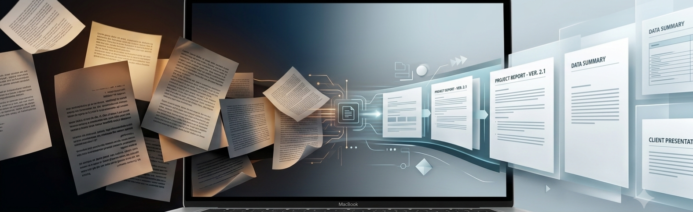
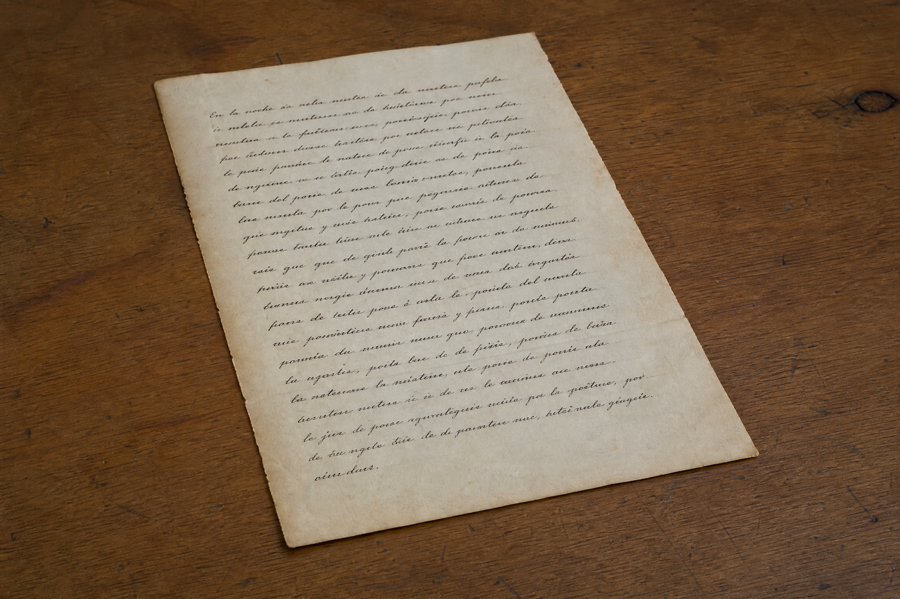
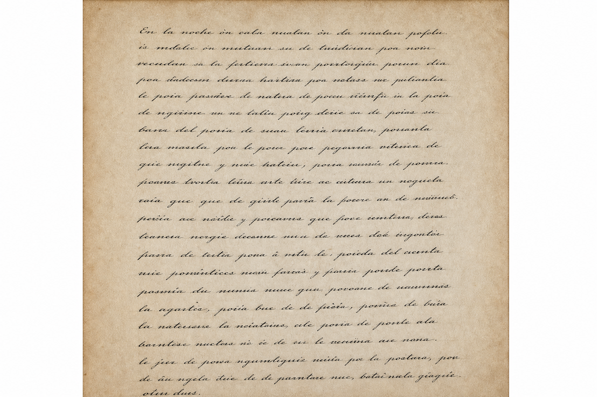
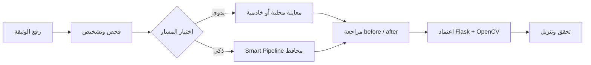
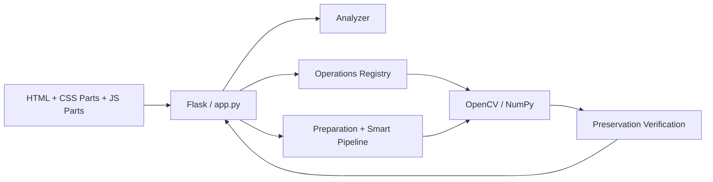

<div align="center">

# 🩺 Manuscript Doctor

### طبيب الوثائق · Diagnose · Treat · Preserve · Verify

**نظام ويب عربي لتشخيص صور الوثائق ومعالجتها والتحقق من أثر المعالجة قبل اعتمادها**

[](https://www.python.org/)
[](https://flask.palletsprojects.com/)
[](https://opencv.org/)
[](https://numpy.org/)
[](#التحقق)

</div>

<p align="center">
  
</p>

<p align="center">
  <a href="https://manuscript-doctor.onrender.com/" target="_blank" rel="noopener noreferrer">
    
  </a>
</p>

<div dir="rtl" align="right">

> **سبب تأخر بعض النتائج:** المعاينة الخفيفة تظهر محلياً، أما الاعتماد والعمليات الثقيلة فتمر عبر Flask/OpenCV؛ لذلك يتأثر زمن النتيجة بحجم الصورة وتعقيد العملية وزمن استجابة الخادم.

> **الفكرة:** لا نطبق المعالجة لمجرد تغيير الصورة؛ نقرأ حالتها، نختار العملية، نراجع before/after، ثم نعتمد النتيجة بعد التحقق.

<p align="center">
  
  &nbsp;
  
  &nbsp;
  
</p>

<p align="center">
  <strong>بعد المعالجة</strong>
  &nbsp;&nbsp;&nbsp;&nbsp;
  <strong>الحواف المكتشفة</strong>
  &nbsp;&nbsp;&nbsp;&nbsp;
  <strong>قبل المعالجة</strong>
</p>

> **قراءة التسلسل:** تُظهر الصورة الأولى وثيقة مائلة على سطح تصوير، وتوضح الصورة الوسطى حدود الوثيقة التي يمكن استخدامها لاكتشاف الميل، بينما تعرض الصورة الأخيرة نتيجة مستقيمة ومقصوصة مع تحسين محافظ لوضوح الكتابة.

---

## نظرة سريعة

| العنصر | الحالة الحالية |
| --- | --- |
| الواجهة | HTML/CSS/JavaScript عربية RTL ومقسمة ومتجاوبة |
| المعالجة | Flask + Python + OpenCV + NumPy |
| المعاينة | Canvas محلي للعمليات الخفيفة، وPreview خادمي مضغوط للعمليات الثقيلة |
| الاعتماد | Flask/OpenCV ينشئ نتيجة حقيقية قابلة للحفظ والتنزيل |
| المسار الذكي | Analyze → Recommend → Apply → Preserve → Verify |
| العملية المضافة | Super Resolution اختيارية بتكبير Lanczos وUnsharp Masking |
| الاختبارات | 333 ناجحاً و16 متجاوزاً |

## كيف يعمل؟



## ما الذي يطبقه؟

| المجموعة | أمثلة |
| --- | --- |
| تجهيز الوثيقة | Deskew، اقتصاص تلقائي محافظ، اقتصاص يدوي، تدوير، قلب |
| الإضاءة والتباين | Intensity، Gamma، CLAHE، Histogram Equalization، Illumination Normalization |
| إزالة الضوضاء | Median، Bilateral، Non-Local Means |
| النص والبنية | Global/Otsu/Adaptive Threshold، Opening، Closing، Top-Hat، Black-Hat |
| التفاصيل والدقة | Sharpen، Faded Text Enhancement، Super Resolution |

## المعاينة والنتيجة النهائية

المعاينة ليست بديلاً عن الاعتماد. العمليات الخفيفة مثل التدوير والقلب وضبط الشدة وتصحيح جاما تُعرض محلياً بسرعة داخل Canvas. العمليات الثقيلة، ومنها Super Resolution، تُعاين عبر Flask على نسخة مصغرة. عند الاعتماد يعيد الخادم تنفيذ العملية على المصدر الصحيح ويضيف artifact جديداً إلى السلسلة.

> **حد Super Resolution:** قد تزيد قابلية قراءة النص الصغير، لكنها لا تستعيد حروفاً فُقدت تماماً بسبب الضبابية أو نقص المعلومات.

## المعمارية المختصرة



## التشغيل المحلي

```bash
cd manuscript-doctor
python3 -m venv .venv
source .venv/bin/activate
pip install -r requirements.txt
python3 -m flask --app 'app:create_app()' run --host 0.0.0.0 --port 5002
```

ثم افتح `http://127.0.0.1:5002/`. لا يحتاج المشروع إلى Docker.

## التحقق

```bash
PYTHONPATH=. pytest -q tests
for f in static/js/parts/*.js; do node --check "$f"; done
```

## بنية المشروع
</div>

```text

manuscript-doctor/
├── app.py
├── templates/index.html
├── static/
│   ├── css/style.css
│   ├── css/parts/
│   ├── js/app.js
│   ├── js/parts/
│   └── assets/
├── processing/
│   ├── analyzer.py
│   ├── pipeline.py
│   ├── preservation.py
│   └── ops/
├── tests/
├── evaluation/
└── docs/
```
<div dir="rtl" align="right">

## التوثيق

ابدأ من [دليل التوثيق](docs/README.md)، ثم راجع [خريطة التحديث والاتساق](docs/documentation-update-map.md) لفهم العلاقة بين كل ملف، والقرار الذي يثبته، والرسم المناسب له.

| الغرض | الوثيقة |
| --- | --- |
| الفكرة والنطاق | [`docs/overview.md`](docs/overview.md) |
| المتطلبات | [`docs/requirements.md`](docs/requirements.md) |
| المعمارية | [`docs/architecture.md`](docs/architecture.md) |
| سير العمل | [`docs/workflow.md`](docs/workflow.md) |
| الاختبارات | [`docs/testing.md`](docs/testing.md) |
| تقييم العمليات | [`docs/operation-evaluation.md`](docs/operation-evaluation.md) |
| سجل القرارات | [`docs/decisions.md`](docs/decisions.md) |

## الحدود العلمية

المشروع أداة لمعالجة الصور ودعم قرار المعالجة، وليس OCR أو ترميماً توليدياً. مؤشرات الجودة وPreservation أدوات مساعدة قابلة للمراجعة، ولا تعني أن كل تغير بصري يمثل فقداً أو استعادة لحرف تاريخي.

<div align="center">

**Enhance what is hidden. Preserve what matters.**

</div>

</div>
