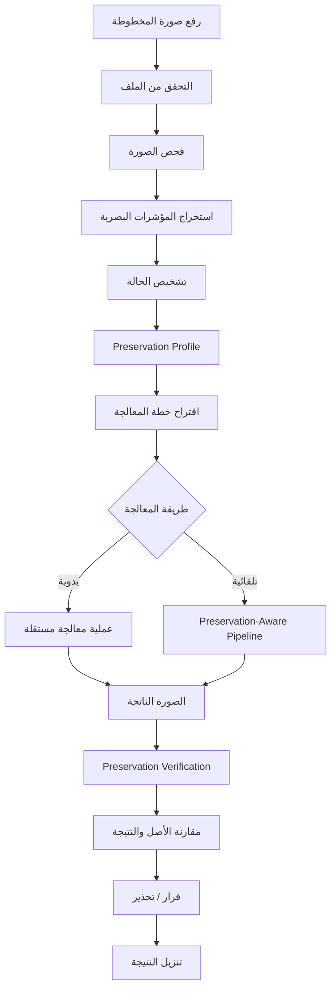
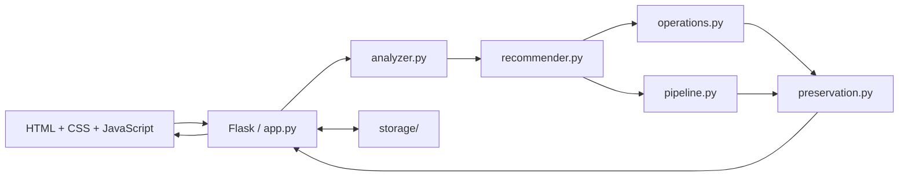

<div align="center">

# 🩺 Manuscript Doctor

### Diagnose · Treat · Preserve · Verify

**نظام ويب لتشخيص ومعالجة صور المخطوطات مع التحقق من المحافظة على التفاصيل الأصلية**


</div>

---

<h2 dir="rtl" align="right">🎯 فكرة المشروع</h2>

<p dir="rtl" align="right">
<strong>Manuscript Doctor</strong> ليس محرر صور تقليديًا يكتفي بتطبيق الفلاتر على المخطوطات.
</p>

<p dir="rtl" align="right">
يقوم النظام أولًا بفحص الحالة البصرية للصورة وتشخيص مشكلاتها، ثم يهيئ لاتخاذ قرار معالجة مناسب، وبعد تنفيذ المعالجة يتحقق من أن التحسين لم يأتِ على حساب التفاصيل البنيوية الأصلية.
</p>

<p dir="rtl" align="right">
السؤال الأساسي الذي يبنى عليه المشروع هو:
</p>

<p dir="rtl" align="center">
<strong>هل أصبحت المخطوطة أوضح دون أن نفقد منها تفاصيل مهمة؟</strong>
</p>

---

<h2 dir="rtl" align="right">💡 القيمة الأساسية</h2>

<div dir="rtl" align="right">

بدل المسار التقليدي:

**صورة ← فلتر ← نتيجة**

يعتمد Manuscript Doctor على دورة أكثر وعيًا:

</div>

```text
فحص الصورة
    ↓
تشخيص المشكلات
    ↓
تقدير حساسية التفاصيل
    ↓
اقتراح المعالجة المناسبة
    ↓
تنفيذ المعالجة
    ↓
التحقق من المحافظة على التفاصيل
    ↓
مقارنة الأصل بالنتيجة
    ↓
اعتماد النتيجة أو التحذير منها
```

<div dir="rtl" align="right">

الفلسفة الأساسية للمشروع:

**Diagnose → Treat → Preserve → Verify**

</div>

---

<h2 dir="rtl" align="right">🧠 كيف يعمل النظام؟</h2>



---

<h2 dir="rtl" align="right">🔍 ما الذي يفحصه النظام؟</h2>

<div dir="rtl" align="right">

محرك الفحص مصمم لاستخراج مؤشرات بصرية قابلة للتفسير، منها:

| المؤشر                     | الغرض                                            |
| -------------------------- | ------------------------------------------------ |
| **Brightness**             | تقدير مستوى السطوع العام                         |
| **Contrast**               | قياس انتشار درجات الإضاءة                        |
| **Dynamic Range**          | تقدير النطاق الفعلي بين المناطق الداكنة والمضيئة |
| **Sharpness**              | مؤشر تقريبي لقوة الحواف والتفاصيل                |
| **Noise**                  | مؤشر تقريبي للتغيرات المحلية غير المنتظمة        |
| **Illumination Variation** | تقدير عدم تجانس الإضاءة عبر الصورة               |
| **Edge Density**           | تقدير كثافة البنية الحافية داخل الصورة           |

هذه القيم **مؤشرات معالجة صور** وليست أحكامًا مطلقة على جودة المخطوطة أو محتواها.

</div>

---

<h2 dir="rtl" align="right">🛡️ Preservation-Aware Processing</h2>

<p dir="rtl" align="right">
أحد أهم أهداف المشروع هو عدم اعتبار كل نتيجة أكثر وضوحًا نتيجة أفضل تلقائيًا.
</p>

<p dir="rtl" align="right">
بعض العمليات قد تزيد التباين أو تنظف الخلفية، لكنها قد تؤدي أيضًا إلى:
</p>

<div dir="rtl" align="right">

* اختفاء خطوط دقيقة.
* انقطاع أجزاء من الحروف.
* اندماج مكونات متجاورة.
* فقد علامات صغيرة.
* تضخيم الضوضاء.
* تغيير واضح في البنية الأصلية.

</div>

<p dir="rtl" align="right">
لذلك يتضمن التصميم مرحلتين مختلفتين:
</p>

<div dir="rtl" align="right">

**Preservation Profile**
يُستخدم قبل المعالجة لتقدير مقدار الحذر المطلوب عند التعامل مع الصورة.

**Preservation Verification**
يُستخدم بعد المعالجة لمقارنة الأصل بالنتيجة والبحث عن مؤشرات على تغير أو فقد بنيوي.

</div>

---

<h2 dir="rtl" align="right">🏗️ المعمارية</h2>



<div dir="rtl" align="right">

يتم الفصل بين المسؤوليات حتى لا يتحول ملف واحد إلى مكان لكل منطق المشروع:

| الجزء             | المسؤولية                             |
| ----------------- | ------------------------------------- |
| `app.py`          | HTTP، التحقق، إدارة الطلبات والملفات  |
| `analyzer.py`     | فحص الصورة الأصلية واستخراج المؤشرات  |
| `recommender.py`  | تحويل التشخيص إلى توصيات معالجة       |
| `operations.py`   | عمليات معالجة الصور المستقلة          |
| `pipeline.py`     | تنظيم المعالجة التلقائية              |
| `preservation.py` | مقارنة الأصل بالنتيجة وتقييم المحافظة |
| `main.js`         | تفاعل الواجهة واستدعاء الـBackend     |
| `style.css`       | التصميم والاستجابة للشاشات            |
| `index.html`      | الهيكل الأساسي للواجهة                |

</div>

---

<h2 dir="rtl" align="right">📁 هيكل المشروع</h2>

```text
manuscript-doctor/
│
├── app.py
│
├── requirements.txt
├── README.md
│
├── processing/
│   ├── __init__.py
│   ├── analyzer.py
│   ├── recommender.py
│   ├── operations.py
│   ├── pipeline.py
│   └── preservation.py
│
├── templates/
│   └── index.html
│
├── static/
│   ├── css/
│   │   └── style.css
│   └── js/
│       └── main.js
│
├── storage/
│   ├── uploads/
│   └── results/
│
├── tests/
│
└── docs/
    ├── overview.md
    ├── requirements.md
    ├── architecture.md
    ├── decisions.md
    ├── workflow.md
    ├── wireframes.md
    ├── ui-states.md
    ├── frontend-components.md
    ├── testing.md
    ├── research-plan.md
    ├── roadmap.md
    └── git-guide.md
```

---

<h2 dir="rtl" align="right">🧰 التقنيات المستخدمة</h2>

<div dir="rtl" align="right">

### Backend

* **Python 3.12**
* **Flask**

### Image Processing

* **OpenCV**
* **NumPy**

### Frontend

* **HTML**
* **CSS**
* **JavaScript**

### Testing & Development

* **pytest**
* **Git**
* **GitHub**
* **VS Code**

</div>

---

<h2 dir="rtl" align="right">⚙️ إعداد بيئة التطوير</h2>

<div dir="rtl" align="right">

### 1. الانتقال إلى مجلد المشروع

افتح المشروع في VS Code، ثم افتح:

**Terminal → New Terminal**

وتأكد أن الطرفية تعمل من جذر المشروع.

### 2. إنشاء البيئة الافتراضية

</div>

```cmd
py -3.12 -m venv .venv
```

<div dir="rtl" align="right">

### 3. تفعيل البيئة على Windows

</div>

```cmd
.venv\Scripts\activate
```

<div dir="rtl" align="right">

يجب أن يظهر `(.venv)` في بداية سطر الطرفية.

### 4. تحديث `pip`

</div>

```cmd
python -m pip install --upgrade pip
```

<div dir="rtl" align="right">

### 5. تثبيت اعتماديات المشروع

</div>

```cmd
python -m pip install -r requirements.txt
```

---

<h2 dir="rtl" align="right">✅ التحقق من البيئة</h2>

<div dir="rtl" align="right">

تحقق من أن المكتبات الأساسية يمكن استيرادها:

</div>

```cmd
python -c "import flask, cv2, numpy; print('Environment OK')"
```

<div dir="rtl" align="right">

النتيجة المتوقعة:

</div>

```text
Environment OK
```

<div dir="rtl" align="right">

وتحقق من `pytest`:

</div>

```cmd
python -m pytest --version
```

---

<h2 dir="rtl" align="right">▶️ تشغيل التطبيق</h2>

<div dir="rtl" align="right">

بعد تفعيل البيئة الافتراضية:

</div>

```cmd
flask --app app run --debug
```

<div dir="rtl" align="right">

ثم افتح:

</div>

```text
http://127.0.0.1:5000
```

<div dir="rtl" align="right">

وضع `--debug` مخصص للتطوير المحلي فقط.

</div>

---

<h2 dir="rtl" align="right">🧪 تشغيل الاختبارات</h2>

```cmd
python -m pytest -q
```

<div dir="rtl" align="right">

يجب ألا يتم الانتقال إلى مرحلة جديدة في التطوير إذا كانت الاختبارات الحالية تفشل دون معرفة السبب.

</div>

---

<h2 dir="rtl" align="right">🔐 مبادئ التعامل مع الصور</h2>

<div dir="rtl" align="right">

يعتمد المشروع مجموعة قواعد ثابتة:

* الصورة الأصلية لا يتم الكتابة فوقها.
* كل صورة مرفوعة تحصل على `image_id` فريد.
* كل نتيجة معالجة تحصل على `result_id` مستقل.
* أسماء الملفات الفعلية يولدها الـBackend.
* الواجهة لا ترسل مسارات ملفات من جهاز المستخدم.
* الامتداد وحده لا يكفي لقبول الملف؛ يجب أن يتمكن OpenCV من قراءته.
* الصور المرفوعة والنتائج Runtime files ولا يتم تتبعها بواسطة Git.
* العمليات اليدوية تبدأ من الصورة الأصلية.
* المعالجة التلقائية وحدها تنفذ سلسلة عمليات مترابطة ومقصودة.

</div>

---

<h2 dir="rtl" align="right">📦 نطاق الـMVP</h2>

<div dir="rtl" align="right">

النسخة الأساسية مستهدفة لتشمل:

* رفع صورة مخطوطة والتحقق منها.
* فحص الخصائص البصرية للصورة.
* تشخيص أولي قابل للتفسير.
* `Preservation Profile`.
* معالجة يدوية مستقلة.
* توصيات معالجة مبنية على قواعد واضحة.
* `Preservation-Aware Smart Pipeline`.
* `Preservation Verification`.
* مقارنة الأصل بالنتيجة.
* عرض تحذيرات عند وجود مؤشرات على معالجة مفرطة.
* تنزيل الصورة الناتجة.
* واجهة عربية متجاوبة.

</div>

---

<h2 dir="rtl" align="right">🚫 خارج نطاق الـMVP</h2>

<div dir="rtl" align="right">

لا تتضمن النسخة الأولى:

* OCR.
* YOLO.
* Deep Learning.
* Generative Restoration.
* استنتاج أو توليد أجزاء مفقودة من المخطوطة.
* حسابات المستخدمين.
* قاعدة بيانات.
* تطبيق جوال.
* Public API.
* تخزينًا دائمًا لصور المستخدمين.

هذه الميزات لا تضاف إلا إذا ظهرت لاحقًا حاجة حقيقية ومبررة لها.

</div>

---

<h2 dir="rtl" align="right">⚠️ الحدود العلمية</h2>

<div dir="rtl" align="right">

Manuscript Doctor هو نظام لمعالجة الصور ودعم قرار المعالجة، وليس نظامًا لاستعادة الحقيقة التاريخية للمخطوطة.

لذلك لا يدعي النظام:

* معرفة أن كل تفصيل متغير يمثل حرفًا أو جزءًا مهمًا من النص.
* إعادة المخطوطة إلى حالتها الأصلية.
* أن أي `Preservation Score` يمثل نسبة حقيقية من النص المحفوظ.
* أن المعالجة المقترحة هي الأفضل لجميع الصور.
* استخدام الذكاء الاصطناعي عندما تكون القرارات مبنية على قواعد تقليدية.

النتائج والتقييمات تعرض بوصفها **مؤشرات قابلة للتفسير** لها حدود معروفة.

</div>

---

<h2 dir="rtl" align="right">📚 التوثيق</h2>

<div dir="rtl" align="right">

التفاصيل الكاملة موزعة حسب مسؤولية كل وثيقة:

| الوثيقة                                                      | الغرض                                |
| ------------------------------------------------------------ | ------------------------------------ |
| [`docs/overview.md`](docs/overview.md)                       | تعريف المشروع والمشكلة والقيمة       |
| [`docs/requirements.md`](docs/requirements.md)               | المتطلبات الوظيفية وغير الوظيفية     |
| [`docs/architecture.md`](docs/architecture.md)               | المعمارية والعقود ومسؤوليات المكونات |
| [`docs/decisions.md`](docs/decisions.md)                     | القرارات الهندسية وأسبابها           |
| [`docs/workflow.md`](docs/workflow.md)                       | تدفق المستخدم والنظام                |
| [`docs/wireframes.md`](docs/wireframes.md)                   | مخططات الواجهة                       |
| [`docs/ui-states.md`](docs/ui-states.md)                     | حالات الواجهة وسلوكها                |
| [`docs/frontend-components.md`](docs/frontend-components.md) | مكونات الواجهة                       |
| [`docs/testing.md`](docs/testing.md)                         | خطة الاختبار وحالاته                 |
| [`docs/research-plan.md`](docs/research-plan.md)             | خطة التقييم والأسئلة التجريبية       |
| [`docs/roadmap.md`](docs/roadmap.md)                         | مراحل تطوير المشروع                  |
| [`docs/git-guide.md`](docs/git-guide.md)                     | أسلوب استخدام Git داخل المشروع       |

</div>

---

<h2 dir="rtl" align="right">🚧 حالة التطوير</h2>

<div dir="rtl" align="right">

المشروع ما يزال **قيد التطوير** وفق مراحل متدرجة.

التركيز الحالي هو بناء الأساس القابل للاختبار قبل التوسع في العمليات والواجهة.

المسار الهندسي العام:

</div>

```text
Foundation
    ↓
Examination & Diagnosis
    ↓
Image Processing Operations
    ↓
Operation Evaluation
    ↓
Preservation Verification
    ↓
Recommendation Engine
    ↓
Preservation-Aware Pipeline
    ↓
Backend Integration
    ↓
Frontend
    ↓
End-to-End Testing
    ↓
Validation
    ↓
Release
```

---

<div align="center">

### Manuscript Doctor

**Enhance what is hidden. Preserve what matters.**

</div>
