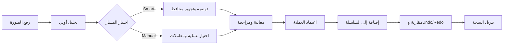
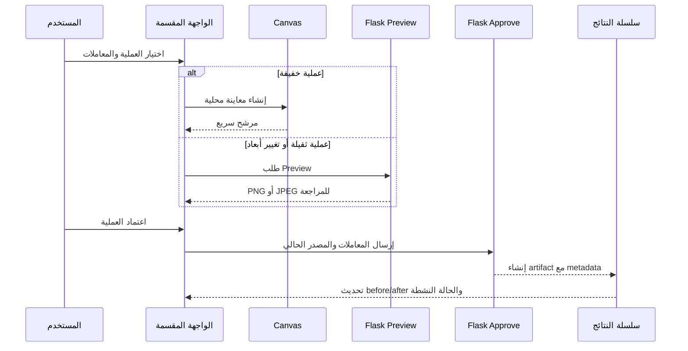
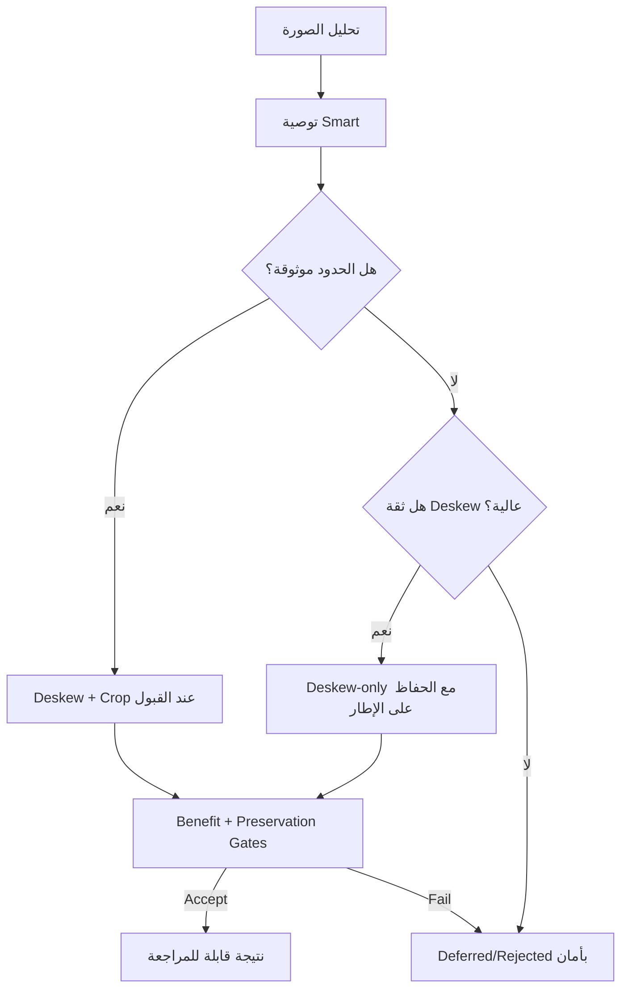

# سجل تحديث النتائج الموحّد

> يوثق هذا الملف الحالة المنفذة حالياً في مشروع **طبيب الوثائق (Manuscript Doctor)**، وليس قائمة وعود مستقبلية. تُقرأ الأرقام والنتائج هنا مع ملفات الاختبارات وتقارير QA المرتبطة بها.

  

## 1. ملخص الإصدار الحالي

أصبح التطبيق يعتمد مساحة معالجة موحّدة تجمع **المعاينة، الاعتماد، السلسلة اليدوية، المقارنة، والتحليلات** في مسار واحد. تظهر نتيجة Smart Pipeline داخل مساحة تجهيز الوثيقة والمعالجة اليدوية، ويمكن للمستخدم مراجعتها ثم متابعة عمليات يدوية فوقها بدلاً من عرض نتائج منفصلة لا تعكس الحالة النشطة.

## 2. ما الذي تغيّر فعلياً؟

| المجال | التغيير المنفذ | الأثر المقصود |
| --- | --- | --- |
| مساحة النتائج | نقل نتيجة Smart Pipeline إلى مساحة العمل اليدوية نفسها | منع تشتت المستخدم بين نتائج منفصلة |
| المعاينة | استخدام Canvas للعمليات الخفيفة، مع بقاء Flask مصدر النتيجة المعتمدة | تقليل زمن الإحساس بالانتظار دون التضحية بمصدر حقيقة قابل للتحقق |
| النقل | دعم JPEG اختيارياً في `/api/images/<id>/preview` مع بقاء PNG افتراضياً | تقليل حجم Preview الثقيلة مع الحفاظ على التوافق |
| الاعتماد | إزالة مسار التنفيذ المكرر؛ زر الاعتماد هو المسار الوحيد لحفظ العملية | منع التكرار وتعارض الحالة بين Preview والنتيجة |
| السلسلة اليدوية | كل خطوة جديدة تعتمد النتيجة الحالية السابقة عبر `source_result_id` | تصحيح before/after ودعم العمليات المتتابعة |
| التراجع والإعادة | عرض السلسلة والحالة النشطة محلياً دون إعادة تنفيذ غير ضرورية | استجابة أسرع وتجربة أوضح أثناء المراجعة |
| الاقتصاص | إطار يبدأ بهامش 5% ومقابض قابلة للسحب، ثم إرسال القيم إلى Flask | جعل Crop قابلاً للاستخدام والقياس الفعلي |
| تجهيز الوثيقة | ربط تصحيح الميل والاقتصاص التلقائي بمسار Smart Preparation المحافظ | قبول الحالات الآمنة فقط وعدم فرض قص غير موثوق |
| Super Resolution | إضافة عملية يدوية مستقلة بتكبير Lanczos وUnsharp على luminance | تحسين قابلية رؤية النص مع توضيح حدود التقنية |
| Header | استخدام صورة مساحة العمل كخلفية للـHeader فقط وإزالة عنصر Hero المكرر | هوية بصرية أبسط ومنع تكرار الصورة أو قصها داخل عنصر مستقل |

## 3. المعاينة والاعتماد

المعاينة ليست نتيجة محفوظة. في العمليات الخفيفة، ينشئ المتصفح مرشحاً محلياً على Canvas للعرض السريع. وفي العمليات الثقيلة أو التي تغيّر الأبعاد، يرسل العميل طلب Preview إلى Flask، وقد يستخدم JPEG عند طلبه. في الحالتين، لا تصبح الصورة جزءاً من سجل النتائج إلا بعد الضغط على **اعتماد العملية وإضافتها للسلسلة**.

## 4. السلسلة اليدوية وbefore/after

تبدأ السلسلة من الصورة الأصلية، ثم تعتمد كل خطوة لاحقة على نتيجة الخطوة السابقة، مع بقاء الأصل غير قابل للتعديل. لذلك فإن صورة **قبل** تمثل المصدر السابق للخطوة النشطة، بينما تمثل صورة **بعد** النتيجة المعتمدة للخطوة نفسها. يظل Undo وRedo تغييراً في العرض والحالة النشطة، وليس إعادة تنفيذ للعملية على الصورة.

| الحالة | المصدر المستخدم | ما يظهر للمستخدم |
| --- | --- | --- |
| قبل أول اعتماد | Original | الصورة الأصلية ومعاينة العملية الحالية |
| بعد اعتماد الخطوة الأولى | Original → Result 1 | Result 1 كحالة معتمدة |
| قبل الخطوة الثانية | Result 1 | نتيجة الخطوة السابقة |
| بعد اعتماد الخطوة الثانية | Result 1 → Result 2 | Result 2 كالحالة الحالية |
| Undo/Redo | نتيجة موجودة في السلسلة | تغيير الحالة النشطة دون إعادة معالجة |

## 5. Smart Preparation: سياسة القبول

لا تعني المعالجة الذكية تنفيذ كل توصية تلقائياً. يمر المرشح عبر بوابات المنفعة والمحافظة والتحقق. عند غياب حدود قص موثوقة، يمكن قبول **deskew-only** إذا كانت ثقة تصحيح الميل عالية بما يكفي؛ أما الثقة المنخفضة فتؤدي إلى تأجيل أو رفض آمن بدلاً من تطبيق قص أو منظور غير مضمون.

## 6. Super Resolution: الإضافة وحدودها

أضيفت `super_resolution` كعملية يدوية مستقلة في `processing/ops/super_resolution.py`. تنفذ تكبيراً مكانياً باستخدام **Lanczos**، ثم Unsharp Masking على قناة الإضاءة، مع `scale=2` أو `3`، و`amount` ضمن `0..1`، و`sigma` ضمن `0.5..3`، وحد أقصى لحجم الناتج يبلغ 60 مليون بكسل.

هذه العملية قد تجعل الحروف الصغيرة أو الحواف أوضح بصرياً، لكنها **لا تستعيد معلومات فُقدت بالكامل** بسبب ضبابية شديدة أو دقة أصلية منخفضة. وهي ليست DNN، ولا تستخدم EDSR أو FSRCNN أو Real-ESRGAN، ولا تدخل تلقائياً في Smart Pipeline؛ لأنها عملية اختيارية يراجعها المستخدم وقد تغيّر أبعاد الصورة.

## 7. دليل التحقق الحالي

| الاختبار أو السيناريو | النتيجة الموثقة |
| --- | --- |
| Regression | `333 passed, 16 skipped` |
| JavaScript syntax | نجاح `node --check static/js/parts/*.js` |
| C05 Smart Preparation | قبول deskew-only بثقة تقارب `0.8683`، مع residual skew قريب من `-0.04` ودون قص غير موثوق |
| C05 Super Resolution | معاينة JPEG تقريباً `720×960`، ثم اعتماد ناتج `1920×2560` من مصدر `960×1280` عند `scale=2` |
| C06 Smart Preparation | لم تُقبل الحالة منخفضة الثقة؛ بقيت مؤجلة أو مرفوضة بأمان بدلاً من فرض تجهيز غير موثوق |
| Crop | سحب الإطار غيّر الإحداثيات، والنتيجة الخادمية طابقت الأبعاد المعتمدة |
| Preview المحلي | العمليات الخفيفة عُرضت محلياً دون طلب Preview خادمي أثناء المعاينة |
| JPEG Preview | مدعوم اختيارياً، مع استمرار PNG كصيغة افتراضية للتوافق |

> قياسات C05 وC06 وزمن التنفيذ هي **أدلة QA محلية لسيناريوهات محددة**، وليست ضماناً لأداء شامل على جميع الأجهزة والصور.

## 8. ما لم يتغير وما هو خارج النطاق

لا يزال Flask/OpenCV هو مصدر النتيجة النهائية عند الاعتماد والتنزيل. ولا يعني تحسين Preview أن المعاينة المحلية أصبحت artifact نهائياً. كما لا يتضمن الإصدار الحالي OCR، أو تدريب Deep Learning، أو Generative Restoration، أو حسابات مستخدمين، أو قاعدة بيانات، أو Queue خلفية، أو تخزيناً دائماً متعدد المستخدمين.

كذلك لم تُضف وعود زمنية مثل «فوري» لكل العمليات؛ فالعمليات الثقيلة تعتمد على حجم الصورة، والضغط، وزمن الطلب، وتكلفة OpenCV. القرار الحالي هو تحسين الإحساس بالاستجابة للعمليات الخفيفة مع الحفاظ على التحقق الخادمي للنتيجة المعتمدة.

## 9. ملفات التنفيذ المرتبطة

| الوظيفة | الملفات المرجعية |
| --- | --- |
| Flask والواجهات البرمجية | `app.py` |
| سجل العمليات والمعاملات | `processing/ops/registry.py` |
| Super Resolution | `processing/ops/super_resolution.py` |
| Smart Pipeline | `processing/pipeline.py` و`processing/preparation_verification.py` |
| حالة الواجهة | `static/js/parts/00-state-constants.js` |
| المعاملات والاقتصاص | `static/js/parts/05-manual-parameters.js` |
| المعاينة | `static/js/parts/06-manual-preview.js` |
| الاعتماد والسلسلة وUndo/Redo | `static/js/parts/07-manual-execution.js` |
| القالب والهوية البصرية | `templates/index.html` و`static/css/style.css` و`static/css/parts/07-theme-layout.css` |

## 10. قاعدة قراءة هذا السجل

أي رقم أو وصف قديم في سجل سابق، مثل عدد اختبارات مختلف أو وجود زر تنفيذ مستقل، يُفهم بوصفه **حالة تاريخية** لا وصفاً للنسخة الحالية. المرجع الحالي هو التنفيذ الفعلي والاختبارات المرتبطة به، ويجب أن يربط كل تحديث بين المشكلة، والقرار، وموضع التنفيذ، ودليل التحقق.

