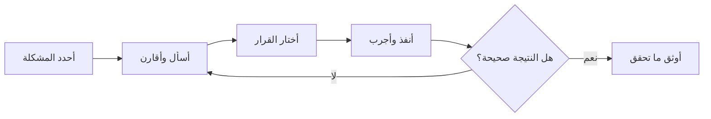

<div dir="rtl" align="right">

# كيف استخدمت الذكاء الاصطناعي في تطوير Manuscript Doctor

> هذه الوثيقة تشرح **طريقة استخدامي للذكاء الاصطناعي** أثناء بناء المشروع. ما هي محادثة كاملة من أولها إلى آخرها، ولا هي محاولة أظهر فيها أن كل شيء اتعمل يدوياً. استخدمت الأداة كمساعد للنقاش، وترتيب الأفكار، ومراجعة الأخطاء، وكتابة بعض الأجزاء بعد ما أحدد المطلوب وأجرب النتيجة بنفسي. أما القرار النهائي، والفهم، وتجربة التطبيق، فمسؤوليتي أنا.
>
> المرجع الحالي للتنفيذ هو `docs/current-baseline.md`، والمرجع الحالي للاختبارات هو `manual-qa-report.md`. هذه الوثيقة تشرح طريقة التفكير، ولا تُستخدم وحدها لإثبات وجود وظيفة. وما بنسب لنفسي تجربة ما حصلت؛ أي نتيجة أذكرها لازم تكون مرتبطة بتجربة أو اختبار موجود فعلاً.

## 1. من أين بدأت الفكرة؟

في البداية كنت أفكر أعمل محرر صور عادي: أرفع صورة، أختار فلتر، وأنزل النتيجة. لكن هذا النوع من المشاريع ما كان بيضيف قيمة كبيرة لمقرر معالجة الصور؛ أي برنامج جاهز يقدر يعمل نفس الشيء.

فسألت نفسي: **كيف أخلي المشروع يعالج مشكلة واضحة في الوثائق والمخطوطات، ويبين أني فاهم التقنيات التي أستخدمها؟** من هنا بدأت فكرة طبيب الوثائق. الهدف ما هو أن الصورة تصير «أجمل» وخلاص، بل أن النظام يفحصها، يقترح معالجة مناسبة، ويخليني أراجع أثر المعالجة قبل اعتمادها.

كان دور الذكاء الاصطناعي في هذه المرحلة أنه يناقش الفكرة معي ويطلع لي نقاط القوة والضعف. أنا كنت أحدد المشكلة والقيود، وبعدها أطلب منه يقترح لي طرقاً ممكنة. ما كنت أتعامل مع أول اقتراح كأنه قرار نهائي؛ كنت أقول: **خلنا نجرب ونشوف النتيجة** قبل ما نعتمد أي شيء.

## 2. القرار الأساسي للمشروع

بعد المراجعة ثبتت عندي الفكرة بهذا التسلسل:

```text
Diagnose → Treat → Preserve → Verify
```

بمعنى:

| المرحلة | المقصود |
|---|---|
| Diagnose | تحليل حالة الصورة ومؤشراتها |
| Treat | تطبيق معالجة مناسبة يدوية أو ذكية |
| Preserve | مراجعة أثر المعالجة على بنية الصورة |
| Verify | التحقق من النتيجة قبل تنزيلها |

هذا التسلسل هو الذي فرق المشروع عن صفحة فلاتر عادية. الذكاء الاصطناعي ساعدني أرتب الفكرة وأنتبه للتناقضات، لكن اختيار هذا الاتجاه وربطه بمتطلبات المقرر كان قرار المشروع نفسه.

## 3. تحديد الحدود العلمية

من الأشياء التي كنت حريصاً عليها أني ما أكتب ادعاءات أكبر من الذي يقدر يثبته الكود. مثلاً، ما يصح أقول إن النظام عرف أن حرفاً معيناً انمسح، لأن المشروع ما فيه OCR ولا يفهم معنى النص.

لذلك راجعت مع الذكاء الاصطناعي الفرق بين:

- قياس تغير الحواف والضوضاء والإضاءة.
- وبين الادعاء بأن النظام فهم النص أو حافظ على نسبة محددة منه.

والقرار النهائي كان استخدام مفهوم قريب من **Structural Preservation Assessment**: نقيس التغير في بنية الصورة ونوضح المخاطر، لكن ما ندعي أننا اكتشفنا فقدان حرف أو استعدنا معلومات غير موجودة.

## 4. قبل كتابة الكود

كنت أستخدم البرومبت بطريقة متدرجة. ما أقول: «ابنِ المشروع كله». كنت أقسم المشكلة إلى أسئلة صغيرة، مثل:

```text
عندي تطبيق لمعالجة صور الوثائق والمخطوطات.
أريد أولاً تحليل الفكرة وحدودها، لا كتابة الكود.
وضح لي ما المشكلة التي يحلها المشروع، وما الذي يميزه عن محرر فلاتر عادي، وما الذي أستطيع إثباته باستخدام OpenCV وNumPy فقط.
```

وبعد ما تتضح الفكرة، أنتقل للسؤال التالي:

```text
رتب رحلة المستخدم من رفع الصورة إلى تنزيل النتيجة.
أريد أن يفهم المستخدم ماذا وجد النظام، ولماذا اقترح المعالجة، وماذا تغير بعد المعالجة.
لا تدخل في CSS أو الكود الآن؛ ركز على تدفق الاستخدام.
```

هذا الأسلوب خلاني أفصل بين التفكير في المشكلة، وتصميم النظام، وكتابة التنفيذ. لو بدأت بالكود مباشرة، كان سهل أرجع أكرر نفس فكرة محرر الفلاتر.



## 5. كيف قررت فصل Manual عن Smart؟

كان عندي سؤال مهم: هل كل عملية يختارها المستخدم تبدأ من الصورة الأصلية، أو تعتمد على العملية السابقة؟

بعد المراجعة قسمت الاستخدام إلى مسارين:

| المسار | السلوك |
|---|---|
| Manual | المستخدم يجرب عملية، يراجع Preview، ثم يعتمدها. الخطوة التالية تستخدم النتيجة المعتمدة السابقة في السلسلة. |
| Smart Pipeline | النظام ينفذ خطوات مترابطة عن قصد، لكن لا يقبل المرشح إلا بعد بوابات المنفعة والمحافظة والتحقق. |

الذي ثبتناه في التنفيذ هو أن الصورة الأصلية تبقى غير معدلة، وكل خطوة لاحقة تستخدم `source_result_id` للنتيجة السابقة. أما Canvas فهي للمعاينة، وليست مصدراً للنتيجة النهائية.

## 6. كيف استخدمت الذكاء الاصطناعي أثناء البرمجة؟

كنت أستخدمه في أربع حالات رئيسية:

1. **تفكيك المشكلة:** عندما تكون المشكلة كبيرة، أطلب تقسيمها إلى مسؤوليات وملفات صغيرة.
2. **المراجعة:** أعرض فكرة أو جزءاً من الكود وأسأل عن الحالات التي قد تكسره.
3. **اقتراح التنفيذ:** بعد تحديد العقد والمعاملات، أطلب مسودة أولى ثم أراجعها وأعدلها.
4. **التوثيق:** أطلب تحويل القرار أو نتيجة الاختبار إلى صياغة واضحة يمكن الرجوع إليها.

لكن المسودة ما كانت تعتمد مباشرة. كنت أراجع المسارات، وأشغل الاختبارات، وأجرب الواجهة، ثم أرجع أصلح ما يظهر. أحياناً كان الاقتراح الأول غير مناسب، مثل الاعتماد على الخادم لكل معاينات العمليات الخفيفة؛ بعدها اتجهت إلى Canvas للمعاينة مع إبقاء Flask/OpenCV مصدراً للنتيجة النهائية.

## 7. أمثلة على قرارات خرجت من التجربة

### المعاينة المحلية

كانت المعاينة الخفيفة تتأخر لأنها ترسل طلباً إلى Flask مع كل تغيير. بعد تحليل المسار اتضح أن التدوير والقلب وبعض تعديلات الشدة يمكن عرضها على Canvas. لذلك فصلت بين سرعة العرض وصحة الاعتماد: Canvas يعرض مرشحاً سريعاً، وFlask ينفذ النتيجة التي تدخل السلسلة.

### before/after والسلسلة

ظهرت مشكلة أن before كان متأخراً خطوة بعد اعتماد عملية ثانية. بدلاً من معالجة الصورة نفسها مرة أخرى، راجعت منطق اختيار المصدر والحالة النشطة، ثم ربطت الخطوة الجديدة بالنتيجة السابقة عبر `source_result_id` وحدثت `manualActiveIndex`.

### Crop

الاقتصاص كان صعباً لأن المقابض تظهر على الحواف مباشرة. عدلت البداية إلى هامش 5%، وربطت السحب بالقيم الحقيقية، ثم تحققت أن أبعاد النتيجة الخادمية تطابق الإطار الذي اختاره المستخدم.

### Smart Preparation

لم أقبل أن يعمل القص تلقائياً لمجرد أن النظام وجد زاوية. في C05 كانت ثقة تصحيح الميل عالية، فقبلت سياسة `deskew-only` بدون قص. في C06 كانت الثقة منخفضة، فبقي القرار مؤجلاً أو مرفوضاً بأمان. هذا القرار جاء من مراجعة النتائج، وليس من الرغبة في جعل كل الصور تنجح بأي طريقة.

### Super Resolution

أضيفت كعملية يدوية مستقلة بعد مناقشة حدودها. التنفيذ الحالي يستخدم Lanczos ثم Unsharp Masking على luminance. هي قد تجعل النص الصغير أوضح بصرياً، لكنها ما ترجع معلومات فقدت بسبب ضعف المصدر، وليست DNN أو Real-ESRGAN.

## 8. كيف تأكدت أن الاقتراحات اشتغلت؟

كنت أتعامل مع الاختبار كجزء من التطوير، مش كخطوة شكلية في النهاية. لكل تغيير كنت أراجع واحداً أو أكثر من التالي:

| نوع التغيير | طريقة التحقق |
|---|---|
| عملية OpenCV | اختبار الأبعاد والقنوات والمعاملات وعدم تعديل الأصل |
| API | اختبار الرفع وPreview والاعتماد والتنزيل وحالات الفشل |
| JavaScript | `node --check static/js/parts/*.js` وتجربة المسار في المتصفح |
| السلسلة | اعتماد أكثر من خطوة وتجربة before/after وUndo/Redo |
| Smart | استخدام C05 وC06 مع مراجعة قرار القبول أو التأجيل |
| Super Resolution | التحقق من scale والحدود وحجم الناتج والقنوات |
| التوثيق | مقارنة الوصف مع الكود والاختبارات، وليس مع الخطة القديمة |

النتيجة الحالية لاختبارات Python هي:

```text
333 passed, 16 skipped
```

## 9. ما الذي كان دوري فيه وما دور الأداة؟

| المسؤولية | كيف تمت |
|---|---|
| تحديد فكرة المشروع | قرار بشري مرتبط بالمقرر والمشكلة |
| اختيار الحدود العلمية | مراجعة الادعاءات والالتزام بما يثبته الكود |
| تقسيم الملفات | اقتراحات ومقارنة ثم اعتماد البنية المناسبة للمشروع |
| كتابة أو تعديل بعض الأجزاء | مساعدة لغوية وبرمجية، ثم مراجعة وتعديل وتجربة |
| الاختبارات | تنفيذ فعلي ومراجعة نتائج الفشل والإصلاح |
| القرارات النهائية | بناءً على الكود، النتائج، ومتطلبات الاستخدام |
| التوثيق | تنظيم القرارات والنتائج بصياغة قابلة للقراءة |

## 10. الخلاصة

استخدام الذكاء الاصطناعي اختصر وقت البحث والكتابة والمراجعة، لكنه ما كان بديلاً عن فهم المشروع. كل قرار مهم في النسخة الحالية مرتبط بمشكلة ظهرت أثناء العمل أو بحاجة واضحة في المقرر، ثم تم اختباره أو مراجعته قبل اعتماده.

الأهم عندي أن أي شخص يسألني عن المشروع أقدر أشرح له: لماذا اخترت Flask وOpenCV، لماذا قسمت الواجهة، لماذا Canvas للمعاينة، لماذا الاعتماد يمر عبر الخادم، ولماذا Smart Pipeline لا يقبل كل شيء تلقائياً. هذه هي الفائدة الحقيقية من استخدام الأداة: تساعدني أسرع، لكن لازم أفهم وأتحمل مسؤولية النتيجة.

</div>
