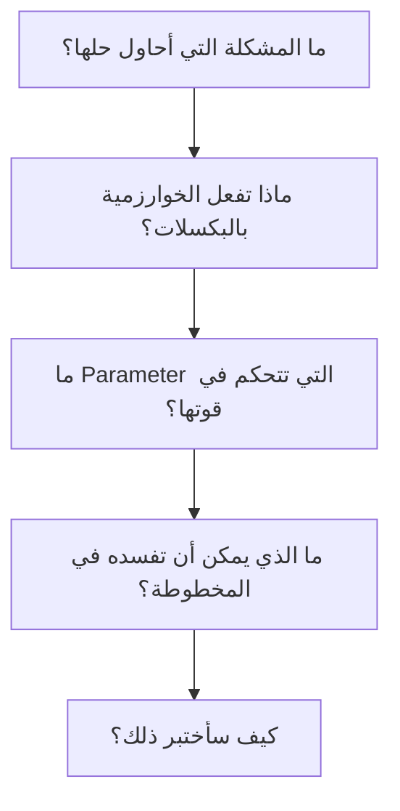

docs/ai-prompts.md

<div dir="rtl" align="right">

# 🤖 سجل استخدام الذكاء الاصطناعي في تطوير Manuscript Doctor

> هذه الوثيقة لا تمثل نسخًا حرفيًا لكل محادثة تمت أثناء المشروع، بل توثق **الأوامر الرئيسية التي وجّهت بها الذكاء الاصطناعي أثناء التحليل والتنفيذ والمراجعة** بعد إعادة ترتيبها بحسب مراحل المشروع.
>
> استخدمت الذكاء الاصطناعي هنا كأداة للمناقشة والمراجعة وتسريع التنفيذ، وليس كبديل عن فهم المشكلة أو اتخاذ القرار. لذلك حاولت في كل مرحلة تحديد المشكلة والقيود والمخرج المطلوب أولًا، ثم طلب التنفيذ أو النقد بناءً عليها.

---

# 1. البداية — لا أريد محرر صور آخر

### الفكرة التي بدأت منها

كان أول سؤال بالنسبة لي ليس: *ما الخوارزميات التي سأضعها؟*
بل: *لماذا سيستخدم أحد المشروع أصلًا إذا كان مجرد مجموعة فلاتر موجودة في أي برنامج تحرير صور؟*
<div dir="rtl" align="right">

### 📋 Prompt

<pre>
لدي مشروع عملي في مقرر معالجة الصور موقع محرر للصور او لنطبق ما تعلمناه بأي فكره .
عندي اقتراح للفكره بأن تكون تحسين تلقائي للوثائق والمخطوطات القديمه والتالفه 
قبل أن نكتب أي كود، أريد منك تحليل الفكرة نفسها بصرامة.
لا أريد مشروعًا عبارة عن:
رفع صورة , اختيار فلتر , تنزيل الصورة.
هذا سهل ولا يعطي المشروع قيمة حقيقية.

أريد أن نستفيد من مفاهيم Image Processing التي أدرسها، لكن داخل مشكلة واضحة:
الصورة القديمة قد تحتاج تحسينًا، وفي الوقت نفسه قد تؤدي المعالجة القوية إلى حذف خطوط رفيعة أو نقاط أو تفاصيل أصلية.
حلل كيف يمكن تحويل هذه الملاحظة إلى نظام له هدف واضح وقابل للتنفيذ بوقتي ومستواي، بدون Deep Learning أو OCR أو تعقيد غير ضروري.
لا تقترح التنفيذ بعد.
أريد أولًا:
- المشكلة الحقيقية.
- القيمة التي سيضيفها النظام.
- ما الذي سيميزه عن محرر الصور العادي.
- الحدود الواقعية لما يمكن إثباته باستخدام معالجة الصور التقليدية.</pre>

</div>
### القرار الناتج

تحولت الفكرة إلى:

**Diagnose → Treat → Preserve → Verify**

أي أن النظام لا يطبق معالجة فقط، بل:

1. يفحص الصورة.
2. يشخص حالتها.
3. يقترح Treatment.
4. يقيس أثر Treatment على التفاصيل الأصلية.

---

# 2. تثبيت الحدود العلمية

كنت أريد أن تكون فكرة Preservation قوية، لكن بدون إعطاء المشروع قدرات لا يملكها.

### Prompt

```text
أريد مراجعة علمية لفكرة Preservation قبل اعتمادها.

إذا قارنت الصورة الأصلية بالنتيجة، فأنا أستطيع قياس تغير في الحواف أو المكونات أو التفاصيل الصغيرة.

لكن لا أعتقد أنه من الصحيح أن أقول:
"اكتشف النظام أن حرفًا فُقد"
أو
"تم الحفاظ على 95% من النص"

لأننا لا نستخدم OCR ولا نفهم محتوى النص نفسه.

حدد لي بدقة:
- ما الذي يمكنني قياسه فعليًا؟
- ما الذي لا يمكنني الادعاء به؟
- ما المصطلح العلمي الأنسب للميزة؟
- كيف أجعل المشروع قويًا بدون مبالغة في وصف قدراته؟
```

### ما اعتمدته

استخدام مفهوم:

**Structural Preservation Assessment**

بدل ادعاء اكتشاف فقد النص.

---

# 3. قبل كتابة الواجهة — تحديد رحلة المستخدم

لم أرد كتابة `index.html` أولًا ثم محاولة تركيب الفكرة داخله.

### Prompt

```text
قبل تصميم الواجهة، أريد تحديد رحلة المستخدم كاملة.

افترض أن المستخدم لا يعرف أسماء خوارزميات معالجة الصور.

أريده أن يفهم:
1. ماذا وجد النظام في الصورة؟
2. لماذا يقترح معالجة معينة؟
3. ماذا حدث بعد المعالجة؟
4. هل ظهرت مؤشرات على ضرر في التفاصيل؟

رتب رحلة الاستخدام من لحظة فتح الموقع حتى تنزيل النتيجة.

لا تصمم ألوانًا ولا CSS الآن.
ركز فقط على ترتيب المعلومات والأفعال.

مهم:
الأدوات اليدوية يجب ألا تكون هي أول شيء يراه المستخدم، لأن المشروع تشخيصي وليس Filter Gallery.
```

---

# 4. الفصل بين Manual Processing وSmart Pipeline

أحد القرارات التي احتجت أن أحسمها مبكرًا هو: هل كل عملية تستخدم ناتج العملية السابقة؟

### Prompt

```text
لدي نوعان من الاستخدام وأريد عدم الخلط بينهما.

الأول:
المستخدم يختار CLAHE يدويًا، ثم يجرب Median مثلًا للمقارنة.

في هذه الحالة أعتقد أن كل عملية يجب أن تبدأ من Original حتى تكون المقارنة عادلة ولا تتراكم التأثيرات بدون قصد.

الثاني:
Smart Pipeline، وهنا التسلسل مقصود، لذلك يمكن أن يكون:
Original → Operation 1 → Operation 2 → Result.

راجع هذا المنطق من ناحية Image Processing ومن ناحية تصميم النظام.

إذا كان صحيحًا، أريد تثبيته كقاعدة معمارية وعدم السماح للواجهة بكسره لاحقًا.
```

---

# 5. تصميم الـBackend قبل كتابة الخوارزميات

### Prompt

```text
أريد الآن تصميم Backend بسيط باستخدام Flask.

لا أريد Architecture ضخمة لأن المشروع فردي وصغير، لكن أيضًا لا أريد وضع كل شيء داخل app.py.

اقترح أقل تقسيم منطقي يسمح لي بفصل:

- تحليل الصورة.
- عمليات Image Processing.
- التوصيات.
- Smart Pipeline.
- Preservation Verification.

هناك شرط مهم:
لا أريد Frontend يرسل مسارات ملفات إلى السيرفر.

أريد عند رفع الصورة أن يولد Backend image_id، وعند إنشاء نتيجة يولد result_id.

كذلك Original يجب ألا يتم تعديلها أبدًا.

صمم المسؤوليات والعلاقات أولًا، ولا تبدأ في كتابة الكود حتى أتأكد أن التقسيم منطقي.
```

---

# 6. بناء Upload بصورة صحيحة

### Prompt

```text
سننفذ رفع الصور الآن.

أريد implementation بسيطًا لكن صحيحًا.

المسموح:
JPG / JPEG / PNG.

لا أريد الاعتماد على extension فقط، لأن أي ملف يمكن تغيير اسمه إلى .jpg.

أريد:
1. التحقق من وجود الملف.
2. قراءة bytes.
3. محاولة فك الصورة باستخدام cv2.imdecode.
4. رفضها إذا لم تكن صورة صالحة.
5. التحقق من حجم الملف.
6. التحقق من أبعاد الصورة.
7. توليد UUID داخلي.
8. حفظ Original دون تعديل أو إعادة معالجة غير ضرورية.

لا تستخدم اسم الملف القادم من المستخدم كاسم التخزين.

قبل الكود اشرح لي مسار البيانات ومكان كل فشل محتمل، ثم اكتب أبسط implementation نظيف.
```

---
# المرحلة السابعة — بناء التوثيق من القرارات الفعلية

> في هذه المرحلة لم أتعامل مع التوثيق كخطوة أخيرة لملء المستودع بالملفات، بل حاولت أن يكون لكل وثيقة سبب واضح ووظيفة مختلفة.
> بدأت من تعريف المشروع، ثم حولت الفكرة إلى متطلبات، وبعدها وثقت المعمارية والقرارات وتدفق النظام والواجهة والاختبارات وخطة التنفيذ.
> هدفي كان أن أستطيع الرجوع لأي سؤال في المشروع وأعرف أي وثيقة يجب أن تجيب عنه.

---
7.0 — تصميم هيكل ملف توثيق البرومبتات

الفكرة

قبل إضافة البرومبتات نفسها، أردت أولًا تصميم ملف منظم يوثق استخدامي للذكاء الاصطناعي أثناء المشروع بشكل يوضح تدرج التفكير، وليس مجرد نسخ للمحادثات.

Prompt

أريد إنشاء ملف مخصص لتوثيق البرومبتات التي استخدمتها أثناء تطوير Manuscript Doctor.

اسم الملف:
docs/ai-prompts.md


أريد فقط تصميم هيكل الملف بحيث أستطيع لاحقًا إضافة كل مرحلة بشكل مستقل ومرتب.

أريد الهيكل أن يوضح تطور عملي من:
الفكرة
التحليل
التصميم
 التنفيذ
 الاختبار
 التوثيق

قسم الملف إلى مراحل واضحة، ولكل مرحلة عنوان مستقل أضيف تحته البرومبتات الخاصة بها لاحقًا.

داخل كل Prompt أريد قالبًا ثابتًا وبسيطًا يحتوي على:

- عنوان الخطوة.
- لماذا احتجت هذا الـPrompt.
- نص الـPrompt.
- القرار أو المخرج الناتج إذا كان مهمًا.

لا تجعل الملف عبارة عن سجل محادثات كامل، ولا تضف محتوى غير مهم.

أريد مقدمة قصيرة تشرح أن الملف يوثق طريقة استخدام AI كأداة للنقاش والمراجعة والتنفيذ التدريجي.

صمم الهيكل فقط الآن، وسأضيف محتوى كل مرحلة لاحقًا.
---
## 7.1 — بناء `README.md`

### Prompt

```text
وصلت الآن إلى مرحلة أستطيع فيها كتابة README حقيقية للمشروع.

لا أريد README تسويقية أو مليئة بالكلام العام.
أريد شخصًا يفتح المستودع لأول مرة أن يفهم بسرعة:

- ما المشكلة التي يحلها Manuscript Doctor؟
- ما الذي يجعله مختلفًا عن محرر الصور؟
- كيف يعمل المسار العام؟
- ما التقنيات المستخدمة؟
- كيف يشغل المشروع؟
- أين يجد التفاصيل إذا أراد فهم التصميم أو الاختبارات؟

هناك نقطة مهمة:
لا تكرر كل محتوى docs داخل README.

أريدها مدخلًا للمشروع فقط، وتضع روابط للوثائق التفصيلية بدل نسخها.

كذلك راجع أي Claim علمي قبل كتابته:
لا أريد كلمات مثل AI أو intelligent restoration أو text preservation percentage إذا لم يكن المشروع يثبتها فعليًا.

اكتب README بناءً على القرارات التي اعتمدناها فعليًا، لا بناءً على شكل README شائع في GitHub.
```

---

## 7.2 — بناء `docs/overview.md`

### الفكرة

بعد وجود README احتجت وثيقة تشرح **فكرة المشروع وقيمته وحدوده** بعيدًا عن تفاصيل البرمجة.

### Prompt

```text
الآن أريد وثيقة منفصلة تشرح فكرة المشروع نفسها بعيدًا عن تفاصيل الكود.

اسمها:
docs/overview.md

وظيفتها أن تجيب عن سؤال واحد:
لماذا يوجد هذا المشروع أصلًا؟

أريد أن تحتوي على:

- المشكلة التي نحاول حلها.
- الملاحظة التي بدأت منها الفكرة.
- الحل الذي اعتمدناه.
- معنى Diagnose → Treat → Preserve → Verify.
- القيمة التي يقدمها المشروع.
- المستخدم المستهدف.
- حدود الـMVP.
- ما هو خارج نطاق المشروع.
- الحدود العلمية التي يجب ألا نتجاوزها.

لا أريد داخلها:
API
أسماء Functions
تفاصيل الملفات
Git
تفاصيل الاختبارات

لأن لكل منها وثيقة منفصلة.

أريد أن يستطيع شخص أكاديمي قراءة هذه الوثيقة وفهم فكرة المشروع وقيمته حتى لو لم يقرأ أي سطر من الكود.
```

---

## 7.3 — بناء `docs/requirements.md`

### الفكرة

بعد تثبيت الفكرة، كان لابد من تحويلها إلى متطلبات واضحة يمكن الرجوع إليها أثناء التنفيذ والاختبار.

### Prompt

```text
بعد أن أصبحت فكرة المشروع واضحة، أريد تحويلها إلى Requirements يمكنني لاحقًا التحقق من تنفيذها.

اسم الملف:
docs/requirements.md

لا أريد متطلبات عامة مثل:
"النظام يجب أن يكون سريعًا وسهل الاستخدام".

أريد Requirements مرتبطة مباشرة بسلوك Manuscript Doctor.

قسمها منطقيًا إلى:

- Functional Requirements
- Architecture Requirements
- Preservation Requirements
- UX Requirements
- Security Requirements
- Non-Functional Requirements
- Scientific Boundaries

استخدم IDs ثابتة مثل:
FR-01
FR-02
SEC-01

لكن لا تكثر البنود لمجرد زيادة العدد.

كل Requirement يجب أن تمثل وظيفة أو قيدًا حقيقيًا.

تأكد خصوصًا من توثيق:

- Original لا تتغير.
- Frontend لا يرسل filesystem paths.
- Backend هو مصدر الحقيقة للDiagnosis وRecommendation وPreservation.
- Manual Operations تبدأ من Original.
- Smart Pipeline فقط يمكن أن تنفذ خطوات مترابطة بشكل مقصود.
- أي Threshold غير معايرة علميًا يجب ألا تقدم كحقيقة ثابتة.

في النهاية ضع Definition of Done مختصرة يمكن استخدامها لمراجعة المشروع.
```

---

## 7.4 — بناء `docs/architecture.md`

### الفكرة

بعد أن عرفت **ماذا يجب أن يفعل النظام**، انتقلت للسؤال التالي:

> كيف أقسم هذه المسؤوليات داخل المشروع؟

### Prompt

```text
الآن أريد توثيق Architecture المشروع بعد أن أصبحت Requirements واضحة.

اسم الملف:
docs/architecture.md

لا أريد درسًا نظريًا عن MVC أو Design Patterns.

أريد Architecture خاصة بمشروع Manuscript Doctor.

وثق مسؤولية كل جزء:

- Flask.
- analyzer.py.
- operations.py.
- recommender.py.
- pipeline.py.
- preservation.py.
- storage.
- frontend.

وضح أيضًا:

- دورة حياة Original.
- دورة حياة Result.
- image_id وresult_id.
- Operation Registry.
- API endpoints.
- شكل Response الموحد.
- أين يتم Validation.
- لماذا Frontend لا يحتوي Diagnosis Rules أو Preservation Rules.
- كيف تنتقل البيانات من Upload إلى Result.

استخدم Mermaid عندما يكون المخطط أوضح من النص.

لا تضف Layers أو Classes أو Patterns لا يحتاجها مشروع فردي صغير.

وأي شيء لم ننفذه بعد اكتبه كتصميم مستهدف، وليس كأنه موجود فعليًا.
```

---

## 7.5 — بناء `docs/decisions.md`

### الفكرة

لاحظت أن Architecture تشرح **ما هو موجود**، لكنها لا تحفظ دائمًا **لماذا اخترته بهذه الطريقة**.

لذلك احتجت سجل قرارات مستقل.

### Prompt

```text
خلال تصميم المشروع اتخذنا عددًا من القرارات المهمة، وأريد حفظ سبب كل قرار بدل أن أنساه بعد فترة.

أنشئ:
docs/decisions.md

لا تعيد شرح Architecture كاملة.

لكل قرار مهم أريد توثيق:

- ماذا قررت؟
- لماذا اخترت هذا الحل؟
- ما البديل الذي رفضته أو أجلته؟
- هل القرار ثابت أم يحتاج معايرة لاحقًا؟

يجب أن تشمل القرارات المهمة مثل:

- لماذا المشروع Rule-Based وليس AI.
- لماذا لا يوجد OCR في الـMVP.
- لماذا Original immutable.
- لماذا Manual Operations تبدأ دائمًا من Original.
- لماذا Smart Pipeline فقط تسمح بالـchaining المقصود.
- لماذا نستخدم image_id بدل filesystem path.
- لماذا Thresholds الحالية Heuristics مبدئية.
- لماذا Preservation Profile منفصلة عن Preservation Verification.
- لماذا Pixel Difference وحدها لا تكفي للحكم على Preservation.
- لماذا لا نستخدم مصطلح Text Loss بدون دليل.
- لماذا لا نحتاج Database حاليًا.
- لماذا نحافظ على Architecture بسيطة.

اكتب القرارات باختصار وبصيغة أستطيع الرجوع إليها لاحقًا ومعرفة سبب التصميم.
```

---

## 7.6 — بناء `docs/workflow.md`

### الفكرة

بعد فهم Architecture أردت رؤية النظام من منظور الحركة:

> ماذا يحدث بعد ماذا؟

### Prompt

```text
الآن Architecture أصبحت واضحة، لكن أريد وثيقة مختلفة تصف حركة المستخدم والنظام خطوة بخطوة.

اسم الملف:
docs/workflow.md

ابدأ من:
فتح التطبيق

وانته عند:
تنزيل Result.

المسار الأساسي:

Upload
→ Validation
→ Examination
→ Diagnosis
→ Preservation Profile
→ Recommendation
→ Manual أو Smart Treatment
→ Processing
→ Preservation Verification
→ Comparison
→ Decision
→ Download

وضح الفرق بين المسارين:

Manual:
Original → Operation → Result

Smart Pipeline:
Original → Step 1 → Step 2 → ... → Result

وضح كذلك:
- ماذا يحدث عند فشل Upload.
- ماذا يحدث عند فشل Processing.
- ماذا يحدث إذا نجحت Result لكن فشل Preservation Verification.
- ماذا يحدث عند اختيار صورة جديدة.

لا تكرر API Contracts بالتفصيل، لأنها موجودة في architecture.md.

أريد أن أقرأ هذه الوثيقة وأفهم فقط:
ما الذي يحدث بعد ماذا؟
```

---

## 7.7 — بناء `docs/wireframes.md`

### الفكرة

بعد تثبيت Workflow لم أرد البدء مباشرة في `index.html`.

أردت أولًا تحويل التسلسل المنطقي إلى واجهة يمكن رؤيتها.

### Prompt

```text
بعد تثبيت Workflow أريد تحويله إلى Wireframe قبل كتابة HTML.

اسم الملف:
docs/wireframes.md

مهم جدًا:
لا تستخدم صناديق ASCII أو رسومات نصية ثابتة.

استخدم Mermaid والمخططات التي تظهر رسوميًا داخل GitHub.

أريد الوثيقة أن توضح بصريًا:

- شكل الصفحة الكامل.
- ترتيب Sections.
- Upload.
- Examination Metrics.
- Diagnosis.
- Preservation Profile.
- Treatment Recommendation.
- Manual Tools.
- Processing.
- Verifying.
- Original vs Result.
- Preservation Verification.
- Decision.
- Treatment Summary.
- Download.

وضح كذلك الفرق بين Desktop وMobile.

ركز على Information Hierarchy:

Diagnosis
Recommendation
Preservation Verification
Decision

يجب أن تكون أهم بصريًا من:
Raw Metrics
Manual Tools
التفاصيل التقنية.

لا أريد ألوان CSS نهائية أو Style Guide الآن.

أريد مخططًا أستطيع الرجوع إليه لاحقًا عند كتابة index.html مباشرة.
```

---

## 7.8 — بناء `docs/ui-states.md`

### الفكرة

الـWireframe يخبرني أين يوجد العنصر، لكنه لا يخبرني **متى يظهر**.

لذلك فصلت حالات الواجهة في وثيقة مستقلة.

### Prompt

```text
الـWireframe يحدد مكان العناصر، لكن أريد الآن توثيق متى يظهر كل جزء ومتى يختفي.

أنشئ:
docs/ui-states.md

حدد الحالات الحقيقية للواجهة:

Empty
Image Selected
Uploading / Examining
Examination Ready
Treatment Ready
Processing
Verifying
Result Ready
Warning
Error

لكل State وضح:

- ما الذي يظهر؟
- ما الذي يختفي؟
- ما الذي يصبح Disabled؟
- ما الحدث الذي ينقلنا للحالة التالية؟

ركز بشكل خاص على حالتين:

الحالة الأولى:
Processing انتهت لكن Preservation Verification لم تنته بعد.
لا أريد عرض النتيجة كأنها معتمدة مباشرة.

الحالة الثانية:
Result تم إنشاؤها بنجاح لكن Preservation Verification فشل تقنيًا.
يجب أن تبقى Result متاحة مع Warning،
ولا يجوز عرض Acceptable تلقائيًا.

استخدم Mermaid State Diagram إذا كان سيجعل الانتقالات أوضح.

لا تكتب JavaScript الآن.
```

---

## 7.9 — بناء `docs/frontend-components.md`

### الفكرة

بعد معرفة شكل الواجهة وحالاتها، احتجت تحديد الأجزاء التي سأبنيها فعليًا في Frontend.

### Prompt

```text
بعد تحديد Wireframe وUI States أريد حصر مكونات الواجهة التي سأبنيها فعلًا.

اسم الملف:
docs/frontend-components.md

أنا لا أستخدم React، لذلك كلمة Component هنا تعني جزءًا منطقيًا داخل HTML/CSS/JavaScript.

حدد فقط المكونات التي لها وظيفة واضحة، مثل:

Upload Area
Image Preview
Examination Panel
Diagnosis Panel
Preservation Profile
Treatment Recommendation
Manual Tools
Processing Status
Comparison Viewer
Preservation Verification Panel
Decision Panel
Treatment Summary
Download Action
Message Area

لكل مكوّن أريد:

- وظيفته.
- البيانات التي يحتاجها.
- متى يظهر.

لا تجعل الملف طويلًا.
إذا لم يكن للجزء مسؤولية مستقلة فلا تنشئ له Component منفصلًا.

هناك قاعدة لا يجب كسرها:

Frontend يعرض القرارات التي تأتي من Backend فقط.

لا أريد داخل JavaScript:
Thresholds
Diagnosis Rules
Recommendation Rules
Preservation Rules.
```

---

## 7.10 — بناء `docs/testing.md`

### الفكرة

بعد تصميم النظام احتجت التمييز بين:

> الكود يعمل

و

> الكود يعمل كما أتوقع في الحالات المختلفة.

### Prompt

```text
الآن أريد توثيق كيف سأتحقق من أن النظام يعمل بصورة صحيحة.

أنشئ:
docs/testing.md

لا أريد Test Plan خاص بمؤسسة كبيرة.

أريد خطة عملية أستطيع تنفيذها باستخدام pytest والاختبار اليدوي.

قسم الاختبارات حسب أجزاء المشروع:

Upload
Analyzer
Diagnosis
Operations
Recommendation
Pipeline
Preservation
API
Frontend
End-to-End

بالنسبة لمعالجة الصور لا يكفي أن يكون الاختبار:
"الدالة أعادت صورة".

أريد behavioral tests مثل:

Dark image → Brightness أقل
Blurred image → Sharpness أقل
Low Contrast image → Contrast أقل
Uneven Lighting → Illumination Variation أعلى

كذلك يجب اختبار أن:
Original لا تتغير.

أضف مجموعة صور اختبار تمثل الحالات المهمة.

وفي النهاية ضع Quality Gate واضحة قبل اعتبار المشروع جاهزًا للمرحلة التالية.
```

---

## 7.11 — بناء `docs/research-plan.md`

### الفكرة

هنا فصلت بين نوعين مختلفين من التحقق:

**Testing** يتحقق أن الكود يعمل كما صممته.

أما **Evaluation** فيسأل هل الاختيار نفسه جيد أصلًا.

### Prompt

```text
هناك جزء مختلف عن Unit Testing أريد توثيقه.

Tests يمكن أن تثبت أن الدالة تعمل كما كتبتها.

لكن ما زال لدي أسئلة أخرى:

هل Metric نفسها مناسبة؟
هل Threshold معقولة؟
هل Parameter قوية زيادة؟
هل Operation مفيدة فعليًا على صور المخطوطات؟
هل Preservation Metric تميز بين المعالجة المعتدلة والمعالجة المفرطة؟

لذلك أنشئ:
docs/research-plan.md

لا أريد Research Paper أو إحصاءات معقدة.

أريد خطة تجربة عملية لتقييم:

- Analyzer Metrics.
- Diagnosis Thresholds.
- Operation Parameters.
- Recommendation Rules.
- Smart Pipeline.
- Preservation Metrics.

استخدم مجموعة صور متنوعة:
normal
dark
low contrast
noisy
uneven lighting
fine details

ضع مبدأ واضحًا:

إذا كانت Metric لا تتحرك في الاتجاه المتوقع،
لا أعدل Threshold حتى أخفي المشكلة.
أراجع Metric نفسها أولًا.

وأي Threshold أو Parameter لم يتم تقييمها يجب أن تبقى موثقة بأنها provisional.
```

---

## 7.12 — بناء `docs/roadmap.md`

### الفكرة

بعد أن أصبحت أجزاء المشروع واضحة، احتجت خريطة تعرفني **بأي ترتيب أبنيها**.

### Prompt

```text
أصبحت فكرة المشروع ومعماريته وطريقة اختباره واضحة.

الآن أريد Roadmap تنفيذ.

اسم الملف:
docs/roadmap.md

لا أريد وصفًا جديدًا للمشروع، ولا Checklist تفصيلية.

أريد مراحل مرتبة بحيث لا أبني الأشياء بترتيب عشوائي.

الترتيب المنطقي الحالي:

Scope
Workspace
Python Environment
UX Design
Architecture
Flask Foundation
Examination & Diagnosis
Image Processing Operations
Operation Evaluation
Preservation Verification
Recommendation Engine
Smart Pipeline
Backend Integration
Frontend
Frontend Integration
End-to-End Testing
Scientific Validation
UX/UI Polish
Optional Features
Documentation
Final Release

لكل مرحلة:
- الهدف.
- المخرج الرئيسي.

فقط.

الـRoadmap يجب أن تجيب عن:
أين نحن وإلى أين نذهب؟

أما المهام التفصيلية فسأضعها لاحقًا في project-plan.md.
```

---

## 7.13 — بناء `docs/git-guide.md`

### الفكرة

كنت أحتاج Git يخدمني أثناء المشروع، وليس Workflow معقدًا مخصصًا لفريق كبير.

### Prompt

```text
أعمل على هذا المشروع بمفردي، لذلك لا أريد Git Flow معقدًا.

أنشئ:
docs/git-guide.md

أريد Workflow بسيطًا أستطيع الالتزام به:

implement
→ test
→ git status
→ git diff
→ git add
→ git diff --staged
→ commit
→ push

حدد فقط أنواع Commit التي أحتاجها غالبًا:

feat
fix
test
docs
refactor
chore

وضح أيضًا:

- ما الملفات التي لا تدخل Git.
- لماذا storage/uploads وstorage/results يجب تجاهلهما.
- متى أستخدم Branch.
- متى لا أحتاج Branch.
- متى أضع Tag.
- لماذا لا أستخدم git add . بشكل أعمى.

لا أريد شرح Git كاملًا.

الهدف هو الحفاظ على Repository نظيف وتاريخ تغييرات مفهوم.
```

---

## 7.14 — بناء `docs/README.md`

### الفكرة

بعد زيادة عدد ملفات `docs` احتجت ملفًا واحدًا يعمل كخريطة، وليس وثيقة جديدة تكرر محتواها.

### Prompt

```text
أصبح لدي الآن عدة ملفات داخل docs، وأريد نقطة دخول واحدة لها.

أنشئ:
docs/README.md

لا تعيد تلخيص محتوى كل ملف بالتفصيل.

أريد فقط:

- اسم كل وثيقة.
- السؤال الذي تجيب عنه.
- ترتيب مقترح للقراءة.
- توضيح أي وثيقة تعتبر المصدر الأساسي لكل نوع من المعلومات.

مثلًا:

overview:
لماذا يوجد المشروع؟

requirements:
ماذا يجب أن يفعل؟

architecture:
كيف قسمت المسؤوليات؟

decisions:
لماذا اخترت هذه القرارات؟

workflow:
ماذا يحدث بعد ماذا؟

wireframes:
كيف ترتب الواجهة؟

testing:
كيف أعرف أن النظام يعمل؟

research-plan:
كيف أقيم الاختيارات العلمية؟

اجعل الملف صغيرًا لأنه مجرد فهرس.
```

---

## 7.15 — بناء `project-plan.md`

### الفكرة

آخر خطوة كانت تحويل الـRoadmap إلى ملف أستخدمه فعليًا أثناء التنفيذ.

الفرق الذي أردت الحفاظ عليه:

> `roadmap.md` يخبرني بالمراحل.
> `project-plan.md` يخبرني ماذا أنفذ داخل كل مرحلة.

### Prompt

```text
بعد أن أصبحت Requirements وArchitecture وRoadmap واضحة، أريد الآن إنشاء ملف التنفيذ الرسمي للمشروع.

اسم الملف:
project-plan.md

هذا الملف مختلف عن roadmap.md.

Roadmap تقول:
ما المراحل؟

أما project-plan فيقول:
ما المهام الفعلية التي يجب تنفيذها واختبارها داخل كل مرحلة؟

أريد Checkboxes للأشياء التي يمكن تنفيذها أو التحقق منها فقط.

مهم جدًا:
لا تضع [x] لأي شيء لم أنفذه فعليًا.
الحالة الافتراضية هي [ ].

قسم الخطة حسب المراحل المعتمدة.

لكل مرحلة أريد عند الحاجة:

- الهدف.
- المهام.
- الاختبارات المهمة.
- بوابة إغلاق المرحلة.

ضع قاعدة واضحة:

لا تتحول المهمة من:
[ ]

إلى:
[x]

إلا بعد:

Implementation
+
Testing
+
Review

هذا الملف سيكون المصدر الرسمي الذي أعود إليه أثناء تنفيذ المشروع.
```

---

## 7.16 — مراجعة الوثائق كمنظومة واحدة

### الفكرة

بعد كتابة الوثائق لم أرد افتراض أن كثرتها تعني أنها متناسقة.

لذلك كانت الخطوة الأخيرة هي مراجعتها ضد بعضها.

### Prompt

```text
الآن لا أريد إنشاء أي وثيقة جديدة.

أريد مراجعة ملفات التوثيق الموجودة كمنظومة واحدة.

راجعها من أربع زوايا فقط:

1. التناقض
هل يوجد ملف يقول شيئًا وملف آخر يقول عكسه؟

2. التكرار
هل وثيقتان تشرحان نفس التفاصيل دون سبب؟

3. المصطلحات
هل نستخدم الأسماء نفسها في كل الملفات؟

ركز على:
Original
Result
Diagnosis
Preservation Profile
Preservation Verification
Recommendation
Smart Pipeline

4. الادعاءات
هل توجد جملة تصف ميزة غير منفذة؟
أو تدعي قدرة علمية لا نستطيع إثباتها؟

لا تعيد كتابة جميع الملفات.

أعطني النتيجة بهذه الطريقة:

الملف
→ المشكلة
→ لماذا هي مشكلة
→ التعديل المقترح

ولا تعتبر أي تعديل معتمدًا قبل أن أراجعه.
```

---

# خلاصة المرحلة السابعة

لم يكن هدفي من التوثيق أن أمتلك أكبر عدد ممكن من ملفات Markdown.

كان التسلسل الذي حاولت اتباعه:


وأصبحت وظيفة كل وثيقة بالنسبة لي واضحة:

| الوثيقة                  | السؤال الذي أردت منها الإجابة عنه  |
| ------------------------ | ---------------------------------- |
| `README.md`              | ما هذا المشروع وكيف أبدأ؟          |
| `overview.md`            | لماذا المشروع موجود؟               |
| `requirements.md`        | ماذا يجب أن يفعل؟                  |
| `architecture.md`        | كيف قسمت النظام؟                   |
| `decisions.md`           | لماذا اخترت هذا التصميم؟           |
| `workflow.md`            | ماذا يحدث بعد ماذا؟                |
| `wireframes.md`          | كيف ستترتب الواجهة؟                |
| `ui-states.md`           | متى يظهر كل جزء؟                   |
| `frontend-components.md` | ما الأجزاء التي سأبنيها؟           |
| `testing.md`             | كيف أعرف أن التنفيذ صحيح؟          |
| `research-plan.md`       | كيف أعرف أن الاختيارات نفسها جيدة؟ |
| `roadmap.md`             | ما ترتيب بناء المشروع؟             |
| `git-guide.md`           | كيف أحفظ تطور المشروع بصورة نظيفة؟ |
| `docs/README.md`         | أين أجد كل نوع من المعلومات؟       |
| `project-plan.md`        | ماذا يجب أن أنفذ فعليًا الآن؟      |

<div align="center">

### Documentation was not the last step.

**It became part of how I thought through the project.**

</div>

# 8. تصميم Analyzer من مفاهيم معالجة الصور

هذه كانت أهم مرحلة بالنسبة لي لأنني أردت أن تكون Metrics قابلة للتفسير، وليست أرقامًا عشوائية.

### Prompt

```text
نبدأ الآن analyzer.py.

أريد قياس حالة الصورة قبل المعالجة باستخدام مفاهيم Image Processing تقليدية فقط.

المؤشرات التي أفكر فيها:

- Brightness
- Contrast
- Dynamic Range
- Sharpness
- Noise
- Illumination Variation
- Edge Density

قبل كتابة أي دالة:
لكل Metric أريد منك أن تجيب:
1. ماذا تقيس فعليًا؟
2. لماذا نحتاجها في مشروع المخطوطات؟
3. ما الطريقة الأبسط المنطقية لقياسها؟
4. ما الحالات التي قد تخدع هذه Metric؟
5. هل القيمة يجب أن تستخدم مباشرة أم تحتاج Threshold لاحقًا؟

لا تعطيني معادلات معقدة لمجرد إظهار الاحتراف.
أريد Metric أستطيع شرحها للدكتور وفهم سبب وجودها.
```

---

---


#  أسلوبي في استخدام AI أثناء المشروع

لم أتعامل مع الـAI كأمر واحد من نوع:

```text id="4h6ow2"
ابنِ لي مشروع معالجة صور كامل.
```

لأن هذا كان سيعطيني كودًا قد يعمل، لكنني لن أعرف:

* لماذا اختيرت الخوارزمية؟
* لماذا وضعت هذه Parameter؟
* لماذا توجد هذه Metric؟
* أين تنتهي مسؤولية كل Module؟
* كيف أثبت أن Treatment لم تفسد الصورة؟

لذلك كان الأسلوب الأقرب لما اتبعته:


---

# 41. قاعدة استخدمتها مع أكواد معالجة الصور

قبل اعتماد أي خوارزمية، حاولت الإجابة عن أربعة أسئلة:



إذا لم أستطع تفسير هذه النقاط، لم أعتبر مجرد امتلاك كود يعمل سببًا كافيًا لإدخال العملية إلى Smart Pipeline.

---

#  ما الذي أطلبه من AI وما الذي لا أتركه له؟

| المهمة         | طريقة استخدامي للـAI             |
| -------------- | -------------------------------- |
| تحليل المشكلة  | مناقشة ونقد الفكرة               |
| اختيار Metric  | مقارنة الخيارات وفهم القيود      |
| كتابة الكود    | بعد تحديد السلوك المطلوب         |
| Thresholds     | اقتراح بداية، ثم الاختبار محليًا |
| Parameters     | نقطة بداية فقط، ثم التجربة       |
| Architecture   | نقد التقسيم وتقليل التعقيد       |
| Testing        | البحث عن الحالات التي قد أنساها  |
| Documentation  | تنظيم القرارات التي تم اعتمادها  |
| القرار النهائي | يعتمد على فهمي ونتائج الاختبار   |

---

#  المبدأ النهائي

بالنسبة لي، القيمة من استخدام AI في هذا المشروع لم تكن أن يكتب عددًا أكبر من الأسطر بسرعة.

القيمة كانت أن أستطيع تحويل كل مرحلة إلى سؤال يمكن مناقشته واختباره:

> **لماذا أحتاج هذه الخطوة؟**
> **ماذا تقيس أو تغير فعلًا؟**
> **ما حدودها؟**
> **كيف أعرف أن النتيجة أفضل وليست فقط مختلفة؟**

<div align="center">

### Manuscript Doctor × AI-Assisted Development

**Think first.
Question the method.
Implement one decision at a time.
Test before accepting it.**

</div>

</div>
