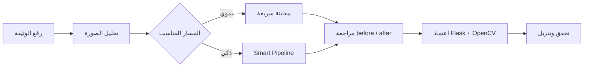
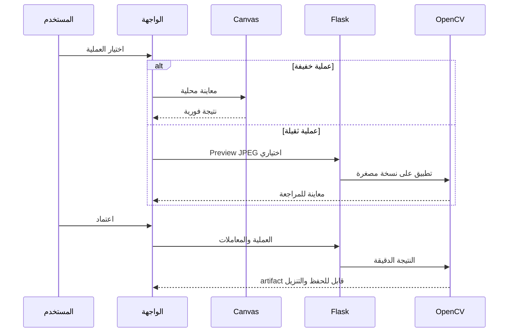
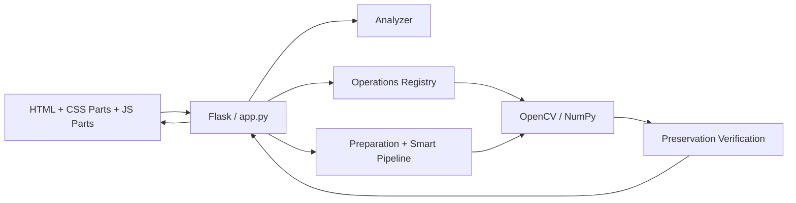

<div dir="rtl" align="right">

<div align="center">

# 🩺 Manuscript Doctor

### طبيب الوثائق · Diagnose · Treat · Preserve · Verify

**نظام ويب عربي لتشخيص صور الوثائق ومعالجتها والتحقق من أثر المعالجة قبل اعتمادها**

[](https://www.python.org/)
[](https://flask.palletsprojects.com/)
[](https://opencv.org/)
[](https://numpy.org/)
[](https://developer.mozilla.org/en-US/docs/Web/JavaScript)
[](#التحقق)

</div>

<p align="center">
  
</p>

<p align="center">
  <strong>صورة واضحة، قرار قابل للتفسير، ونتيجة لا تُعتمد قبل مراجعتها.</strong>
</p>

---

## قبل المعالجة وبعدها

<p align="center">
  
  &nbsp;&nbsp;&nbsp;
  
</p>

<p align="center">
  <sub>مثال من نتائج التقييم: تصحيح الميل مع إبقاء النتيجة قابلة للمقارنة مع الأصل.</sub>
</p>

---

## الفكرة في سطر واحد

> **ليس المسار: صورة ← فلتر ← نتيجة.**
>
> **بل: فحص ← تشخيص ← معالجة ← تحقق ← اعتماد.**



---

## ماذا يطبق المشروع؟

| المجال | التقنيات الموجودة فعلياً |
| --- | --- |
| تجهيز الوثيقة | تصحيح الميل، الاقتصاص التلقائي المحافظ، الاقتصاص اليدوي، التدوير، القلب الأفقي والرأسي |
| تحسين الصورة | ضبط الشدة، Gamma، CLAHE، Histogram Equalization، الإضاءة، الشحذ |
| إزالة العيوب | Median، Bilateral، Non-Local Means، إزالة الخلفية والبنية الضعيفة |
| فصل النص | Global، Otsu، Adaptive Threshold |
| العمليات البنيوية | Opening، Closing، Top-Hat، Black-Hat |
| تحسين الدقة | **Super Resolution** اختيارية مستقلة بتكبير Lanczos وUnsharp Masking |
| التحقق | Preservation، مقارنة الأصل بالنتيجة، Benefit Gate، Rollback، وتحذيرات المخاطر |

---

## المعاينة ليست الاعتماد



المعاينة المحلية مخصصة لسرعة التفاعل في التدوير والقلب وضبط الشدة وتصحيح جاما. أما الاعتماد النهائي، ونتيجة Super Resolution، والتنزيل، فتُنفذ خادمياً عبر Flask/OpenCV حتى تبقى النتيجة حقيقية وقابلة للتحقق.

---

## Super Resolution

عملية اختيارية يدوية لتحسين قابلية قراءة النص الصغير أو منخفض الدقة. تستخدم حالياً:

| المعامل | القيم المتاحة |
| --- | --- |
| `scale` | `2×` أو `3×` |
| `amount` | من `0` إلى `1` |
| `sigma` | من `0.5` إلى `3` |

> لا تستعيد العملية حروفاً فُقدت تماماً بسبب الضبابية أو انخفاض الدقة الشديد؛ إنها تحسن الحواف وقابلية القراءة، ولا تُعد استرجاعاً مؤكداً للمعلومات المفقودة.

---

## المعمارية



| الطبقة | المسؤولية |
| --- | --- |
| `templates/index.html` | هيكل الصفحة العربية RTL |
| `static/css/parts/` | التخطيط، الثيمات، التجاوب، ومحرر المعالجة |
| `static/js/parts/` | الحالة، الأحداث، المعاينة، المعاملات، الاعتماد والسلسلة |
| `app.py` | HTTP ورفع الصور وPreview وApprove والتنزيل |
| `processing/ops/` | عمليات الصور المستقلة وسجل العمليات |
| `processing/pipeline.py` | المسار الذكي وبوابات القرار |
| `processing/preservation.py` | قياس المحافظة على التفاصيل |
| `tests/` | اختبارات الوحدة والتكامل والمسارات الكاملة |

---

## التشغيل المحلي

```bash
cd image_project_split
python3 -m venv .venv
source .venv/bin/activate
pip install -r requirements.txt
python3 -m flask --app 'app:create_app()' run --host 0.0.0.0 --port 5002
```

افتح بعد ذلك:

```text
http://127.0.0.1:5002/
```

> لا يحتاج التشغيل المحلي إلى Docker.

---

## التحقق

```bash
PYTHONPATH=. pytest -q tests

for f in static/js/parts/*.js; do
  node --check "$f"
done
```

النتيجة الموثقة حالياً:

```text
333 passed, 16 skipped
```

وشملت المراجعة الفعلية C05 وC06، المعاينات المحلية، before/after، Undo/Redo، الاقتصاص اليدوي، Smart Pipeline، وSuper Resolution.

---

## خريطة التوثيق

| الوثيقة | ما الذي تجيبه؟ |
| --- | --- |
| [`overview.md`](overview.md) | لماذا بُني المشروع وما حدوده؟ |
| [`requirements.md`](requirements.md) | ماذا يجب أن يفعل النظام؟ |
| [`architecture.md`](architecture.md) | كيف تتوزع الطبقات وواجهات API؟ |
| [`split-structure.md`](split-structure.md) | لماذا قُسمت ملفات CSS وJavaScript؟ |
| [`workflow.md`](workflow.md) | كيف يتحرك المستخدم والنظام؟ |
| [`frontend-components.md`](frontend-components.md) | ما وظيفة مكونات الواجهة؟ |
| [`ui-states.md`](ui-states.md) | كيف تتغير الواجهة حسب الحالة؟ |
| [`decisions.md`](decisions.md) | لماذا اتُخذت القرارات الهندسية؟ |
| [`testing.md`](testing.md) | كيف يتم التحقق من صحة المشروع؟ |
| [`e2e-testing.md`](e2e-testing.md) | كيف تُختبر التجربة كاملة؟ |
| [`operation-evaluation.md`](operation-evaluation.md) | كيف تُقاس آثار العمليات؟ |
| [`phase-c-report.md`](phase-c-report.md) | كيف يعمل Smart Pipeline؟ |
| [`research-plan.md`](research-plan.md) | كيف تُقيّم Metrics وThresholds؟ |
| [`roadmap.md`](roadmap.md) | ما مراحل التطوير القادمة؟ |
| [`git-guide.md`](git-guide.md) | كيف تُدار التغييرات؟ |

---

## الحدود العلمية

المشروع أداة **لمعالجة الصور ودعم قرار المعالجة**، وليس أداة OCR أو ترميماً توليدياً. لا يدعي معرفة النص الأصلي عندما تكون معلوماته قد فُقدت، ولا يعتبر ارتفاع التباين وحده دليلاً على جودة أفضل. النتيجة النهائية تحتاج دائماً إلى مراجعة المستخدم قبل اعتمادها.

---

<div align="center">

### Manuscript Doctor

**Enhance what is hidden. Preserve what matters.**

</div>

</div>
