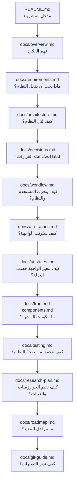
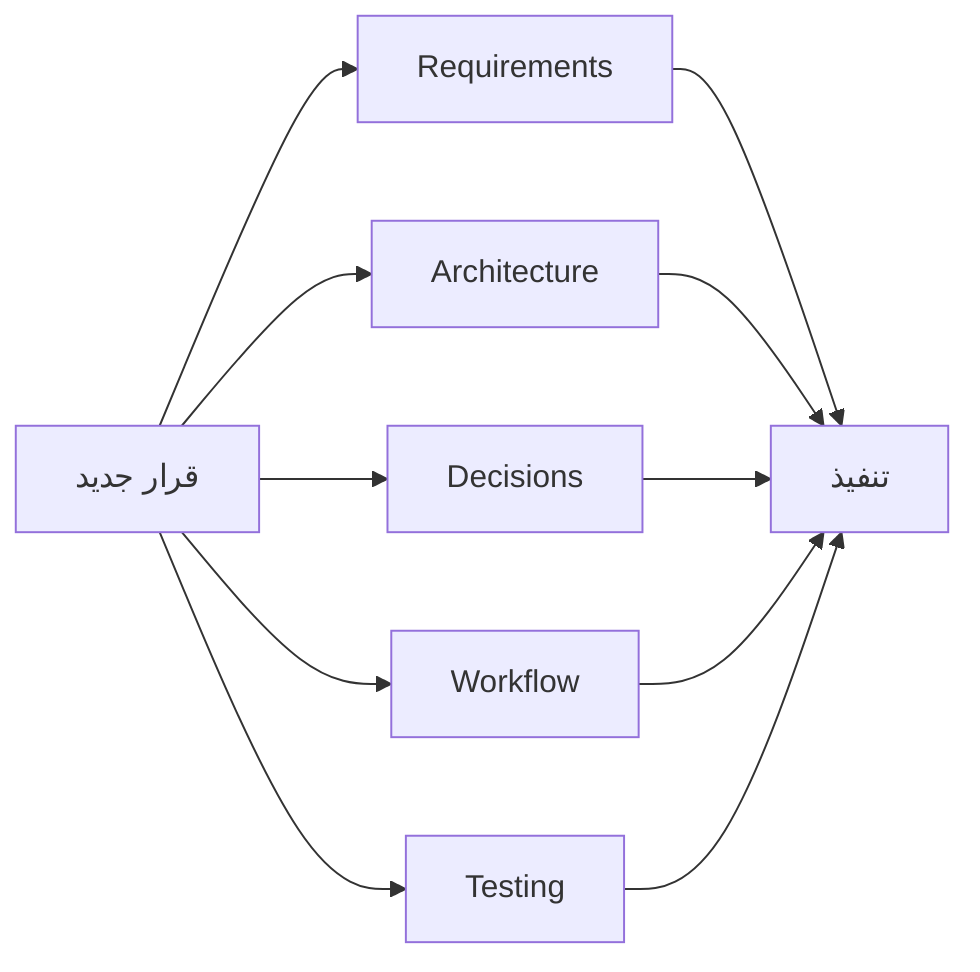

docs/README.md

<div dir="rtl" align="right">

# 📚 Manuscript Doctor — دليل الوثائق

> **الغرض من هذا الملف:** أن يكون نقطة الدخول لجميع وثائق المشروع، ويوضح وظيفة كل وثيقة ومتى نرجع إليها.

---

## 1. خريطة الوثائق



---

## 2. وظيفة كل وثيقة

| الملف                         | وظيفته                                             |
| ----------------------------- | -------------------------------------------------- |
| `README.md`                   | تعريف مختصر بالمشروع وطريقة تشغيله والوصول لوثائقه |
| `docs/overview.md`            | شرح المشكلة والقيمة والنطاق والحدود                |
| `docs/requirements.md`        | المتطلبات الوظيفية وغير الوظيفية والأمنية          |
| `docs/architecture.md`        | المعمارية والوحدات والـAPI ومسؤوليات النظام        |
| `docs/decisions.md`           | توثيق القرارات الهندسية وأسبابها                   |
| `docs/workflow.md`            | تدفق المستخدم والنظام من الرفع حتى التنزيل         |
| `docs/wireframes.md`          | المخطط البنيوي المعتمد للواجهة                     |
| `docs/ui-states.md`           | حالات الواجهة والانتقالات بينها                    |
| `docs/frontend-components.md` | مكونات Frontend ووظيفة كل مكوّن                    |
| `docs/testing.md`             | استراتيجية الاختبارات وبوابات الجودة               |
| `docs/research-plan.md`       | خطة تقييم Metrics وThresholds وOperations          |
| `docs/roadmap.md`             | مراحل تنفيذ المشروع حتى الإصدار                    |
| `docs/git-guide.md`           | أسلوب استخدام Git داخل المشروع                     |

---

## 3. من أين أبدأ؟

### لفهم المشروع

```text
README.md
↓
overview.md
↓
requirements.md
```

### لفهم التصميم الهندسي

```text
architecture.md
↓
decisions.md
↓
workflow.md
```

### للعمل على الواجهة

```text
wireframes.md
↓
ui-states.md
↓
frontend-components.md
```

### للتنفيذ والتحقق

```text
roadmap.md
↓
testing.md
↓
research-plan.md
```

---

## 4. مصدر الحقيقة لكل نوع من المعلومات

| السؤال                        | الوثيقة                  |
| ----------------------------- | ------------------------ |
| ما فكرة المشروع؟              | `overview.md`            |
| ما المطلوب تنفيذه؟            | `requirements.md`        |
| أين توضع الوظائف؟             | `architecture.md`        |
| لماذا اخترنا هذا الحل؟        | `decisions.md`           |
| ما ترتيب سير النظام؟          | `workflow.md`            |
| كيف ترتب الواجهة؟             | `wireframes.md`          |
| متى يظهر كل جزء؟              | `ui-states.md`           |
| ما مكونات Frontend؟           | `frontend-components.md` |
| كيف نختبر؟                    | `testing.md`             |
| كيف نضبط Metrics وThresholds؟ | `research-plan.md`       |
| ما المرحلة التالية؟           | `roadmap.md`             |
| كيف نحفظ التغييرات؟           | `git-guide.md`           |

---

## 5. التقدم الفعلي

هذه الوثائق لا تعتبر سجل إنجاز للمراحل.

مصدر التتبع الرسمي هو:

```text
project-plan.md
```

ولا توضع علامة إنجاز إلا بعد تنفيذ المهمة واختبارها فعليًا.

---

## 6. عند تغيير قرار مهم

إذا تغير قرار يؤثر على أكثر من جزء، نراجع الوثائق المتأثرة فقط.



الهدف هو إبقاء الوثائق والكود متطابقين، لا زيادة عدد الملفات.

---

## 7. قاعدة التوثيق

كل وثيقة يجب أن:

* تغطي مسؤوليتها فقط.
* لا تكرر محتوى وثيقة أخرى دون حاجة.
* تستخدم نفس أسماء الوحدات والحالات والمراحل.
* لا تصف ميزة غير معتمدة كأنها موجودة.
* لا تعتبر Threshold أو Parameter نهائية قبل التقييم.
* تتغير عندما يتغير السلوك الفعلي للنظام.

---

<div align="center">

## 🩺 Manuscript Doctor

**One project.
One consistent design.
One clear source for every decision.**

</div>

</div>
