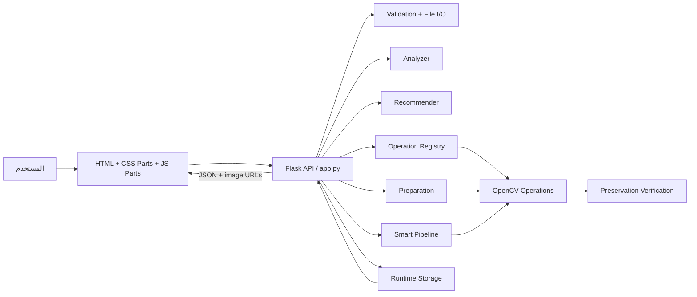
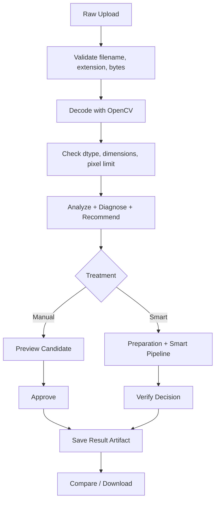
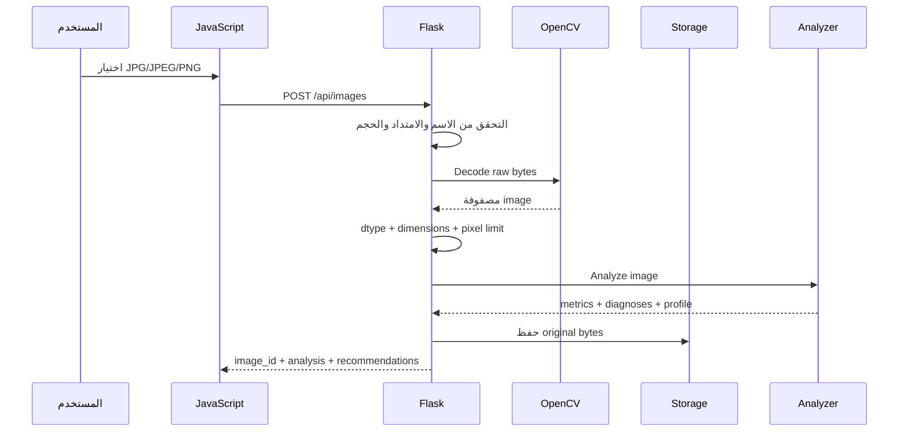
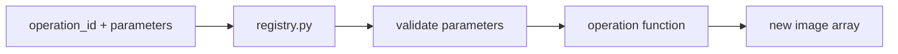
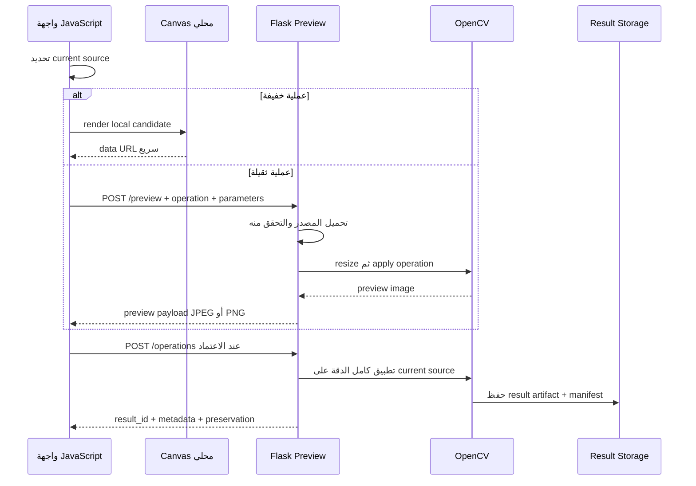
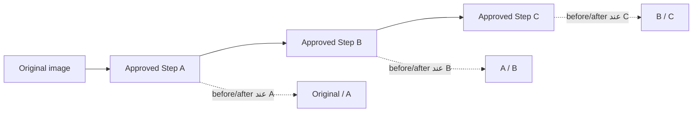
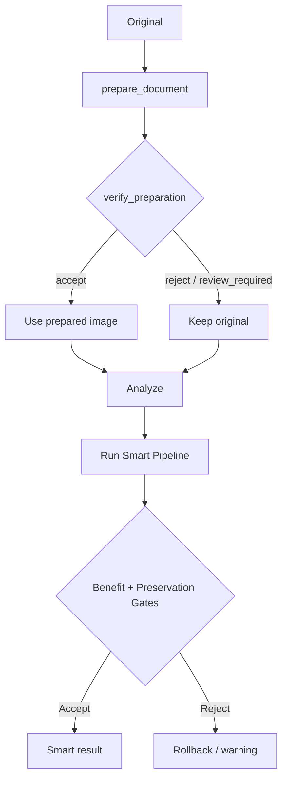
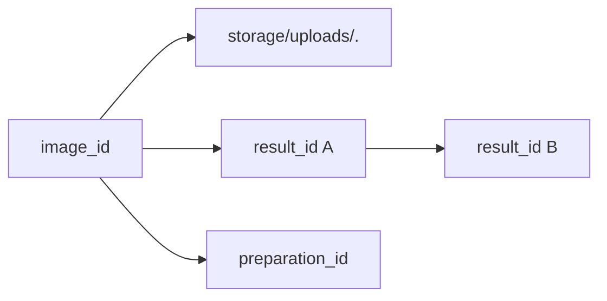
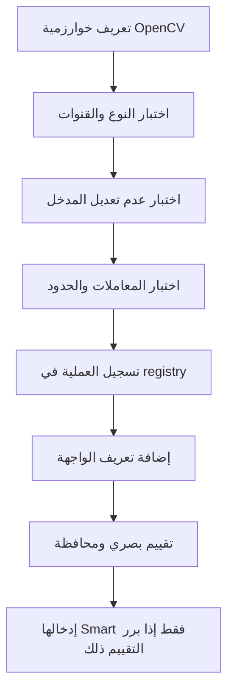

<div dir="rtl" align="right">

# 🏛️ Manuscript Doctor — معمارية النظام

> **غرض الوثيقة:** شرح كيف تتصل الواجهة بالخادم ومحرك معالجة الصور، وكيف تنتقل الصورة من الرفع إلى المعاينة ثم الاعتماد والتحقق والتنزيل.
>
> توثق هذه الصفحة **المعمارية المنفذة حالياً**. تفاصيل المتطلبات في [`requirements.md`](requirements.md)، ومسار المستخدم في [`workflow.md`](workflow.md)، وأسباب القرارات في [`decisions.md`](decisions.md).

---

## 1. المبدأ المعماري

يعتمد النظام على دورة واضحة:

```text
Analyze → Diagnose → Recommend → Treat → Preserve → Verify
```

والقاعدة الأهم هي الفصل بين المسؤوليات:

| المسؤولية | مكانها |
| --- | --- |
| استقبال الملفات والطلبات | Flask في `app.py` |
| قياس الصورة وتشخيصها | `processing/analyzer.py` |
| بناء التوصيات | `processing/recommender.py` |
| تنفيذ عملية واحدة | `processing/ops/` عبر `registry.py` |
| ترتيب المسار الذكي | `processing/pipeline.py` و`smart_document_pipeline.py` |
| تجهيز الوثيقة والتحقق من الميل والحدود | `preparation_pipeline.py` و`preparation_verification.py` |
| مقارنة الأصل بالنتيجة | `processing/preservation.py` |
| العرض والحالة والمعاينة | `static/js/parts/` |
| الهوية البصرية والتجاوب | `static/css/parts/` |

لا ينفذ الخادم خوارزمية OpenCV داخل Route مباشرة، ولا تضع الواجهة قواعد التشخيص أو التوصية أو المحافظة على التفاصيل.

---

## 2. الصورة العامة للنظام



### الطبقات

| الطبقة | المكوّنات | المسؤولية |
| --- | --- | --- |
| Presentation | `templates/index.html`، `static/css/`، `static/js/` | رسم الواجهة، إدارة الحالة، المعاينة، المقارنة، والتفاعل |
| Application | `app.py` | التحقق من HTTP، قراءة الملفات، استدعاء الخدمات، وتوحيد الاستجابات |
| Analysis | `analyzer.py`، `recommender.py` | استخراج المؤشرات، التشخيص، وبناء توصيات قابلة للتفسير |
| Processing | `processing/ops/`، `pipeline.py` | تطبيق العمليات الفردية والمسارات المركبة |
| Preparation | `preparation_pipeline.py`، `document_boundary.py`، `document_rectification.py` | تجهيز الوثيقة عندما يكون القرار آمناً |
| Verification | `preservation.py`، `preparation_verification.py` | فحص أثر المعالجة والتحقق من قبول التجهيز |
| Storage | `storage/uploads/`، `storage/results/`، `storage/preparation_previews/` | ملفات Runtime المؤقتة والنتائج القابلة للعرض والتنزيل |

لا توجد قاعدة بيانات أو خدمة خلفية دائمة في النسخة الحالية. يعتمد النظام على ملفات Runtime ومعرفات مولدة في الخادم.

---

## 3. دورة حياة الصورة



تبقى البايتات الأصلية محفوظة كما وصلت بعد نجاح التحقق، ولا تُستبدل نتيجة معالجة بالصورة الأصلية. كل نتيجة معتمدة تملك `result_id` مستقلاً، ويمكن ربطها بنتيجة سابقة عبر `parent_result_id`.

---

## 4. طبقة Flask — `app.py`

يتولى `app.py` تنسيق الطلبات ولا يحتوي على منطق خوارزميات OpenCV التفصيلي. قبل تمرير أي عملية، يتحقق من:

1. صحة `image_id` أو `result_id`.
2. وجود الملف داخل مجلد Runtime المسموح.
3. صحة جسم JSON ووجود `operation_id`.
4. كون `parameters` كائناً JSON صالحاً.
5. أن العملية مسجلة في `processing/ops/registry.py`.
6. أن `source_result_id` ينتمي إلى الصورة نفسها وصالح للسلسلة.

### مسارات API الحالية

| الطريقة | المسار | الوظيفة |
| --- | --- | --- |
| `GET` | `/` | عرض صفحة التطبيق |
| `POST` | `/api/images` | رفع الصورة، التحقق، التحليل، والتوصيات |
| `GET` | `/api/images/<image_id>` | عرض الصورة الأصلية |
| `POST` | `/api/images/<image_id>/operations` | تنفيذ عملية يدوية واعتماد نتيجتها |
| `POST` | `/api/images/<image_id>/preview` | إنشاء Preview خادمي غير نهائي |
| `POST` | `/api/images/<image_id>/pipeline` | تشغيل Smart Pipeline |
| `GET` | `/api/results/<result_id>` | عرض نتيجة محفوظة |
| `GET` | `/api/results/<result_id>/download` | تنزيل نتيجة محفوظة بصيغة PNG |
| `GET` | `/api/images/<image_id>/boundary` | تحليل حدود الوثيقة |
| `POST` | `/api/images/<image_id>/preparation/preview` | إنشاء معاينة تجهيز الوثيقة |
| `GET` | `/api/preparation/<preparation_id>` | عرض معاينة Preparation |
| `POST` | `/api/images/<image_id>/preparation/<preparation_id>/approve` | اعتماد معاينة Preparation |

لا ينشئ النظام Route جديداً لكل Operation؛ يمر `operation_id` عبر registry موحدة.

---

## 5. رفع الصورة والتحقق منها



القيم الأمنية الحالية تشمل حد حجم الطلب `20 MB` وحد الصورة المفكوكة `30,000,000` بكسل. لا يكفي الامتداد وحده لقبول الملف؛ يجب أن ينجح فك الصورة وقراءة مصفوفتها.

---

## 6. محرك التحليل والتوصية

### Analyzer

يعمل `analyzer.py` على صورة قابلة للقراءة ويعيد أبعادها ومؤشرات بصرية، منها:

| المؤشر | المعنى |
| --- | --- |
| `brightness` | مستوى السطوع العام |
| `contrast` | انتشار درجات الإضاءة |
| `dynamic_range` | المسافة بين القيم الداكنة والمضيئة |
| `sharpness` | مؤشر تقريبي لقوة التفاصيل والحواف |
| `noise` | تغيرات محلية غير منتظمة |
| `illumination_variation` | عدم تجانس الإضاءة |
| `edge_density` | كثافة الحواف |

### Recommender

يحوّل `recommender.py` نتائج التحليل إلى توصيات تحتوي على العملية والسبب والأولوية والمخاطر. وهو **Rule-Based Decision Support**، وليس نموذج تعلم آلي أو ذكاء اصطناعي توليدي.

لا تصبح العملية مؤهلة للمسار التلقائي إذا كانت مصنفة `manual_only` أو `reject`، ولا يعني وجودها في registry أنها آمنة لكل الصور.

---

## 7. سجل العمليات — `processing/ops/registry.py`

تستخدم الواجهة معرفات ثابتة، ثم يربطها registry بدوال Python المسموح بها:



### مجموعات العمليات الحالية

| الفئة | معرفات أو أمثلة |
| --- | --- |
| الهندسة | `crop`، `deskew`، `rotate_right`، `rotate_left`، `flip_horizontal`، `flip_vertical` |
| التباين | `clahe`، `histogram_equalization`، `faded_text_enhance` |
| الإضاءة | `intensity_adjust`، `gamma_correct`، `illumination_normalize` |
| إزالة الضوضاء | `median_denoise`، `bilateral_denoise`، `non_local_means_denoise` |
| فصل النص | `global_threshold`، `otsu_threshold`، `adaptive_threshold` |
| البنية | `morphological_opening`، `morphological_closing`، `morphological_top_hat`، `morphological_black_hat` |
| الخلفية | `background_suppress`، `weak_structure_suppress` |
| التفاصيل والدقة | `sharpen`، `super_resolution` |

كل عملية تستقبل مصفوفة صورة وتعيد مصفوفة جديدة، ولا تتعامل مباشرة مع HTML أو HTTP أو مسارات الملفات. العمليات الملونة تعالج luminance عند الحاجة للمحافظة على القنوات اللونية، وتتحقق الوحدات من القنوات والأنواع والمعاملات.

### Super Resolution

توجد العملية في `processing/ops/super_resolution.py` وتظهر في registry بالمعرف `super_resolution`. وهي عملية يدوية مستقلة، ومعاملاتها الافتراضية الحالية:

```json
{
  "scale": 2,
  "amount": 0.35,
  "sigma": 1.0
}
```

التنفيذ الحالي هو Lanczos interpolation ثم Unsharp Masking محافظ. توجد حماية لحجم الناتج، ولا تُدرج العملية تلقائياً داخل Smart Pipeline. تحسين الوضوح لا يعني استعادة حرف فُقدت معلوماته بالكامل.

---

## 8. المعاينة مقابل الاعتماد

هذا الفصل هو أساس معالجة مشكلة التأخير وعدم ظهور الخطوة الحالية في الوقت الصحيح.



### المعاينة المحلية

العمليات الحالية القابلة للمعاينة المحلية هي:

```text
rotate_right
rotate_left
flip_horizontal
flip_vertical
intensity_adjust
gamma_correct
```

لا تنشئ هذه المعاينة ملفاً نهائياً ولا `result_id`. إنها مرشح بصري سريع فقط.

### المعاينة الخادمية

يستخدم المسار `/preview` مصدراً مصغراً للعمليات الثقيلة. يمكن للواجهة إرسال:

```http
X-Preview-Format: jpeg
```

فيعود الرد بصيغة JPEG لتقليل النقل، بينما يبقى PNG هو الافتراضي للتوافق. يتخطى Preview فحص المحافظة النهائي لأنه غير نهائي.

### الاعتماد

زر **اعتماد العملية وإضافتها للسلسلة** هو مسار الاعتماد الوحيد. عند الاعتماد:

1. يتحقق الخادم من العملية والمعاملات.
2. يحدد المصدر الحالي من `source_result_id` إن وجد، وإلا يستخدم الأصل.
3. يطبق العملية كاملة الدقة عبر OpenCV.
4. ينفذ `Preservation Verification` عند الإمكان.
5. يحفظ النتيجة وmanifest جديداً.
6. يعيد `result_id` و`parent_result_id` وmetadata للواجهة.

---

## 9. السلسلة اليدوية وbefore/after وUndo/Redo

الوثيقة الأصلية ثابتة، لكن العمليات اليدوية **تُبنى تسلسلياً** بعد الاعتماد. معنى ذلك أن الخطوة الثانية تستخدم نتيجة الخطوة الأولى المعتمدة كمصدر، لا أن كل خطوة تعود إلى الأصل.



يحفظ كل عنصر في `manualChain` بيانات العملية ونتيجتها ومصدرها. يحدد `manualActiveIndex` الخطوة المعروضة، وتستخدم `syncManualChainSelection` المصدر السابق والنتيجة الحالية لتحديث الصورتين معاً. لذلك لا يجب أن تعتمد الواجهة على تعيينات متفرقة قد تعرض الخطوة السابقة بعد اعتماد الخطوة الجديدة.

يغير Undo/Redo المؤشر النشط في السلسلة ويعيد عرض الصور من النتائج المحفوظة أو الكاش المحلي دون إعادة تنفيذ العملية بلا حاجة. وعند اعتماد عملية جديدة بعد التراجع، تُزال الفروع اللاحقة غير المعتمدة من المسار النشط بدلاً من خلط تاريخين.

---

## 10. تجهيز الوثيقة وSmart Pipeline

تجهيز الوثيقة ليس مرادفاً لاقتصاص قسري. يبدأ المسار بـ`prepare_document`، ثم يمرر الناتج إلى `verify_preparation` قبل استخدامه في Smart Pipeline.



### سياسة deskew-only

عند عدم وجود حدود موثوقة، يمكن قبول تصحيح الميل فقط إذا:

| الشرط | المطلوب |
| --- | --- |
| الثقة | `deskew` عالي الثقة، بحد أدنى محافظ `0.80` |
| الاقتصاص | غير مطبق |
| المنظور | غير مطبق |
| الإطار | يُحافظ على الإطار الكامل |
| القرار | يقبل فقط إذا كان التحقق يصف الحالة الآمنة |

إذا لم تحقق الصورة هذه الشروط، تبقى Preparation مؤجلة أو مرفوضة، ويمكن للمستخدم مراجعة تجهيز الوثيقة يدوياً.

### Smart Pipeline

يطبق `pipeline.py` و`smart_document_pipeline.py` المرشحات المؤهلة فقط. يمر المرشح عبر:

```text
Recommendation
   ↓
Eligibility Gate
   ↓
Apply Candidate
   ↓
Re-analysis / Benefit Gate
   ↓
Preservation Gate
   ↓
Accept أو Rollback
```

تُحفظ نتيجة Smart الأساسية مع `origin="smart"`، وقد تُحفظ مرشحات فصل النص كـ`smart_candidate` للمراجعة. لا تدخل `super_resolution` في المسار التلقائي.

---

## 11. Preservation Verification

يقارن `processing/preservation.py` الأصل بالنتيجة بعد العملية. لا يستخدم OCR ولا يفهم المعنى اللغوي للنص.

| المؤشر | الاستخدام |
| --- | --- |
| Edge Retention | هل بقيت الحواف الأصلية قريبة من مواضعها؟ |
| Component Retention | مقارنة مكونات بنيوية مشتقة، وليست حروفاً مؤكدة |
| Structure Similarity Indicator | اختلاف بصري مبسط بعد التطبيع، وليس SSIM القياسي |
| Edge Inflation | رصد تضخم الحواف أو الضوضاء بعد المعالجة |

النتيجة تصنف كمؤشر مساعد مثل `acceptable` أو `caution` أو `high_risk`. أما Preview غير النهائي فيعيد `skipped_for_preview` ولا يُعامل كحكم اعتماد.

---

## 12. واجهة Frontend المقسمة

### JavaScript

| الملف | المسؤولية |
| --- | --- |
| `00-state-constants.js` | الحالة، عناصر DOM، تعريفات العمليات والمعاملات |
| `01-utilities.js` | أدوات عامة وتنسيق الرسائل والقيم |
| `02-upload-api.js` | الرفع، تصفير الحالة، واستدعاءات البداية |
| `03-analysis-dashboard.js` | المؤشرات والرسومات ولوحة التحليل |
| `04-examination.js` | فحص الصورة وتحديث حالات Examination |
| `05-manual-parameters.js` | إنشاء المعاملات، Crop، وملاحظات Super Resolution |
| `06-manual-preview.js` | Preview، Chart، Canvas المحلي، والمرشح المتفائل |
| `07-manual-execution.js` | اعتماد العملية، السلسلة، before/after، Undo/Redo |
| `08-smart-pipeline.js` | تشغيل Smart Pipeline وعرض قراره وخطواته |
| `09-history-results.js` | سجل النتائج والخطوات المعتمدة |
| `10-theme-quick-tools.js` | الثيم وأزرار العمليات السريعة |
| `11-events-entry.js` | ربط الأحداث ونقطة الدخول النهائية |

### CSS

تقسم CSS إلى ملفات للـHeader، workflow، الرفع، التحليل، المعالجة اليدوية، القص والسجل والفوتر، الثيم، المحرر، Dashboard، والاستجابة للشاشات.

الـHeader يستخدم الصورة:

```text
static/assets/header-workspace-background.png
```

كخلفية كاملة فقط، ولا يوجد عنصر Hero مستقل للصورة القديمة.

---

## 13. هوية الموارد والتخزين



| المورد | المعنى |
| --- | --- |
| `image_id` | هوية صورة الرفع الأصلية |
| `result_id` | هوية نتيجة معالجة محفوظة |
| `parent_result_id` | النتيجة التي بنيت عليها الخطوة الحالية |
| `preparation_id` | معاينة تجهيز مؤقتة قبل اعتمادها |

تُولد المعرفات في الخادم، ولا ترسل الواجهة مسارات نظام الملفات. يستخدم `storage/uploads/` للأصل، و`storage/results/` للنتائج، و`storage/preparation_previews/` لمعاينات التجهيز المؤقتة. هذه ملفات Runtime وليست جزءاً من مصدر الكود.

---

## 14. عقد الاستجابة

تستخدم الاستجابات غلافاً موحداً:

```json
{
  "success": true,
  "message": "تم تنفيذ الطلب بنجاح.",
  "data": {},
  "error": null
}
```

وعند الخطأ:

```json
{
  "success": false,
  "message": "تعذر تنفيذ الطلب.",
  "data": null,
  "error": {
    "code": "ERROR_CODE",
    "details": null
  }
}
```

### عقد العملية اليدوية

```json
{
  "operation_id": "super_resolution",
  "parameters": {
    "scale": 2,
    "amount": 0.35,
    "sigma": 1.0
  },
  "source_result_id": "OPTIONAL_APPROVED_RESULT_ID"
}
```

يعيد الخادم نتيجة تحتوي على `result_id` و`url` و`download_url` وبيانات العملية و`source_result_id` وحالة التحقق.

### عقد Preview

```json
{
  "operation_id": "clahe",
  "parameters": {},
  "source_result_id": "OPTIONAL_APPROVED_RESULT_ID"
}
```

لا تعيد هذه العملية نتيجة معتمدة؛ تعيد `preview` و`source_result_id` و`verification.status = "skipped_for_preview"`.

---

## 15. قواعد الحماية والتعامل مع الأخطاء

| القاعدة | التطبيق |
| --- | --- |
| الأصل Immutable | لا تُكتب نتيجة فوق ملف الرفع |
| معرفات غير مكشوفة البنية | الواجهة تتعامل مع `image_id` و`result_id` كمعرفات opaque |
| تحقق مزدوج | التحقق في الواجهة لتحسين UX وفي Flask للحماية |
| registry مغلقة | لا تُستدعى دوال Python من اسم يرسله المستخدم |
| مصدر السلسلة | لا تُستخدم نتيجة من صورة أخرى |
| المعاملات | ترفض القيم غير الصالحة قبل OpenCV |
| المسارات | لا يختار المستخدم مسار التخزين |
| الذاكرة | حدود الحجم والبكسلات وحماية Super Resolution |
| الأخطاء | رسائل عربية مفهومة دون كشف Stack Trace |

أمثلة رموز الأخطاء: `NO_FILE`، `UNREADABLE_IMAGE`، `INVALID_OPERATION`، `INVALID_OPERATION_PARAMETERS`، `SOURCE_RESULT_NOT_FOUND`، `INVALID_SOURCE_RESULT_KIND`، `PROCESSING_FAILED`، و`RESULT_NOT_FOUND`.

---

## 16. الأداء واختيار التعقيد

لا تُقاس سرعة النظام بزمن المعاينة وحده:

| المسار | الأولوية | سبب الكلفة |
| --- | --- | --- |
| Canvas Preview | استجابة فورية | يعمل على نسخة العرض داخل المتصفح |
| Flask Preview | حجم نقل منخفض ونتيجة تقريبية | تصغير الصورة وتطبيق العملية الخادمية |
| Approve | صحة artifact النهائي | معالجة كاملة وحفظ وفحص المحافظة |
| Smart Pipeline | قرار محافظ قابل للتفسير | Preparation وتحليل ومرشح والتحقق |

لم تُضف queue أو background workers أو Docker لأن المعمارية الحالية تطبيق محلي تعليمي، ولأن إضافة بنية تشغيلية كبيرة ستخفي منطق معالجة الصور بدلاً من توضيحه.

---

## 17. إضافة عملية جديدة



إضافة عملية لا تعني تشغيلها تلقائياً. يجب أولاً تحديد هدفها، معاملاتها، مخاطرها، دعمها للمعاينة، ودليل صلاحيتها على صور متنوعة.

---

## 18. حدود المعمارية

لا تشمل المعمارية الحالية OCR، أو YOLO، أو Segmentation، أو تدريب Deep Learning، أو Generative Restoration، أو حسابات المستخدمين، أو قاعدة بيانات، أو تخزيناً دائماً، أو معالجة سحابية. كما لا تُعد Super Resolution الحالية نموذجاً عميقاً ولا ضماناً لاستعادة المعلومات المفقودة.

---

## 19. التحقق من المعمارية

تُراجع المعمارية من خلال:

```bash
PYTHONPATH=. pytest -q tests
for f in static/js/parts/*.js; do node --check "$f"; done
```

النتيجة المرجعية الحالية:

```text
333 passed, 16 skipped
```

وتغطي اختبارات المشروع عمليات OpenCV، Flask API، التحضير، اتجاه الصورة، السلسلة اليدوية، التحقق المحافظ، وSuper Resolution.

---

## مراجع التوثيق الداخلي

| الموضوع | الملف |
| --- | --- |
| الفكرة والنطاق | [`overview.md`](overview.md) |
| المتطلبات وقابلية التتبع | [`requirements.md`](requirements.md) |
| تدفق المستخدم | [`workflow.md`](workflow.md) |
| تخطيط الواجهة | [`wireframes.md`](wireframes.md) |
| حالات الواجهة | [`ui-states.md`](ui-states.md) |
| مكونات Frontend | [`frontend-components.md`](frontend-components.md) |
| الاختبارات | [`testing.md`](testing.md) و[`e2e-testing.md`](e2e-testing.md) |
| تقييم العمليات | [`operation-evaluation.md`](operation-evaluation.md) |
| القرارات | [`decisions.md`](decisions.md) |
| خط تجهيز الوثيقة وSmart Pipeline | [`phase-c-report.md`](phase-c-report.md) |

<div align="center">

### Architectural Principle

**ضع كل منطق في مكانه الصحيح.**

**عاين بسرعة. اعتمد بدقة. تحقّق بصدق.**

</div>

</div>
