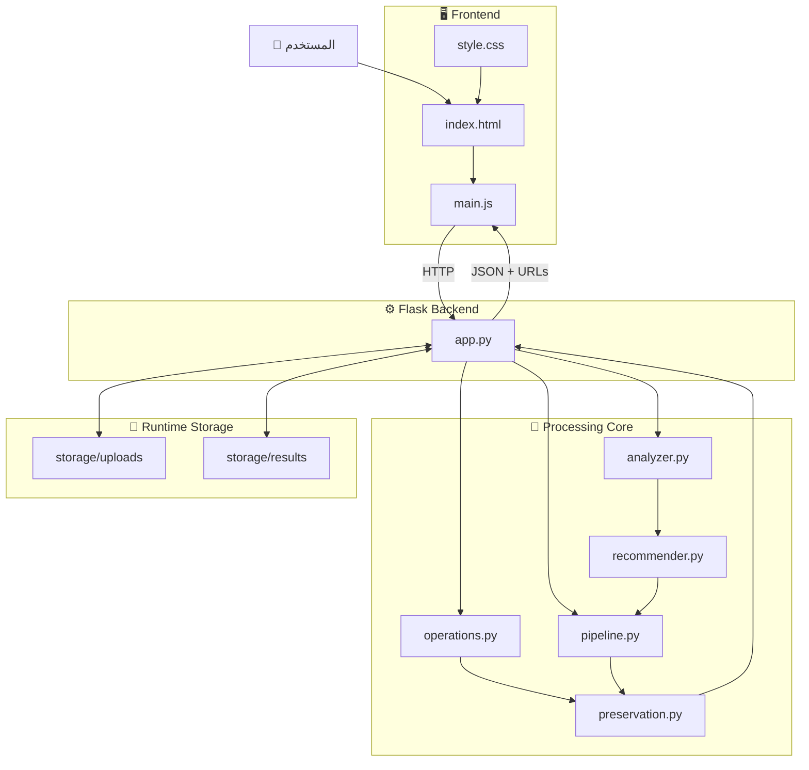
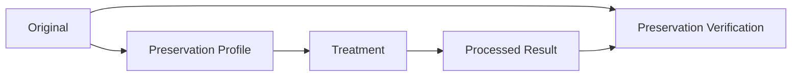
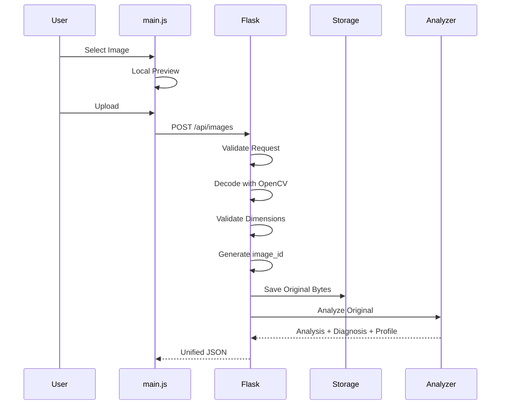
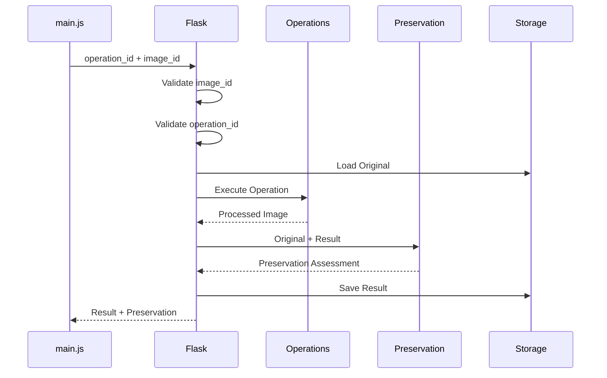
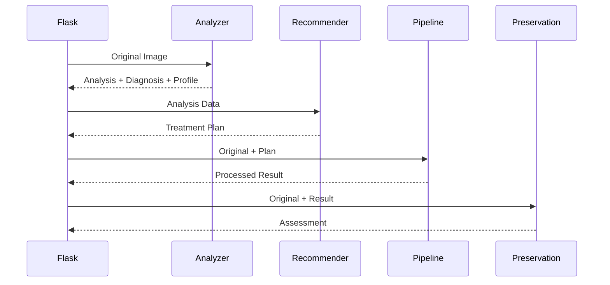
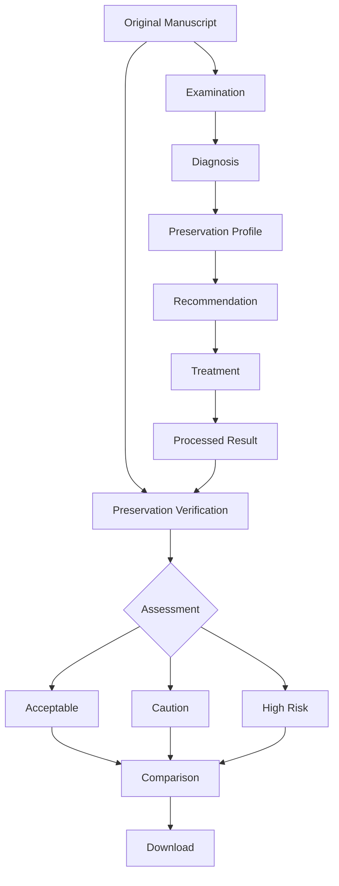

<div dir="rtl" align="right">

# 🏛️ Manuscript Doctor — معمارية النظام

> **الغرض من الوثيقة:** توضيح البنية الداخلية للنظام، مسؤولية كل مكوّن، تدفق البيانات، عقود الـAPI، وحدود الفصل بين الأجزاء.
> **هذه الوثيقة لا تشرح المتطلبات أو أسباب جميع القرارات؛ المتطلبات في `requirements.md` والقرارات في `decisions.md`.**

---

## 1. الهدف المعماري

يجب أن تسمح المعمارية لـ **Manuscript Doctor** بتنفيذ المسار التالي بوضوح:

```text
Analyze
   ↓
Diagnose
   ↓
Recommend
   ↓
Treat
   ↓
Preserve
   ↓
Verify
```

مع الحفاظ على مبدأ أساسي:

> **تنفيذ المعالجة منفصل عن تحليل الصورة، والتوصية منفصلة عن التنفيذ، والتحقق من المحافظة منفصل عن الجميع.**

الهدف ليس إنشاء عدد كبير من الملفات، بل منع تداخل المسؤوليات بحيث يمكن تطوير كل جزء واختباره دون هدم بقية النظام.

---

# 2. النظرة العامة على المعمارية



---

# 3. طبقات النظام

| الطبقة                 | المسؤولية                                   | التقنية                 |
| ---------------------- | ------------------------------------------- | ----------------------- |
| **Presentation Layer** | عرض الواجهة والتفاعل مع المستخدم            | HTML + CSS + JavaScript |
| **Application Layer**  | إدارة HTTP والتحقق وتنسيق تدفق الطلبات      | Flask                   |
| **Processing Layer**   | التحليل والتشخيص والتوصية والمعالجة والتحقق | OpenCV + NumPy          |
| **Storage Layer**      | حفظ الصور الأصلية والنتائج المؤقتة          | Local File System       |

> لا توجد قاعدة بيانات في الـMVP.

---

# 4. المكونات ومسؤولياتها

## 4.1 `app.py` — منسق التطبيق

### المسؤوليات

* إنشاء تطبيق Flask.
* إعداد المجلدات وحدود الرفع.
* تعريف Routes.
* استقبال HTTP Requests.
* التحقق من الطلبات والملفات.
* إدارة `image_id` و`result_id`.
* استدعاء الوحدات المتخصصة.
* حفظ وقراءة الملفات المسموحة.
* إعادة JSON موحد.
* التعامل مع الأخطاء المتوقعة.

### لا يجب أن يحتوي على

* خوارزميات OpenCV الخاصة بالمعالجة.
* حساب Brightness أو Contrast.
* قواعد Diagnosis.
* قواعد Recommendation.
* خوارزميات Preservation.
* منطق Pipeline الداخلي.

---

## 4.2 `processing/analyzer.py` — Examination & Diagnosis Engine

### المسؤولية

تحليل **الصورة الأصلية قبل المعالجة**.

### الوظائف

* التحقق من صحة مصفوفة الصورة.
* دعم:

  * Grayscale
  * BGR
  * BGRA
* استخراج الأبعاد والقنوات.
* تحويل نسخة داخلية إلى Grayscale عند الحاجة.
* حساب المؤشرات البصرية.
* تحويل بعض المؤشرات إلى Diagnosis.
* إنشاء Preservation Profile أولي.

### المؤشرات الحالية

* Brightness
* Contrast
* Dynamic Range
* Sharpness Indicator
* Noise Indicator
* Illumination Variation
* Edge Density

### لا يجب أن يقوم بـ

* حفظ الملفات.
* تنفيذ CLAHE أو Threshold أو أي Treatment.
* اختيار Operation للمستخدم.
* مقارنة Original مع Result.
* التعامل مع Flask أو HTTP.

```text
Original Image
      ↓
Analyzer
      ↓
Metrics
      ↓
Diagnosis
      ↓
Preservation Profile
```

---

## 4.3 `processing/recommender.py` — Recommendation Engine

### المسؤولية

تحويل نتائج التحليل إلى **خطة معالجة قابلة للتفسير**.

### المدخلات

```text
Analysis
+
Diagnoses
+
Preservation Profile
```

### المخرجات

* Operation مقترحة.
* سبب الاختيار.
* Priority.
* تحذير عند وجود حساسية مرتفعة.
* خطة أولية يمكن للـPipeline استخدامها.

### مثال منطقي

```text
Low Contrast
+
Uneven Illumination
+
Moderate Preservation Sensitivity
        ↓
Recommend CLAHE
        ↓
Reason:
تحسين التباين المحلي مع تجنب معالجة عالمية قوية
```

### لا يجب أن يقوم بـ

* تنفيذ الخوارزمية.
* قراءة الملفات.
* حفظ النتائج.
* اتخاذ قرار Preservation بعد المعالجة.

---

## 4.4 `processing/operations.py` — Image Processing Operations

### المسؤولية

توفير عمليات معالجة مستقلة وقابلة للاختبار.

من أمثلتها:

* Grayscale
* Median Filter
* Gaussian Filter
* Histogram Equalization
* CLAHE
* Sharpening
* Canny
* Otsu Threshold
* Adaptive Threshold
* Morphological Opening
* Morphological Closing

كل Operation يجب أن:

```text
تستقبل Image
      ↓
تنفذ عملية محددة
      ↓
تعيد Result
```

ولا تتعامل مع:

* HTTP
* File Paths من المستخدم
* Diagnosis
* Recommendations
* UI

---

# 5. Operation Registry

لا يرسل المستخدم اسم Python Function.

يرسل فقط معرفًا ثابتًا مثل:

```json
{
  "operation": "clahe"
}
```

ويتم الربط داخليًا:

```text
"clahe"
   ↓
Operation Registry
   ↓
clahe function
```

مثال مفاهيمي:

```python
OPERATIONS = {
    "grayscale": ...,
    "median": ...,
    "clahe": ...,
    "otsu": ...
}
```

## الهدف

* منع استدعاء دوال عشوائية.
* تثبيت Contract بين Frontend وBackend.
* جعل إضافة Operation جديدة أسهل.
* عدم إنشاء Route جديد لكل خوارزمية.

---

# 6. `processing/pipeline.py` — Preservation-Aware Smart Pipeline

### المسؤولية

تنفيذ سلسلة معالجة تلقائية بناءً على حالة الصورة.

الـPipeline ليست:

```text
Filter A
→ Filter B
→ Filter C
```

ثابتة لجميع الصور.

بل:

```text
Diagnosis
+
Recommendation
+
Preservation Profile
       ↓
Treatment Plan
       ↓
Pipeline Execution
```

### النسخة الأساسية

```text
Original
   ↓
Treatment Plan
   ↓
Step 1
   ↓
Step 2
   ↓
Result
   ↓
Preservation Verification
```

### يجب أن تعيد

* الخطوات المنفذة.
* ترتيبها.
* سبب كل خطوة.
* Result.
* Preservation Assessment عند توفره.

### لا يجب أن

* تستخدم نتيجة Manual Operation سابقة كمدخل.
* تعتبر Result مقبولة تلقائيًا دون التحقق.
* تخفي خطواتها عن المستخدم.

---

# 7. `processing/preservation.py` — Preservation Verification Engine

هذا المكوّن من أهم أجزاء معمارية Manuscript Doctor.

### المسؤولية

مقارنة:

```text
Original
+
Processed Result
```

للبحث عن مؤشرات بنيوية على أن المعالجة قد تكون أثرت في التفاصيل الأصلية.

### يمكن أن يشمل مستقبلًا

* Edge Retention.
* Small Detail Retention.
* Component Changes.
* Stroke Continuity Indicators.
* Component Merging Indicators.
* Structural Change Indicators.

### المخرجات

```text
Metrics
+
Warnings
+
Assessment
```

### مثال

```json
{
  "metrics": {},
  "warnings": [],
  "assessment": "acceptable"
}
```

### لا يجب أن

* يفسر كل اختلاف Pixel كفقد نص.
* يدعي معرفة معنى الحروف.
* يعيد بناء تفاصيل مفقودة.
* يصف النتيجة بأنها `100% safe`.
* يحدد Treatment قبل المعالجة.

---

# 8. الفرق بين Preservation Profile وPreservation Verification

هذا الفرق **أساسي** ولا يجب خلطه.

| العنصر                        | التوقيت      | السؤال                              |
| ----------------------------- | ------------ | ----------------------------------- |
| **Preservation Profile**      | قبل المعالجة | ما مقدار الحذر المقترح لهذه الصورة؟ |
| **Preservation Verification** | بعد المعالجة | ماذا حدث للبنية بعد تطبيق المعالجة؟ |



---

# 9. الواجهة الأمامية

## `templates/index.html`

مسؤول عن:

* هيكل الصفحة.
* الأقسام.
* الأزرار.
* أماكن عرض الصور.
* الحاويات.

لا يحتوي منطق Diagnosis أو Processing.

---

## `static/js/main.js`

مسؤول عن:

* اختيار الصورة.
* Local Preview.
* إرسال Requests.
* استقبال JSON.
* إدارة حالات الواجهة.
* عرض Metrics.
* عرض Diagnosis.
* عرض Recommendations.
* عرض Result.
* عرض Preservation Assessment.
* تحديث روابط التنزيل.

### ممنوع داخله

```text
Thresholds
Diagnosis Rules
Recommendation Rules
Preservation Rules
OpenCV Logic
```

---

## `static/css/style.css`

مسؤول عن:

* RTL.
* Responsive Layout.
* Grid/Flex.
* Cards.
* Buttons.
* Image Containers.
* Loading States.
* Warning States.
* Typography.

ولا يحتوي أي منطق وظيفي.

---

# 10. Backend هو مصدر الحقيقة

الـBackend هو المصدر الوحيد لـ:

* Analysis Metrics.
* Diagnostic Thresholds.
* Diagnosis.
* Preservation Profile.
* Recommendation Rules.
* Operation Selection.
* Pipeline Rules.
* Preservation Metrics.
* Preservation Assessment.
* Warnings.

```text
JavaScript
    ✗ لا يشخص
    ✗ لا يوصي
    ✗ لا يحسب Thresholds
    ✗ لا يقرر سلامة النتيجة

Python Backend
    ✓ مصدر الحقيقة
```

---

# 11. دورة حياة الصورة

## 11.1 رفع الصورة



---

## 11.2 Manual Processing



---

## 11.3 Smart Pipeline



---

# 12. هوية الموارد

## `image_id`

يمثل صورة أصلية مرفوعة.

يولد بواسطة Backend.

مثال:

```text
917a66f45b08454c9ab34cb7658f4060
```

Frontend يتعامل معه كـ:

> Opaque Identifier

أي معرف لا يحتاج لمعرفة بنيته الداخلية.

---

## `result_id`

يمثل Result مستقلة.

الصورة الواحدة يمكن أن تنتج:

```text
Original
 ├── CLAHE Result
 ├── Median Result
 ├── Otsu Result
 └── Pipeline Result
```

وكل Result لها `result_id` منفصل.

---

# 13. قاعدة Original Immutable

الصورة الأصلية لا يتم تعديلها أو الكتابة فوقها.

### Manual Operation

```text
Original
   ↓
Operation A
   ↓
Result A
```

ثم إذا اختار المستخدم Operation B:

```text
Original
   ↓
Operation B
   ↓
Result B
```

وليس:

```text
Result A
   ↓
Operation B
```

أما Smart Pipeline فهي سلسلة مقصودة:

```text
Original
   ↓
Step 1
   ↓
Step 2
   ↓
Step 3
   ↓
Result
```

---

# 14. التخزين

```text
storage/
├── uploads/
└── results/
```

## `uploads`

يحتوي الصور الأصلية المؤقتة.

## `results`

يحتوي نتائج المعالجة.

### القواعد

* الملفات Runtime Data.
* لا تتبع بواسطة Git.
* الاسم الداخلي يولده Backend.
* المستخدم لا يختار مسار التخزين.
* لا يوجد تخزين دائم في الـMVP.

---

# 15. استراتيجية التحقق من الرفع

يمر الملف بالخطوات التالية:

```text
Request
   ↓
هل يوجد image؟
   ↓
هل filename غير فارغ؟
   ↓
هل الامتداد مسموح؟
   ↓
قراءة Raw Bytes
   ↓
OpenCV Decode
   ↓
هل الصورة قابلة للقراءة؟
   ↓
Dimensions Check
   ↓
Pixel Limit Check
   ↓
Generate image_id
   ↓
Save Original Bytes
```

### لا يعتمد النظام على

* Extension وحده.
* MIME Type وحده.
* اسم الملف القادم من المستخدم.

---

# 16. حدود الرفع

القيم الحالية:

```text
MAX_UPLOAD_SIZE = 20 MB
MAX_IMAGE_PIXELS = 30,000,000
```

وجود الحدين مقصود:

```text
File Size Limit
+
Decoded Image Pixel Limit
```

لأن الملف المضغوط الصغير قد يتحول إلى صورة كبيرة جدًا بعد فك الضغط.

---

# 17. API Endpoints

| Method | Endpoint                            | الوظيفة                |
| ------ | ----------------------------------- | ---------------------- |
| `GET`  | `/`                                 | عرض الصفحة الرئيسية    |
| `POST` | `/api/images`                       | رفع صورة والتحقق منها  |
| `GET`  | `/api/images/<image_id>`            | عرض Original           |
| `POST` | `/api/images/<image_id>/operations` | تنفيذ Manual Operation |
| `POST` | `/api/images/<image_id>/pipeline`   | تشغيل Smart Pipeline   |
| `GET`  | `/api/results/<result_id>`          | عرض Result             |
| `GET`  | `/api/results/<result_id>/download` | تنزيل Result           |

لا نضيف Route لكل Operation.

---

# 18. عقد الاستجابة الموحد

## نجاح

```json
{
  "success": true,
  "message": "تم تنفيذ الطلب بنجاح.",
  "data": {},
  "error": null
}
```

## فشل

```json
{
  "success": false,
  "message": "تعذر تنفيذ الطلب.",
  "data": null,
  "error": {
    "code": "ERROR_CODE",
    "details": null
  }
}
```

---

# 19. Upload Contract

## Request

```text
Content-Type: multipart/form-data
Field: image
```

## Response

```json
{
  "success": true,
  "message": "تم رفع الصورة والتحقق منها بنجاح.",
  "data": {
    "image": {
      "image_id": "SERVER_GENERATED_ID",
      "original_name": "manuscript.jpg",
      "width": 1200,
      "height": 1600,
      "channels": 3,
      "url": "/api/images/SERVER_GENERATED_ID"
    },
    "analysis": null,
    "diagnoses": [],
    "preservation_profile": null,
    "recommendations": []
  },
  "error": null
}
```

القيم التي ما زالت `null` يتم ملؤها عند ربط وحدات التحليل والتوصية فعليًا.

---

# 20. Analysis Contract

```json
{
  "dimensions": {
    "width": 1200,
    "height": 1600,
    "channels": 3
  },
  "metrics": {
    "brightness": {
      "value": 74.2,
      "unit": "gray_level"
    },
    "contrast": {
      "value": 31.6,
      "unit": "gray_level_std"
    },
    "dynamic_range": {
      "value": 112.0,
      "unit": "gray_level"
    },
    "sharpness": {
      "value": 83.5,
      "unit": "laplacian_variance"
    },
    "noise": {
      "value": 4.0,
      "unit": "local_difference"
    },
    "illumination_variation": {
      "value": 0.13,
      "unit": "coefficient"
    },
    "edge_density": {
      "value": 0.08,
      "unit": "ratio"
    }
  }
}
```

> قيم Metrics تقنية ومؤشرية، ولا يجب تفسيرها خارج تعريف كل Metric.

---

# 21. Diagnosis Contract

```json
{
  "code": "low_contrast",
  "label": "تباين منخفض",
  "severity": "medium",
  "message": "تشير القياسات إلى انخفاض التباين في الصورة."
}
```

---

# 22. Preservation Profile Contract

```json
{
  "level": "moderate",
  "indicators": [
    {
      "code": "weak_contrast_details",
      "message": "قد تكون بعض التفاصيل ضعيفة التباين وأكثر عرضة للاختفاء أثناء المعالجة القوية."
    }
  ],
  "message": "توجد مؤشرات تستدعي استخدام معالجة متوازنة ومراقبة أثرها على التفاصيل.",
  "interpretation": "heuristic"
}
```

---

# 23. Recommendation Contract

```json
{
  "operation_id": "clahe",
  "title": "تحسين التباين المحلي",
  "reason": "التباين منخفض ويحتاج إلى تحسين محلي محافظ.",
  "priority": "high"
}
```

---

# 24. Manual Operation Contract

## Request

```json
{
  "operation": "clahe"
}
```

## Response

```json
{
  "success": true,
  "message": "تمت معالجة الصورة وفحص النتيجة.",
  "data": {
    "result": {
      "result_id": "SERVER_GENERATED_ID",
      "url": "/api/results/SERVER_GENERATED_ID",
      "download_url": "/api/results/SERVER_GENERATED_ID/download"
    },
    "processing": {
      "operation_id": "clahe",
      "name": "CLAHE",
      "purpose": "تحسين التباين المحلي"
    },
    "preservation": {
      "metrics": {},
      "warnings": [],
      "assessment": null
    }
  },
  "error": null
}
```

وجود:

```json
"assessment": null
```

مسموح مؤقتًا قبل اكتمال Preservation Engine.

---

# 25. Pipeline Contract

```json
{
  "success": true,
  "message": "تمت المعالجة التلقائية وفحص النتيجة.",
  "data": {
    "result": {
      "result_id": "SERVER_GENERATED_ID"
    },
    "pipeline": {
      "steps": [
        {
          "operation": "median",
          "reason": "تقليل التغيرات المحلية المزعجة"
        },
        {
          "operation": "clahe",
          "reason": "تحسين التباين المحلي"
        }
      ]
    },
    "preservation": {
      "metrics": {},
      "warnings": [],
      "assessment": null
    },
    "decision": {
      "status": null,
      "message": null
    }
  },
  "error": null
}
```

---

# 26. Error Codes

| Code                         | المعنى                                   |
| ---------------------------- | ---------------------------------------- |
| `NO_FILE`                    | الطلب لا يحتوي صورة                      |
| `EMPTY_FILENAME`             | اسم الملف فارغ                           |
| `UNSUPPORTED_FILE_TYPE`      | نوع الملف غير مدعوم                      |
| `FILE_TOO_LARGE`             | حجم الطلب يتجاوز الحد                    |
| `IMAGE_DIMENSIONS_TOO_LARGE` | أبعاد الصورة تتجاوز الحد                 |
| `UNREADABLE_IMAGE`           | الملف لا يمكن فكّه كصورة صالحة           |
| `INVALID_IMAGE_ID`           | صيغة معرف الصورة غير صالحة               |
| `IMAGE_NOT_FOUND`            | الصورة الأصلية غير موجودة                |
| `INVALID_OPERATION`          | Operation غير مسجلة                      |
| `PROCESSING_FAILED`          | فشل تنفيذ المعالجة                       |
| `INVALID_RESULT_ID`          | صيغة معرف النتيجة غير صالحة              |
| `RESULT_NOT_FOUND`           | Result غير موجودة                        |
| `PRESERVATION_CHECK_FAILED`  | تعذر تنفيذ فحص المحافظة                  |
| `FEATURE_NOT_READY`          | الوظيفة مثبتة معماريًا لكنها لم تنفذ بعد |
| `INTERNAL_ERROR`             | خطأ داخلي غير متوقع                      |

> `FEATURE_NOT_READY` يستخدم أثناء التطوير فقط ويختفي من السلوك النهائي عند اكتمال الوظائف.

---

# 27. فشل Preservation Verification

فشل Preservation Check تقنيًا لا يعني دائمًا أن عملية معالجة الصورة نفسها فشلت.

يمكن أن تكون الحالة:

```text
Processing
   ✓ Success

Preservation Check
   ✗ Failed
```

وفي هذه الحالة يمكن للنظام إعادة:

```text
Result
+
Warning:
Preservation Assessment unavailable
```

لكن لا يجوز للنظام أن يصف النتيجة بأنها آمنة.

---

# 28. HTTP Status Codes

| Status | الاستخدام                                   |
| ------ | ------------------------------------------- |
| `200`  | طلب ناجح                                    |
| `201`  | إنشاء Resource جديدة مثل Upload             |
| `400`  | Request غير صالح                            |
| `404`  | Resource غير موجودة                         |
| `413`  | الملف أكبر من الحد                          |
| `500`  | خطأ داخلي غير متوقع                         |
| `501`  | وظيفة مثبتة لكنها لم تنفذ بعد أثناء التطوير |

---

# 29. إضافة Analysis Metric جديدة

عند إضافة Metric:

```text
1. Implement in analyzer.py
        ↓
2. Define exactly what it measures
        ↓
3. Document unit / interpretation
        ↓
4. Write tests
        ↓
5. Evaluate on real images
        ↓
6. Connect to Diagnosis only if justified
```

لا نضيف Threshold لمجرد وجود Metric.

---

# 30. إضافة Preservation Metric جديدة

```text
1. Implement in preservation.py
        ↓
2. Define Original vs Result behavior
        ↓
3. Document meaning
        ↓
4. Document limitations
        ↓
5. Add tests
        ↓
6. Evaluate empirically
        ↓
7. Connect to Assessment only after justification
```

هذه الخطوة أكثر صرامة لأن Preservation Metrics تؤثر على الحكم النهائي على Result.

---

# 31. إضافة Operation جديدة

```text
Implement Operation
      ↓
Test Output
      ↓
Test Original Immutability
      ↓
Evaluate Preservation Effects
      ↓
Register Operation
      ↓
Add Metadata
      ↓
Document Intended Use
      ↓
Allow Recommendation / Pipeline if justified
```

### الملفات التي قد تتغير

```text
operations.py
tests/
Operation Registry
recommender.py     ← عند الحاجة
pipeline.py        ← عند الحاجة
Frontend metadata  ← عند الحاجة
documentation      ← عند الحاجة
```

### ما لا يتغير

```text
API Route Structure
```

---

# 32. إضافة Recommendation Rule

```text
Diagnosis exists
      ↓
Preservation context understood
      ↓
Rule added in recommender.py
      ↓
Reason added
      ↓
Tests
      ↓
Pipeline update if needed
```

لا تكتب Recommendation Rule داخل `analyzer.py`.

---

# 33. قواعد الأمان المعمارية

* Backend يتحقق من كل Request.
* Frontend validation لتحسين UX فقط.
* لا يرسل المستخدم File Path.
* لا يرسل المستخدم Python Function Name.
* لا يكتب Backend فوق Original.
* UUID يستخدم كهوية داخلية.
* الملفات لا تحفظ خارج المجلدات المسموحة.
* لا تعتمد عملية القبول على Extension فقط.
* Runtime files لا تدخل Git.
* Stack Trace لا يعرض للمستخدم النهائي.
* لا يوجد `current_image` global state.

---

# 34. القرارات التي تحافظ على بساطة النظام

لا نستخدم حاليًا:

```text
Database
Repository Layer
Service Layer لكل عملية
Flask-RESTful
SQLAlchemy
Celery
Background Workers
Microservices
Docker كشرط
Cloud Storage
```

لأن حجم المشروع لا يبررها.

المعمارية الحالية تعتمد:

```text
Flask
+
Processing Modules
+
File System
+
UUID
+
Clear Contracts
```

وهي كافية للـMVP.

> **Simple until complexity is justified.**

---

# 35. قابلية الاختبار

كل وحدة معالجة يجب أن تكون قابلة للاختبار بعيدًا عن الواجهة.

```text
analyzer.py
   ↓
Unit Tests

operations.py
   ↓
Unit Tests

preservation.py
   ↓
Unit Tests

pipeline.py
   ↓
Unit Tests
```

أما `app.py` فيختبر باستخدام Flask Test Client.

---

# 36. مبدأ عدم تعديل Original

يجب أن يظل هذا الاختبار ممكنًا طوال المشروع:

```text
Original Before
       =
Original After Analysis / Processing
```

إذا احتاجت Operation إلى تعديل الصورة:

```python
working_image = image.copy()
```

أو سلوك مكافئ يضمن عدم تعديل المدخل الأصلي.

---

# 37. المسار المعماري النهائي



---

# 38. الهدف المعماري النهائي

> **Manuscript Doctor يجب أن يستطيع التطور بإضافة Metrics أو Operations أو Preservation Checks جديدة دون الحاجة إلى إعادة بناء التطبيق أو خلط المسؤوليات.**

المعيار الذي يحكم كل تعديل معماري:

```text
هل هذا المنطق في الملف الصحيح؟
        ↓
هل يمكن اختباره مستقلًا؟
        ↓
هل يكرر مسؤولية موجودة؟
        ↓
هل يغير API بلا ضرورة؟
        ↓
هل يزيد التعقيد دون قيمة؟
```

إذا كانت الإجابة الأخيرة:

> نعم

فالحل يجب تبسيطه قبل اعتماده.

---

<div align="center">

### Architectural Principle

**Analyze clearly.**
**Treat deliberately.**
**Preserve carefully.**
**Verify independently.**

</div>

</div>
