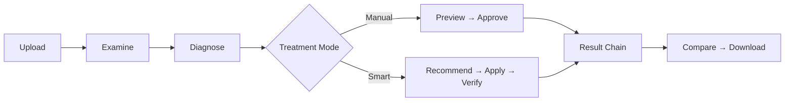
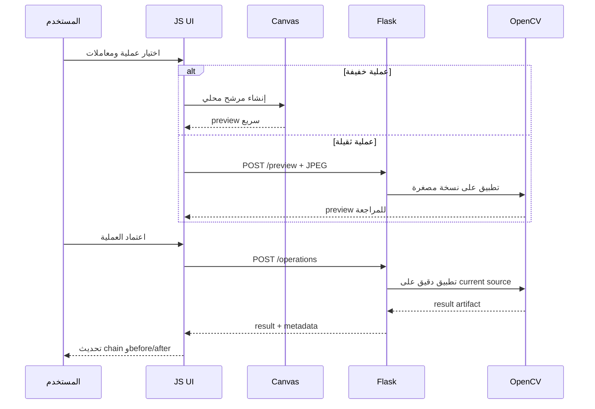
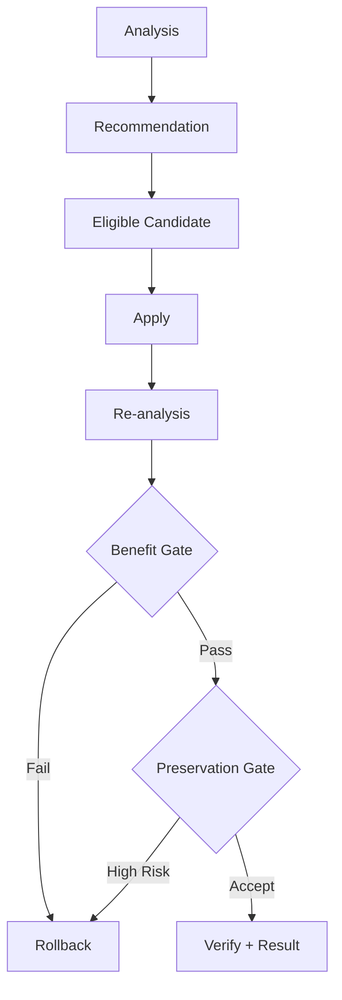

# الحالة الحالية المعتمدة — Manuscript Doctor

> هذه الوثيقة هي المرجع المختصر للنسخة المنفذة فعلياً. إذا تعارض وصف تاريخي في وثيقة أخرى مع هذا الملف، يُفهم الوصف القديم كسجل تاريخي وتُعتمد هذه الصفحة لوصف السلوك الحالي.

  

## 1. تعريف الإصدار الحالي

**طبيب الوثائق** تطبيق ويب عربي RTL لمعالجة صور الوثائق والمخطوطات باستخدام Flask وPython وOpenCV وNumPy، مع واجهة HTML/CSS/JavaScript مقسمة. يركز الإصدار الحالي على المعالجة القابلة للمراجعة، لا على زيادة عدد الفلاتر فقط.

## 2. القرارات المنفذة

| القرار | التنفيذ الحالي | السبب |
| --- | --- | --- |
| تقسيم المشروع | CSS وJavaScript وعمليات OpenCV في ملفات مسؤولة | تقليل أثر التعديل وتسهيل الاختبار |
| مصدر الحقيقة | Flask/OpenCV عند الاعتماد والتنزيل | منع اعتبار Canvas نتيجة نهائية |
| المعاينة | Canvas للعمليات الخفيفة وFlask JPEG للعمليات الثقيلة | توازن السرعة والدقة |
| السلسلة اليدوية | كل خطوة تعتمد النتيجة الحالية في السلسلة | دعم خطوات متتابعة وbefore/after صحيح |
| الاعتماد | زر واحد: «اعتماد العملية وإضافتها للسلسلة» | منع تكرار التنفيذ وتضارب الحالات |
| الاقتصاص | إطار يبدأ بهامش 5% وقيمه ترسل إلى Flask | مقابض قابلة للسحب ونتيجة قابلة للقياس |
| Smart Preparation | deskew-only لا يُقبل إلا بثقة عالية عند غياب حدود موثوقة | تجنب قص أو منظور غير آمن |
| Super Resolution | عملية يدوية مستقلة بتكبير Lanczos + Unsharp | تحسين قابلية القراءة دون ادعاء استعادة المعلومات المفقودة |
| الهوية البصرية | صورة Header كاملة فقط | منع تكرار صورة المقدمة وقصها داخل شريط ضيق |

## 3. عقد المعالجة اليدوية

العمليات الخفيفة الحالية للمعاينة المحلية هي التدوير، القلب، ضبط الشدة، وتصحيح جاما. أما Super Resolution وCLAHE والعمليات الثقيلة فتستخدم المسار الخادمي. لا تُحفظ المعاينة المحلية كملف نتيجة؛ الحفظ يبدأ عند الاعتماد.

## 4. العمليات والـregistry

تُسجل العمليات في `processing/ops/registry.py` وتُطبق عبر `apply_operation`. تشمل المجموعات الحالية تجهيز الوثيقة، الهندسة، الإضاءة والتباين، إزالة الضوضاء، التفاصيل، فصل النص، البنية، والخلفية.

| العملية | الوضع | ملاحظة التحقق |
| --- | --- | --- |
| `document_prepare` | Smart/Manual | تصحيح الميل والاقتصاص التلقائي وفق التحقق المحافظ |
| `crop` | Manual | إطار قابل للسحب، والنتيجة تطابق الأبعاد المرسلة |
| `rotate_*` و`flip_*` | Manual | معاينة Canvas واعتماد OpenCV |
| `super_resolution` | Manual only | `scale=2/3`، `amount=0..1`، `sigma=0.5..3` |
| `clahe` و`gamma_correct` و`intensity_adjust` | Manual/بعضها Smart | تتبع سياسة المنفعة والمحافظة حسب المسار |
| Threshold وMorphology وDenoising | Manual أو مرشح حسب السياسة | تحتاج مراجعة قبل الاعتماد ولا تُفترض آمنة لكل الصور |

### حدود Super Resolution

تستخدم العملية الحالية تكبيراً محافظاً بـLanczos ثم Unsharp Masking على luminance. قد تحسن قابلية قراءة نص صغير، لكنها لا تعيد حرفاً فُقدت معلوماته بالكامل بسبب الضبابية أو انخفاض الدقة. لا تدخل العملية تلقائياً في Smart Pipeline.

## 5. Smart Pipeline

تجهيز الوثيقة جزء محافظ من المسار الذكي. إذا كانت الحدود غير موثوقة لكن تصحيح الميل عالي الثقة، يمكن اعتماد deskew-only مع الحفاظ على الإطار. إذا لم تتحقق الثقة، يبقى القرار مؤجلاً أو مرفوضاً ولا يُفرض قص غير مضمون.

## 6. واجهة المستخدم الحالية

| المنطقة | السلوك |
| --- | --- |
| Header | خلفية `static/assets/header-workspace-background.png` كاملة، ولا توجد صورة Hero منفصلة |
| Workflow Bar | مراحل رفع، تهيئة، تشخيص، معالجة، تحقق، إخراج |
| Dashboard | مؤشرات السطوع والتباين والحدة والضوضاء والإضاءة والحواف، مع منحنى الظلال والإضاءات |
| Manual Editor | معاينة يساراً، أدوات ومعاملات يميناً، RTL ومتجاوب |
| Comparison | before وafter مرتبطان بالخطوة النشطة، لا بالخطوة السابقة عرضاً |
| History | سلسلة نتائج فعلية مع Undo/Redo محليين |
| Approval | اعتماد واحد يضيف النتيجة إلى السلسلة |

## 7. الأدلة والاختبار

| الدليل | النتيجة الحالية |
| --- | --- |
| C05 | `960×1280`، Smart Preparation قبلت deskew-only عالي الثقة، وSuper Resolution اعتمدت إلى `1920×2560` |
| C06 | الثقة المنخفضة لا تفرض deskew-only؛ بقي القرار محافظاً أو مؤجلاً |
| Crop | سحب المقبض غيّر القيم، والنتيجة النهائية طابقت الأبعاد المعتمدة |
| Local Preview | العمليات الخفيفة لم تطلب `/preview` أثناء المعاينة المحلية |
| Regression | `333 passed, 16 skipped` |
| JavaScript | `node --check` ناجح لجميع ملفات `static/js/parts/` |

## 8. حدود النطاق

لا يتضمن الإصدار الحالي OCR، أو YOLO، أو تدريب Deep Learning، أو Generative Restoration، أو تخزيناً دائماً، أو حسابات مستخدمين. ذكر هذه العناصر في وثائق قديمة يعني أنها خارج النطاق أو اقتراح مستقبلي، وليس أنها وظائف منفذة.

## 9. قاعدة التوثيق

كل قرار جديد يجب أن يربط بين أربعة عناصر: **المشكلة، القرار، موضع التنفيذ، ودليل التحقق**. لا يكفي وصف واجهة جميلة أو نتيجة بصرية واحدة؛ يجب أن يكون السلوك قابلاً للتتبع من ملف الكود إلى الاختبار أو الدليل البصري.

