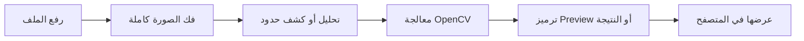
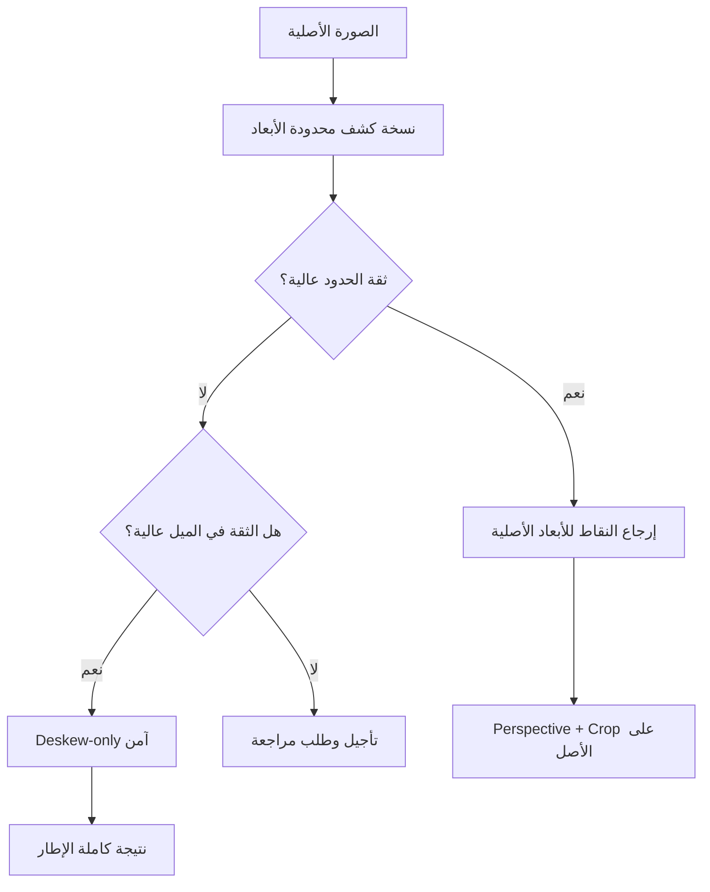

<div dir="rtl" align="right">

# مشاكل النسخة الحالية وخطة التحسين للنسخة القادمة

> **حالة الوثيقة:** توثق هذه الصفحة مشاكل ظهرت فعلاً أثناء تجربة النسخة الحالية، وتفصل بين السبب المرجح المدعوم بالكود، والأثر الذي يراه المستخدم، والحل المقترح للنسخة القادمة. الحلول المقترحة هنا **لم تُنفذ بعد** إلا إذا ذُكر غير ذلك.

## ملخص سريع

| المشكلة | السبب الأقرب | وضعها الحالي |
|---|---|---|
| تأخر فحص الصور عالية الدقة | الفحص يحسب عدة مؤشرات على المصفوفة الأصلية كاملة، وليس على نسخة تحليل محدودة | مشكلة مرصودة |
| تأخر التباين والشحذ | CLAHE وUnsharp Masking يعالجان الصورة كاملة عبر مسار Flask/OpenCV | مشكلة مرصودة |
| تأخر القص وتصحيح الميل | كشف الحدود يمر بعدة مراحل OpenCV وقد ينتقل إلى مسارات احتياطية، ثم يأتي التصحيح والقص الآمن | مشكلة مرصودة |
| زيادة التأخر مع الميلان الكبير | الميل الواضح يجعل فصل حدود الوثيقة أصعب، وقد يزيد عدد المرشحات ومسارات التراجع | مشكلة مرصودة |
| Super Resolution لا تستعيد النص المفقود | التنفيذ الحالي Lanczos + Unsharp؛ يكبر الأبعاد ويحسن الحواف ولا يخترع معلومات جديدة | قيد معروف ومقصود |

## كيف نقرأ زمن الانتظار؟

حجم الملف بالميجابايت ليس هو العامل الوحيد. العامل الأهم غالباً هو **عدد البكسلات بعد فك الصورة**، ثم عدد المراحل التي تمر عليها الصورة، وبعد ذلك زمن نقل البيانات وترميز Preview أو النتيجة.



لذلك لا يصح القول إن كل صورة أكبر من 1MB ستتأخر بنفس المقدار. قد تكون صورة مضغوطة بحجم صغير لكنها ذات أبعاد ضخمة، وقد تكون صورة أكبر حجماً بأبعاد أقل. الرقم 1MB مفيد كوصف للتجربة، لكنه ليس تشخيصاً تقنياً وحده.

---

## 1. تأخر فحص الصور عالية الدقة

### ما الذي يراه المستخدم؟

عند رفع صورة كبيرة، يتأخر ظهور المؤشرات والتشخيص قبل أن يستطيع المستخدم الانتقال إلى المعالجة. التأخر يكون أوضح عندما تكون الأبعاد كبيرة حتى لو لم يكن حجم الملف كبيراً جداً.

### السبب التقني المرجح

في `app.py` تُفك الصورة الأصلية باستخدام `np.frombuffer` ثم `cv2.imdecode`. بعد ذلك يعمل `processing/analyzer.py` على الصورة المفكوكة، ويحوّلها إلى رمادي ويحسب عدة مؤشرات، منها:

| المؤشر | العمل الذي يستهلك وقتاً على الصورة الكبيرة |
|---|---|
| السطوع والتباين | `mean` و`std` على كامل المصفوفة |
| المجال الديناميكي | حساب Percentiles على البيانات |
| الحدة | `cv2.Laplacian` على كامل الصورة |
| الضوضاء | `medianBlur` ثم مقارنة الصورة الأصلية بالنسخة المفلترة |
| تغير الإضاءة | `GaussianBlur` بحجم يعتمد على أقصر ضلع |
| كثافة الحواف | `Canny` على الصورة الرمادية |

مسار `resize_for_preview` الحالي يحد حجم **المعاينة**، لكنه لا يعني أن الفحص الأولي نفسه يعمل دائماً على نسخة تحليل صغيرة. لذلك يظل عدد العمليات مرتبطاً بأبعاد الصورة الأصلية.

### الأثر والحد العلمي

هذا ليس دليلاً على وجود حلقة لا نهائية أو عطل في Flask. هو أثر متوقع لمعالجة كاملة الدقة على عدة مرشحات ومؤشرات. في المقابل، لا ينبغي اعتبار وقت صورة واحدة ضماناً لأداء كل الصور، لأن الأبعاد والقنوات ونوع المحتوى تختلف.

### الحل المقترح في النسخة القادمة

1. إنشاء **Analysis Proxy** بحد أقصى ثابت للضلع، مثل 1600 أو 2048 بكسل، قبل حساب المؤشرات الأولية.
2. استخدام النسخة المحدودة للتشخيص وكشف الحدود المبدئي، مع الاحتفاظ بالأصل للنتيجة النهائية.
3. حفظ نتيجة التحليل في Cache مرتبط بـ`image_id` وببصمة الأبعاد والقنوات حتى لا يعاد الفحص نفسه بلا داعٍ.
4. تقسيم الفحص إلى مرحلة سريعة أولى ثم مؤشرات إضافية تُحسب عند الحاجة.
5. إضافة قياس زمني لكل مرحلة بدلاً من عرض زمن واحد مبهم.

### معيار قبول مقترح

يجب أن تظهر مؤشرات أساسية من النسخة المحدودة أولاً، وأن تبقى النتيجة النهائية والمعاملات المرجعية مرتبطة بالصورة الأصلية. لا يكفي تقليل الوقت إذا تغير معنى التشخيص أو اختفت معلومات مهمة.

---

## 2. تأخر التباين وSharpening

### ما الذي يراه المستخدم؟

تظهر المعاينة أبطأ عند اختيار عمليات مثل CLAHE أو Sharpen مقارنة بالتدوير أو القلب أو بعض تعديلات الشدة.

### السبب التقني

الواجهة تملك معاينة Canvas محلية لمجموعة صغيرة من العمليات الخفيفة فقط. أما CLAHE وSharpen فتسلكان مسار Preview الخادمي:

```text
المتصفح → POST /preview → تصغير للمعاينة → OpenCV → ترميز JPEG/PNG → المتصفح
```

في `processing/ops/enhancement.py`:

- CLAHE يعمل على luminance بعد تجهيز الصورة، ويطبق equalization على مساحة الصورة.
- Sharpen ينفذ Gaussian Blur ثم `cv2.addWeighted` على الصورة، أي أنه يمر على كامل الإطار مرتين تقريباً قبل إعادة النتيجة.

وفوق تكلفة المعالجة توجد تكلفة فك الصورة، وتصغيرها، وترميزها، وإرسالها، وفكها في المتصفح. لذلك فالمشكلة ليست في اسم العملية وحده، بل في أن هذه العمليات لا تستخدم حالياً مسار Canvas المحلي.

### الحل المقترح

| الأولوية | الحل | الهدف |
|---|---|---|
| P0 | تصغير خادمي مضبوط للـPreview قبل CLAHE وSharpen مع حد ثابت للأبعاد | تقليل عدد البكسلات المعالجة أثناء التجربة |
| P0 | تأخير قصير محسوب بعد توقف المستخدم عن تحريك المعامل | منع طلب لكل حركة سريعة على شريط التحكم |
| P1 | إلغاء الطلب السابق عند وصول تعديل أحدث، مع اعتماد آخر مرشح فقط | منع تراكم نتائج قديمة وتأخرها عن الحالة الحالية |
| P1 | إضافة Preview محلي تقريبي لـSharpen عند الإمكان، مع إبقاء الاعتماد خادمياً | جعل العرض أسرع دون تحويل المعاينة إلى نتيجة رسمية |
| P2 | دراسة نسخة تقريبية من CLAHE للمعاينة فقط ومقارنتها بصرياً بالنتيجة الخادمية | تقليل الإحساس بالانتظار دون ادعاء تطابق كامل |

### ما لن نفعله

لن نعرض Preview محلياً على أنه النتيجة النهائية. الاعتماد سيبقى عبر Flask/OpenCV حتى تظل القنوات والمعاملات والـartifact قابلة للتحقق.

---

## 3. تأخر الاقتصاص وتصحيح الميل التلقائي

### ما الذي يراه المستخدم؟

يزداد الانتظار عندما تكون الصورة أكبر من نحو 1MB، ويكون أوضح عندما تحتوي الصورة على ميلان كبير أو خلفية طاولة أو حدود غير متساوية.

### التوضيح المهم

حجم 1MB ليس حدّاً برمجياً في التطبيق. `MAX_UPLOAD_SIZE` يسمح بملفات أكبر، لكن تكلفة الحساب ترتبط أساساً بالأبعاد وعدد البكسلات. لذلك سنسجل في النسخة القادمة الحجم، والأبعاد، وعدد القنوات، وزمن كل مرحلة حتى لا نخلط بين حجم الملف وتعقيد الصورة.

### السبب التقني في كشف الحدود

`processing/document_boundary.py` لا ينفذ كاشفاً واحداً قصيراً. المسار يحتوي على مراحل مثل:

1. تحويل إلى رمادي وتنعيم Gaussian.
2. Canny لاستخراج الحواف.
3. عمليات Morphological Closing وDilation لربط الحواف.
4. استخراج Contours وتقريبها إلى أربع نقاط.
5. ترتيب المرشحات حسب المساحة والهندسة وتباين الحدود.
6. مسار Hough يعتمد على `HoughLinesP` وعائلات الخطوط وتقاطعها.
7. عند فشل بعض المسارات، يمكن استخدام Region أو Guided fallback، وفي المسار الإقليمي توجد عمليات أثقل مثل GrabCut.

بعد اكتشاف المرشح لا ينتهي العمل؛ `preparation_pipeline.py` قد يطبق تصحيح منظور، ثم يكشف الميل، ثم ينفذ تدويراً بدون قص، ثم يبحث عن قص آمن يحافظ على الإطار. لذلك فإن «تصحيح الميل والاقتصاص التلقائي» مجموعة مراحل وليست عملية واحدة.

### لماذا يزيد الميل الكبير التأخر أو عدم اليقين؟

عندما يكون الميل واضحاً، تصبح الحواف قطْرية وقد تختلط بحدود الطاولة والظلال والكتابة. هذا لا يعني أن الخوارزمية تفشل دائماً، لكنه يزيد احتمال أن يحتاج النظام إلى تقييم مرشحات أكثر أو تجربة مسار احتياطي. وفي بعض الحالات يكون القرار الآمن هو `deskew-only` أو `deferred` بدلاً من قص غير موثوق.

### الحل المقترح للنسخة القادمة



الحلول العملية المقترحة هي:

| الأولوية | الحل | ملاحظة السلامة |
|---|---|---|
| P0 | تنفيذ كشف الحدود والميل على نسخة محدودة ثم تحويل النقاط إلى مقياس الأصل | المعالجة النهائية لا تعتمد على صورة منخفضة الدقة |
| P0 | إضافة Early Exit عند وصول مرشح إلى ثقة كافية | لا يُستخدم إلا مع بوابة جودة واضحة |
| P1 | تخزين نتيجة كشف الحدود والميل وإعادة استخدامها داخل جلسة الصورة | يمنع إعادة الحساب عند طلب Preview أو اعتماد مرتبطين بنفس المصدر |
| P1 | ترتيب المسارات من الأرخص إلى الأثقل، وعدم تشغيل Region/GrabCut إلا بعد فشل مبرر | يحافظ على زمن الصور السهلة |
| P2 | استخدام ROI أو تقدير أولي لمكان الوثيقة قبل المسح الكامل | يحتاج اختبارات على الخلفيات المختلفة حتى لا يخفي الحدود |

### معيار القبول المقترح

تُقاس النسخة القادمة بزمن منفصل لكل مرحلة: فك الصورة، كشف الحدود، تقدير الميل، التصحيح، القص، والترميز. ويجب أن تبقى قرارات الثقة و`deskew-only` و`deferred` ظاهرة للمستخدم بدلاً من تحويل تقليل الزمن إلى قص خاطئ.

---

## 4. Super Resolution: زيادة الحجم وليست استعادة للنص

### ما الذي يحدث فعلياً؟

العملية الحالية في `processing/ops/super_resolution.py` تستخدم:

```text
Lanczos upscale → Luminance-only Unsharp Masking
```

وتسمح بمعامل تكبير 2 أو 3 مع حد أقصى لحجم الناتج. هذا يرفع الأبعاد المكانية للصورة ويزيد وضوح بعض الحواف أو قابلية القراءة البصرية، لكنه لا يعيد حرفاً فقده المصدر ولا يستخرج معنى النص.

### لماذا لا تحسن النصوص دائماً؟

إذا كانت المعلومة الأصلية غير موجودة بسبب ضبابية شديدة أو ضغط أو انخفاض دقة، فإن التكبير يعيد توزيع البكسلات ولا يملك مرجعاً حقيقياً للحرف المفقود. وقد يؤدي الشحذ أيضاً إلى تضخيم الحواف أو الضوضاء. لذلك فالملاحظة الصحيحة هي:

> **Super Resolution الحالية تزيد حجم الصورة وقد تحسن مظهر الحواف، لكنها لا تضمن تحسين قراءة النص ولا تستعيد التفاصيل المفقودة.**

### الحلول المقترحة للنسخة القادمة

1. تغيير الوصف الظاهر للمستخدم إلى «تكبير محافظ وتحسين حواف» بدلاً من وعد عام بتحسين النص.
2. عرض أبعاد المصدر والناتج وحجم الناتج قبل الاعتماد.
3. إضافة تحذير عند اختيار 3× لأن الزمن والذاكرة وحجم الملف سيزيدون.
4. إجراء مقارنة تجريبية على صور مختلفة، مع تقييم القراءة بصرياً دون ادعاء OCR.
5. دراسة نموذج DNN مثل Real-ESRGAN أو EDSR كبحث منفصل فقط إذا سمحت متطلبات المقرر والموارد، وعدم خلطه بالتنفيذ الحالي أو تقديمه كأنه موجود.
6. إبقاء Super Resolution خارج Smart Pipeline إلى أن تثبت فائدتها وحدودها على مجموعة اختبار كافية.

---

## 5. ترتيب العمل في النسخة القادمة

| المرحلة | العمل | مخرج القبول |
|---|---|---|
| P0 | Analysis Proxy للفحص وكشف الحدود | فحص أسرع مع إبقاء الأصل للنتيجة النهائية |
| P0 | قياس زمن كل مرحلة | تقرير يميز بين CPU والترميز والنقل |
| P0 | تحسين Preview للتباين والشحذ | معاينة محدودة الأبعاد ولا تتراكم طلباتها |
| P1 | Cache لنتائج التحليل والحدود والميل | عدم إعادة الحساب لنفس المصدر والمعاملات |
| P1 | Early Exit ومسارات احتياطية مشروطة | تقليل العمل دون قص غير آمن |
| P1 | توضيح Super Resolution | وصف صادق للأثر والحدود |
| P2 | اختبار DNN Super Resolution منفصلاً | قرار مبني على مقارنة لا على الانطباع |

## 6. ما سنقيسه في النسخة القادمة

لن نستخدم عبارة «أسرع» بلا أرقام. لكل تجربة سنسجل:

- أبعاد الصورة وعدد القنوات وحجم الملف.
- زمن فك الصورة.
- زمن التحليل أو كشف الحدود.
- زمن المعالجة.
- زمن الترميز والنقل عند Preview.
- حجم Preview وحجم النتيجة.
- قرار الثقة: accepted أو deferred أو rejected.
- هل تغيرت النتيجة البصرية أو الأبعاد عن المتوقع؟

الهدف ليس جعل كل عملية لحظية بأي ثمن؛ الهدف هو **تقليل العمل غير الضروري، وإظهار حالة الانتظار بوضوح، والحفاظ على صحة النتيجة**.

## 7. الخلاصة

المشاكل الحالية مفهومة وليست متشابهة. تأخر الفحص سببه تعدد المؤشرات على الصورة الكاملة، وتأخر التباين والشحذ سببه مسار المعالجة الخادمي الكامل، وتأخر القص والميل سببه تعدد مراحل كشف الحدود والتراجع الآمن، بينما Super Resolution ليست مشكلة أداء فقط بل لها حد علمي يجب شرحه بوضوح.

النسخة القادمة ستبدأ بقياس زمني ونسخ تحليل محدودة الأبعاد وCache وPreview أكثر انضباطاً. ولن نعتبر أي حل ناجحاً إلا إذا قلل الزمن مع بقاء الصورة الأصلية محفوظة، والقرار قابلاً للتفسير، والنتيجة النهائية قابلة للتحقق.

</div>
