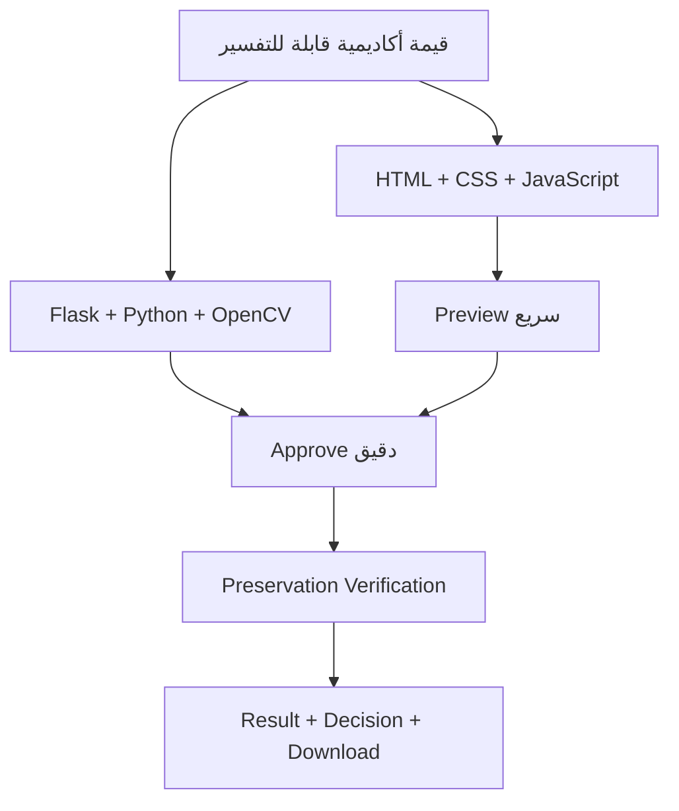
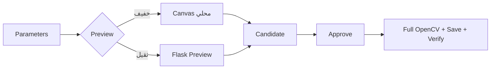

<div dir="rtl" align="right">

# 📌 Manuscript Doctor — سجل القرارات الهندسية

> **الغرض:** توثيق القرارات التي قادت إلى النسخة الحالية، مع سبب الاختيار، البدائل المرفوضة، الأثر، والحدود.
>
> المتطلبات في [`requirements.md`](requirements.md)، والمعمارية في [`architecture.md`](architecture.md)، وتفصيل التنفيذ في [`workflow.md`](workflow.md).

---

## 1. طريقة القراءة

| الحالة | معناها |
| --- | --- |
| ✅ معتمد | قرار مطبق في النسخة الحالية |
| 🟡 مؤقت | مطبق، لكنه يحتاج معايرة أو قياساً إضافياً |
| ⏳ مؤجل | خيار مستقبلي لم يدخل التنفيذ الحالي |
| ❌ ملغى | قرار قديم استُبدل بقرار أحدث |

كل قرار يجيب عن أربعة أسئلة:

```text
ما المشكلة؟
  ↓
ما البدائل؟
  ↓
ما الاختيار؟
  ↓
ما الأثر والحدود؟
```

---

## 2. خريطة القرارات



---

# 3. الهوية والنطاق

## DEC-001 — النظام مساعد قرار لمعالجة الوثائق

**الحالة:** ✅ معتمد

**القرار:** النظام ليس معرض فلاتر فقط؛ بل يمرر الصورة عبر فحص وتشخيص وتوصية ومعالجة وتحقق.

```text
Diagnose → Treat → Preserve → Verify
```

**السبب:** هذا المسار يوضح القيمة الأكاديمية ويمنع تطبيق معالجة عمياء على كل صورة.

**الحدود:** لا يفهم النظام النص لغوياً، ولا يعيد الحالة التاريخية الأصلية، ولا يضمن حفظ كل حرف.

## DEC-002 — المعالجة Rule-Based

**الحالة:** ✅ معتمد

**القرار:** Diagnosis وRecommendation وSmart Pipeline مبنية على قواعد ومؤشرات معالجة صور، وليست نماذج AI توليدية.

**البديل المرفوض:** استخدام عبارات مثل `AI Diagnosis` أو `Magic Enhancement` دون نموذج مقيم فعلياً.

**الأثر:** كل توصية قابلة للتفسير، وكل قاعدة يمكن اختبارها وتعديلها منفصلة عن الواجهة.

## DEC-003 — OCR وDeep Learning خارج الإصدار الحالي

**الحالة:** ⏳ مؤجل

**القرار:** لا يتضمن الإصدار الحالي OCR أو YOLO أو Segmentation أو نموذج Deep Learning.

**السبب:** هذه الإضافات تحتاج بيانات وتقييماً مستقلاً مثل CER/WER أو مقاييس كشف، وقد توسع النطاق بعيداً عن هدف مقرر معالجة الصور.

**ملاحظة:** Super Resolution الحالية عملية OpenCV محافظة، وليست نموذجاً عميقاً.

## DEC-004 — لا قاعدة بيانات ولا حسابات

**الحالة:** ✅ معتمد

**القرار:** يستخدم التطبيق ملفات Runtime للرفع والنتائج دون Authentication أو Database أو تاريخ دائم.

**السبب:** التطبيق محلي وتعليمي، وتكفي معرفات الخادم وملفات `storage/` للمسار الحالي.

**متى يراجع:** عند الحاجة إلى مستخدمين، تاريخ دائم، مشاركة النتائج، أو نشر متعدد المستخدمين.

## DEC-005 — لا Docker في التسليم

**الحالة:** ✅ معتمد

**القرار:** يعمل المشروع محلياً عبر Flask ولا يضيف Docker أو طبقات تشغيلية غير مطلوبة.

**السبب:** الحفاظ على بساطة التشغيل وإظهار منطق Python/OpenCV مباشرة.

---

# 4. اختيار التقنية

## DEC-006 — Flask كطبقة HTTP

**الحالة:** ✅ معتمد

**القرار:** يتولى `app.py` الـRoutes، والتحقق، وقراءة الموارد، واستدعاء وحدات المعالجة، وتوحيد JSON.

**البديل المرفوض:** وضع خوارزميات OpenCV داخل Routes أو إضافة Framework Backend أثقل.

## DEC-007 — OpenCV وNumPy لمحرك الصور

**الحالة:** ✅ معتمد

**القرار:** تمثل الصورة كمصفوفة NumPy، وتنفذ العمليات عبر OpenCV ووحدات Python مستقلة.

**الأثر:** يمكن اختبار العمليات بعيداً عن المتصفح وشرحها أكاديمياً.

## DEC-008 — HTML/CSS/JavaScript دون Framework Frontend

**الحالة:** ✅ معتمد

**القرار:** الواجهة Vanilla JavaScript مع CSS مخصص وHTML دلالي.

**السبب:** المشروع يحتاج تفاعلاً محدوداً نسبياً، والتقسيم إلى أجزاء يحقق الوضوح دون إخفاء منطق التطبيق خلف Framework.

---

# 5. التقسيم والمسؤوليات

## DEC-009 — تقسيم CSS وJavaScript إلى أجزاء مرتبة

**الحالة:** ✅ معتمد

**القرار:** قسمت CSS إلى عشرة أجزاء وJavaScript إلى أجزاء مرتبة من الحالة والرفع حتى الأحداث النهائية.

```text
00 State
→ 01 Utilities
→ 02 Upload
→ 03 Dashboard
→ 04 Examination
→ 05 Parameters
→ 06 Preview
→ 07 Execution
→ 08 Smart Pipeline
→ 09 History
→ 10 Theme
→ 11 Events
```

**السبب:** تقليل التداخل مع الحفاظ على ترتيب التنفيذ.

**ملفات التوافق:** `static/css/style.css` يستورد أجزاء CSS، و`static/js/main.js` ملف توافق صغير، بينما يحمّل HTML أجزاء JavaScript مباشرة.

## DEC-010 — تقسيم Processing حسب نوع المسؤولية

**الحالة:** ✅ معتمد

**القرار:** توجد وحدات مستقلة للتحسين والضوضاء والعتبات والمورفولوجيا والهندسة والمستند وSuper Resolution، مع registry مركزية.

**الأثر:** إضافة عملية جديدة لا تتطلب Route جديداً ولا تعديل واجهة HTTP.

## DEC-011 — Backend هو مصدر الحقيقة

**الحالة:** ✅ معتمد

**القرار:** Backend هو المصدر الوحيد للتحليل والتشخيص والتوصيات والتنفيذ والنتائج والتقييم.

**الواجهة:** تعرض الحالة وتطلب العمليات، لكنها لا تعيد حساب Diagnostic Thresholds أو Recommendation Rules.

---

# 6. الهوية والتخزين

## DEC-012 — الأصل Immutable

**الحالة:** ✅ معتمد

**القرار:** لا تكتب أي عملية فوق صورة الرفع. تحفظ النتائج في `storage/results/` بمعرفات مستقلة.

**السبب:** الحاجة إلى مرجع ثابت للمقارنة، وإعادة تجربة المعالجة، وتقييم أثرها.

## DEC-013 — استخدام image_id وresult_id

**الحالة:** ✅ معتمد

**القرار:** تتعامل الواجهة مع معرفات موارد، لا مع مسارات ملفات.

```text
image_id
  ↓
result_id A
  ↓
result_id B
```

**البديل المرفوض:** تمرير `C:\...` أو `../storage/...` من العميل.

## DEC-014 — التحقق قبل الحفظ

**الحالة:** ✅ معتمد

**القرار:** يقرأ الخادم البايتات ويفك الصورة ويتحقق من النوع والأبعاد والبكسلات قبل حفظ الأصل.

**الحدود الحالية:** `20 MB` للطلب و`30,000,000` بكسل للصورة المفكوكة.

## DEC-015 — عدم استخدام حالة صورة عامة

**الحالة:** ✅ معتمد

**القرار:** لا يوجد `current_image` عالمي في Backend. يحدد كل طلب الصورة من `image_id` والمصدر من `source_result_id` عند وجوده.

**السبب:** منع خلط صور الطلبات وجعل الاختبار قابلاً للتكرار.

---

# 7. Preview وApprove

## DEC-016 — الفصل بين المعاينة والاعتماد

**الحالة:** ✅ معتمد

**القرار:** المعاينة مرشح سريع، أما الاعتماد فينشئ نتيجة كاملة الدقة محفوظة.



**السبب:** تقليل التأخير في التفاعل دون التضحية بصحة الملف النهائي.

## DEC-017 — Canvas للعمليات الخفيفة

**الحالة:** ✅ معتمد

**القرار:** تعرض العمليات التالية محلياً عندما تكون المعاينة ممكنة:

```text
rotate_right · rotate_left
flip_horizontal · flip_vertical
intensity_adjust · gamma_correct
```

**البديل المرفوض:** إرسال كل تغيير صغير في Slider إلى Flask.

**الحدود:** Canvas لا ينشئ artifact نهائياً ولا يتولى Preservation Verification.

## DEC-018 — JPEG اختياري لمعاينة الخادم

**الحالة:** ✅ معتمد

**القرار:** ترسل الواجهة `X-Preview-Format: jpeg` عند الحاجة، بينما يبقى PNG الافتراضي للتوافق.

**السبب:** تقليل حجم النقل للصور الكبيرة دون تغيير نتيجة الاعتماد.

## DEC-019 — زر اعتماد واحد

**الحالة:** ✅ معتمد

**القرار:** المسار المرئي الوحيد لاعتماد مرشح يدوي هو `manualApprovalButton` بعنوان «اعتماد العملية وإضافتها للسلسلة».

**القرار الملغى:** زر مستقل باسم «تنفيذ العملية الحالية».

**السبب:** منع تكرار الإجراء وتقليل الالتباس بين Preview وApprove.

---

# 8. السلسلة اليدوية

## DEC-020 — العمليات اليدوية المعتمدة تُبنى كسلسلة

**الحالة:** ✅ معتمد

**القرار:** تبدأ أول خطوة من الأصل، ثم تستخدم كل خطوة لاحقة النتيجة المعتمدة السابقة كمصدر.

```text
Original → Approved A → Approved B → Approved C
```

**القرار الملغى:** تشغيل كل عملية يدوية مستقلة من Original، لأنه كان يمنع بناء خطوات متتابعة فوق نتيجة موثقة.

**السبب:** المستخدم يحتاج إلى إضافة معالجة يدوية بعد Smart أو بعد خطوة يدوية سابقة، مع إبقاء الأصل ثابتاً.

## DEC-021 — source_result_id عقد السلسلة

**الحالة:** ✅ معتمد

**القرار:** يرسل العميل `source_result_id` عند وجود نتيجة معتمدة سابقة، ويتحقق Flask من انتمائها إلى `image_id` نفسه وصلاحيتها للسلسلة.

**الأثر:** يمنع استخدام نتيجة من وثيقة أخرى أو Preview غير معتمد كمصدر نهائي.

## DEC-022 — before/after مرتبطان بالمؤشر النشط

**الحالة:** ✅ معتمد

**القرار:** عند `manualActiveIndex = i`:

```text
before = Original إذا i = 0، وإلا Result(i - 1)
after  = Result(i)
```

وتتولى `syncManualChainSelection` تحديث الصورتين معاً.

**السبب:** معالجة مشكلة ظهور before متأخراً خطوة واحدة بعد الاعتماد.

## DEC-023 — Undo/Redo تنقل محلي في السلسلة

**الحالة:** ✅ معتمد

**القرار:** يغير Undo/Redo المؤشر النشط ويعرض النتيجة الموجودة دون إعادة تنفيذ العملية أو إرسال طلب جديد بلا حاجة.

**الحد:** اعتماد خطوة جديدة بعد التراجع يبدأ فرعاً نشطاً ويزيل الفروع اللاحقة من المسار الحالي.

---

# 9. تجهيز الوثيقة وSmart Pipeline

## DEC-024 — Preparation ليست قصاً قسرياً

**الحالة:** ✅ معتمد

**القرار:** يسبق Smart Pipeline استدعاء `prepare_document` ثم `verify_preparation`. لا يستخدم الناتج المجهز إلا بعد قبول التحقق المحافظ.

**السبب:** فشل اكتشاف الحدود لا يعني أن تصحيح الميل نفسه غير آمن.

## DEC-025 — سياسة deskew-only

**الحالة:** ✅ معتمد

**القرار:** يمكن قبول تصحيح الميل وحده عندما تكون الثقة عالية، دون قص أو تصحيح منظور، وبحد ثقة محافظ `0.80`.

| الشرط | القرار |
| --- | --- |
| حدود موثوقة | يمكن استخدام تجهيز مناسب بعد التحقق |
| حدود غير موثوقة + deskew عالي الثقة | `deskew-only` مع الحفاظ على الإطار |
| ثقة منخفضة | `deferred` أو `review_required` والإبقاء على الأصل |

## DEC-026 — Smart Pipeline يبدأ من الأصل

**الحالة:** ✅ معتمد

**القرار:** يبدأ `/pipeline` من صورة الرفع، ثم يستخدم Preparation المقبولة أو الأصل، وبعدها يحلل ويطبق المرشحات المؤهلة.

**السبب:** Smart Pipeline قرار مستقل وقابل لإعادة التقييم، وليس امتداداً خفياً لسلسلة يدوية.

## DEC-027 — المرشح يمر عبر Benefit وPreservation Gates

**الحالة:** ✅ معتمد

**القرار:** لا يكفي نجاح OpenCV؛ يجب أن تكون الفائدة مقبولة وألا تظهر مخاطرة بنيوية مرتفعة وفق المؤشرات المستخدمة.

**الأثر:** يمكن أن يعيد Smart نتيجة مع `review_required` أو `unchanged_due_to_risk` بدلاً من فرض تحسين غير مناسب.

## DEC-028 — Super Resolution لا تدخل Smart تلقائياً

**الحالة:** ✅ معتمد

**القرار:** `super_resolution` عملية يدوية فقط.

**السبب:** التكبير قد يزيد الحجم والزمن والضوضاء، ويحتاج اختياراً واعياً من المستخدم وحدوداً واضحة.

---

# 10. Super Resolution

## DEC-029 — تنفيذ محافظ دون اعتماد نموذج خارجي

**الحالة:** ✅ معتمد مؤقتاً

**القرار:** تستخدم `processing/ops/super_resolution.py` تكبير Lanczos ثم Unsharp Masking بمعاملات آمنة:

```json
{
  "scale": 2,
  "amount": 0.35,
  "sigma": 1.0
}
```

**البديل المؤجل:** EDSR أو FSRCNN أو Real-ESRGAN مع ملفات نموذج واعتماديات إضافية.

**السبب:** المسار الحالي أسهل في التشغيل والاختبار ولا يضيف نموذجاً قد يتعارض مع بيئة Flask/OpenCV.

**الحدود:** لا تستعيد التقنية معلومات لم تُلتقط أصلاً، ولا تضمن صحة الحروف غير المقروءة.

---

# 11. Preservation Verification

## DEC-030 — Profile قبل المعالجة وVerification بعدها

**الحالة:** ✅ معتمد

**القرار:**

```text
Preservation Profile
→ تقدير الحذر قبل المعالجة

Preservation Verification
→ مقارنة Original مع Result بعد المعالجة
```

لا يستخدم المصطلحان بالتبادل.

## DEC-031 — التقييم بنيوي لا لغوي

**الحالة:** ✅ معتمد

**القرار:** تعتمد الوحدة على Edge Retention وComponent Retention وStructure Similarity Indicator وEdge Inflation ومؤشرات مشابهة.

**الحدود:** لا تفهم الوحدة معنى النص ولا تثبت أن حرفاً معيناً حُفظ أو فُقد.

## DEC-032 — Warning لا تعني حذف النتيجة

**الحالة:** ✅ معتمد

**القرار:** إذا نجحت المعالجة وتعذر التحقق فنياً، يمكن حفظ النتيجة مع `Assessment Unavailable` وتحذير، دون وصفها بأنها آمنة.

**السبب:** فشل وحدة التقييم لا يعني بالضرورة أن ملف الصورة الناتج غير صالح.

## DEC-033 — منع النسب المطلقة

**الحالة:** ✅ معتمد

**القرار:** لا تعرض الواجهة `95% Safe` أو `100% Preserved` أو `Zero Loss`.

**البديل المستخدم:** `Acceptable` و`Caution` و`High Risk` بوصفها مؤشرات مساعدة.

---

# 12. الواجهة والهوية البصرية

## DEC-034 — Single-Page Progressive Workflow

**الحالة:** ✅ معتمد

**القرار:** تبقى الوظائف في صفحة واحدة، وتظهر الأقسام حسب حالة الصورة بدلاً من عرض كل الأدوات من البداية.

**السبب:** إبقاء المسار واضحاً للمستخدم وتقليل الحمل المعرفي.

## DEC-035 — تنظيم الأدوات حسب الغرض

**الحالة:** ✅ معتمد

**القرار:** تجمع الأدوات تحت تجهيز الوثيقة والإضاءة والتباين والضوضاء والتفاصيل وفصل النص والبنية والخلفية.

**السبب:** اختيار العملية بناءً على المشكلة، لا على حفظ أسماء OpenCV فقط.

## DEC-036 — Header بخلفية كاملة فقط

**الحالة:** ✅ معتمد

**القرار:** تستخدم الصورة المرفقة `header-workspace-background.png` كخلفية Header، وتحذف صورة المقدمة المستقلة.

**السبب:** الصورة عريضة ومناسبة للرأس، ووضعها في Hero كان يؤدي إلى تكرار بصري أو قص غير مناسب.

## DEC-037 — الرسم الخطي لتوازن الظلال والإضاءات

**الحالة:** ✅ معتمد

**القرار:** يعرض Dashboard منحنى نطاقات الظلال والدرجات الوسطى والإضاءات، لا شريطاً أو Histogram بديلاً عن التصميم المطلوب.

**الحد:** الرسم قراءة تفسيرية ولا يغني عن القيم الرقمية.

---

# 13. قرارات الاختبار والتسليم

## DEC-038 — الاختبار الآلي قبل التسليم

**الحالة:** ✅ معتمد

**القرار:** لا يعتمد التغيير قبل تشغيل:

```bash
PYTHONPATH=. pytest -q tests
for f in static/js/parts/*.js; do node --check "$f"; done
```

**النتيجة المرجعية الحالية:**

```text
333 passed, 16 skipped
JavaScript syntax check: passed
```

## DEC-039 — صور C05 وC06 جزء من التحقق

**الحالة:** ✅ معتمد

**القرار:** تستخدم صور متنوعة، ومنها C05 الثقيلة ذات الأبعاد `960×1280` وC06، للتحقق من الأداء والقص وSmart والسلسلة.

**السبب:** نجاح عملية على صورة واحدة لا يثبت صلاحيتها على بقية الوثائق.

## DEC-040 — لا queue أو threading في النسخة الحالية

**الحالة:** ✅ معتمد مؤقتاً

**القرار:** لا تضاف بنية Job Queue أو Workers لمجرد تقليل زمن Smart Pipeline.

**السبب:** زمن Smart يرتبط بـPreparation والتحليل والتحقق، وليس بتأخير Preview اليدوي. إضافة بنية معقدة ستزيد التشغيل والتوثيق دون حاجة حالية.

**متى يراجع:** عند تحويل التطبيق إلى خدمة متعددة المستخدمين أو الحاجة إلى مهام طويلة في الخلفية.

---

# 14. قرارات ملغاة أو مستبدلة

| القرار القديم | البديل الحالي | السبب |
| --- | --- | --- |
| كل عملية يدوية تبدأ من الأصل | السلسلة اليدوية تستخدم النتيجة المعتمدة السابقة | دعم إضافة خطوات يدوية متتابعة وSmart Result |
| زر تنفيذ مستقل مع زر اعتماد | زر اعتماد واحد | إزالة الإجراء المكرر |
| إرسال كل Preview إلى Flask | Canvas للعمليات الخفيفة | تقليل زمن التفاعل والطلبات |
| استخدام PNG دائماً للمعاينة | JPEG اختياري وPNG افتراضي | تقليل النقل مع التوافق |
| صورة before/after داخل المقدمة | الصورة خلفية Header فقط | الحفاظ على هوية بصرية واضحة دون تكرار |
| قص تلقائي عند كل Smart | Preparation مشروطة بالتحقق | منع القص أو المنظور غير الموثوق |
| اعتبار اختلاف البكسلات فقداً للنص | تقييم بنيوي محافظ | التغيير الطبيعي بعد Enhancement ليس فقداً مؤكداً |

---

# 15. قاعدة القرار القادم

أي ميزة جديدة يجب ألا تدخل مباشرة إلى الكود. تسجل أولاً بهذه الصورة:

```text
المشكلة التي تحلها
    ↓
القيمة الأكاديمية أو العملية
    ↓
المكان الصحيح في المعمارية
    ↓
البدائل المرفوضة ولماذا
    ↓
الاختبار المطلوب
    ↓
الحدود والمخاطر
```

إذا لم يمكن تحديد هذه العناصر، تبقى الفكرة في قسم `Future` ولا تُعرض كوظيفة منفذة.

</div>
