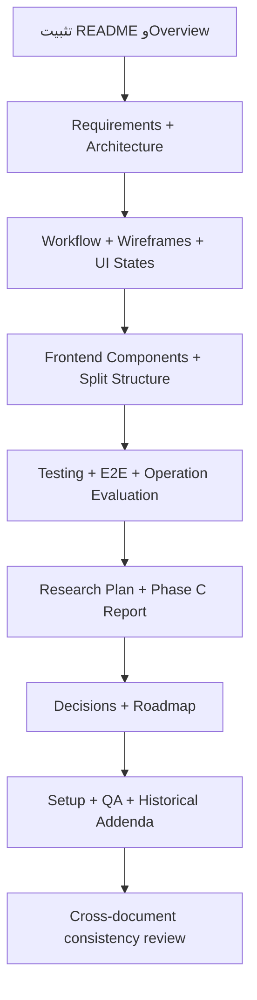

<div dir="rtl" align="right">

# خريطة تحديث توثيقات Manuscript Doctor

## الغرض

هذه الخريطة هي نتيجة مراجعة التوثيقات الحالية مقابل الكود والاختبارات والواجهة الحية. الهدف هو توحيد التوثيق حول النسخة المنفذة فعلياً، بحيث يظهر كل قرار على أنه نتيجة مشكلة أو تجربة أو قيد واضح، وليس تعديلاً منفصلاً عن بقية النظام.

> **ملاحظة مهمة:** يوجد ملفان يحملان معنى README مختلفاً: `README.md` في جذر المشروع هو بوابة GitHub والتشغيل الأولى، أما `docs/README.md` فهو فهرس التوثيق. يجب تحديثهما معاً، لكن لكل واحد وظيفة مختلفة.

---

## 1. نتيجة التدقيق المختصرة

| الحالة | الملفات | القرار |
| --- | --- | --- |
| تحديث أساسي | `README.md`، `docs/README.md`، `docs/overview.md` | توحيد الهوية، الصور، النطاق، والنسخة الحالية |
| تحديث معماري | `docs/requirements.md`، `docs/architecture.md`، `docs/split-structure.md` | تثبيت العقود، الطبقات، registry، ومسارات المعاينة والاعتماد |
| تحديث تجربة الاستخدام | `docs/workflow.md`، `docs/wireframes.md`، `docs/ui-states.md`، `docs/frontend-components.md` | توثيق التخطيط الفعلي وحالات before/after وUndo/Redo والقص |
| تحديث التحقق والتقييم | `docs/testing.md`، `docs/e2e-testing.md`، `docs/operation-evaluation.md`، `docs/research-plan.md` | إضافة C05/C06 وSuper Resolution ونتائج regression الحالية |
| تحديث القرارات والتقدم | `docs/decisions.md`، `docs/phase-c-report.md`، `docs/roadmap.md` | تحويل التعديلات إلى قرارات مبررة وسجل إصدار حقيقي |
| تحديث التشغيل والتقارير | `LOCAL_SETUP_GUIDE_AR.md`، `UNIFIED_RESULTS_UPDATE_AR.md`، `manual-qa-report.md` | إزالة الأرقام والأزرار القديمة وتثبيت طريقة التشغيل الحالية |
| تحديث تاريخي مختصر | `audit.md`، `split-audit.md`، `docs/AI-prompts.md` | وسم المحتوى القديم كتاريخ أو إضافة ملحق يوضح ما نُفذ فعلياً |
| تحديثات صغيرة | `processing/README.md`، `static/README.md`، `templates/README.md`، `tests/README.md`، `storage/README.md` | إزالة عبارات «الخطوة التالية» التي لم تعد تصف الوضع الحالي |
| لا يحتاج تغييراً جوهرياً | `docs/git-guide.md` | يراجع فقط إذا ظهرت أسماء إصدارات أو مسارات قديمة |

---

## 2. الملفات التي يجب تحديثها

### أ. بوابة المشروع والنطاق

| الملف | ما يجب تصحيحه | الرسم المفضل |
| --- | --- | --- |
| `README.md` | جعله مدخل GitHub الحقيقي: صورة Header، Before/After، الفكرة، التشغيل، البنية، الاختبارات، والحدود. يجب ألا يصف المشروع بأنه «قيد بناء» فقط، وألا يذكر بنية `main.js` القديمة. | Lifecycle Flowchart + صور Before/After |
| `docs/README.md` | إبقاؤه فهرساً بصرياً مختصراً للوثائق، مع روابط دقيقة وأسماء الملفات الفعلية، لا تكرار كل التفاصيل الموجودة في الوثائق المتخصصة. | Documentation Map |
| `docs/overview.md` | تعريف المشكلة والقيمة وتجربة المستخدم الحالية، مع توضيح أن المعالجة اليدوية متسلسلة وأن Super Resolution يدوية محافظة. | System Overview + User Journey |

### ب. المتطلبات والمعمارية

| الملف | ما يجب تصحيحه | الرسم المفضل |
| --- | --- | --- |
| `docs/requirements.md` | إضافة متطلبات صريحة لـCanvas Preview، JPEG Preview، approve-only، manual chain، Undo/Redo، crop handles، Header، وSuper Resolution. تحديث معيار القبول إلى `333 passed, 16 skipped`. | Requirements Traceability Matrix + State Flow |
| `docs/architecture.md` | تحديث القائمة لتشمل `processing/ops/super_resolution.py`، وشرح registry، مصدر السلسلة، الفرق بين preview وapprove، وحماية حجم Super Resolution. إزالة أي وصف يوحي بأن كل العمليات تبدأ دائماً من الصورة الأصلية؛ البداية الصحيحة للخطوة اليدوية هي المصدر الحالي في السلسلة. | Component Diagram + Preview/Approve Sequence + Smart Pipeline Flow |
| `docs/split-structure.md` | تحويله من خطة تقسيم مستقبلية إلى وصف للبنية المنفذة: ملفات CSS وJavaScript المقسمة، registry، وحدات التحضير، والاختبارات. | Directory Tree + Module Dependency Graph |

### ج. سير العمل وواجهة المستخدم

| الملف | ما يجب تصحيحه | الرسم المفضل |
| --- | --- | --- |
| `docs/workflow.md` | توثيق المسار الفعلي من الرفع إلى الفحص ثم manual أو Smart، واعتماد العملية، وإضافة خطوة لاحقة، والتراجع والإعادة. إزالة وصف الزر القديم «تنفيذ العملية الحالية». | User Flowchart + Approval Sequence |
| `docs/wireframes.md` | مطابقة التخطيط الفعلي: Header بخلفية الصورة، شريط مراحل ثابت، معاينة، لوحة تحكم، تجهيز الوثيقة، الرسم داخل لوحة العملية، وسلوك العرض الضيق. | Desktop Layout + Mobile Layout |
| `docs/ui-states.md` | إضافة حالات `Preview Candidate` و`Approved Chain Step` و`Undo/Redo Active` و`Preparation Accepted/Deferred` و`Super Resolution Preview`. | UI State Machine |
| `docs/frontend-components.md` | استبدال أسماء الملفات القديمة مثل `main.js` بوحدات `static/js/parts/`، وتوثيق Canvas المحلي، current source، manual chain، selected operation، charts، وHeader. | Frontend Component Tree |

### د. الاختبارات والتقييم

| الملف | ما يجب تصحيحه | الرسم المفضل |
| --- | --- | --- |
| `docs/testing.md` | إضافة اختبارات Super Resolution والمعاملات، JPEG preview، Crop dimensions، local preview، before/after، Smart preparation، والتصميم المتجاوب. تثبيت أوامر الاختبار الحالية. | Test Pyramid + Quality Gate |
| `docs/e2e-testing.md` | إضافة سيناريو C05 لـSuper Resolution، وسيناريو C06 لسلسلة عمليتين مع Undo/Redo، وتحديث أي خطوات تعتمد على زر التنفيذ القديم. | E2E Scenario Map + Sequence Diagram |
| `docs/operation-evaluation.md` | إضافة بطاقة مستقلة لـSuper Resolution: الهدف، المعاملات، الفائدة، الحدود، الكلفة، وطريقة القبول. تصنيفها manual-only وخادمية. | Operation Decision Matrix |
| `docs/research-plan.md` | إضافة تجربة مقارنة النص قبل/بعد Super Resolution، مع عدم الادعاء باستعادة المعلومات المفقودة. توثيق C05/C06 كحالات اختبار لا كدليل عام على كل الصور. | Experimental Loop + Before/After Evaluation |
| `docs/phase-c-report.md` | إضافة ملحق يثبت علاقة Preparation بالمسار الذكي، deskew-only عالي الثقة لـC05، التأجيل الآمن لـC06، واستبعاد Super Resolution من Smart Pipeline. | Gate Flowchart + Decision Table |

### هـ. القرارات والتقدم

| الملف | ما يجب تصحيحه | الرسم المفضل |
| --- | --- | --- |
| `docs/decisions.md` | إضافة قرارات جديدة مرقمة: المعاينة المحلية، JPEG للنقل، approve-only، source synchronization، crop margin، preparation policy، Header background، وSuper Resolution المحافظة. | Decision Lifecycle Diagram |
| `docs/roadmap.md` | تحويل الحالة الحالية إلى مراحل مكتملة ومراحل لاحقة، وإضافة مرحلة UX/performance/documentation freeze. إزالة أي وعد بعمليات لم تُنفذ مثل Sobel أو Canny إذا لم تكن في registry. | Roadmap Timeline |

### و. التشغيل والتقارير

| الملف | ما يجب تصحيحه | الرسم المفضل |
| --- | --- | --- |
| `LOCAL_SETUP_GUIDE_AR.md` | تحديث اسم الحزمة، المنفذ، الأمر الصحيح `app:create_app()`، رقم الاختبارات، وإضافة شرح Super Resolution وملفات الأصول. إزالة الرقم القديم `312 passed` ومسار demo غير المضمون. | Setup Flow بسيط أو دون رسم |
| `UNIFIED_RESULTS_UPDATE_AR.md` | تحويله إلى سجل تغيير مختصر يذكر ما تم تنفيذه فعلياً: unified workspace، local preview، crop، before/after، Smart preparation، Header، Super Resolution. | Change Timeline |
| `manual-qa-report.md` | استبدال التقرير التاريخي الذي يذكر زر التنفيذ و20/20 و312 اختباراً بتقرير QA حديث يضم C05/C06 و333 اختباراً وSuper Resolution. | QA Evidence Matrix |

### ز. الملفات التاريخية وملفات المجلدات

| الملف | القرار |
| --- | --- |
| `audit.md` | لا يُعاد تقديمه كخطة مستقبلية. يضاف في بدايته تنبيه «تقرير تدقيق تاريخي» وجدول يفرق بين المقترحات التي بقيت خارج النطاق وما نُفذ لاحقاً. |
| `split-audit.md` | يُحدث إلى «تقرير تحقق من التقسيم»؛ فعبارات «سيتم» و«لن تتم إضافة عمليات» أصبحت قديمة بعد إضافة Super Resolution والتحسينات الحالية. |
| `docs/AI-prompts.md` | يبقى سجلاً تاريخياً، ويضاف ملحق نهائي يربط القرارات بالأدلة والاختبارات بدلاً من إعادة كتابة السجل كله. |
| `processing/README.md` | تحديثه ليذكر `ops/registry.py` و`super_resolution.py`، وأن الوحدة لا تعرف HTML أو Flask. |
| `static/README.md` | توثيق CSS/JS المقسمين، Canvas المحلي، assets، وملفات التوافق، بدلاً من عبارة «إضافة التنسيق لاحقاً». |
| `templates/README.md` | وصف `index.html` المنفذ ومناطق Header والرفع والتحليل والمحرر والنتيجة. |
| `tests/README.md` | إضافة ملفات الاختبار الحالية وتصنيفها: analyzer، operations، API، preparation، pipeline، orientation، end-to-end. |
| `storage/README.md` | توضيح أنه Runtime فقط، وإضافة preparation previews وقواعد عدم التتبع والتنظيف. |

---

## 3. الرسومات التي يُنصح بتوحيدها

لا نحتاج إلى وضع رسومات كثيرة في كل ملف. المجموعة التالية تكفي لتغطية المنطق كاملاً من دون تكرار:

| الرسم | يوضع أساساً في | يعاد استخدامه مختصراً في |
| --- | --- | --- |
| System Lifecycle | `README.md` | `overview.md` |
| Component Architecture | `docs/architecture.md` | `README.md` و`split-structure.md` |
| Manual Preview/Approve Sequence | `docs/workflow.md` | `docs/architecture.md` و`docs/testing.md` |
| Smart Pipeline Gate Flow | `docs/phase-c-report.md` | `docs/architecture.md` و`docs/workflow.md` |
| UI State Machine | `docs/ui-states.md` | `docs/e2e-testing.md` |
| Frontend Component Tree | `docs/frontend-components.md` | `docs/wireframes.md` |
| Operation Decision Matrix | `docs/operation-evaluation.md` | `docs/research-plan.md` |
| Test Pyramid and Quality Gate | `docs/testing.md` | `docs/e2e-testing.md` |
| Documentation Map | `docs/README.md` | `README.md` كرابط فقط |
| Roadmap Timeline | `docs/roadmap.md` | `docs/README.md` كرابط فقط |

---

## 4. ما يجب ألا نفعله أثناء التحديث

يجب ألا نكرر الفقرات نفسها في كل ملف، أو نضع رسماً للزينة لا يشرح قراراً. كما يجب ألا نصف Super Resolution بأنها نموذج ذكاء اصطناعي عميق ما دام التنفيذ الحالي يستخدم OpenCV بصورة محافظة، ولا نصف المعاينة المحلية بأنها النتيجة النهائية، ولا نصف Smart Pipeline بأنه لحظي، ولا نذكر عمليات غير موجودة في registry على أنها منفذة.

ينبغي أيضاً فصل **التاريخ** عن **الحالة الحالية**. ملفات التدقيق وسجل الأوامر يمكن أن تحتفظ بما حدث سابقاً، لكن يجب وسم المقترحات القديمة والنتائج القديمة بوضوح حتى لا يقرأها المدرس باعتبارها وصفاً للإصدار الحالي.

---

## 5. ترتيب التنفيذ المقترح



كل مرحلة تعتمد على السابقة: لا يمكن تثبيت حالات الواجهة قبل تثبيت workflow، ولا يمكن تثبيت الاختبارات قبل تثبيت العقود، ولا يمكن كتابة سجل القرارات النهائي قبل ربط القرار بالدليل والاختبار.

---

## 6. المخرج المتوقع

المخرج النهائي ليس مجرد ملفات أطول، بل **مجموعة توثيقات متسقة** يستطيع القارئ من خلالها تتبع المسار التالي:

```text
مشكلة واضحة
    ↓
قرار تصميمي مبرر
    ↓
تنفيذ في ملف محدد
    ↓
اختبار أو دليل بصري
    ↓
نتيجة موثقة
    ↓
حدود معلنة
```

</div>
