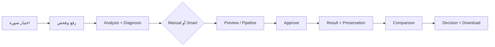
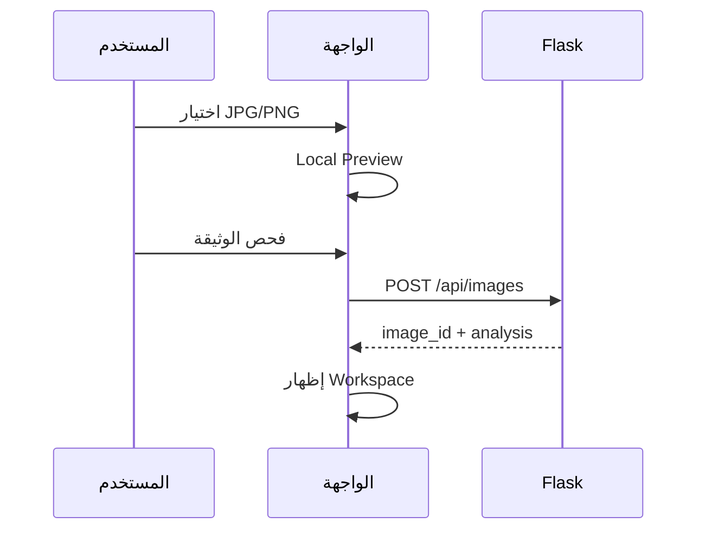
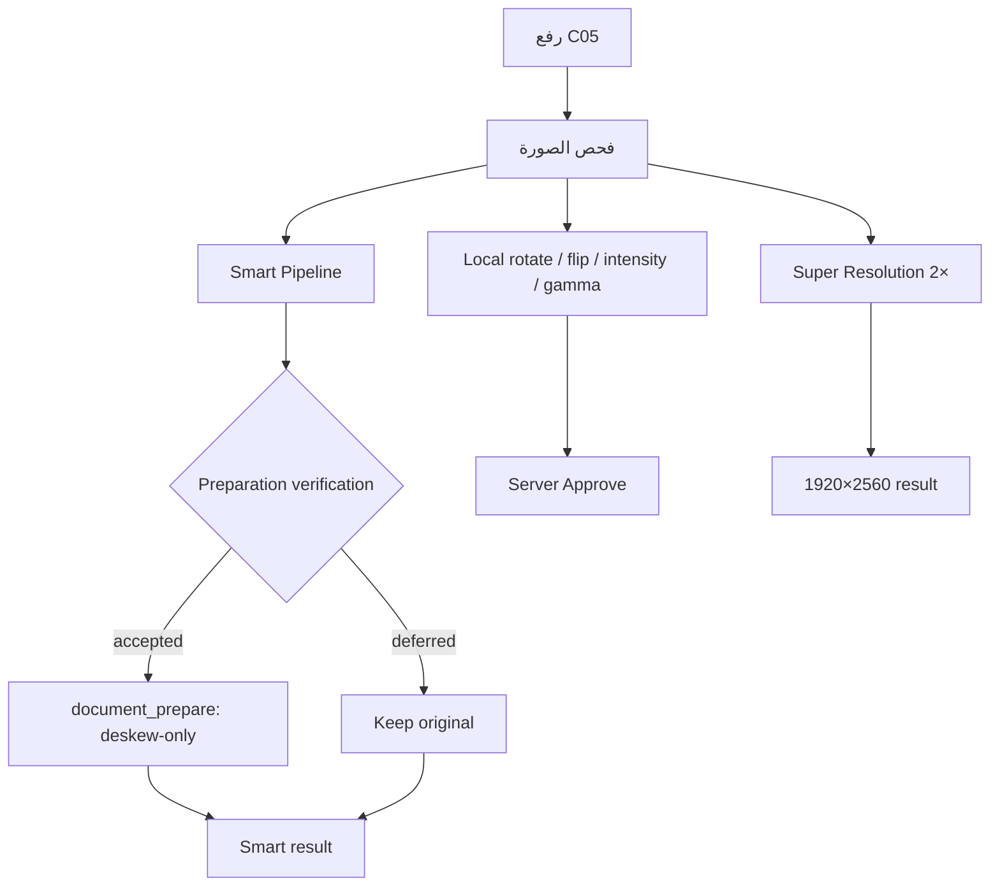
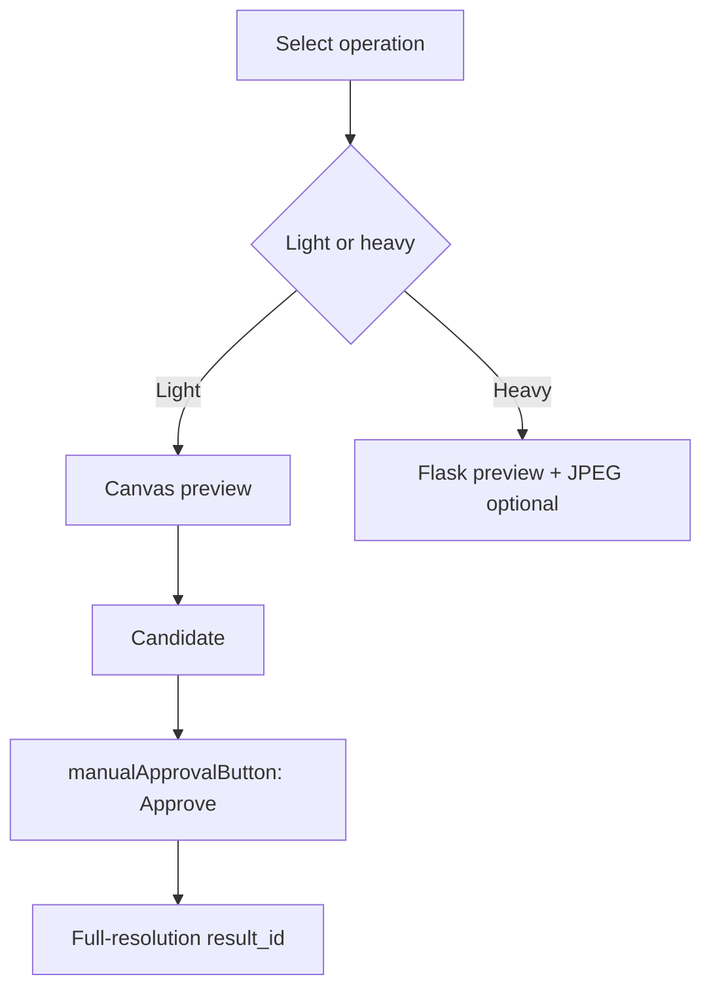
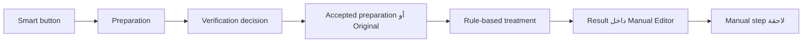
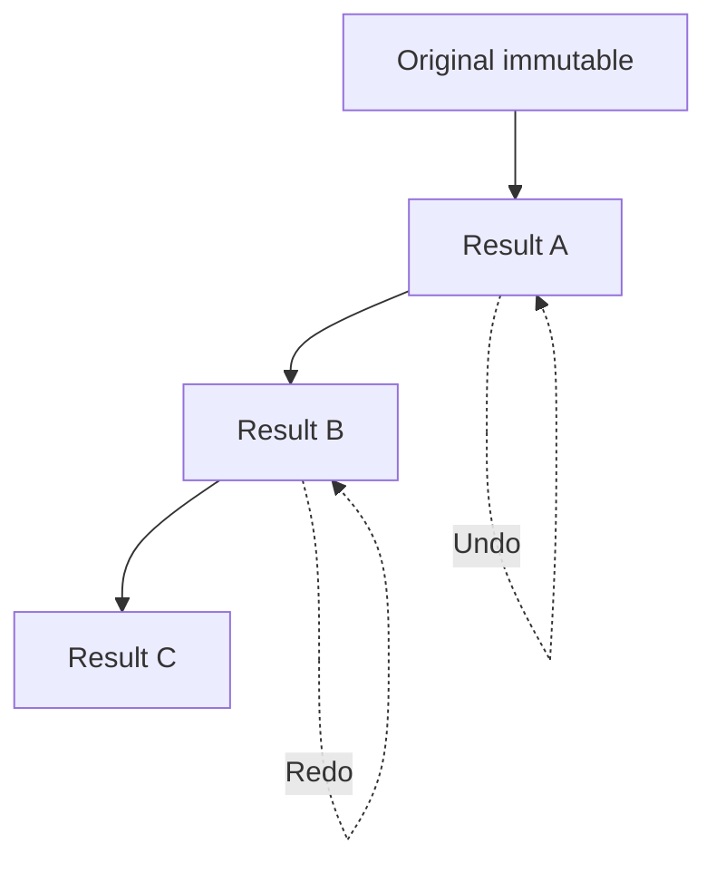
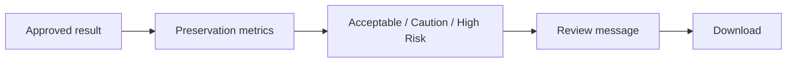

<div dir="rtl" align="right">

# 🧪 Manuscript Doctor — اختبار المسار الكامل

> **الغرض:** التحقق من تجربة المستخدم من اختيار الصورة حتى إنشاء النتيجة والتحقق منها وتنزيلها، مع فحص الصورة الفعلية في المتصفح وليس API وحده.
>
> الاختبارات الآلية المفصلة في [`testing.md`](testing.md)، أما هذه الوثيقة فتركز على تكامل المسار والحالة المرئية.

---

## 1. بيئة الاختبار المرجعية

| العنصر | القيمة |
| --- | --- |
| Backend | Flask محلي |
| Image Engine | Python + OpenCV + NumPy |
| Frontend | HTML + CSS + Vanilla JavaScript RTL |
| Browser | Chromium |
| الاختبار الآلي | `PYTHONPATH=. pytest -q tests` |
| فحص JavaScript | `node --check static/js/parts/*.js` |
| النتيجة الآلية المرجعية | `333 passed, 16 skipped` |

النتيجة الآلية لا تغني عن اختبار المتصفح؛ فمشكلة before/after أو Crop قد تظهر في العرض رغم نجاح API.

---

## 2. تعريف الحالة

| الرمز | الاستخدام |
| --- | --- |
| `PASS` | السلوك تحقق بالدليل المطلوب |
| `FAIL` | السلوك خالف العقد أو منع إكمال المسار |
| `RETEST` | يحتاج إعادة اختبار بعد تغيير قريب |
| `KNOWN LIMITATION` | حد موثق لا يمثل عطلاً |
| `NOT RUN` | لم يدخل في الجولة الحالية |

لا تسجل الحالة `PASS` لمجرد أن الصفحة فتحت؛ يجب تحديد الدليل، مثل `result_id` أو `src` فعلي أو أبعاد النتيجة.

---

## 3. المسار الكامل



### معيار النجاح

يعد المسار ناجحاً عندما تتحقق الشروط التالية معاً:

```text
لا Crash
+ لا بيانات من صورة سابقة
+ Original ثابت
+ Result محفوظة بمعرف
+ before/after للخطوة الصحيحة
+ Verification ظاهر أو موضح كغير متاح
+ التنزيل يستخدم Result الحقيقية
```

---

## 4. سيناريو الرفع والفحص



### خطوات التحقق

| الخطوة | الدليل المطلوب |
| --- | --- |
| اختيار الملف | اسم الملف ومعاينة محلية |
| الرفع | `image_id` صالح |
| التحليل | Metrics وDiagnosis ظاهرة |
| المحافظة | Profile ظاهرة قبل العلاج |
| التوصية | مرتبطة بالتحليل وليست نصاً عاماً |

عند فشل الملف، تبقى رسالة مفهومة وإجراء تعافٍ، ولا تظهر بيانات الخادم القديمة كأنها مرتبطة بالملف الجديد.

---

## 5. حالات الاختبار الواقعية

| الحالة | الهدف | الدليل |
| --- | --- | --- |
| وثيقة طبيعية | التأكد من المسار الأساسي | Workspace ونتيجة قابلة للمراجعة |
| صورة داكنة | التحقق من Brightness وCLAHE المشروط | Recommendation ومرشح قابل للفحص |
| تباين منخفض | اختبار Contrast | تحسن مستهدف دون قبول أعمى |
| ضوضاء | اختبار Median وNoise Indicator | مراجعة بصرية للضوضاء والتفاصيل |
| إضاءة غير متجانسة | اختبار Binarization وIllumination | Candidate منفصل وليس Enhancement مؤكداً |
| تفاصيل دقيقة | اختبار Sharpen وPreservation | عدم ظهور halos أو فقد ظاهر |
| Bleed-through | اختبار حدود النظام | لا يدعي إزالة مخصصة للتسرب |
| C05 | Preparation وSmart وSuper Resolution | deskew-only عند الثقة العالية، ونتيجة 2× عند الاعتماد |
| C06 | Chain وCrop وUndo/Redo | before/after والمؤشر يطابقان الخطوة النشطة |

---

## 6. C05 — اختبار حي موثق

**المدخل:** صورة C05 بأبعاد `960×1280` وحجم يقارب `158 KB`.



### النتائج المثبتة

| الفحص | النتيجة |
| --- | --- |
| Local `rotate_right` | مرشح Canvas دون طلب `/preview` |
| Local `intensity_adjust` | مرشح سريع دون طلب `/preview` |
| تغييرات معاملات متتابعة | آخر معاملات تصبح المرشح الحالي |
| Smart Preparation | قبول `deskew-only` عند الثقة العالية دون Crop غير موثوق |
| Super Resolution | اعتماد خادمي ونتيجة 2× بأبعاد `1920×2560` |
| قبل/بعد بعد الاعتماد | النتيجة الحالية ظهرت في after والمصدر الصحيح في before |

زمن Smart لا يقارن بزمن Canvas؛ Smart يشمل Preparation والتحليل والتحقق، ولذلك لا يوصف بأنه لحظي.

---

## 7. C06 — اختبار حي موثق

استخدمت C06 لاختبار السلسلة اليدوية والقص والتنقل بين النتائج:

```text
Upload C06
  ↓
Intensity Adjustment → Approve
  ↓
Rotate Right → Approve
  ↓
Undo → Redo
  ↓
Crop drag → Approve
```

| الفحص | معيار القبول |
| --- | --- |
| الخطوة الأولى | before = Original وafter = Result A |
| الخطوة الثانية | before = Result A وafter = Result B |
| `manualActiveIndex` | يساوي الخطوة المعروضة |
| Undo | يعرض Result A من الكاش دون طلب جديد غير لازم |
| Redo | يعيد Result B بصرياً |
| Crop handle | يغير x/y/width/height فعلياً |
| Crop approval | أبعاد النتيجة تطابق القيم المرسلة |
| Smart على ثقة منخفضة | لا يفرض deskew-only أو crop غير موثوق |

نجاح هذا السيناريو يتطلب فحص `src` للصورتين، وليس state فقط.

---

## 8. Manual Preview وApprove



### الفحوص الإلزامية

| الفحص | المتوقع |
| --- | --- |
| عملية خفيفة | لا تنتظر شبكة للمعاينة |
| عملية ثقيلة | Preview خادمي، والواجهة ترسل `X-Preview-Format: jpeg` عند الحاجة |
| تغيير Slider سريع | آخر قيمة هي المرشح المعروض |
| اعتماد | إنشاء Result حقيقية عبر Flask/OpenCV |
| خطوة لاحقة | استخدام `source_result_id` للنتيجة المعتمدة |
| زر التنفيذ | لا يوجد إجراء مرئي مكرر مع الاعتماد |

---

## 9. Smart Pipeline وPreparation



يجب تسجيل العملية والقرار والسبب. لا تدخل `super_resolution` تلقائياً، ولا تتحول Preparation المرفوضة إلى قص إجباري.

---

## 10. حفظ الأصل والسلسلة



### معيار القبول

- الأصل المرئي والمحفوظ لا يتغير.
- لكل نتيجة `result_id` مستقل.
- لا يستخدم النظام Preview غير المعتمد كمصدر نهائي.
- after يعرض النتيجة النشطة، وbefore يعرض مصدرها الصحيح.
- تنزيل النتيجة لا يعتمد على اسم الملف القادم من العميل.

---

## 11. التحقق والقرار والتنزيل



إذا فشل التحقق تقنياً وبقيت النتيجة صالحة، تعرض الواجهة Warning و`Assessment Unavailable` بدلاً من حذف النتيجة أو وصفها بأنها آمنة.

---

## 12. الاختبارات السلبية

| السيناريو | النتيجة المتوقعة |
| --- | --- |
| امتداد غير مدعوم | `UNSUPPORTED_FILE_TYPE` |
| ملف غير مقروء | `UNREADABLE_IMAGE` |
| أبعاد أو حجم يتجاوز الحد | رفض مضبوط |
| `operation_id` غير معروف | `INVALID_OPERATION` |
| معاملات غير صالحة | `INVALID_OPERATION_PARAMETERS` |
| `image_id` غير موجود | `IMAGE_NOT_FOUND` |
| `result_id` غير موجود | `RESULT_NOT_FOUND` |
| مصدر لا ينتمي للصورة | رفض مصدر غير صالح |
| طلبان متزامنان | منع التضارب عبر `isBusy` |
| خطأ داخلي | رسالة عربية دون Traceback |

---

## 13. Responsive وConsole

### Desktop

```text
Preview | Controls
```

يجب أن تظهر الصورتان واللوحة والأزرار دون overflow غير متوقع.

### Mobile

```text
Preview
  ↓
Controls
  ↓
Verification
```

يجب أن يبقى Workflow قابلاً للتمرير، وأن تكون مقابض Crop والأزرار قابلة للاستخدام.

### Console

يفحص المتصفح عدم وجود أخطاء JavaScript أثناء الرفع، Preview، الاعتماد، Smart، Undo/Redo، والتنزيل. نجاح Syntax Check لا يغني عن اختبار الأحداث الفعلية.

---

## 14. الحالة المرجعية الحالية

| المجال | الحالة |
| --- | --- |
| Regression Python | `333 passed, 16 skipped` |
| JavaScript syntax | Passed |
| Header والخلفية | تم التحقق بصرياً؛ الخلفية كاملة دون Hero مكرر |
| C05 Local Preview | تم التحقق |
| C05 Smart Preparation | deskew-only مقبول عند الثقة العالية |
| C05 Super Resolution | تم الاعتماد والتحقق من أبعاد 2× |
| C06 Manual Chain | before/after صحيحان بعد خطوتين |
| C06 Undo/Redo | تم التحقق بصرياً من الكاش |
| C06 Crop | السحب والاعتماد وأبعاد النتيجة تم التحقق منها |
| Bleed-through removal | غير منفذ؛ حد موثق |

---

## 15. بوابة إغلاق اختبار E2E

لا يغلق الاختبار إلا بعد وجود دليل لكل بند:

```text
Upload passed
Analysis passed
Manual preview passed
Manual approve passed
Smart path checked
C05 checked
C06 checked
before/after checked by src
Undo/Redo checked visually
Crop dimensions checked
Original immutability checked
Verification message checked
Download checked
Responsive layout checked
Console checked
```

</div>
