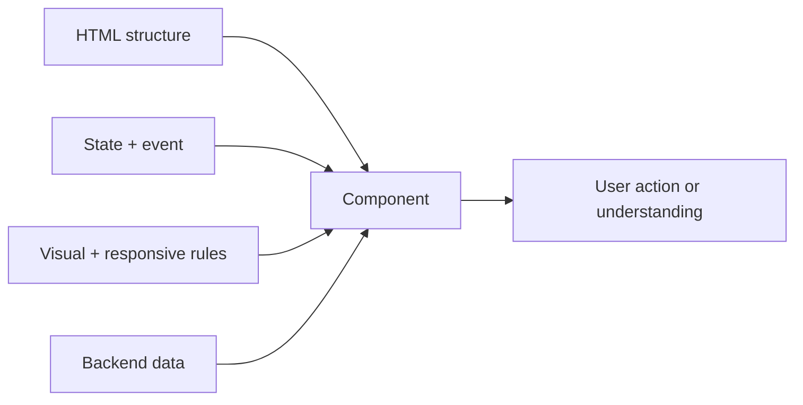
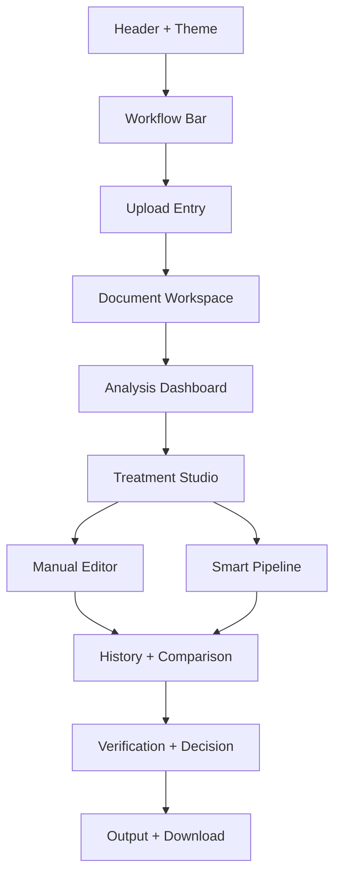
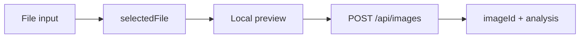
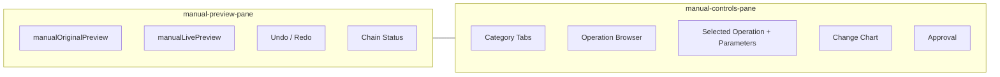
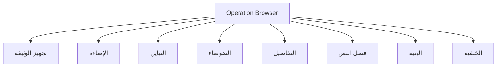
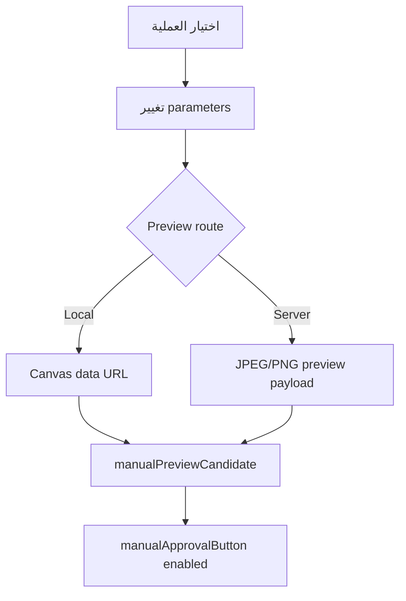

<div dir="rtl" align="right">

# 🧱 Manuscript Doctor — مكونات الواجهة

> **غرض الوثيقة:** ربط كل مكوّن مرئي بمسؤوليته وعناصره الفعلية في HTML وملف JavaScript وطبقة CSS، مع توضيح البيانات التي يقرأها والحالات التي يعمل فيها.
>
> التخطيط العام في [`wireframes.md`](wireframes.md)، والحالات في [`ui-states.md`](ui-states.md)، والتقسيم البرمجي في [`split-structure.md`](split-structure.md).

---

## 1. قاعدة المكوّن

كل مكوّن يجيب عن سؤال واحد:

> **ما الذي يحتاجه المستخدم الآن، وما البيانات التي تثبته؟**



لا تعيد الواجهة تنفيذ خوارزميات OpenCV أو قواعد التشخيص. وهي لا تعتبر المعاينة المحلية Result محفوظة.

---

## 2. خريطة المكونات الرئيسية



| المكوّن | العنصر أو المحدد الأساسي | ملف السلوك | ملف الشكل |
| --- | --- | --- | --- |
| Header | `.app-header` | `10-theme-quick-tools.js` | `01-foundation-header.css` و`07-theme-layout.css` |
| Workflow Bar | `#workflow` | `11-events-entry.js` | `02-workflow-main.css` |
| Upload Entry | `#uploadSection` و`#dropZone` | `02-upload-api.js` | `03-upload-buttons.css` |
| Processing State | `#processingStateSection` | `02-upload-api.js` و`07-manual-execution.js` | `04-processing-analysis.css` |
| Document Workspace | `#documentPreviewSection` | `03-analysis-dashboard.js` | `04-processing-analysis.css` |
| Examination Dashboard | `#examinationSection` | `03-analysis-dashboard.js` و`04-examination.js` | `04-processing-analysis.css` و`09-preview-dashboard.css` |
| Treatment Studio | `#treatmentSection` | `08-smart-pipeline.js` و`10-theme-quick-tools.js` | `05-treatment-manual.css` |
| Manual Editor | `#manualEditor` | `05` إلى `07-manual-*.js` | `05-treatment-manual.css` و`08-manual-studio.css` |
| Treatment History | `[data-treatment-history]` | `09-history-results.js` | `06-crop-history-footer.css` |
| Verification | `#verificationSection` | `07-manual-execution.js` و`08-smart-pipeline.js` | `04-processing-analysis.css` |
| Decision | `#decisionSection` | `07-manual-execution.js` و`08-smart-pipeline.js` | `04-processing-analysis.css` |
| Output | `#downloadSection` | `09-history-results.js` | `06-crop-history-footer.css` |

---

## 3. Header وWorkflow Bar

### Header

يقدم هوية المشروع والتبديل بين الثيمات، ويستخدم الشعار والخلفية الحالية:

```text
static/assets/doctor-logo.svg
static/assets/header-workspace-background.png
```

الصورة خلفية Header فقط، ولا توجد صورة Hero مستقلة مكررة في مقدمة الصفحة.

### Workflow Bar

يعرض المراحل الست ويربطها بأقسام الصفحة:

```text
01 رفع → 02 تهيئة → 03 تشخيص → 04 معالجة → 05 تحقق → 06 إخراج
```

يبقى `.workflow-bar` ثابتاً أثناء التمرير وقابلاً للتمرير الأفقي في العرض الضيق.

---

## 4. Upload Entry

| العنصر | المسؤولية |
| --- | --- |
| `#dropZone` | اختيار الملف بالسحب أو النقر |
| `#imageInput` | حقل الملف المخفي |
| `#selectedFile` | عرض اسم الملف وبياناته بعد الاختيار |
| `#removeImageButton` | تغيير الصورة وتصفير بيانات الجلسة |
| `#startExaminationButton` | بدء الرفع والتحقق والتحليل |
| `#originalPreview` | عرض الأصل بعد نجاح الرفع |

البيانات الأساسية هي `state.selectedFile` و`state.previewUrl`. لا يصبح `state.imageId` متاحاً إلا بعد نجاح Flask.



---

## 5. Processing State

يستخدم `#processingStateSection` لعرض ما يحدث حالياً، ولا يثبت نجاح المعالجة وحده.

| حالة الطلب | العنوان المقترح |
| --- | --- |
| Upload | جارٍ رفع الصورة والتحقق منها وفحصها |
| Manual Preview | جارٍ تحديث المعاينة |
| Manual Approve | جارٍ اعتماد العملية وإنشاء النتيجة |
| Smart | جارٍ تنفيذ المعالجة الذكية |
| Verification | جارٍ فحص أثر المعالجة على التفاصيل |

يرتبط هذا المكوّن بـ`state.isBusy`. أثناء `true` تتعطل الأزرار التي قد تنشئ طلباً متداخلاً.

---

## 6. Document Workspace وExamination Dashboard

### Workspace

`#documentPreviewSection` يجمع الصورة الأصلية وملخص الفحص والتشخيص وملف المحافظة والتوصيات. لا يعرض نتيجة معالجة قبل وجودها.

### Dashboard

يعرض `#examinationSection` البطاقات التالية:

```text
Brightness · Contrast · Noise · Sharpness
Illumination Variation · Edge Density
```

وتظهر رسوم:

```text
#tonalDistributionChart
#qualityMetricsChart
```

رسم **توازن الظلال والإضاءات** يعرض منحنى نطاقات الإضاءة، وليس Histogram كاملاً. لا يعيد Frontend حساب المؤشرات؛ يستخدم بيانات `analysis` القادمة من Backend.

---

## 7. Treatment Studio

يتكون `#treatmentSection` من مسارين واضحين:

| البطاقة | العنصر | وظيفتها |
| --- | --- | --- |
| Smart | `#runPipelineButton` | تشغيل `/api/images/<id>/pipeline` |
| Manual | رابط `#manualEditor` | فتح مساحة التحكم اليدوي |

تتغير حالة زر Smart حسب وجود الصورة وبيانات الفحص. لا يعرض المكوّن اسم AI أو Magic Fix لأن النظام Rule-Based ومحافظ.

---

## 8. Manual Editor



| الجزء | العناصر | السلوك |
| --- | --- | --- |
| Preview | `manualOriginalPreview` و`manualLivePreview` | عرض before/after للخطوة النشطة |
| Crop | `manualCropGuide` ومقابضه | إنشاء مسودة قص قابلة للسحب |
| Toolbar | `manualUndoButton` و`manualRedoButton` | التنقل في النتائج المعتمدة |
| Status | `manualPreviewStatus` و`manualPreviewNote` | وصف حالة المرشح |
| Chain | `manualChainStatus` و`manualChainList` و`manualActiveIndex` | عرض عدد الخطوات وحالتها والخطوة النشطة |
| Controls | `.operation-category-strip` و`.operation-browser` | اختيار الفئة والعملية |
| Parameters | `#manualParameters` | تعديل المعاملات |
| Chart | `#manualChangeChart` داخل `.manual-change-chart-inline` | عرض أثر المعاينة داخل اللوحة نفسها |
| Approval | `#manualApprovalButton` | الاعتماد وإنشاء Result حقيقية |
| Download | `#manualManualDownloadButton` | تنزيل نتيجة يدوية محفوظة |

لا يوجد إجراء تنفيذ موازٍ للاعتماد؛ المرشح يعرض أولاً، ثم يضغط المستخدم زر الاعتماد الوحيد.

---

## 9. مجموعات العمليات



### عناصر خاصة

| العملية | مكانها | ملاحظتها |
| --- | --- | --- |
| `document_prepare` | تجهيز الوثيقة | تجهيز محافظ مرتبط بالتحقق |
| `crop` | تجهيز الوثيقة | إطار ومقابض واعتماد فقط |
| `rotate_*` و`flip_*` | اتجاه الصورة | معاينة محلية سريعة |
| `deskew` | تجهيز الوثيقة | يمكن استخدامه تلقائياً فقط وفق الثقة |
| `super_resolution` | التفاصيل | خادمية، 2× أو 3×، ولا تدخل Smart تلقائياً |
| Threshold operations | فصل النص | قد تظهر كمرشحات مستقلة |

---

## 10. Preview Candidate



المرشح يحمل العملية والمعاملات والمصدر الحالي بصرياً، لكنه لا يدخل `state.manualChain` ولا يملك `result_id` حتى الاعتماد.

---

## 11. Smart Result وHistory

عند اكتمال Smart Pipeline، تستخدم الواجهة نفس `manualEditor` لعرض النتيجة، ثم يمكن إضافة خطوة يدوية لاحقة. يسجل `[data-treatment-history]` النتائج التي أنشأها النظام فعلياً، ولا يسجل كل حركة معاينة مؤقتة.


---

## 12. Verification وDecision

| المكوّن | العنصر | المخرج |
| --- | --- | --- |
| Verification | `#verificationSection` | مؤشرات المحافظة والتحذيرات |
| Decision | `#decisionSection` | حالة القرار ورسالة تفسيرية |
| Binarization | `#binarizationSection` | مرشحو فصل النص عند وجودهم |

يظهر التقييم بصياغة `Acceptable` أو `Caution` أو `High Risk`، ولا يعتمد فهمه على اللون وحده؛ يجب أن يظهر النص والأيقونة والرسالة.

---

## 13. Output وDownload

يضم `#downloadSection` زر `#downloadResultButton` وزر `#startOverButton`. يتفعل التنزيل عند وجود `state.resultId` أو النتيجة اليدوية الحالية، ويرسل معرف المورد إلى Flask بدلاً من بناء مسار ملف داخل المتصفح.

---

## 14. Message وError

يعرض `#errorSection` الأخطاء برسالة عربية مختصرة وإجراء تعافٍ مناسب. لا تُعرض تفاصيل `cv2.error` أو Traceback للمستخدم النهائي.

```text
Icon + عنوان مفهوم + سبب مختصر + الإجراء التالي
```

يمكن أن تبقى المعاينة المحلية بعد فشل الرفع، لكن يجب حذف بيانات Backend القديمة عند تبديل الصورة.

---

## 15. علاقة المكوّن بالحالة

| الحالة | المكونات الأساسية | الإجراء التالي |
| --- | --- | --- |
| Empty | Header، Workflow، Upload | اختيار صورة |
| Image Selected | Upload، Local Preview | فحص الوثيقة |
| Examination Ready | Workspace، Dashboard، Diagnosis | اختيار Smart أو Manual |
| Preview Candidate | Manual Editor، Parameters، Chart | اعتماد المرشح |
| Approved Result | Editor، History، Verification | مراجعة أو خطوة جديدة |
| Warning | Result، Warning، Decision | مراجعة أو معالجة أكثر تحفظاً |
| Error | Error Section، Recovery Action | إعادة المحاولة أو اختيار صورة |

---

## 16. قواعد المكوّنات

1. لا ينفذ المكوّن خوارزمية معالجة صورة بنفسه.
2. لا يعرض نتيجة نهائية من `data URL` على أنها ملف محفوظ.
3. لا يكرر مصدر الحقيقة في متغيرات متنافسة.
4. لا يعيد حساب تشخيص أو Threshold داخل JavaScript.
5. لا يعرض Download قبل وجود نتيجة حقيقية.
6. لا يمسح صورة before عند تحديث after إلا ضمن مزامنة السلسلة الصحيحة.
7. لا يفرض Smart Preparation عندما يرفض التحقق المحافظ.
8. يظل المكوّن قابلاً للاستخدام في العرض الضيق دون فقد الإجراء الأساسي.

---

## 17. معيار اكتمال الواجهة

تكون المكونات مترابطة بصورة صحيحة عندما يستطيع المستخدم تنفيذ المسار التالي دون عنصر غامض أو مكرر:

```text
اختيار صورة
  ↓
فحصها
  ↓
فهم حالتها
  ↓
اختيار Manual أو Smart
  ↓
معاينة المرشح
  ↓
اعتماده
  ↓
رؤية before/after والسجل
  ↓
مراجعة Preservation
  ↓
تنزيل النتيجة
```

</div>
