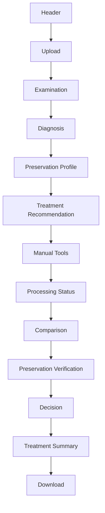
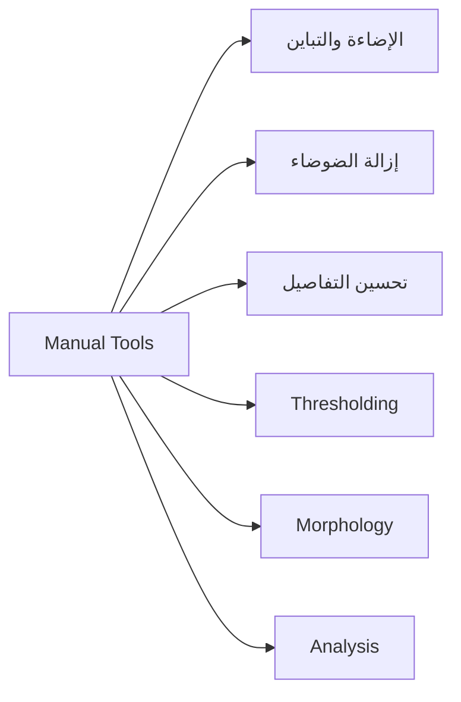
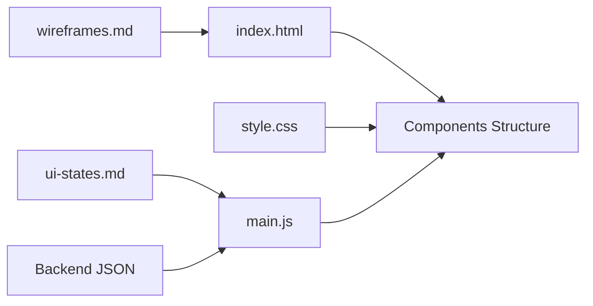

docs/frontend-components.md

<div dir="rtl" align="right">

# 🧱 Manuscript Doctor — مكونات الواجهة

> **الغرض من الوثيقة:** تحديد مكونات الواجهة التي سنبنيها فعليًا، وظيفة كل مكوّن، البيانات التي يحتاجها، ومتى يظهر.
> التفاصيل البصرية في `wireframes.md`، وحالات الواجهة في `ui-states.md`.

---

## 1. المبدأ

لا نريد واجهة مليئة بالمكونات بلا فائدة.

كل مكوّن يجب أن يجيب عن سؤال واحد:

> **ما الوظيفة التي يؤديها للمستخدم داخل مسار Diagnose → Treat → Preserve → Verify؟**

---

## 2. الهيكل الرئيسي



---

## 3. المكونات المعتمدة

| المكوّن                      | الوظيفة                         | يظهر عندما           |
| ---------------------------- | ------------------------------- | -------------------- |
| **Header**                   | تعريف المشروع باختصار           | دائمًا               |
| **Upload Area**              | اختيار الصورة ورفعها            | دائمًا               |
| **Image Preview**            | معاينة الصورة المختارة          | بعد اختيار ملف       |
| **Examination Panel**        | عرض مؤشرات الفحص                | بعد نجاح التحليل     |
| **Diagnosis Panel**          | عرض المشكلات المكتشفة           | بعد التشخيص          |
| **Preservation Profile**     | عرض مستوى الحذر قبل المعالجة    | بعد التحليل          |
| **Treatment Recommendation** | عرض المعالجة المقترحة وسببها    | عند توفر توصية       |
| **Manual Tools**             | اختيار عملية يدوية              | بعد نجاح رفع الصورة  |
| **Processing Status**        | توضيح Processing أو Verifying   | أثناء الطلب          |
| **Comparison Viewer**        | عرض Original وResult            | بعد وجود Result      |
| **Preservation Panel**       | عرض تقييم أثر المعالجة          | بعد Verification     |
| **Decision Panel**           | عرض حالة النتيجة                | بعد التقييم          |
| **Treatment Summary**        | تلخيص ما تم ولماذا              | بعد المعالجة         |
| **Download Action**          | تنزيل Result                    | عند وجود `result_id` |
| **Message Area**             | عرض Error أو Warning أو Success | عند الحاجة           |

---

# 4. Upload Area

### يحتوي

* File input.
* Drop area اختياري.
* اسم الملف.
* Local Preview.
* زر **رفع وفحص الصورة**.

### البيانات

```text
selectedFile
previewUrl
```

### القاعدة

اختيار الملف محليًا لا يعني نجاح الرفع.

---

# 5. Examination Panel

يعرض مؤشرات الصورة التي يعيدها Backend.

المؤشرات المستهدفة:

```text
Brightness
Contrast
Dynamic Range
Sharpness
Noise
Illumination Variation
Edge Density
```

كل Metric تعرض:

```text
Name
↓
Readable interpretation
↓
Raw value عند الحاجة
```

لا يحسب Frontend أي Metric بنفسه.

---

# 6. Diagnosis Panel

كل Diagnosis تعرض:

```text
Severity
Label
Message
```

مثال:

```text
⚠ تباين منخفض
تشير القياسات إلى انخفاض التباين في الصورة.
```

لا نعرض `code` التقني في الواجهة الأساسية.

إذا لم توجد Diagnosis:

> لم تكتشف القواعد الحالية مشكلة بصرية واضحة ضمن المؤشرات المستخدمة.

---

# 7. Preservation Profile

يعرض:

* `level`
* الرسالة العامة.
* Indicators المهمة.

المستويات:

```text
Low
Moderate
High
```

ولا تعرض على شكل:

```text
95% Safe
```

---

# 8. Treatment Recommendation

يعرض للمستخدم:

```text
Treatment Goal
Recommended Operation
Reason
Priority
Preservation Note عند الحاجة
```

المكوّن لا يختار المعالجة بنفسه؛ يعرض ما أعاده Backend.

---

# 9. Manual Tools

تنظم العمليات حسب الغرض:



### العمليات المستهدفة

| المجموعة         | العمليات                      |
| ---------------- | ----------------------------- |
| الإضاءة والتباين | CLAHE, Histogram Equalization |
| إزالة الضوضاء    | Median, Gaussian              |
| التفاصيل         | Sharpening                    |
| Thresholding     | Otsu, Adaptive                |
| Morphology       | Opening, Closing              |
| Analysis         | Grayscale, Canny              |

يفضل عرض المجموعات باستخدام Accordion لتقليل ازدحام الصفحة.

---

# 10. Processing Status

له حالتان واضحتان:

### Processing

> جاري تنفيذ المعالجة...

### Verifying

> جاري فحص أثر المعالجة على التفاصيل...

أثناءهما يتم تعطيل الأزرار التي قد تبدأ Request أخرى.

---

# 11. Comparison Viewer

يعرض:

```text
Original
↔
Processed Result
```

### Desktop

الصورتان جنبًا إلى جنب.

### Mobile

Original ثم Result أسفلها.

يجب الحفاظ على Aspect Ratio وعدم Stretch الصور.

---

# 12. Preservation Verification Panel

يعرض فقط المؤشرات التي يعتمدها `preservation.py`.

البنية:

```text
Preservation Metrics
Warnings
Assessment
```

لا نفترض أسماء Metrics النهائية داخل Frontend قبل اعتماد Backend لها.

---

# 13. Decision Panel

الحالات المتوقعة:

```text
Acceptable
Caution
High Risk
```

كل حالة تعرض:

* Icon.
* Status.
* رسالة تفسيرية.

ولا يعتمد معناها على اللون وحده.

---

# 14. Treatment Summary

ملخص قصير:

| العنصر   | المثال               |
| -------- | -------------------- |
| المشكلة  | Low Contrast         |
| المعالجة | CLAHE                |
| السبب    | تحسين التباين المحلي |
| التقييم  | Acceptable           |

لا يعيد عرض جميع Metrics مرة أخرى.

---

# 15. Download Action

يصبح متاحًا فقط إذا:

```text
resultId != null
```

الرابط يأتي من Backend.

Frontend لا ينشئ File Path بنفسه.

---

# 16. Message Area

نستخدم مكوّنًا موحدًا للرسائل:

```text
Success
Warning
Error
```

كل رسالة تحتوي على:

```text
Icon + Message
```

والـError يحتوي أيضًا على الإجراء المطلوب عند الحاجة.

مثال:

> تعذر قراءة الصورة. اختر ملف JPG أو PNG صالحًا.

---

# 17. البيانات التي يحتفظ بها `main.js`

الحالة الأساسية المطلوبة:

```javascript
selectedFile
imageId
resultId
analysis
diagnoses
preservationProfile
recommendations
currentResult
preservationAssessment
currentState
```

هذه بيانات UI فقط.

Backend يبقى مصدر الحقيقة للمنطق والقرارات.

---

# 18. قواعد مهمة للمكونات

* لا يظهر Treatment قبل نجاح رفع الصورة.
* لا يظهر Download قبل Result.
* لا تظهر بيانات صورة قديمة بعد اختيار صورة جديدة.
* لا توجد Thresholds داخل JavaScript.
* لا توجد Diagnosis Rules داخل JavaScript.
* لا توجد Preservation Rules داخل JavaScript.
* Original لا تتغير عند تشغيل Manual Operation.
* Warning لا تعامل دائمًا كـError.
* الأقسام غير المستخدمة تبقى مخفية بدل عرض بطاقات فارغة.

---

# 19. العلاقة بين الملفات



* `index.html` يبني الهيكل.
* `style.css` يحدد الشكل والاستجابة.
* `main.js` يدير السلوك والحالات.
* Backend يرسل البيانات الفعلية.

---

# 20. معيار اكتمال الواجهة

تعتبر المكونات كافية عندما يستطيع المستخدم تنفيذ:

```text
Upload
↓
Examine
↓
Understand Diagnosis
↓
See Preservation Profile
↓
Choose Treatment
↓
Process
↓
Verify
↓
Compare
↓
Understand Decision
↓
Download
```

دون الحاجة إلى مكوّن لا يؤدي وظيفة واضحة.

---

<div align="center">

### 🩺 Manuscript Doctor

**Every component must have a purpose.
Every state must have a clear next action.**

</div>

</div>
