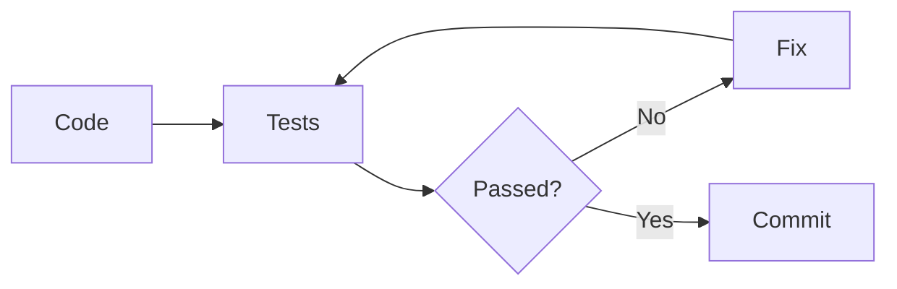
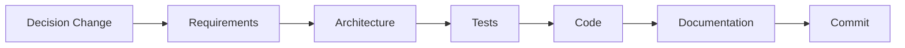

docs/git-guide.md

<div dir="rtl" align="right">

# 🌿 Manuscript Doctor — دليل Git

> **الغرض من الوثيقة:** تحديد طريقة بسيطة وثابتة لاستخدام Git داخل المشروع، بحيث يمكن تتبع التغييرات والرجوع إليها دون تعقيد غير ضروري.
>
> **ملاحظة الحالة الحالية:** هذا الدليل إرشادي. قبل الإضافة راجع `git status` و`.gitignore`؛ فمجلدات runtime وملفات التقييم والكاش قد تكون مستبعدة عمداً من Git. أمر الاختبارات المعتمد حالياً هو `PYTHONPATH=. pytest -q` من جذر المشروع.

---

## 1. المبدأ

Git في هذا المشروع ليس مجرد مكان لحفظ نسخة من الملفات.

نستخدمه من أجل:

* معرفة ما الذي تغير.
* حفظ مراحل العمل.
* الرجوع إلى نسخة مستقرة عند حدوث خطأ.
* منع رفع ملفات Runtime أو ملفات شخصية.
* جعل تاريخ المشروع مفهومًا.

---

## 2. الدورة اليومية

المسار المعتمد:


لا ننفذ Commit قبل مراجعة التغييرات.

---

# 3. الأوامر الأساسية

## معرفة الحالة الحالية

```bash
git status
```

يعرض:

* الملفات المعدلة.
* الملفات الجديدة.
* الملفات المحذوفة.
* الملفات الجاهزة للـCommit.

---

## مراجعة التغييرات

```bash
git diff
```

لمراجعة التغييرات غير المضافة بعد.

بعد `git add`:

```bash
git diff --staged
```

وهذه المراجعة مهمة قبل كل Commit.

---

# 4. إضافة الملفات

الأفضل إضافة الملفات المقصودة فقط:

```bash
git add processing/analyzer.py
git add tests/test_analyzer.py
```

بدل استخدام:

```bash
git add .
```

دائمًا دون مراجعة.

يمكن استخدام `git add .` فقط عندما تكون متأكدًا من جميع التغييرات الظاهرة في `git status`.

---

# 5. كتابة Commit واضح

صيغة الرسالة:

```text
type: short description
```

أمثلة:

```text
feat: add manuscript examination engine
fix: reject unreadable image uploads
test: add analyzer validation tests
docs: update project architecture
refactor: simplify processing module
chore: update project configuration
```

---

## أنواع Commit المستخدمة

| النوع      | الاستخدام                    |
| ---------- | ---------------------------- |
| `feat`     | إضافة وظيفة جديدة            |
| `fix`      | إصلاح خطأ                    |
| `test`     | إضافة أو تعديل الاختبارات    |
| `docs`     | تعديل التوثيق فقط            |
| `refactor` | إعادة تنظيم دون تغيير السلوك |
| `chore`    | أعمال إعداد أو صيانة         |

لا نحتاج أنواعًا أكثر ما لم تظهر حاجة حقيقية.

---

# 6. حجم Commit

Commit الجيد يمثل تغييرًا منطقيًا واحدًا.

مثال جيد:

```text
feat: add image diagnosis metrics
```

مثال غير جيد:

```text
feat: add analyzer, redesign frontend, fix upload and update everything
```

إذا كانت التغييرات مستقلة، نقسمها إلى أكثر من Commit.

---

# 7. الملفات التي لا تدخل Git

يجب تجاهل ملفات Runtime مثل:

```text
storage/uploads/*
storage/results/*
storage/preparation_previews/*
.pytest_cache/
*.log
*.zip
```

مع الاحتفاظ بـ:

```text
storage/uploads/.gitkeep
storage/results/.gitkeep
```

ويجب كذلك تجاهل:

```text
.venv/
__pycache__/
*.pyc
.env
.vscode/
logs/
temporary files
```

بحسب ما هو معتمد داخل `.gitignore`.

---

# 8. قبل كل Commit

نفذ:

```bash
git status
```

ثم:

```bash
git diff
```

وتأكد من:

* عدم وجود صور مرفوعة.
* عدم وجود Results.
* عدم وجود مسارات شخصية.
* عدم وجود كلمات مرور أو Secrets.
* عدم وجود Debug Code غير مقصود.
* عدم وجود ملفات مؤقتة.

---

# 9. بعد الاختبارات

لا نحفظ مرحلة كنسخة مستقرة قبل نجاح اختباراتها الأساسية.

المسار:



مثال:

```bash
PYTHONPATH=. pytest -q
```

ثم فقط إذا كانت النتيجة صحيحة:

```bash
git add ...
git commit -m "feat: ..."
```

---

# 10. Push إلى GitHub

بعد Commit:

```bash
git push
```

ثم تحقق:

```bash
git status
```

المطلوب عند الانتهاء:

```text
nothing to commit, working tree clean
```

---

# 11. العمل على Branches

لأن المشروع حاليًا فردي وصغير، لا نحتاج Workflow معقدًا.

الفرع الأساسي:

```text
main
```

يمكن إنشاء Branch فقط إذا كان التعديل:

* كبيرًا.
* تجريبيًا.
* قد يكسر النسخة الحالية.

مثال:

```bash
git switch -c feature/preservation-engine
```

وعند الانتهاء:

```bash
git switch main
git merge feature/preservation-engine
```

لا ننشئ Branch لكل تعديل صغير بلا حاجة.

---

# 12. الرجوع عن تغييرات غير محفوظة

لرؤية التغيير أولًا:

```bash
git diff
```

ثم إذا كنت متأكدًا أنك تريد إلغاء تعديل ملف:

```bash
git restore path/to/file
```

مثال:

```bash
git restore processing/analyzer.py
```

> هذا يحذف التعديلات غير المحفوظة في ذلك الملف، لذلك يستخدم بحذر.

---

# 13. الاطلاع على التاريخ

```bash
git log --oneline
```

يعرض Commit History بشكل مختصر.

مثال:

```text
a12bc34 feat: add manuscript examination engine
7d91ef2 feat: build secure Flask upload foundation
3aa39dd chore: initialize project structure
```

---

# 14. Tags للإصدارات

لا نضع Tag لكل مرحلة.

نستخدمه عندما توجد نسخة مستقرة تستحق أن تعتبر Release.

مثال عند اكتمال الـMVP:

```bash
git tag -a v0.1.0-mvp -m "Manuscript Doctor MVP"
git push origin v0.1.0-mvp
```

---

# 15. ما لا نحتاجه الآن

لا نضيف في المشروع الحالي بلا سبب:

* Git Flow معقد.
* فروع `develop`, `release`, `hotfix` بشكل دائم.
* Pull Requests لنفسك لكل تعديل صغير.
* CI/CD قبل الحاجة.
* عشرات Tags أثناء التطوير.

الهدف:

> **تاريخ Git نظيف ومفهوم، وليس Workflow معقدًا.**

---

# 16. قاعدة العمل لكل مرحلة

عند تنفيذ أي مرحلة من المشروع:

```text
Implement
↓
Test
↓
Review Files
↓
Update Related Docs
↓
git status
↓
git diff
↓
git add
↓
git diff --staged
↓
Commit
↓
Push
↓
Clean Working Tree
```

---

# 17. مثال عملي

بعد الانتهاء من مرحلة Analyzer:

```bash
PYTHONPATH=. pytest -q
```

ثم:

```bash
git status
```

ثم إضافة الملفات المقصودة:

```bash
git add processing/analyzer.py
git add tests/test_analyzer.py
git add docs/architecture.md
git add docs/decisions.md
git add docs/requirements.md
git add project-plan.md
```

ثم:

```bash
git diff --staged
```

ثم:

```bash
git commit -m "feat: add manuscript examination and diagnosis engine"
```

ثم:

```bash
git push
```

وأخيرًا:

```bash
git status
```

---

# 18. قاعدة مهمة للوثائق

إذا غيّرنا قرارًا يؤثر على المشروع:



لا نسمح بأن يكون Git يحتوي كودًا حديثًا ووثائق تصف نسخة قديمة من المشروع.

---

# 19. القائمة السريعة قبل Push

* [ ] الاختبارات المطلوبة ناجحة.
* [ ] راجعت `git status`.
* [ ] راجعت `git diff`.
* [ ] لا توجد Runtime Images.
* [ ] لا توجد Secrets.
* [ ] لا توجد مسارات شخصية.
* [ ] رسالة Commit واضحة.
* [ ] الملفات المضافة تخص التغيير الحالي.
* [ ] راجعت `git diff --staged`.
* [ ] تم Push بنجاح.

---

<div align="center">

### 🌿 Git Principle

**Small logical changes.
Clear commits.
Review before saving.
Never commit what you do not understand.**

</div>

</div>
