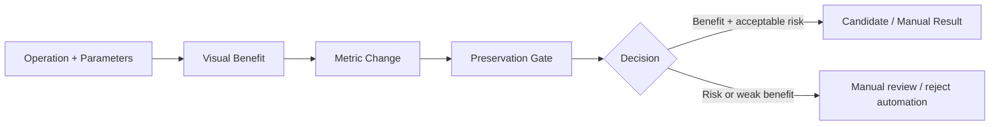
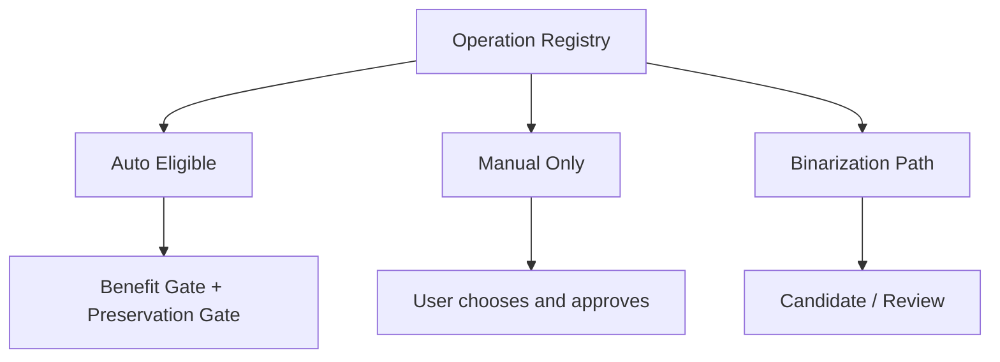
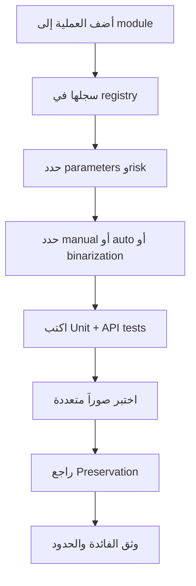

<div dir="rtl" align="right">

# 🧪 Manuscript Doctor — تقييم عمليات معالجة الصور

> **الغرض:** توثيق ما تقيسه كل عملية، ومتى تكون مفيدة، وما مخاطرها، وهل تدخل Smart Pipeline أم تبقى اختياراً يدوياً.
>
> لا تعني زيادة Brightness أو Contrast أو Sharpness وحدها أن النتيجة أفضل؛ القرار النهائي يجمع الفائدة المرئية، سلامة البنية، ونتيجة Preservation Verification.

---

## 1. مبدأ التقييم



يُقيّم كل مرشح على ثلاث طبقات:

| الطبقة | السؤال |
| --- | --- |
| الهدف | هل عالج المشكلة المقصودة؟ |
| الأثر الجانبي | هل ضخّم الضوضاء أو الحواف أو الخلفية؟ |
| المحافظة | هل بقي التغير البنيوي ضمن الحدود المقبولة؟ |

النتائج الرقمية **مؤشرات** وليست حكماً مطلقاً على جودة الوثيقة أو صحة النص.

---

## 2. مجموعة التقييم

تستخدم المراجعة صوراً متعددة الظروف، ولا تعتمد على صورة واحدة:

| الحالة | الغرض |
| --- | --- |
| `01_normal.jpg` | وثيقة متوازنة |
| `02_dark.jpg` | سطوع منخفض |
| `03_low_contrast.jpg` | تباين منخفض |
| `04_noisy.jpg` | ضوضاء ظاهرة |
| `05_uneven_lighting.jpg` | إضاءة غير متجانسة |
| `06_fine_details.jpg` | تفاصيل دقيقة حساسة |
| `07_bleed_through.jpg` | حالة حدية لتسرب الخلفية |
| C05 `960×1280` | اختبار Preparation وSuper Resolution وSmart |
| C06 | اختبار السلسلة والاقتصاص وUndo/Redo والثقة المنخفضة |

تستخدم C05 وC06 لاختبار السلوك التشغيلي، بينما تستخدم صور التقييم المقسمة لمقارنة الأثر البصري والمؤشرات.

---

## 3. التصنيف التنفيذي الحالي



### مؤهلة للمسار التلقائي بشروط

```text
clahe
gamma_correct
illumination_normalize
median_denoise
sharpen
```

وجود العملية في `AUTO_ELIGIBLE_OPERATIONS` لا يعني تشغيلها على كل الصور. Smart Pipeline يسمح بمرشح واحد مقبول في الجولة، ويوقف أو يتراجع عند فشل بوابة المنفعة أو المحافظة.

### يدوية فقط

```text
histogram_equalization
global_threshold
otsu_threshold
adaptive_threshold
bilateral_denoise
non_local_means_denoise
background_suppress
weak_structure_suppress
super_resolution
faded_text_enhance
morphological_opening
morphological_closing
morphological_top_hat
morphological_black_hat
deskew
crop
rotate_right
rotate_left
flip_vertical
flip_horizontal
```

أما `adaptive_threshold` فيبقى ضمن **Binarization Path** ولا يعامل كتحسين عام للصورة.

---

## 4. مصفوفة العمليات الحالية

| العملية | الهدف | المعاملات المرجعية | الاستخدام الحالي | الخطر الغالب |
| --- | --- | --- | --- | --- |
| `clahe` | تحسين التباين المحلي | `clip_limit=1.5`, `tile_grid_size=8` | تلقائي مشروط ويدوي | تضخيم الضوضاء والخلفية |
| `histogram_equalization` | تباين عالمي | لا توجد | يدوي فقط | تغير قوي في النطاق |
| `median_denoise` | تقليل ضوضاء نقطية | `kernel_size=3` | تلقائي عند دليل Noise ويدوي | فقد التفاصيل الدقيقة |
| `bilateral_denoise` | تقليل الضوضاء مع حفظ الحواف | `diameter=5`, `sigma_color=25`, `sigma_space=25` | يدوي فقط | تنعيم أو زمن أعلى |
| `non_local_means_denoise` | تقليل ضوضاء مع حفظ البنى المتشابهة | `strength=5`, `template=7`, `search=21` | يدوي فقط | كلفة أعلى وتنعيم زائد |
| `sharpen` | تحسين الحواف والتفاصيل | `amount=0.25`, `kernel_size=3` | تلقائي مشروط ويدوي | Halos وتضخيم الضوضاء |
| `super_resolution` | تكبير وتحسين قابلية القراءة | `scale=2`, `amount=0.35`, `sigma=1.0` | يدوي فقط | حجم وزمن وتفاصيل غير مستعادة |
| `gamma_correct` | ضبط السطوع بمنحنى Gamma | `gamma=1.0` | تلقائي مشروط ويدوي | تغيير التعريض |
| `intensity_adjust` | ضبط خطي للسطوع والتباين | `alpha=1.0`, `beta=0` | يدوي، Preview محلي | قص القيم عند الشدة العالية |
| `illumination_normalize` | تقليل اختلاف الإضاءة التدريجي | `kernel_size=51`, `strength=0.65` | تلقائي مشروط ويدوي | إزالة تدرج مفيد أو هالات |
| `faded_text_enhance` | إبراز النص الباهت | `clip_limit=1.4`, `gamma=0.95` | يدوي فقط | تضخيم الخلفية |
| `background_suppress` | تقليل إضاءة الخلفية غير المتجانسة | `kernel_size=31`, `strength=0.45` | يدوي فقط | فقد مكونات ضعيفة |
| `weak_structure_suppress` | تقليل بنى ضعيفة | `kernel_size=31`, `threshold=12`, `strength=0.35` | يدوي فقط | حذف تفاصيل أصلية |
| `global_threshold` | فصل ثنائي بعتبة ثابتة | `threshold=127` | يدوي فقط | لا يعمم على الإضاءة المتغيرة |
| `otsu_threshold` | اختيار عتبة عالمية تلقائياً | لا توجد | يدوي أو Binarization محدود | حساس لتوزيع الصورة |
| `adaptive_threshold` | فصل محلي للنص | `block_size=35`, `c=11` | Binarization فقط | تحويل الضوضاء إلى بنية |
| `morphological_opening` | إزالة مكونات صغيرة | `kernel_size=3` | يدوي فقط | إزالة نقاط أو خطوط دقيقة |
| `morphological_closing` | سد فجوات صغيرة | `kernel_size=3` | يدوي فقط | دمج مكونات متجاورة |
| `morphological_top_hat` | إبراز البنى الفاتحة الصغيرة | `kernel_size=3` | يدوي فقط | تضخيم Texture |
| `morphological_black_hat` | إبراز البنى الداكنة الصغيرة | `kernel_size=5` | يدوي فقط | تغير بنيوي قوي |
| `deskew` | تصحيح زاوية الميل | `angle` | يدوي؛ آلياً عبر Preparation وفق الثقة | تدوير غير مناسب |
| `crop` | اقتصاص إطار يحدده المستخدم | `x,y,width,height` | يدوي فقط | فقد جزء من الوثيقة |
| `rotate_*` / `flip_*` | تصحيح الاتجاه | لا توجد | يدوي وPreview محلي | اتجاه غير مقصود |

---

## 5. نتائج التقييم الأساسية

### CLAHE

أظهر CLAHE فائدة أوضح في الصور الداكنة ومنخفضة التباين. الإعداد المحافظ `clip_limit=1.5` و`tile_grid_size=8` هو نقطة البدء؛ فرفع القوة قد يزيد Edge Density والضوضاء وتسرب الخلفية، ولذلك لا تكفي زيادة Contrast لقبول المرشح.

**الحكم:** `auto_candidate` مشروط، مع مراجعة Preservation.

### Histogram Equalization

يزيد التباين العالمي بقوة، لكنه قد يضخم Texture الورق والضوضاء وBleed-through. لا يوجد Default تلقائي عام.

**الحكم:** `manual_only`، خطر مرتفع.

### Median Denoising

يبدأ بـ`kernel_size=3`. Kernel أكبر قد يقلل الضوضاء لكنه يخفض Sharpness وEdge Density ويزيل تفاصيل دقيقة.

**الحكم:** تلقائي فقط عند وجود دليل كافٍ على ضوضاء نقطية، وإلا يدوي.

### Sharpen

يبدأ بـ`amount=0.25` و`kernel_size=3`. يجب مراجعة halos والضوضاء وتسرب الخلفية بصرياً، لأن ارتفاع Laplacian لا يثبت تحسن النص.

**الحكم:** `auto_candidate` مشروط.

### Thresholding

Global Threshold حساس للصورة ولا يصلح كقرار عام. Otsu أفضل في الإضاءة المتجانسة نسبياً. Adaptive Threshold مناسب للإضاءة غير المتجانسة لكنه يغير طبيعة الصورة إلى Binary، ولذلك يبقى في مسار فصل النص ولا يحل محل Enhancement.

**الحكم:** عمليات يدوية أو مرشحات Binarization محدودة، وليست نتيجة نصية مؤكدة.

### Morphology

Opening وClosing وTop-hat وBlack-hat عمليات بنيوية. تبدأ بأصغر Kernel مع مراجعة التفاصيل، ولا تدخل Smart تلقائياً. Closing بـ`kernel_size=5` مرفوض للتشغيل التلقائي بسبب احتمال الدمج والتغير القوي.

**الحكم:** `manual_only`، ومخاطرها مرتفعة.

---

## 6. Super Resolution


تنفذ `super_resolution` في `processing/ops/super_resolution.py` بطريقة محافظة. لا تستخدم نموذجاً عميقاً أو ملف أوزان خارجياً في الإصدار الحالي.

| القاعدة | القرار |
| --- | --- |
| `scale=2` | الإعداد المرجعي الأول |
| `scale=3` | مسموح عند بقاء الناتج ضمن حد الحجم |
| `amount` و`sigma` | يتحقق الخادم من المجال قبل التنفيذ |
| Smart Pipeline | لا تدخل تلقائياً |
| المعاينة | خادمية لأنها عملية ثقيلة |
| النتيجة | تعتمد من Flask/OpenCV لا من Canvas |

**الحد العلمي:** قد تحسن الحواف وقابلية القراءة، لكنها لا تستعيد حرفاً لم تلتقطه الصورة أو فقدته الضبابية كلياً.

---

## 7. Benefit Gate وPreservation Gate

```text
Candidate
  ↓
إعادة التحليل
  ↓
Benefit Gate: هل تحسن المقياس المستهدف؟
  ↓
Preservation Gate: هل التغير البنيوي مقبول؟
  ↓
Accept OR Rollback
```

| العملية | مقياس المنفعة الأساسي |
| --- | --- |
| `gamma_correct` | الاقتراب من نطاق السطوع المناسب |
| `clahe` | تحسن Contrast |
| `illumination_normalize` | انخفاض Illumination Variation |
| `median_denoise` | انخفاض Noise Indicator مع مراقبة الحدة |
| `sharpen` | تحسن Sharpness بنسبة صغيرة دون تضخم الحواف |

لا يسمح نجاح Preservation وحده بقبول المرشح؛ يجب أن تظهر منفعة مرتبطة بهدف العملية.

---

## 8. سياسة Smart Pipeline

| القرار | المعنى |
| --- | --- |
| `AUTO_ELIGIBLE_OPERATIONS` | مجموعة صغيرة يمكن اختبارها تلقائياً |
| `MANUAL_ONLY_OPERATIONS` | تعرض للمستخدم ولا تدخل المسار التلقائي |
| `BINARIZATION_OPERATIONS` | مسار منفصل لمرشحي الفصل الثنائي |
| `MAX_ACCEPTED_STEPS=1` | خطوة تلقائية مقبولة واحدة في الجولة |
| `MAX_ATTEMPTS_PER_RUN=4` | حد للمحاولات قبل الإيقاف أو المراجعة |

لا تعني كلمة **Smart** أن النظام يستخدم Machine Learning. المسار يختار مرشحاً وفق Diagnosis وPreservation Profile ثم يمرره عبر بوابات المنفعة والمحافظة. أما العملية اليدوية اللاحقة فتستخدم `source_result_id` للنتيجة المعتمدة السابقة، ولا تستخدم Preview غير معتمد كمصدر نهائي.

---

## 9. ما لا يثبته التقييم

لا يثبت هذا التقييم:

- أن العملية مناسبة لكل المخطوطات.
- أن زيادة Metric تعني تحسن النص لغوياً.
- أن Edge Density تساوي نسبة النص.
- أن اختلاف البكسلات يساوي فقداً نصياً.
- أن Super Resolution تعيد معلومات مفقودة.
- أن النتيجة `100% safe` أو خالية من الفقد.
- أن النظام يعالج Bleed-through بصورة مستقلة.

تبقى الصور الحقيقية والفحص البصري وPreservation Verification أجزاء أساسية من القرار.

---

## 10. بوابة اعتماد عملية جديدة



لا تضاف العملية إلى Smart Pipeline لمجرد أنها تعمل برمجياً. يجب أن يثبت التقييم فائدتها، واستقرارها، وقابلية مراقبة مخاطرها.

---

## 11. الخلاصة التنفيذية

القاعدة المعتمدة هي:

> **أقل معالجة تحقق فائدة واضحة مع أقل تغير بنيوي ممكن.**

لذلك تبقى العمليات القوية أو غير القابلة للتعميم يدوية، وتخضع العمليات التلقائية القليلة إلى Benefit Gate وPreservation Gate. هذا الفصل يجعل سلوك Smart Pipeline قابلاً للتفسير، ويمنح المستخدم تحكماً صريحاً في Crop وThresholding وMorphology وSuper Resolution.

</div>
