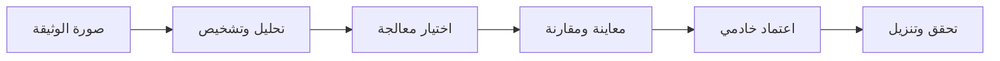
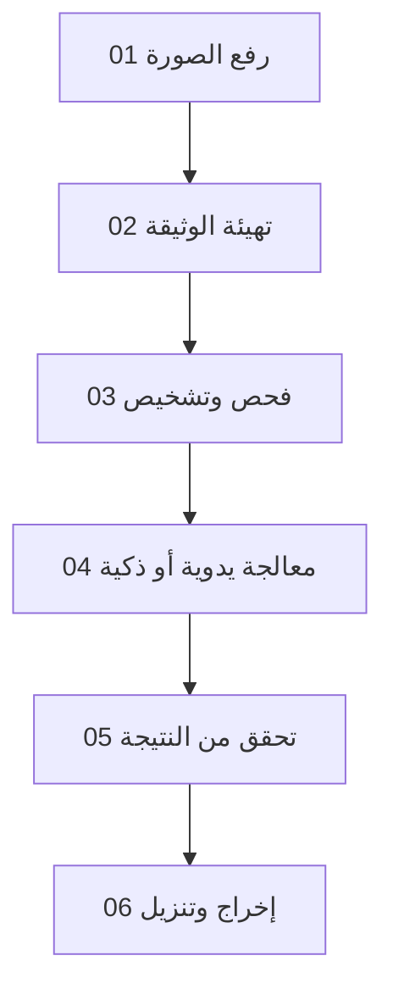
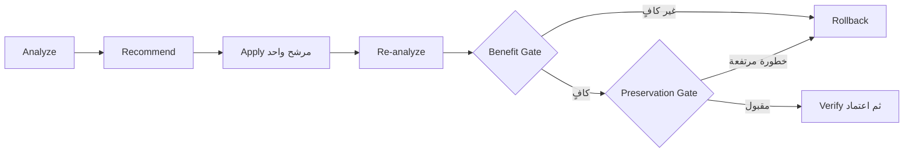

<div dir="rtl" align="right">

<div align="center">

# 📖 Manuscript Doctor

### نظرة عامة على المشروع

**نظام ويب عربي لتشخيص صور الوثائق ومعالجتها والتحقق من أثر المعالجة قبل اعتمادها**

</div>

<p align="center">
  
</p>

<p align="center">
  <strong>شخّص · عالج · حافظ · تحقّق</strong>
</p>

---

## 1. الفكرة الأساسية

**طبيب الوثائق (Manuscript Doctor)** ليس محرر صور يطبق مرشحاً واحداً ثم يعرض نتيجة نهائية. إنه مساحة معالجة قابلة للفحص، تبدأ من قراءة الحالة البصرية للصورة، ثم اختيار معالجة مناسبة، ثم مراجعة أثرها قبل حفظها وتنزيلها.

> **السؤال المركزي:** كيف نجعل الوثيقة أوضح مع تقليل احتمال فقد التفاصيل الأصلية؟



---

## 2. المشكلة والقيمة

قد تحتوي صورة الوثيقة على إضاءة غير متجانسة، أو تباين منخفض، أو ضوضاء، أو ميل هندسي، أو نص صغير، أو خلفية متدهورة. تحسين هذه الحالات قد يجعل الصورة أوضح، لكنه قد يسبب أيضاً تضخيم الضوضاء أو فقد الحواف أو اندماج تفاصيل متجاورة.

لذلك يضيف المشروع طبقة قرار ومراجعة فوق عمليات OpenCV التقليدية:

| بدلاً من | يعتمد المشروع على |
| --- | --- |
| تطبيق فلتر عشوائي | تشخيص مؤشرات الصورة أولاً |
| اعتماد أول نتيجة | معاينة before/after قبل الاعتماد |
| مساواة الوضوح بالجودة | قياس الفائدة ومراجعة المحافظة على التفاصيل |
| إجبار كل الصور على المسار نفسه | اختيار يدوي أو Smart Pipeline محافظ |
| إخفاء حدود الخوارزمية | عرض التحذير والقرار وقابلية التفسير |

---

## 3. تجربة المستخدم

<p align="center">
  
  &nbsp;&nbsp;&nbsp;
  
</p>

<p align="center">
  <sub>مثال بصري من مجموعة التقييم: صورة مائلة قبل المعالجة وبعد تصحيح الميل.</sub>
</p>

يمر الاستخدام الفعلي بالمراحل الآتية:



يستطيع المستخدم رؤية الصورة الأصلية والنتيجة الحالية داخل مساحة واحدة، وإضافة عمليات يدوية إلى سلسلة المعالجة، ثم استخدام **Undo/Redo** للتنقل بين الخطوات. لا تصبح المعاينة نتيجة نهائية إلا بعد الضغط على زر الاعتماد، حيث يعيد Flask/OpenCV تنفيذ العملية ويحفظ artifact حقيقياً.

---

## 4. ماذا يفحص النظام؟

يستخرج محرك التحليل مؤشرات بصرية قابلة للتفسير، ولا يتعامل معها كحكم مطلق على جودة الوثيقة:

| المؤشر | وظيفته |
| --- | --- |
| `Brightness` | تقدير السطوع العام |
| `Contrast` | تقدير انتشار درجات الإضاءة |
| `Sharpness` | قياس تقريبي لقوة الحواف |
| `Noise` | رصد التغيرات المحلية غير المنتظمة |
| `Illumination Variation` | قياس عدم تجانس الإضاءة |
| `Edge Density` | تقدير كثافة البنية الحافية |
| `Dynamic Range` | قراءة النطاق بين المناطق الداكنة والمضيئة |

تتحول هذه المؤشرات إلى تشخيصات وتوصيات، ثم تعرض الواجهة سبب المعالجة المقترحة ومستوى المحافظة المتوقع.

---

## 5. مسارا المعالجة

### المعالجة اليدوية

يختار المستخدم العملية والمعاملات، ثم يرى أثرها في نفس مساحة المحرر. العمليات الخفيفة مثل التدوير والقلب وضبط الشدة وتصحيح جاما تستخدم معاينة Canvas محلية لتقليل التأخير. العمليات الثقيلة تستخدم معاينة Flask مصغرة، ويمكن طلبها بصيغة JPEG لتقليل حجم النقل.

عند الاعتماد، تُرسل العملية والمعاملات إلى Flask/OpenCV، وتُضاف النتيجة إلى السلسلة مع تحديث before/after وسجل المعالجة. هذا الفصل يجعل التجربة سريعة، من دون التضحية بصحة النتيجة النهائية.

### المعالجة الذكية

يعمل **Smart Pipeline** وفق التسلسل:



لا يطبق المسار الذكي سلسلة ثابتة بصورة عمياء، ولا يُجبر كل صورة على القص أو تصحيح الميل. يُقبل **deskew-only** عندما يكون تصحيح الميل عالي الثقة ولا تكون حدود القص أو المنظور موثوقة؛ أما الصور منخفضة الثقة فتبقى ضمن قرار محافظ أو مؤجل.

---

## 6. التقنيات التي يطبقها المشروع

| المجال | أمثلة من العمليات |
| --- | --- |
| تجهيز الوثيقة | Deskew، تصحيح الميل والاقتصاص التلقائي، الاقتصاص اليدوي، التدوير والقلب |
| الإضاءة والتباين | Intensity، Gamma، CLAHE، Histogram Equalization، Illumination Normalization |
| إزالة الضوضاء | Median، Bilateral، Non-Local Means |
| التفاصيل | Sharpen وFaded Text Enhancement |
| فصل النص | Global Threshold، Otsu، Adaptive Threshold |
| البنية والخلفية | Opening، Closing، Top-Hat، Black-Hat، Background Suppression |
| تحسين الدقة | **Super Resolution** اختيارية بتكبير Lanczos وUnsharp Masking |

### Super Resolution

هي عملية يدوية مستقلة للنص الصغير أو الصورة منخفضة الدقة. تكبر الصورة بمعامل `2×` أو `3×`، ثم تحسن حواف الإضاءة بدرجة محافظة. لا تدخل تلقائياً في Smart Pipeline، ولا تضمن استعادة حروف فقدت تماماً بسبب الضبابية أو نقص المعلومات.

---

## 7. طبقة المحافظة على التفاصيل

يستخدم المشروع مفهومين متكاملين:

| المكوّن | دوره |
| --- | --- |
| `Preservation Profile` | تقدير مستوى الحذر المطلوب قبل المعالجة |
| `Preservation Verification` | فحص التغيرات بعد المعالجة ومراقبة المخاطر |

تبحث المراجعة عن مؤشرات مثل تغير الحواف، فقد التفاصيل الدقيقة، اندماج المكونات، تضخيم الضوضاء، أو اختلاف بنيوي واضح. لا تمثل هذه المؤشرات فهماً لغوياً للنص ولا ضماناً تاريخياً لحفظ كل حرف؛ إنها أدوات مساعدة لاتخاذ قرار أكثر حذراً.

---

## 8. حدود المشروع

| داخل النطاق | خارج النطاق الحالي |
| --- | --- |
| معالجة الصور باستخدام OpenCV وNumPy | OCR والتعرف على اللغة |
| تحليل بصري قابل للتفسير | YOLO وObject Detection |
| معالجة يدوية وسلسلة نتائج | تدريب نماذج Deep Learning |
| Smart Pipeline محافظ | Generative Restoration |
| مقارنة الأصل بالنتيجة | تخمين نص أو أجزاء مفقودة |
| واجهة عربية RTL متجاوبة | الحسابات وقاعدة البيانات وتسجيل الدخول |
| Super Resolution محافظة | اعتبار التكبير استعادة مؤكدة للمعلومات |

---

## 9. الفئة المستهدفة والنتيجة المتوقعة

صُمم النظام للطالب أو الباحث أو المستخدم الذي يريد تحسين صورة وثيقة عبر واجهة واضحة، من دون الحاجة إلى معرفة تفاصيل OpenCV. وفي الوقت نفسه يحتفظ المشروع بتقسيم تقني مناسب للمراجعة الأكاديمية، بحيث يمكن تتبع العلاقة بين القياس، والتشخيص، والمعالجة، والتحقق.

يُعد المسار ناجحاً عندما يستطيع المستخدم رفع صورة سليمة، فحصها، فهم مشكلتها، تجربة معالجة، مقارنة before/after، مراجعة التحذير أو قرار المحافظة، ثم تنزيل نتيجة حقيقية من دون تغيير الصورة الأصلية.

---

## 10. المبدأ النهائي

> **الاحتراف في معالجة الوثائق لا يعني جعل الصورة أكثر حدة بأي ثمن؛ بل يعني اختيار معالجة مبررة، تنفيذها بصورة صحيحة، ثم مراجعة أثرها قبل اعتمادها.**

```text
قياس صحيح
   ↓
تشخيص واضح
   ↓
معالجة مبررة
   ↓
معاينة قابلة للمراجعة
   ↓
اعتماد خادمي
   ↓
تحقق صادق من الحدود
```

للتفاصيل التنفيذية، راجع [README الرئيسي](README.md)، ثم [المعمارية](architecture.md)، و[مسار العمل](workflow.md)، و[استراتيجية الاختبار](testing.md)، و[تقييم العمليات](operation-evaluation.md).

</div>
