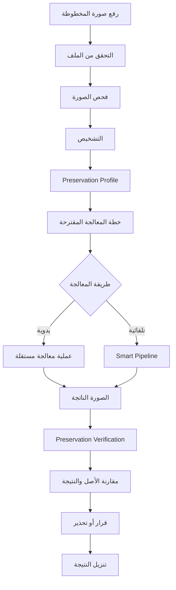

<div dir="rtl" align="right">

# 📖 Manuscript Doctor — نظرة عامة على المشروع

> **الغرض من الوثيقة:** تقديم تعريف واضح ومختصر للمشروع، المشكلة التي يعالجها، القيمة التي يقدمها، نطاق النسخة الأولى، وحدوده العامة.
> **الجمهور:** المشرف الأكاديمي، المطور، وأي قارئ يريد فهم المشروع قبل الدخول في التفاصيل التقنية.
> **هذه الوثيقة لا تحتوي تفاصيل العقود البرمجية أو الاختبارات أو القرارات الهندسية التفصيلية؛ لكل منها وثيقته الخاصة.**

---

## 🩺 1. ما هو Manuscript Doctor؟

**Manuscript Doctor** هو نظام ويب لتشخيص ومعالجة صور المخطوطات باستخدام تقنيات معالجة الصور التقليدية.

لا يقتصر دوره على تطبيق فلاتر أو تحسين الصورة بصريًا، بل يتبع مسارًا أكثر حذرًا:

1. يفحص الحالة البصرية للصورة.
2. يشخّص المشكلات التي يمكن استنتاجها من المؤشرات المستخدمة.
3. يقدّر مقدار الحذر المطلوب أثناء المعالجة.
4. يقترح معالجة مناسبة وقابلة للتفسير.
5. ينفذ المعالجة يدويًا أو من خلال مسار تلقائي.
6. يقارن النتيجة بالصورة الأصلية.
7. يتحقق من وجود مؤشرات على فقد أو تغير بنيوي في التفاصيل.
8. يعرض النتيجة للمستخدم مع تفسير واضح.

---

<div align="center">

### Diagnose → Treat → Preserve → Verify

**شخّص → عالج → حافظ → تحقّق**

</div>

---

## 🎯 2. المشكلة التي يعالجها المشروع

صور المخطوطات قد تعاني من مشكلات بصرية متعددة، مثل:

* انخفاض التباين.
* ضعف الإضاءة.
* عدم تجانس الإضاءة.
* الضوضاء.
* الحبر الباهت.
* ضعف وضوح التفاصيل.
* خلفيات متدهورة أو غير متجانسة.

معالجة هذه المشكلات قد تحسن وضوح الصورة، لكنها قد تسبب في الوقت نفسه آثارًا جانبية غير مرغوبة، مثل:

* اختفاء خطوط رفيعة.
* انقطاع أجزاء من التفاصيل.
* اندماج مكونات متجاورة.
* فقد علامات صغيرة.
* تضخيم الضوضاء.
* تغيير واضح في البنية الأصلية للصورة.

لذلك لا تكمن المشكلة في:

> **كيف نحسّن صورة المخطوطة؟**

فقط، بل في:

> **كيف نحسّن صورة المخطوطة بناءً على حالتها، مع تقليل خطر فقد التفاصيل الأصلية ومراقبة أثر المعالجة قبل اعتماد النتيجة؟**

---

## 💡 3. القيمة الأساسية

القيمة الأساسية للمشروع ليست توفير عدد كبير من الفلاتر.

بل بناء **دورة معالجة واعية بالحالة وقابلة للتفسير**.

```text
الصورة الأصلية
      ↓
فحص الحالة البصرية
      ↓
تشخيص المشكلات
      ↓
تقدير حساسية التفاصيل
      ↓
اقتراح خطة المعالجة
      ↓
تنفيذ المعالجة
      ↓
فحص المحافظة على التفاصيل
      ↓
تقييم النتيجة
      ↓
مقارنة الأصل بالنتيجة
      ↓
تنزيل النتيجة
```

بهذا يتحول Manuscript Doctor من:

**Image Editor**

إلى:

**Decision-Support Image Processing System**

متخصص في صور المخطوطات.

---

## 🔍 4. ماذا يفعل النظام؟

يتكون السلوك الأساسي للنظام من أربع وظائف رئيسية:

| الوظيفة                               | الغرض                                                        |
| ------------------------------------- | ------------------------------------------------------------ |
| **Diagnosis Engine**                  | فحص الصورة واستخراج مؤشرات بصرية ثم تكوين تشخيص قابل للتفسير |
| **Adaptive Recommendation Engine**    | اقتراح معالجة مناسبة اعتمادًا على حالة الصورة                |
| **Preservation-Aware Smart Pipeline** | تنفيذ معالجة تلقائية تراعي حالة الصورة وحساسيتها             |
| **Preservation Verification**         | مقارنة الأصل بالنتيجة والبحث عن مؤشرات على تغير أو فقد بنيوي |

---

## 🧭 5. المسار الأساسي للمستخدم



المسار المختصر:

**Upload → Validate → Examine → Diagnose → Recommend → Treat → Preserve → Verify → Compare → Download**

---

## 🧪 6. الفحص والتشخيص

قبل تطبيق أي معالجة، يقوم النظام بفحص الصورة الأصلية.

قد يشمل الفحص مؤشرات مثل:

| المؤشر                     | ما الذي يصفه؟                              |
| -------------------------- | ------------------------------------------ |
| **Brightness**             | مستوى السطوع العام                         |
| **Contrast**               | مقدار انتشار درجات الإضاءة                 |
| **Dynamic Range**          | النطاق الفعلي بين المناطق الداكنة والمضيئة |
| **Sharpness**              | مؤشر تقريبي لقوة الحواف والتفاصيل          |
| **Noise**                  | مؤشر تقريبي للتغيرات المحلية غير المنتظمة  |
| **Illumination Variation** | مقدار عدم تجانس الإضاءة عبر الصورة         |
| **Edge Density**           | كثافة الحواف المكتشفة داخل الصورة          |

هذه المؤشرات لا تعتبر أحكامًا مطلقة على جودة المخطوطة، وإنما تستخدم كأساس للتشخيص واتخاذ القرار.

---

## 🛡️ 7. Preservation Profile

قبل المعالجة يمكن للنظام تكوين:

**Preservation Profile**

وهو تقدير تقريبي لمقدار الحذر المطلوب أثناء معالجة الصورة.

قد تكون الحالة مثلًا:

* `Low`
* `Moderate`
* `High`

ويعتمد ذلك على مؤشرات الصورة نفسها.

الغرض منه ليس القول إن أجزاء محددة من النص ستفقد، بل مساعدة النظام على تجنب معالجة قوية عندما تظهر الصورة حساسية مرتفعة نسبيًا.

---

## 🧰 8. طرق المعالجة

يوفر المشروع مسارين رئيسيين.

### 8.1 المعالجة اليدوية

يختار المستخدم عملية واحدة محددة ويشاهد أثرها على الصورة.

كل عملية يدوية تبدأ من **الصورة الأصلية**، وليس من نتيجة العملية السابقة.

هذا يحافظ على وضوح التجربة ويمنع تراكم تغييرات غير مقصودة.

---

### 8.2 المعالجة التلقائية

تستخدم:

**Preservation-Aware Smart Pipeline**

وهي سلسلة معالجة يتم اختيار خطواتها وفق حالة الصورة وقواعد واضحة.

المعالجة التلقائية:

* ليست نموذج تعلم آلي.
* ليست ذكاءً اصطناعيًا.
* لا تعمل كسلسلة ثابتة بصورة عمياء.
* تعتمد على قواعد قابلة للتفسير.

---

## 🔎 9. Preservation Verification

بعد تطبيق المعالجة لا يعتمد النظام النتيجة مباشرة.

بل يقارن:

```text
Original
   +
Processed Result
   ↓
Preservation Verification
```

ويبحث عن مؤشرات على تغيرات بنيوية مثل:

* فقد تفاصيل دقيقة.
* تغير الحواف.
* تفتت مكونات.
* اندماج مكونات.
* تغيرات قد تشير إلى معالجة قوية.

ثم يعرض تقييمًا مساعدًا مثل:

* **Acceptable**
* **Caution**
* **High Risk**

هذه الحالات ليست أحكامًا علمية مطلقة، بل مؤشرات مساعدة مبنية على المقاييس المستخدمة.

---

## 👤 10. المستخدم المستهدف

المشروع موجه إلى أي مستخدم يحتاج إلى فحص وتحسين صورة رقمية لمخطوطة من خلال واجهة ويب واضحة.

لا يشترط في المستخدم:

* معرفة OpenCV.
* معرفة البرمجة.
* فهم الخوارزميات الداخلية.
* معرفة كيفية اختيار كل عملية يدويًا.

الهدف أن يستطيع المستخدم فهم:

> **ما المشكلة في الصورة؟ ما المعالجة المقترحة؟ لماذا؟ وما أثر المعالجة على التفاصيل؟**

---

## 🎯 11. أهداف المشروع

|  #  | الهدف                                                |
| :-: | ---------------------------------------------------- |
|  1  | تمكين المستخدم من رفع صورة مخطوطة والتحقق منها بأمان |
|  2  | الحفاظ على الصورة الأصلية دون الكتابة فوقها          |
|  3  | استخراج مؤشرات بصرية أساسية من الصورة                |
|  4  | تقديم تشخيص قابل للتفسير                             |
|  5  | تكوين Preservation Profile قبل المعالجة              |
|  6  | توفير عمليات معالجة مستقلة                           |
|  7  | اقتراح معالجة مناسبة اعتمادًا على التشخيص            |
|  8  | توفير Smart Pipeline واعية بالحالة                   |
|  9  | تقييم أثر المعالجة على التفاصيل الأصلية              |
|  10 | عرض الأصل والنتيجة للمقارنة                          |
|  11 | توضيح سبب المعالجة ونتيجة التحقق                     |
|  12 | السماح بتنزيل الصورة الناتجة                         |
|  13 | الحفاظ على بنية برمجية واضحة وقابلة للاختبار         |
|  14 | توثيق حدود النظام وعدم تقديم ادعاءات غير مقاسة       |

---

## 📦 12. نطاق النسخة الأولى — MVP

### ✅ يشمل

* تطبيق ويب محلي.
* رفع صور المخطوطات.
* التحقق من نوع الملف وحجمه وقابليته للقراءة.
* حفظ الصورة الأصلية دون إعادة ترميز أو استبدال.
* تحليل الخصائص البصرية الأساسية.
* Diagnosis Engine.
* Preservation Profile.
* عمليات معالجة يدوية مستقلة.
* Recommendation Engine مبني على قواعد واضحة.
* Preservation-Aware Smart Pipeline.
* Preservation Verification.
* مقارنة الصورة الأصلية بالنتيجة.
* عرض تقييم أو تحذير بعد المعالجة.
* تنزيل الصورة الناتجة.
* واجهة عربية متجاوبة.
* إدارة الملفات كملفات Runtime مؤقتة.
* رسائل خطأ مفهومة.

---

### ❌ لا يشمل

`OCR` · `YOLO` · `Object Detection` · `Segmentation` · `Deep Learning` · `تدريب نماذج` · `التعرف على اللغة` · `التعرف على الخط` · `استعادة نص مفقود` · `Generative Restoration` · `حسابات مستخدمين` · `تسجيل دخول` · `قاعدة بيانات` · `تخزين دائم` · `تطبيق جوال` · `Public API` · `Batch Processing` · `معالجة سحابية`

يمكن دراسة أي من هذه الميزات مستقبلًا بعد استقرار النسخة الأساسية، بشرط ألا تغير فلسفة المشروع الأساسية.

---

## 🧱 13. الحدود العلمية للنظام

يجب تفسير نتائج Manuscript Doctor ضمن حدود واضحة:

|  #  | الحد                                                                         |
| :-: | ---------------------------------------------------------------------------- |
|  1  | النظام يعالج الصورة الرقمية، ولا يعيد بناء الحالة التاريخية الأصلية للمخطوطة |
|  2  | تحسن الوضوح البصري لا يعني بالضرورة أن جميع التفاصيل الأصلية أصبحت محفوظة    |
|  3  | لا توجد عملية معالجة واحدة مناسبة لجميع المخطوطات                            |
|  4  | التشخيصات مبنية على مؤشرات وعتبات قابلة للمراجعة                             |
|  5  | Preservation Profile تقدير قبل المعالجة، وليس ضمانًا للحماية                 |
|  6  | Preservation Verification يبحث عن مؤشرات بنيوية ولا يفهم المعنى اللغوي للنص  |
|  7  | تغير Pixel أو حافة لا يعني تلقائيًا فقد حرف أو معلومة تاريخية                |
|  8  | أي Score أو Assessment يعرض كمؤشر مساعد، وليس حقيقة مطلقة                    |

---

## ⚙️ 14. التقنية الأساسية

| الطبقة               | التقنية                 |
| -------------------- | ----------------------- |
| **Backend**          | Python + Flask          |
| **Image Processing** | OpenCV + NumPy          |
| **Frontend**         | HTML + CSS + JavaScript |
| **Testing**          | pytest                  |
| **Version Control**  | Git + GitHub            |

يبدأ المشروع كتطبيق محلي.

النشر الخارجي ليس جزءًا أساسيًا من الـMVP.

---

## 🧠 15. المبادئ الهندسية الأساسية

يعتمد المشروع على مجموعة مبادئ ثابتة:

* **Backend هو مصدر الحقيقة** للمقاييس والتشخيص والتوصيات ونتائج التقييم.
* الصورة الأصلية تبقى **Immutable** ولا يتم الكتابة فوقها.
* كل عملية يدوية تبدأ من الأصل.
* Smart Pipeline هي الحالة الوحيدة التي تنفذ سلسلة عمليات مقصودة.
* الواجهة لا ترسل مسارات ملفات إلى Backend.
* أسماء الملفات الداخلية يولدها الخادم.
* تحليل الصورة منفصل عن توصية المعالجة.
* تنفيذ المعالجة منفصل عن تقييمها.
* Preservation Verification منفصلة عن Diagnosis.
* لا تستخدم تعقيدات إضافية دون حاجة حقيقية.

---

## ✅ 16. معيار نجاح الـMVP

لا يعتبر المشروع ناجحًا بسبب:

* عدد الفلاتر.
* جمال الواجهة فقط.
* كثرة الملفات.
* عدد المكتبات.
* وجود مصطلحات تقنية كثيرة.

يعتبر الـMVP ناجحًا عندما يستطيع المستخدم تنفيذ السيناريو التالي على مجموعة متنوعة من صور الاختبار:

|  #  | السيناريو                                    |
| :-: | -------------------------------------------- |
|  1  | تشغيل التطبيق بنجاح                          |
|  2  | رفع صورة مدعومة                              |
|  3  | رفض ملف غير صالح بطريقة مفهومة               |
|  4  | فحص الصورة الأصلية                           |
|  5  | عرض التشخيص                                  |
|  6  | عرض Preservation Profile                     |
|  7  | مشاهدة المعالجة المقترحة وسببها              |
|  8  | تطبيق معالجة يدوية                           |
|  9  | تشغيل Smart Pipeline                         |
|  10 | إجراء Preservation Verification بعد المعالجة |
|  11 | عرض Assessment أو Warning واضح               |
|  12 | مقارنة الأصل بالنتيجة                        |
|  13 | التأكد أن الأصل لم يتغير                     |
|  14 | تنزيل النتيجة                                |
|  15 | تنفيذ المسار السابق دون انهيار التطبيق       |

> **شرط أساسي:** يجب اختبار السيناريو على صور مختلفة، وليس على صورة واحدة تم اختيارها لتناسب الخوارزميات.

---

## 🚧 17. التطويرات الاختيارية ذات القيمة

بعد استقرار الوظائف الأساسية يمكن دراسة:

| الميزة                     | الغرض                                          |
| -------------------------- | ---------------------------------------------- |
| **Lost Detail Map**        | إظهار مناطق التغير البنيوي المحتملة بصريًا     |
| **Treatment Report**       | إنشاء تقرير منظم لما تم اكتشافه وتطبيقه        |
| **Treatment Comparison**   | مقارنة أكثر من نتيجة معالجة                    |
| **Candidate Selection**    | تجربة أكثر من إعداد واختيار نتيجة أكثر توازنًا |
| **Regional Preservation**  | تقدير حساسية مناطق مختلفة من الصورة            |
| **Region-Aware Treatment** | استخدام معالجة مختلفة حسب المنطقة              |

هذه الميزات ليست شرطًا لإغلاق الـMVP الأساسي.

---

## 🧭 18. هوية المشروع

<div align="center">

### Manuscript Doctor

**ليس الهدف أن تصبح الصورة أوضح فقط.**

**الهدف أن تصبح أوضح دون التضحية بالتفاصيل التي نحاول الحفاظ عليها.**

<br>

### Diagnose → Treat → Preserve → Verify

</div>

---

## 📌 19. المبدأ النهائي

> **الاحتراف في Manuscript Doctor لا يعني كثرة الخوارزميات؛ بل يعني اختيار معالجة مبررة، تنفيذها بصورة صحيحة، ثم التحقق من أثرها.**

الأولوية دائمًا:

```text
صحة القياس
    ↓
وضوح التشخيص
    ↓
اختيار معالجة مبررة
    ↓
تنفيذ محافظ
    ↓
التحقق من النتيجة
    ↓
اختبارات واقعية
    ↓
تفسير صادق للحدود
```

**أي إضافة مستقبلية يجب أن تدعم هذه الفلسفة، لا أن تغيرها.**

</div>
