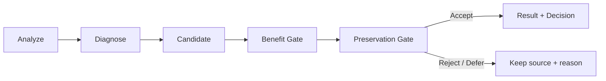
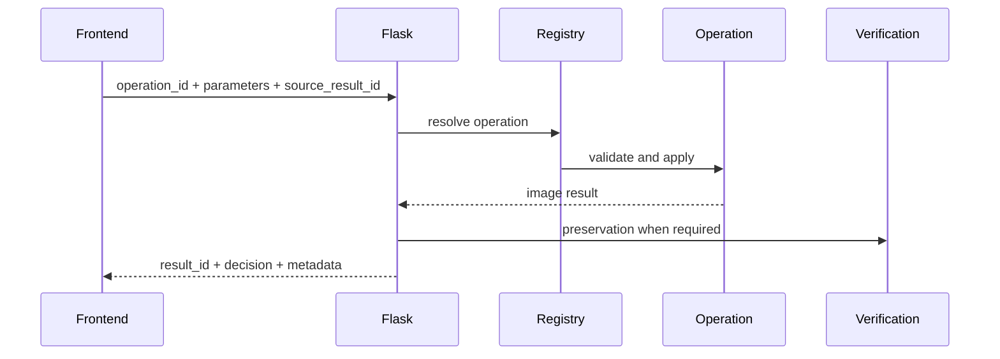
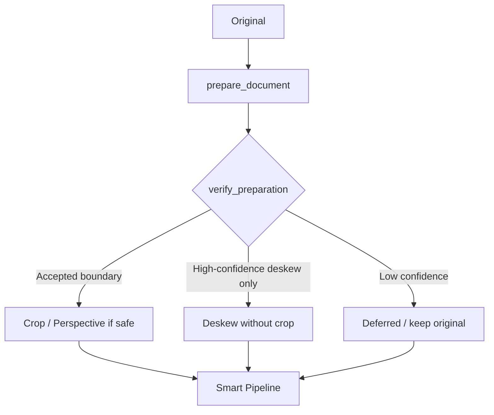
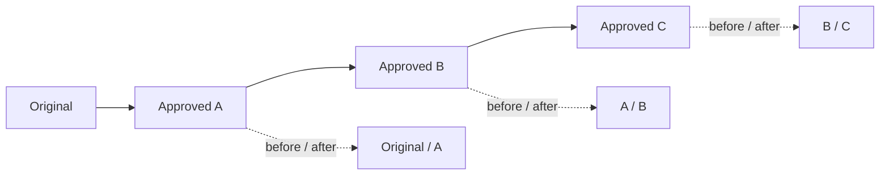
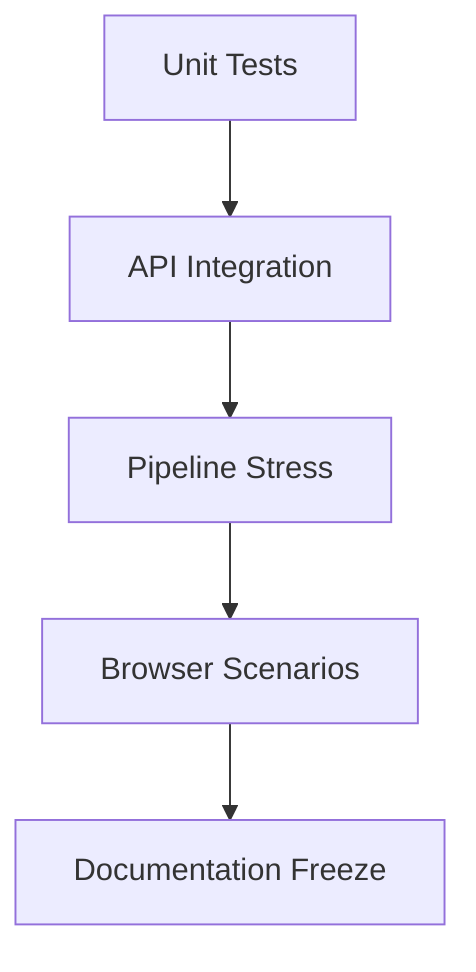

<div dir="rtl" align="right">

# 🧪 Manuscript Doctor — تقرير التكامل النهائي

**المرحلة:** Phase C — Smart Pipeline + Cross-Layer Integration + E2E Validation

**حالة التقرير:** إصدار متوافق مع النسخة الحالية

**المبدأ:** Diagnose → Treat → Preserve → Verify

> هذا التقرير يلخص ما تم تنفيذه والتحقق منه فعلياً. لا يحول الاختبار المحدود إلى ادعاء تعميم، ولا يصف المزايا المؤجلة كأنها منفذة.

---

## 1. الحكم التنفيذي



| البند | الحالة الحالية |
| --- | --- |
| Regression Python | `333 passed, 16 skipped` |
| JavaScript syntax | ناجح لجميع ملفات `static/js/parts/*.js` |
| Smart Pipeline | Rule-Based، مرشح مقبول واحد في الجولة |
| Manual Chain | تعمل عبر النتائج المعتمدة ومصدرها الحالي |
| Local Preview | للعمليات الخفيفة دون طلب `/preview` |
| JPEG Preview | اختياري للمعاينة الخادمية، وPNG افتراضي للتوافق |
| Crop | مقابض يدوية، هامش ابتدائي 5%، واعتماد خادمي |
| Super Resolution | يدوية فقط، Lanczos + Unsharp Masking محافظ |
| Header | صورة كاملة كخلفية Header فقط |
| النتيجة | **READY WITH KNOWN LIMITATIONS** |

---

## 2. نطاق التكامل

تمت مراجعة التكامل بين الطبقات الآتية:

```text
HTML / CSS / JavaScript
        ↓
State + Events + Preview
        ↓
Flask API
        ↓
Registry + Processing Operations
        ↓
Analyzer + Recommender + Pipeline
        ↓
Preservation + Storage + Download
```

يشمل التقرير المسارات اليدوية والذكية، لكنه لا يدعي أن العمليات التلقائية مناسبة لكل صورة أو أن Super Resolution نموذج Deep Learning.

---

## 3. تدقيق Registry والسياسة

تحتوي `processing/ops/registry.py` على 26 عملية مسجلة. وتفصل `processing/pipeline.py` بينها حسب سياستي `AUTO_ELIGIBLE_OPERATIONS` و`MANUAL_ONLY_OPERATIONS`:

| المجموعة | العدد | العمليات أو القاعدة |
| --- | ---: | --- |
| Auto Eligible | 5 | `clahe`, `gamma_correct`, `illumination_normalize`, `median_denoise`, `sharpen` |
| Manual Only | 20 | Thresholding وMorphology وBackground وGeometry وDenoising المتقدم وSuper Resolution وغيرها |
| Binarization Path | 1 | `adaptive_threshold` كمرشح ثنائي مستقل |
| الحد التلقائي | 1 | `MAX_ACCEPTED_STEPS = 1` لكل جولة |
| حد المحاولات | 4 | `MAX_ATTEMPTS_PER_RUN = 4` قبل `review_required` |

وجود العملية في Registry لا يعني أنها تدخل Smart Pipeline؛ التسجيل يعرّف العملية، بينما whitelist وBenefit Gate يقرران أهلية التشغيل التلقائي.

---

## 4. تدقيق المعاملات والعقود



تم تثبيت القواعد الآتية:

| القاعدة | النتيجة |
| --- | --- |
| اسم العملية | يطابق `operation_id` المسجل |
| اسم المعامل | يطابق وسيط دالة العملية |
| المصدر اليدوي | Original للخطوة الأولى، ثم `source_result_id` للخطوة اللاحقة |
| Preview | مرشح مؤقت، وليس Result نهائية |
| Approve | ينشئ Result محفوظة عبر Flask/OpenCV |
| الأصل | لا يكتب فوقه |
| معرفات الموارد | `image_id` و`result_id` بدلاً من مسارات ملفات |

---

## 5. Smart Pipeline وBenefit Gate

المسار التلقائي الحالي هو:

```text
Original
  ↓
Diagnosis + Recommendation
  ↓
Select one eligible candidate
  ↓
Apply
  ↓
Re-analyze for benefit
  ↓
Benefit Gate
  ↓
Preservation Gate
  ↓
Accept and stop OR Rollback
```

| العملية | بوابة المنفعة الحالية |
| --- | --- |
| `gamma_correct` | تقليل المسافة عن نطاق Brightness المقبول بمقدار لا يقل عن 1.0 |
| `clahe` | زيادة Contrast بمقدار لا يقل عن 1.0 |
| `sharpen` | زيادة Sharpness بنسبة لا تقل عن 2% من خط الأساس |
| `median_denoise` | خفض Noise residual بمقدار لا يقل عن 0.5 |
| `illumination_normalize` | خفض Illumination Variation بمقدار لا يقل عن 0.01 |

لا يقبل Smart خطوة لمجرد أن Preservation لم يرفضها؛ يجب أن تثبت العملية منفعة مرتبطة بهدفها.

---

## 6. Preparation وdeskew-only



| الحالة | القرار الفعلي |
| --- | --- |
| Boundary موثوقة | يمكن استخدام تجهيز الوثيقة بعد التحقق |
| C05 | قبول `deskew-only` بثقة تقارب `0.8683`، مع الحفاظ على الإطار وعدم تطبيق Crop أو Perspective غير موثوق |
| C06 | لا يفرض deskew-only عند انخفاض الثقة أو عدم وجود تطبيق آمن |
| Boundary غير موثوقة | لا تتحول تلقائياً إلى Crop قسري |

هذه السياسة تفصل بين فشل اكتشاف الحدود وفشل تصحيح الميل، وتمنع فقد أجزاء الوثيقة بسبب قرار هندسي غير مؤكد.

---

## 7. المسار اليدوي وManual Chain



تمت معالجة الخلل السابق الذي كان يجعل before متأخرة خطوة، وأصبح `syncManualChainSelection` هو نقطة تحديث العرض الأساسية، ويحدد `manualActiveIndex` الخطوة المعروضة.

| الاختبار | النتيجة الحالية |
| --- | --- |
| الخطوة الأولى | before = Original، after = Result A |
| الخطوة الثانية | before = Result A، after = Result B |
| مصدر الخطوة | `source_result_id` للنتيجة المعتمدة السابقة |
| Undo | تغيير المؤشر وعرض الكاش دون إعادة تنفيذ غير لازم |
| Redo | إعادة عرض النتيجة اللاحقة بصرياً |
| اعتماد بعد Undo | يبدأ فرعاً نشطاً واضحاً ويزيل المسار اللاحق |

---

## 8. Performance وPreview

تم الفصل بين سرعة التفاعل وصحة النتيجة النهائية:

| المسار | القياس أو السلوك المثبت |
| --- | --- |
| Rotate محلي على C05 | نحو `121 ms` كمرشح Canvas، وبدون طلب `/preview` |
| Intensity محلي على C05 | نحو `81 ms` كمرشح Canvas، وبدون طلب `/preview` |
| اعتماد متفائل | عرض محلي أولي قبل اكتمال الحفظ النهائي |
| CLAHE Preview عبر JPEG | نحو `202 KB` وزمن Resource Timing يقارب `107 ms` في الاختبار المحلي |
| PNG Preview السابق | كان أكبر تقريباً، في نطاق `1.4–1.7 MB` للحالة المقارنة |
| Smart Pipeline | خادمي ودقيق؛ زمنه يتضمن Preparation والتحليل والتحقق، وليس لحظياً |

الـCanvas يسرع المعاينة فقط. أما Approve وDownload وPreservation فتظل خادمية حتى تكون النتيجة Artifact حقيقية قابلة للتحقق.

---

## 9. Super Resolution

تعمل `super_resolution` كعملية يدوية مستقلة في `processing/ops/super_resolution.py`:

```text
Validate scale and parameters
        ↓
Lanczos upscale
        ↓
Luminance Unsharp Masking
        ↓
Save approved result
        ↓
Preservation Verification
```

| البند | القرار |
| --- | --- |
| Scale المرجعي | `2×` |
| Scale الإضافي | `3×` عند بقاء الناتج ضمن حدود الحجم |
| المعاملات | `amount=0.35`, `sigma=1.0` افتراضياً |
| Smart Pipeline | مستبعدة من التشغيل التلقائي |
| نوع التنفيذ | خادمي عند Preview وApprove |
| اختبار C05 | من `960×1280` إلى `1920×2560` عند اعتماد 2× |
| الحد العلمي | لا تستعيد الحروف أو المعلومات التي فقدت بالكامل |

لا يصف التقرير هذه العملية بأنها Real-ESRGAN أو EDSR؛ النماذج العميقة خيار مؤجل يحتاج أوزاناً وتقييماً منفصلين.

---

## 10. Crop وGeometry

تم اختبار الاقتصاص بمبدأ فصل المسودة عن الاعتماد:

```text
Crop Guide on displayed image
        ↓
Map display coordinates to source coordinates
        ↓
Clamp x / y / width / height
        ↓
Approve through Flask/OpenCV
        ↓
Compare output dimensions with crop parameters
```

النتيجة الحالية:

- يبدأ الإطار بهامش 5% تقريباً، فلا تختفي المقابض عند حواف الصورة.
- تغيير المقبض يغير `x` و`y` و`width` و`height` فعلياً.
- الاعتماد لا يكتفي بالمسودة المحلية؛ ينشئ نتيجة خادمية.
- أبعاد النتيجة تطابق قيم Crop المعتمدة بعد التحويل إلى إحداثيات المصدر.

---

## 11. Frontend وHeader

تم التحقق من العناصر التالية:

| العنصر | النتيجة |
| --- | --- |
| Header | الصورة المرفقة خلفية Header كاملة فقط |
| Hero visual | أزيل العنصر المستقل لمنع التكرار |
| Manual Chart | داخل لوحة العملية الحالية |
| زر التنفيذ القديم | غير موجود؛ الاعتماد هو المسار الوحيد |
| Dashboard | رسم خطي لتوازن الظلال والإضاءات |
| Responsive | عناصر المعاينة والأزرار قابلة للاستخدام على العرض الضيق |
| Start Over | يصفر الصورة والسلسلة والتحليل والنتائج |

---

## 12. نتائج الاختبار



| النوع | النتيجة |
| --- | --- |
| Python Regression | `333 passed, 16 skipped` |
| JavaScript syntax | Passed |
| C05 Smart | Preparation accepted كـdeskew-only عالي الثقة |
| C05 Super Resolution | Preview وApprove وأبعاد 2× موثقة |
| C06 Manual Chain | خطوتان مع before/after صحيحين |
| C06 Undo/Redo | تم التحقق من العرض من الكاش |
| C06 Crop | سحب المقبض والاعتماد وأبعاد النتيجة صحيحة |
| Header | تم التحقق من الخلفية الكاملة وعدم وجود Hero مكرر |

---

## 13. ما تم إصلاحه مقابل النسخ القديمة

| المشكلة القديمة | الإصلاح الحالي |
| --- | --- |
| before متأخرة خطوة | مزامنة مركزية عبر `syncManualChainSelection` |
| إرسال كل عملية خفيفة إلى الخادم | Canvas Preview للعمليات المناسبة |
| حجم PNG كبير للمعاينة | JPEG اختياري عبر `X-Preview-Format: jpeg` |
| زر تنفيذ مكرر | اعتماد واحد وإضافة للسلسلة |
| Crop ملاصق للحواف | هامش ابتدائي 5% ومقابض قابلة للسحب |
| Smart يفشل عند عدم وجود Crop آمن | سياسة deskew-only عالية الثقة |
| صورة المقدمة مقصوصة أو مكررة | خلفية Header فقط دون عنصر Hero مستقل |
| الرسم غير المرغوب لتوازن الإضاءة | منحنى خطي كما في التصميم السابق |
| Super Resolution غير موثقة | عملية مستقلة بمعاملات وحدود واختبار |
| رقم اختبارات قديم | تثبيت خط الأساس الحالي `333 passed, 16 skipped` |

---

## 14. القيود المتبقية

1. لا يثبت التقييم أن المؤشرات تفهم معنى النص أو تقيس نسبة الحروف المحفوظة.
2. Super Resolution المحافظة تحسن العرض أحياناً، لكنها لا تستعيد معلومة مفقودة بالكامل.
3. Smart Pipeline خادمي، لذلك لا ينبغي وصفه بأنه لحظي.
4. قبول deskew-only مشروط بالثقة؛ لا يبرر قصاً أو Perspective عند حدود غير موثوقة.
5. Bleed-through Removal مخصص غير منفذ.
6. Thresholds وPreservation Heuristics قابلة للمعايرة على مجموعة أوسع.
7. لا توجد Queue أو Workers؛ زمن Smart يعكس الحساب الفعلي في Flask/OpenCV.
8. التقييم الحالي لا يمثل كل أنواع الوثائق والمخطوطات.

---

## 15. قرار المرحلة

```text
READY WITH KNOWN LIMITATIONS
```

تستوفي النسخة الحالية الشروط الوظيفية والمعمارية الأساسية: الأصل محمي، العمليات مسجلة، المعاينة منفصلة عن الاعتماد، السلسلة قابلة للتتبع، Smart Pipeline محافظ، ونتائج الاختبار موثقة. تبقى القيود السابقة معلنة ولا تُخفى خلف عبارات مثل «دقة مضمونة» أو «استعادة كاملة للنص».

</div>
