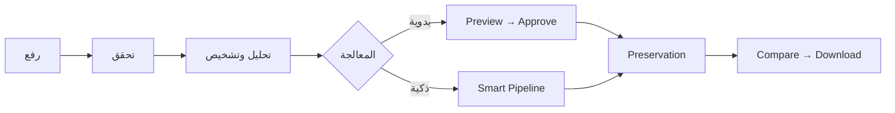
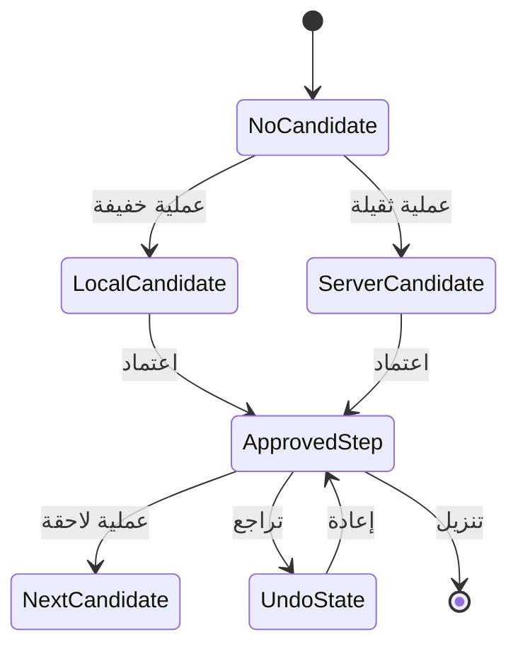

<div dir="rtl" align="right">

# 📋 Manuscript Doctor — متطلبات النظام

> **الغرض:** تحديد ما يجب أن يفعله الإصدار الحالي، وكيف نتحقق من كل متطلب، وما الذي يبقى خارج النطاق.
>
> هذه الوثيقة تصف **المتطلبات والسلوك المتوقع**. تفاصيل التنفيذ في [`architecture.md`](architecture.md)، ومسار المستخدم في [`workflow.md`](workflow.md)، وقرارات الاختيار في [`decisions.md`](decisions.md).

---

## 1. تعريف النظام

**طبيب الوثائق (Manuscript Doctor)** تطبيق ويب عربي RTL لمعالجة صور الوثائق والمخطوطات. يفحص الصورة، يعرض مؤشرات بصرية، يتيح معالجة يدوية أو ذكية، ثم يعرض النتيجة والتحذير قبل الاعتماد والتنزيل.



### حالات المتطلب

| الحالة | المعنى |
| --- | --- |
| `Implemented` | منفذ في الكود ومغطى باختبار أو دليل موثق |
| `Implemented with limitation` | منفذ، لكن له حد علمي أو تشغيلي معلن |
| `Manual only` | متاح للمستخدم ولا يدخل تلقائياً في Smart Pipeline |
| `Future` | مقترح لاحق وليس جزءاً من الإصدار الحالي |

---

## 2. المتطلبات الوظيفية

### 2.1 الرفع والتحقق

| المعرف | المتطلب | معيار القبول | الحالة |
| --- | --- | --- | --- |
| `FR-01` | فتح التطبيق دون تسجيل دخول | تظهر صفحة العمل من `/` دون خطأ | Implemented |
| `FR-02` | رفع JPG أو JPEG أو PNG | يقبل `/api/images` الملف المدعوم | Implemented |
| `FR-03` | رفض الطلب الذي لا يحتوي ملفاً | يعاد `NO_FILE` برسالة مفهومة | Implemented |
| `FR-04` | رفض الاسم الفارغ أو الامتداد غير المسموح | يعاد خطأ مضبوط دون انهيار | Implemented |
| `FR-05` | التحقق من أن الملف صورة فعلية | يفشل الملف التالف حتى لو كان امتداده صحيحاً | Implemented |
| `FR-06` | تطبيق حدود الحجم والبكسلات | يرفض الطلب الذي يتجاوز `20 MB` أو `30,000,000` بكسل | Implemented |
| `FR-07` | إنشاء هوية للخدمة | يحصل الرفع الناجح على `image_id` مولد خادمياً | Implemented |
| `FR-08` | حفظ الأصل | تحفظ البايتات الأصلية في `storage/uploads/` دون الكتابة فوقها | Implemented |
| `FR-09` | عرض الأصل بالهوية | يعرض `/api/images/<image_id>` دون كشف مسار الملف | Implemented |

### 2.2 الفحص والتشخيص

| المعرف | المتطلب | معيار القبول | الحالة |
| --- | --- | --- | --- |
| `FR-10` | تحليل الصورة بعد نجاح الرفع | تعاد الأبعاد والقنوات والمؤشرات الأساسية | Implemented |
| `FR-11` | دعم Grayscale وBGR وBGRA | يحلل `analyzer.py` الأنواع المدعومة دون كسر الأصل | Implemented |
| `FR-12` | حساب Brightness وContrast | يعاد كل مؤشر بقيمة قابلة للعرض | Implemented |
| `FR-13` | حساب Dynamic Range وSharpness وNoise | تظهر المؤشرات في بنية التحليل | Implemented |
| `FR-14` | حساب Illumination Variation وEdge Density | تستخدم النتائج في التشخيص عند توفرها | Implemented |
| `FR-15` | فصل القياس عن التشخيص | يمكن تعديل قاعدة التشخيص دون تغيير دالة القياس | Implemented |
| `FR-16` | عرض تشخيص قابل للتفسير | يحتوي التشخيص على `code` و`label` و`severity` و`message` | Implemented |
| `FR-17` | إنشاء Preservation Profile | يعاد مستوى `low` أو `moderate` أو `high` مع أسباب | Implemented with limitation |

### 2.3 التوصيات

| المعرف | المتطلب | معيار القبول | الحالة |
| --- | --- | --- | --- |
| `FR-18` | إنشاء توصية من نتائج التحليل | ترتبط التوصية بمؤشر أو تشخيص فعلي | Implemented |
| `FR-19` | تفسير سبب التوصية | يحتوي كل اقتراح على `reason` واضح | Implemented |
| `FR-20` | استخدام `operation_id` ثابت | لا ترسل الواجهة اسم دالة Python | Implemented |
| `FR-21` | مراعاة المخاطر | لا تُعامل `manual_only` و`reject` كعمليات تلقائية | Implemented |
| `FR-22` | عدم تقديم معالجة عند غياب مشكلة واضحة | يسمح المسار الذكي بحالة `no_treatment` | Implemented with limitation |

---

## 3. عمليات معالجة الصور

### 3.1 العمليات المنفذة

| المجموعة | المعرفات الحالية | الوضع |
| --- | --- | --- |
| الهندسة | `crop`، `deskew`، `rotate_right`، `rotate_left`، `flip_horizontal`، `flip_vertical` | Manual، وبعض تجهيز الوثيقة عبر Smart |
| التباين | `clahe`، `histogram_equalization`، `faded_text_enhance` | Manual، وقد يؤهل بعضها وفق السياسة |
| الإضاءة | `intensity_adjust`، `gamma_correct`، `illumination_normalize` | Manual |
| إزالة الضوضاء | `median_denoise`، `bilateral_denoise`، `non_local_means_denoise` | Manual أو توصية مشروطة |
| فصل النص | `global_threshold`، `otsu_threshold`، `adaptive_threshold` | Manual وCandidates منفصلة عند Smart |
| البنية | `morphological_opening`، `morphological_closing`، `morphological_top_hat`، `morphological_black_hat` | Manual، مع حذر مرتفع لبعضها |
| الخلفية | `background_suppress`، `weak_structure_suppress` | Manual |
| التفاصيل والدقة | `sharpen`، `super_resolution` | Manual؛ Super Resolution لا تدخل Smart تلقائياً |

### 3.2 متطلبات العملية العامة

| المعرف | المتطلب | معيار القبول | الحالة |
| --- | --- | --- | --- |
| `OP-01` | تنفيذ العملية من خلال registry | لا تُستدعى دالة غير مسجلة | Implemented |
| `OP-02` | استقبال مصفوفة في الذاكرة | لا تعتمد العملية على Flask أو مسار ملف | Implemented |
| `OP-03` | عدم تعديل المدخل | تعاد صورة جديدة أو نسخة مكافئة آمنة | Implemented |
| `OP-04` | التحقق من المعاملات | القيم غير الصالحة تعاد كخطأ مضبوط | Implemented |
| `OP-05` | حفظ النتيجة خارج دالة العملية | يتولى Flask إنشاء artifact وmanifest | Implemented |
| `OP-06` | توثيق الغرض والمخاطر | يملك registry اسماً وفئة ووصفاً، وعند الحاجة risk وdefaults | Implemented |

### 3.3 الاقتصاص وتجهيز الوثيقة

| المعرف | المتطلب | معيار القبول | الحالة |
| --- | --- | --- | --- |
| `OP-07` | توفير اقتصاص يدوي قابل للسحب | يستطيع المستخدم تحريك المقابض وتعديل `x/y/width/height` | Implemented |
| `OP-08` | بدء إطار القص بهامش قابل للإمساك | يبدأ الإطار بهامش تقريبي 5% بدلاً من التصاقه بالحواف | Implemented |
| `OP-09` | مطابقة أبعاد القص | تطابق أبعاد النتيجة قيم القص المعتمدة بعد تنفيذ Flask | Implemented |
| `OP-10` | عدم فرض القص التلقائي | لا يستخدم Smart Pipeline القص إلا بعد نجاح `verify_preparation` | Implemented |
| `OP-11` | دعم deskew-only المحافظ | يمكن قبول تصحيح الميل وحده بثقة عالية، دون قص أو منظور | Implemented with limitation |

### 3.4 Super Resolution

| المعرف | المتطلب | معيار القبول | الحالة |
| --- | --- | --- | --- |
| `SR-01` | توفير العملية كخيار يدوي مستقل | تظهر في registry والواجهة دون دخول تلقائي إلى Smart | Implemented / Manual only |
| `SR-02` | دعم `scale` بقيم آمنة | القيم الحالية `2` و`3` | Implemented |
| `SR-03` | دعم `amount` و`sigma` | ترفض القيم الخارجة عن الحدود المحددة | Implemented |
| `SR-04` | تنفيذ محافظ | تستخدم Lanczos ثم Unsharp Masking على luminance | Implemented with limitation |
| `SR-05` | حماية حجم الناتج | يمنع التكبير من تجاوز حد الذاكرة أو البكسلات الآمن | Implemented |
| `SR-06` | وصف الحدود العلمية | لا توصف العملية بأنها تستعيد حروفاً فُقدت تماماً | Implemented |

> Super Resolution الحالية ليست نموذجاً عميقاً مثل Real-ESRGAN؛ إنها عملية OpenCV محافظة قابلة للتفسير. يمكن دراسة نموذج عميق لاحقاً كميزة منفصلة، وليس جزءاً من المتطلبات الحالية.

---

## 4. المعاينة والاعتماد



| المعرف | المتطلب | معيار القبول | الحالة |
| --- | --- | --- | --- |
| `PRE-01` | معاينة العمليات الخفيفة محلياً | لا يرسل التدوير والقلب وضبط الشدة وجاما طلب `/preview` أثناء المعاينة | Implemented |
| `PRE-02` | معاينة العمليات الثقيلة خادمياً | يستخدم `/api/images/<id>/preview` نسخة عرض مصغرة | Implemented |
| `PRE-03` | تقليل نقل Preview عند الحاجة | تقبل الواجهة `X-Preview-Format: jpeg` مع بقاء PNG افتراضياً | Implemented |
| `PRE-04` | عدم اعتبار Preview نتيجة نهائية | يعاد `skipped_for_preview` لفحص المحافظة | Implemented |
| `PRE-05` | وجود زر اعتماد واحد | يعتمد المستخدم عبر «اعتماد العملية وإضافتها للسلسلة» | Implemented |
| `PRE-06` | تنفيذ الاعتماد كاملاً على الخادم | يعيد Flask/OpenCV تطبيق العملية ويحفظ `result_id` | Implemented |
| `PRE-07` | تحديث before/after فورياً وصحيحاً | ترتبط الصورة السابقة والحالية بالمؤشر النشط في السلسلة | Implemented |
| `PRE-08` | دعم Undo/Redo | يغير المؤشر النشط ويعيد عرض النتائج دون خلط الفروع | Implemented |
| `PRE-09` | دعم خطوات متتابعة | تستخدم الخطوة اللاحقة `source_result_id` للنتيجة المعتمدة السابقة | Implemented |

---

## 5. Smart Pipeline

| المعرف | المتطلب | معيار القبول | الحالة |
| --- | --- | --- | --- |
| `SP-01` | تشغيل المسار من الأصل | لا يعتمد Smart Pipeline على نتيجة يدوية سابقة | Implemented |
| `SP-02` | تجهيز الوثيقة قبل العلاج عند الأمان | تستخدم Preparation فقط عند `verify_preparation.status = accept` | Implemented |
| `SP-03` | دعم deskew-only عالي الثقة | يقبل C05 هذا المسار مع عدم تطبيق القص أو المنظور عند غياب الحدود | Implemented with limitation |
| `SP-04` | إبقاء الصورة الأصلية عند الرفض | إذا فشل التحقق المحافظ، تكون Preparation `deferred` ويستمر المسار من الأصل | Implemented |
| `SP-05` | تطبيق المرشحات المؤهلة فقط | تمر العملية عبر eligibility وpolicy قبل التطبيق | Implemented |
| `SP-06` | فحص الفائدة والمحافظة | يمر المرشح عبر Benefit Gate وPreservation Gate | Implemented |
| `SP-07` | دعم Rollback | لا تعتمد النتيجة عالية المخاطر تلقائياً | Implemented |
| `SP-08` | تسجيل الخطوات | تعاد العملية والمعاملات والسبب وقرار التنفيذ | Implemented |
| `SP-09` | فصل Binarization Candidates | لا تخلط Thresholding مع Enhancement Chain | Implemented |
| `SP-10` | استبعاد Super Resolution تلقائياً | تبقى `super_resolution` يدوية فقط | Implemented |
| `SP-11` | توضيح الكلفة | لا يُشترط أن يكون Smart Pipeline لحظياً | Implemented with limitation |

---

## 6. Preservation Verification

| المعرف | المتطلب | معيار القبول | الحالة |
| --- | --- | --- | --- |
| `PV-01` | مقارنة الأصل بالنتيجة | تستقبل الوحدة `Original + Processed Result` | Implemented |
| `PV-02` | قياس Edge Retention | يعاد مؤشر قابل للاختبار | Implemented |
| `PV-03` | قياس Component Retention | يستخدم كمؤشر بنيوي وليس كعد للحروف | Implemented |
| `PV-04` | قياس Structure Similarity Indicator | لا يسمى SSIM القياسي | Implemented |
| `PV-05` | قياس Edge Inflation | يساعد في رصد تضخم الضوضاء أو الحواف | Implemented |
| `PV-06` | إصدار Assessment | يمكن أن تكون `acceptable` أو `caution` أو `high_risk` | Implemented |
| `PV-07` | إعلان الحدود | لا تعرض النتيجة كنسبة نص محفوظ أو حكم لغوي | Implemented |
| `PV-08` | تخطي الحكم النهائي في Preview | لا يعامل المرشح غير النهائي كنتيجة آمنة | Implemented |

---

## 7. متطلبات الواجهة

| المعرف | المتطلب | معيار القبول | الحالة |
| --- | --- | --- | --- |
| `UX-01` | دعم العربية RTL | تستخدم الصفحة اتجاه RTL ونصوصاً عربية واضحة | Implemented |
| `UX-02` | عرض Header بصري واضح | تستخدم الصورة الحالية كخلفية Header فقط دون Hero مكرر | Implemented |
| `UX-03` | عرض Dashboard | تظهر مؤشرات التحليل والرسم الخطي لتوازن الظلال والإضاءات | Implemented |
| `UX-04` | عرض محرر موحد | يظهر Smart result والعمليات اليدوية ضمن مساحة المعالجة نفسها | Implemented |
| `UX-05` | وضع مخطط أثر المعاينة داخل لوحة العملية | لا يظهر الرسم كزر تنفيذ مكرر أسفل الصفحة | Implemented |
| `UX-06` | إظهار العملية المختارة ومعاملاتها | تظهر قيم العملية ووصفها وحدودها | Implemented |
| `UX-07` | عرض before/after داخل المحرر | تتحدث الصورتان مع النتيجة النشطة | Implemented |
| `UX-08` | عرض السلسلة | تظهر الخطوات المعتمدة ونتائجها | Implemented |
| `UX-09` | دعم الوضعين الفاتح والداكن | يحفظ المستخدم تفضيل الثيم | Implemented |
| `UX-10` | دعم العرض الضيق | لا تسبب أدوات العمل أو Footer overflow غير مقصود | Implemented with limitation |
| `UX-11` | رسائل خطأ مفهومة | لا تظهر Stack Trace للمستخدم | Implemented |

---

## 8. المتطلبات غير الوظيفية

| المعرف | المتطلب | معيار القبول |
| --- | --- | --- |
| `NFR-01` | قابلية التفسير | كل تشخيص وتوصية وخطوة لها سبب أو وصف واضح |
| `NFR-02` | سلامة الأصل | لا تكتب أي عملية فوق صورة الرفع |
| `NFR-03` | سلامة القنوات | تتعامل العمليات مع Grayscale وBGR وBGRA وفق عقدها |
| `NFR-04` | قابلية الاختبار | يمكن اختبار Analyzer وOperations وPipeline وPreservation بعيداً عن المتصفح |
| `NFR-05` | اتساق API | تستخدم الاستجابات غلاف `success/message/data/error` |
| `NFR-06` | سلامة المسارات | لا يصل المستخدم إلى مسار ملف مباشر |
| `NFR-07` | إدارة الذاكرة | تطبق حدود الرفع والبكسلات وحماية Super Resolution |
| `NFR-08` | الاستجابة | تُحسن المعاينات المحلية والنقل دون التضحية بدقة الاعتماد |
| `NFR-09` | بساطة التشغيل | يعمل المشروع محلياً عبر Flask ولا يحتاج Docker |
| `NFR-10` | تطابق التوثيق | لا يصف التوثيق وظيفة غير منفذة كأنها موجودة |

---

## 9. عقد API المطلوبة

| المسار | الطلب | المخرج الأساسي |
| --- | --- | --- |
| `POST /api/images` | `multipart/form-data` بالحقل `image` | `image_id` + analysis + diagnoses + recommendations |
| `POST /api/images/<id>/preview` | `operation_id` + `parameters` + مصدر اختياري | Preview غير نهائي |
| `POST /api/images/<id>/operations` | العملية والمعاملات و`source_result_id` الاختياري | Result معتمد + preservation |
| `POST /api/images/<id>/pipeline` | `image_id` | Smart result + steps + decision + preparation |
| `GET /api/images/<id>` | معرف صورة صالح | الأصل |
| `GET /api/results/<id>` | معرف نتيجة صالح | النتيجة المحفوظة |
| `GET /api/results/<id>/download` | معرف نتيجة صالح | ملف PNG للتنزيل |
| `POST /api/images/<id>/preparation/preview` | معرف صورة صالح | `preparation_id` ومعاينة |
| `POST /api/images/<id>/preparation/<preparation_id>/approve` | معرفا الصورة والمعاينة | Preparation معتمدة |

---

## 10. الحدود وخارج النطاق

هذه العناصر ليست متطلبات للإصدار الحالي:

```text
OCR · YOLO · Object Detection · Segmentation
Deep Learning Model · Real-ESRGAN · Generative Restoration
حسابات المستخدمين · تسجيل الدخول · قاعدة البيانات
تخزين دائم · معالجة سحابية · Batch Processing
```

وجودها في وثيقة تاريخية أو في خطة مستقبلية لا يعني أنها منفذة حالياً.

---

## 11. مصفوفة القبول النهائية

| المحور | دليل القبول الحالي |
| --- | --- |
| Backend وProcessing | `333 passed, 16 skipped` في اختبارات Python |
| JavaScript | `node --check` ناجح لجميع `static/js/parts/*.js` |
| C05 | Preparation قبلت deskew-only عالي الثقة، وSuper Resolution ضاعفت الأبعاد 2× في الاختبار الحي |
| C06 | لم يُفرض deskew-only عند انخفاض الثقة، وبقي القرار محافظاً |
| Manual Chain | خطوتان متتابعتان مع before/after وUndo/Redo صحيحين |
| Crop | تحريك المقبض ونتيجة نهائية مطابقة لقيم القص |
| Performance | العمليات الخفيفة محلياً، والعمليات الثقيلة خادمياً، دون ادعاء أن Smart لحظي |

---

## 12. قاعدة تغيير المتطلبات

لا تُضاف متطلبات جديدة لمجرد زيادة عدد التقنيات. عند اقتراح ميزة، يجب تسجيل:

```text
المشكلة التي تحلها
    ↓
القيمة الأكاديمية أو العملية
    ↓
المكوّن الذي سينفذها
    ↓
الاختبار أو الدليل المطلوب
    ↓
الحدود والمخاطر
```

</div>
