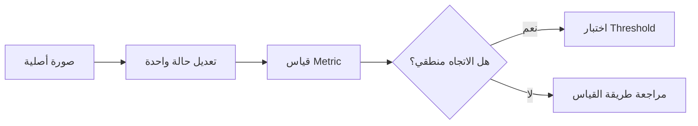
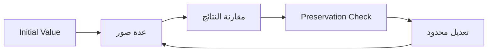
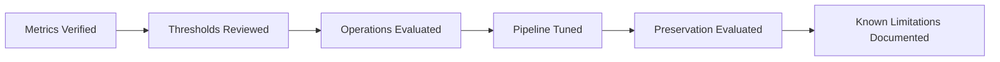

docs/research-plan.md

<div dir="rtl" align="right">

# 🔬 Manuscript Doctor — خطة التقييم والتجربة

> **الغرض من الوثيقة:** تحديد كيف سنقيّم جودة التشخيص والمعالجة والمحافظة على التفاصيل بصورة عملية ومنضبطة، دون تحويل المشروع إلى بحث أكاديمي أكبر من نطاقه.

---

## 1. سؤال التقييم الأساسي

السؤال الذي نريد الإجابة عنه هو:

> **هل يستطيع Manuscript Doctor تحسين صورة المخطوطة وفق حالتها، مع تقليل التغير غير المرغوب في التفاصيل الأصلية؟**

ويتفرع منه:

1. هل Metrics تتصرف بصورة منطقية على صور مختلفة؟
2. هل Diagnosis تعكس الحالة البصرية للصورة بدرجة مقبولة؟
3. هل العملية المقترحة مناسبة للمشكلة المكتشفة؟
4. هل Smart Pipeline أفضل من تطبيق معالجة ثابتة على جميع الصور؟
5. هل Preservation Verification تستطيع كشف حالات المعالجة المفرطة بصورة مفيدة؟

---

# 2. ما الذي لن نحاول إثباته؟

لا تهدف التجربة إلى إثبات:

* استعادة المخطوطة إلى حالتها التاريخية الأصلية.
* معرفة أن كل تفصيل تغير هو حرف أو جزء من النص.
* وجود نسبة مطلقة للنص المحفوظ.
* أن Treatment معينة هي الأفضل لجميع المخطوطات.
* أن النظام يستخدم Artificial Intelligence.

---

# 3. مجموعة الصور الأساسية

نستخدم مجموعة صغيرة لكن متنوعة من الصور الحقيقية قدر الإمكان.

| الحالة              | الهدف                                    |
| ------------------- | ---------------------------------------- |
| **Normal**          | مرجع لصورة جيدة نسبيًا                   |
| **Dark**            | اختبار Brightness والمعالجة المرتبطة بها |
| **Low Contrast**    | اختبار Contrast Enhancement              |
| **Noisy**           | اختبار عمليات تخفيف الضوضاء              |
| **Uneven Lighting** | اختبار المعالجة المحلية                  |
| **Fine Details**    | مراقبة أثر المعالجة على التفاصيل الدقيقة |

يمكن إضافة صور أخرى إذا ظهرت حالة لا تغطيها المجموعة الحالية.

---

# 4. تقييم Metrics

قبل تقييم Thresholds، يجب أولًا التأكد أن كل Metric تتحرك في الاتجاه المتوقع.



أمثلة:

| التجربة           | المتوقع                     |
| ----------------- | --------------------------- |
| تعتيم الصورة      | Brightness أقل              |
| Blur أقوى         | Sharpness أقل               |
| تقليل Contrast    | Contrast أقل                |
| إضافة Noise       | Noise Indicator أعلى غالبًا |
| إنشاء تفاوت إضاءة | Illumination Variation أعلى |

> إذا كان اتجاه Metric غير منطقي، لا نحاول إصلاح المشكلة بتغيير Threshold فقط.

---

# 5. تقييم Thresholds

Thresholds الحالية تعتبر **Initial Heuristics**.

يتم تقييمها على مجموعة الصور الفعلية من خلال:

1. تشغيل Analyzer.
2. تسجيل Metric.
3. مقارنة Diagnosis بالملاحظة البصرية.
4. تحديد False Diagnosis إن وجدت.
5. تعديل Threshold فقط إذا ظهر نمط متكرر.

### ممنوع

```text
صورة واحدة لا تعجبنا
        ↓
تغيير Threshold فورًا
```

### الصحيح

```text
عدة صور
   ↓
نمط واضح من الأخطاء
   ↓
تعديل مبرر
   ↓
إعادة الاختبار
```

---

# 6. تقييم عمليات المعالجة

لكل Operation نسجل ثلاثة أمور فقط:

| البند                   | السؤال                                      |
| ----------------------- | ------------------------------------------- |
| **Benefit**             | هل عالجت المشكلة المستهدفة؟                 |
| **Side Effects**        | هل أضافت مشكلة جديدة؟                       |
| **Preservation Impact** | هل تأثرت التفاصيل الدقيقة بصورة غير مرغوبة؟ |

مثال:

| Operation     | المشكلة           | الفائدة            | الخطر المحتمل    |
| ------------- | ----------------- | ------------------ | ---------------- |
| CLAHE         | Low Contrast      | تحسين محلي للتباين | تضخيم Noise      |
| Median Filter | Noise             | تقليل بعض الضوضاء  | فقد تفاصيل صغيرة |
| Sharpening    | Weak Edges        | تقوية الحواف       | تضخيم Noise      |
| Thresholding  | فصل النص والخلفية | زيادة الفصل        | حذف Ink ضعيف     |

---

# 7. اختيار Parameters

لا تعتمد Parameters النهائية من أول تجربة.

المسار:



يتم اختيار القيمة التي تعطي:

> **توازنًا أفضل بين التحسين والمحافظة وفق الاختبارات المستخدمة.**

وليس القيمة التي تجعل صورة واحدة تبدو أفضل.

---

# 8. تقييم Recommendation Engine

لكل Diagnosis نتحقق من:

```text
Diagnosis
   ↓
Recommended Operation
   ↓
هل العلاقة منطقية؟
   ↓
هل السبب قابل للتفسير؟
```

مثال:

```text
Low Contrast
     ↓
CLAHE
     ↓
تحسين التباين المحلي
```

يتم رفض Recommendation إذا:

* لا ترتبط بالمشكلة المكتشفة.
* تستخدم Operation غير مناسبة.
* تتجاهل Preservation Profile المهمة.
* لا يمكن تفسير سببها.

---

# 9. تقييم Smart Pipeline

نختبر Pipeline على جميع الحالات الأساسية.

لكل صورة نسجل:

| العنصر         | ما يتم تقييمه       |
| -------------- | ------------------- |
| Diagnosis      | ماذا اكتشف النظام؟  |
| Treatment Plan | ما الذي اختاره؟     |
| Steps          | ماذا نُفذ؟          |
| Result         | هل تحسنت المشكلة؟   |
| Preservation   | هل ظهرت مؤشرات خطر؟ |
| Final Decision | هل التقييم منطقي؟   |

### الهدف

Smart Pipeline يجب أن تستخدم **الخطوات اللازمة فقط**.

لا نريد:

```text
كل الخوارزميات
↓
لكل الصور
```

---

# 10. تقييم Preservation Verification

هذه المرحلة تحتاج أكبر قدر من الحذر.

نبدأ بحالات يمكن تفسيرها بسهولة:

### الحالة 1 — صورة مطابقة

```text
Original = Result
```

المتوقع:

> تغير بنيوي منخفض جدًا.

### الحالة 2 — Enhancement معتدلة

المتوقع:

> يوجد تغير بصري، لكن دون مؤشرات قوية على فقد بنيوي.

### الحالة 3 — معالجة قوية عمدًا

ننشئ Result مع معالجة مفرطة لاختبار هل تظهر:

* Edge loss.
* Component changes.
* Fine-detail changes.

إذا لم تستطع Metrics التمييز بين الحالات، نراجعها قبل بناء Assessment عليها.

---

# 11. المقارنة البصرية

القياسات وحدها لا تكفي أثناء التطوير.

لكل Result مهمة نقارن:

```text
Original
↔
Processed Result
```

ونلاحظ:

* وضوح الكتابة.
* بقاء الخطوط الرفيعة.
* العلامات الصغيرة.
* تغير الخلفية.
* اندماج التفاصيل.
* انقطاع التفاصيل.
* ظهور Noise جديدة.

هذه الملاحظة تساعد على تقييم الخوارزميات، لكنها لا تستبدل Metrics.

---

# 12. سجل التجارب

يتم تسجيل التجارب المهمة بهذا الشكل:

| الحقل        | المحتوى                |
| ------------ | ---------------------- |
| Image        | اسم الصورة             |
| Problem      | الحالة المستهدفة       |
| Operation    | المعالجة               |
| Parameters   | القيم المستخدمة        |
| Before       | الملاحظة قبل           |
| After        | الملاحظة بعد           |
| Preservation | Assessment             |
| Decision     | Keep / Adjust / Reject |
| Note         | سبب القرار             |

لا نحتاج تسجيل كل تشغيل بسيط، بل فقط التجارب التي تؤثر على قرار تقني.

---

# 13. معايير قبول Operation

لا تدخل Operation إلى Recommendation أو Smart Pipeline إلا إذا:

* [ ] تعمل تقنيًا دون أخطاء.
* [ ] تحقق هدفًا معروفًا.
* [ ] تم اختبارها على أكثر من صورة.
* [ ] Parameters الخاصة بها مفهومة.
* [ ] آثارها الجانبية معروفة.
* [ ] لا تعدل Original.
* [ ] تم تقييم أثرها على التفاصيل.
* [ ] نستطيع شرح متى تستخدم ومتى لا تستخدم.

---

# 14. معايير قبول Metric

لا تعتمد Metric في قرار النظام إلا إذا:

* [ ] تعريفها واضح.
* [ ] سلوكها يمكن اختباره.
* [ ] تتصرف منطقيًا في الحالات المتوقعة.
* [ ] حدودها موثقة.
* [ ] تمت تجربتها على صور حقيقية.
* [ ] لا نعطيها معنى أكبر مما تقيس فعليًا.

---

# 15. نتيجة التقييم النهائية

في نهاية المشروع نريد أن نستطيع الإجابة بوضوح عن:

1. ما المشكلات التي يستطيع النظام اكتشافها جيدًا؟
2. ما الحالات التي لا يزال التشخيص فيها محدودًا؟
3. أي Operations أثبتت فائدتها؟
4. أي Parameters تم اعتمادها ولماذا؟
5. متى تعطي Smart Pipeline نتيجة جيدة؟
6. متى يصدر Preservation Warning؟
7. ما حدود Preservation Verification الحالية؟

---

# 16. المخرج النهائي للتجربة

يجب أن تنتهي عملية التقييم بـ:



ولا نحتاج أوراقًا بحثية أو إحصاءات معقدة لا تخدم المشروع.

---

<div align="center">

### 🔬 Evaluation Principle

**Measure first.**
**Compare honestly.**
**Tune carefully.**
**Document the limits.**

</div>

</div>
