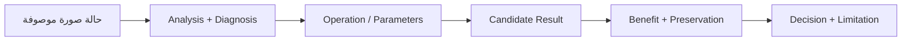
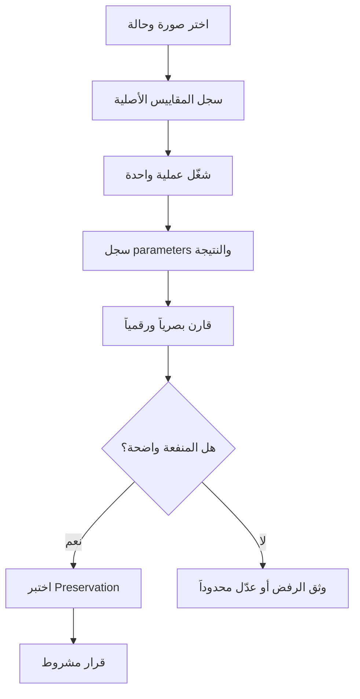
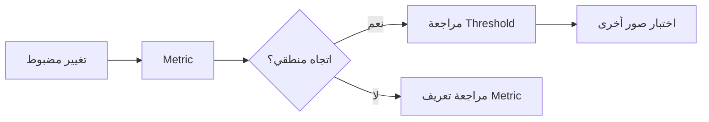
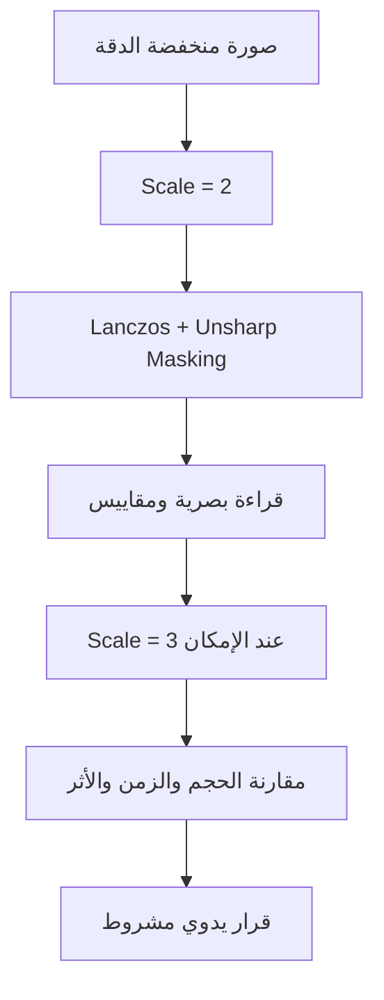
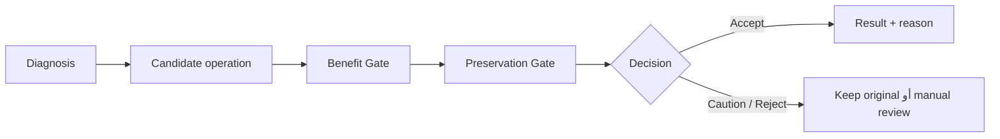
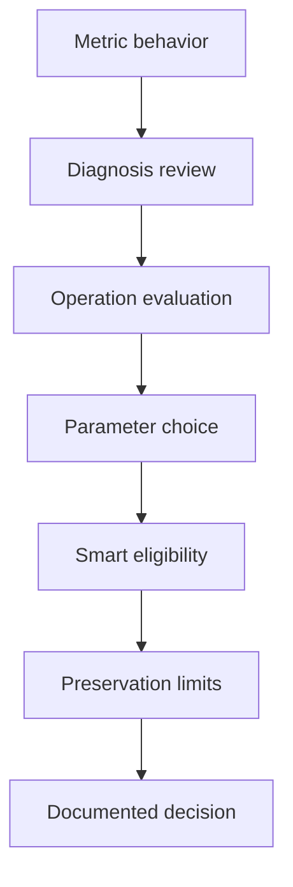

<div dir="rtl" align="right">

# 🔬 Manuscript Doctor — خطة البحث والتجارب

> **السؤال المركزي:** هل يستطيع النظام اختيار معالجة مناسبة لحالة الوثيقة وتحسين قابليتها للعرض، مع تقليل التغير غير الضروري في بنيتها الأصلية؟
>
> هذه الخطة تصف **تقييماً تطبيقياً قابلاً للتكرار**، وليست ادعاءً بتعميم النتائج على جميع الوثائق أو المخطوطات.

---

## 1. نطاق التجربة



تدرس التجربة أربعة أسئلة مترابطة:

| السؤال | الدليل المطلوب |
| --- | --- |
| هل المؤشرات تتحرك منطقياً؟ | تجارب حالة مضبوطة ومقارنة قبل/بعد |
| هل التشخيص مناسب للمشكلة؟ | مقارنة Diagnosis بالملاحظة البصرية |
| هل العملية تحقق هدفها؟ | مقياس منفعة مرتبط بالعملية وفحص بصري |
| هل القرار محافظ؟ | Preservation Verification وحدود معلنة |

---

## 2. ما لا تثبته الخطة

لا تهدف التجربة إلى إثبات أن النظام:

- يستعيد الحالة التاريخية الأصلية للوثيقة.
- يقرأ النص أو يثبت صحة الحروف.
- يعيد تفاصيل لم تلتقطها الكاميرا أو فقدت كلياً بسبب الضبابية.
- يعطي نسبة مطلقة للنص المحفوظ.
- يختار أفضل معالجة لكل وثيقة ممكنة.
- يستخدم Machine Learning أو OCR في الإصدار الحالي.

> **حد Super Resolution:** يمكن للتكبير المحافظ تحسين الحواف وقابلية القراءة عندما تكون بعض المعلومات موجودة في الصورة، لكنه لا يستعيد المعلومات المفقودة ولا يعيد حرفاً غير ظاهر بصورة موثوقة.

---

## 3. تصميم التجربة

يبدأ كل اختبار بوصف الحالة ثم يغير **عاملاً واحداً قدر الإمكان**، حتى يمكن تفسير الأثر.



### قواعد التجربة

| القاعدة | التطبيق |
| --- | --- |
| مصدر ثابت | يبدأ القياس من Original، أو من `source_result_id` عند تقييم خطوة يدوية لاحقة |
| متغير محدود | لا تغير العملية والمعاملات والصورة دفعة واحدة |
| صور متعددة | لا تعتمد المعايرة على صورة واحدة |
| سجل قابل للتكرار | تحفظ الصورة والمعاملات والملاحظات والقرار |
| مقارنة عادلة | تراجع الأبعاد والقنوات والزمن مع جودة المظهر |
| تفسير محافظ | لا تحول Metric واحدة إلى حكم لغوي على النص |

---

## 4. مجموعة الصور

| المجموعة | الحالات التي تمثلها |
| --- | --- |
| `01_normal.jpg` | وثيقة متوازنة |
| `02_dark.jpg` | سطوع منخفض |
| `03_low_contrast.jpg` | تباين منخفض |
| `04_noisy.jpg` | ضوضاء ظاهرة |
| `05_uneven_lighting.jpg` | إضاءة غير متجانسة |
| `06_fine_details.jpg` | تفاصيل دقيقة |
| `07_bleed_through.jpg` | تسرب خلفية كحالة حدية |
| C05 | `960×1280`، اختبار Preparation وSmart وSuper Resolution |
| C06 | اختبار Manual Chain وCrop وUndo/Redo والثقة المنخفضة |

لا تمثل هذه المجموعة كل أنواع الوثائق. تضاف صور جديدة عندما يظهر نمط لا تغطيه الحالات الحالية.

---

## 5. خطة التحقق من Metrics



| التجربة | الاتجاه المتوقع |
| --- | --- |
| تعتيم الصورة | Brightness أقل |
| خفض التباين | Contrast أقل |
| Blur أقوى | Sharpness أقل غالباً |
| ضوضاء نقطية | Noise Indicator أعلى غالباً |
| تفاوت إضاءة | Illumination Variation أعلى |

إذا لم يتحقق الاتجاه، لا يعالج الخلل بتغيير Threshold فقط. تتم مراجعة طريقة القياس أولاً.

---

## 6. خطة تقييم العمليات

لكل عملية نسجل:

| البند | السؤال |
| --- | --- |
| الهدف | ما المشكلة التي يفترض أن تعالجها؟ |
| Parameters | ما القيم التي جُربت ولماذا؟ |
| Benefit | هل تحسن المقياس المستهدف أو المظهر المقصود؟ |
| Side Effects | هل ظهرت ضوضاء أو halos أو فقد بنية؟ |
| Cost | هل تغيرت الأبعاد أو زمن المعالجة أو حجم النقل؟ |
| Decision | Auto Candidate أو Manual Only أو Binarization أو Reject |

### أمثلة للتصميم التجريبي

| العملية | المقارنة الرئيسية |
| --- | --- |
| CLAHE | `clip_limit=1.5` مقابل قيم أقوى على Dark وLow Contrast وNoise |
| Median | Kernel 3 مقابل Kernel 5 مع مراجعة التفاصيل |
| Sharpen | Amount محافظ مقابل قوي مع فحص halos والضوضاء |
| Thresholding | Global وOtsu وAdaptive حسب نمط الإضاءة |
| Morphology | Kernel صغير فقط، مع منع التعميم على التفاصيل الدقيقة |
| Super Resolution | Scale 2× مقابل 3× ضمن حد الحجم، مع فحص الحواف والتكلفة |
| Geometry | Crop وRotate وFlip وDeskew مع مطابقة الأبعاد والاتجاه |

---

## 7. تجربة Super Resolution



تسأل التجربة:

1. هل أصبحت الحواف أوضح دون تضخيم واضح للضوضاء؟
2. هل بقيت القنوات والنوع والأبعاد صحيحة؟
3. هل بقي الناتج ضمن حدود الذاكرة والحجم؟
4. هل تحسن النص المرئي، أم زادت تفاصيل مصطنعة فقط؟
5. هل يحتاج المستخدم إلى مراجعة قبل الاعتماد؟

لا تعتبر زيادة الأبعاد دليلاً على استرجاع نص. العملية يدوية وخادمية، ولا تدخل Smart Pipeline تلقائياً.

---

## 8. تقييم Recommendation وSmart Pipeline



تقارن التجربة بين:

| العنصر | ما يجب تسجيله |
| --- | --- |
| Diagnosis | الكود والرسالة وشدة الحالة |
| Candidate | العملية والمعاملات |
| Benefit | المؤشر الذي استهدفه المرشح |
| Preservation | المؤشرات والتحذير |
| Decision | القبول أو التراجع أو التأجيل |
| Explanation | سبب قابل للعرض للمستخدم |

Smart Pipeline ليست سلسلة عشوائية من كل العمليات. في النسخة الحالية لا تقبل أكثر من خطوة تلقائية واحدة في الجولة، وتمنع العمليات اليدوية غير المؤهلة من الدخول تلقائياً.

---

## 9. C05 وC06 كحالات تحقق تشغيلية

| الحالة | التجربة | ما تثبته فعلياً |
| --- | --- | --- |
| C05 | Preparation وSmart | قبول deskew-only عند ثقة عالية دون قص غير موثوق |
| C05 | Super Resolution | تكبير خادمي 2× ومقارنة الأبعاد والتكلفة |
| C05 | Local Preview | Rotate وFlip وIntensity وGamma دون طلب Preview للمعاينة |
| C06 | Manual Chain | الخطوة الثانية تستخدم نتيجة الخطوة الأولى |
| C06 | before/after | الصورة السابقة والحالية تطابقان `manualActiveIndex` |
| C06 | Undo/Redo | تنقل بصري من كاش النتائج دون إعادة تنفيذ غير لازم |
| C06 | Crop | السحب يغير الإحداثيات والاعتماد يطابق الأبعاد |
| C06 | Smart منخفض الثقة | تأجيل آمن وعدم فرض Deskew أو Crop |

هذه الحالات تثبت سلوك الإصدار الحالي، ولا تثبت تعميماً إحصائياً على كل الصور.

---

## 10. Preservation Verification

تستخدم المقارنة لتحديد خطر التغير البنيوي، لا لقراءة النص:

```text
Original + Result
       ↓
Metrics بنيوية
       ↓
Acceptable / Caution / High Risk
       ↓
قرار مشروط ورسالة واضحة
```

يجب أن تختبر الخطة:

- صورة مطابقة: تغير منخفض جداً.
- Enhancement معتدل: تغير بصري مع عدم استنتاج فقد حرف.
- معالجة مفرطة: ارتفاع المؤشرات أو ظهور Warning.
- Binarization: تغير مظهري كبير يفسر بحذر.
- فشل التقييم: `Assessment Unavailable` بدلاً من حكم أمان مطلق.

---

## 11. خطة المعايرة

لا تعدل Threshold بسبب صورة واحدة:

```text
عدة صور
  ↓
نمط متكرر من الخطأ
  ↓
تعديل محدود ومسبب
  ↓
إعادة regression
  ↓
تحديث القرار والتوثيق
```

تحتفظ كل معايرة بتاريخها، والصور المستخدمة، والقيمة القديمة والجديدة، والأثر، وسبب الإبقاء أو التراجع.

---

## 12. نموذج سجل تجربة

| الحقل | المحتوى |
| --- | --- |
| Image | اسم الصورة أو C05/C06 |
| Condition | Dark / Noise / Crop / Resolution |
| Source | Original أو `source_result_id` |
| Operation | `operation_id` |
| Parameters | JSON القيم المستخدمة |
| Before | ملاحظة ومقاييس قبل |
| After | ملاحظة ومقاييس بعد |
| Runtime | زمن Preview أو Approve عند الحاجة |
| Preservation | القرار والمؤشرات |
| Decision | Keep / Adjust / Manual / Reject |
| Evidence | اختبار أو لقطة أو نتيجة API |
| Limitation | ما لا يمكن استنتاجه |

---

## 13. معايير إدخال عملية إلى Smart Pipeline

لا تنتقل العملية من registry إلى Smart إلا إذا:

```text
تعمل دون خطأ
+ لها هدف واضح
+ تم اختبارها على صور متعددة
+ Parameters محدودة ومفهومة
+ Benefit قابلة للقياس
+ مخاطرها موثقة
+ Original تبقى ثابتة
+ Preservation يراقب أثرها
+ يوجد اختبار API وRegression
```

وجود العملية في registry لا يعني أنها مؤهلة تلقائياً. أما العمليات الهندسية مثل Crop وRotate وFlip وDeskew وSuper Resolution فتبقى يدوية أو ضمن Preparation وفق السياسة المحددة.

---

## 14. المخرج المتوقع

تنتهي الخطة ببطاقات تقييم مترابطة، لا بقائمة أرقام معزولة:



كل نتيجة يجب أن تجيب عن: ما الذي جُرب؟ على أي صورة؟ ما الفائدة؟ ما المخاطر؟ ما الذي لا تثبته؟

---

## 15. دليل الإصدار الحالي

تستخدم الخطة نتيجة regression الحالية كخط أساس للتغييرات، لا كدليل على تعميم الأداء:

```text
333 passed, 16 skipped
JavaScript syntax check: passed
```

تفاصيل الاختبارات الحية وC05/C06 موجودة في [`e2e-testing.md`](e2e-testing.md)، وتفاصيل التقييم لكل عملية في [`operation-evaluation.md`](operation-evaluation.md).

---

## 16. المراجع الداخلية

- [`architecture.md`](architecture.md)
- [`requirements.md`](requirements.md)
- [`workflow.md`](workflow.md)
- [`testing.md`](testing.md)
- [`e2e-testing.md`](e2e-testing.md)
- [`operation-evaluation.md`](operation-evaluation.md)
- [`decisions.md`](decisions.md)

</div>
