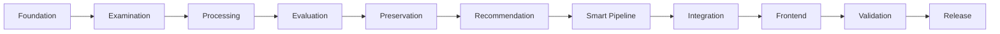
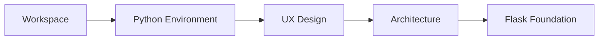
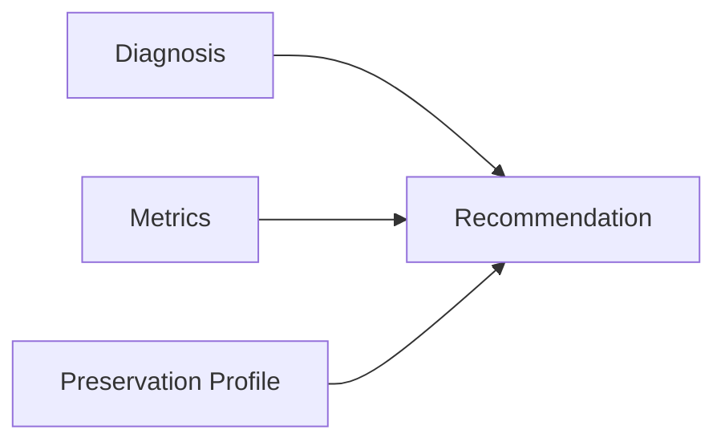
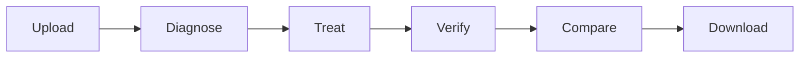
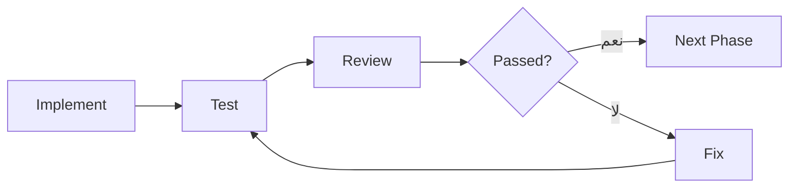

docs/roadmap.md

<div dir="rtl" align="right">

# 🗺️ Manuscript Doctor — خارطة الطريق

> **الغرض من الوثيقة:** توضيح مراحل تنفيذ المشروع من الأساس حتى الإصدار النهائي، مع تحديد الهدف والمخرج الرئيسي لكل مرحلة دون تكرار تفاصيل التنفيذ الموجودة في بقية الوثائق.

---

## 1. المسار العام



---

# 2. المراحل التنفيذية

| المرحلة                           | الهدف                              | المخرج الرئيسي                       |
| --------------------------------- | ---------------------------------- | ------------------------------------ |
| **0 — Scope**                     | تثبيت المشكلة والنطاق              | تعريف واضح للـMVP                    |
| **1 — Workspace**                 | تجهيز بنية المشروع وGit            | مشروع منظم وقابل للتتبع              |
| **2 — Environment**               | تجهيز Python والاعتماديات          | بيئة تشغيل قابلة للتكرار             |
| **3 — UX Design**                 | تصميم تجربة المستخدم قبل البرمجة   | Workflow وWireframes                 |
| **4 — Architecture**              | تثبيت المسؤوليات والعقود           | Architecture + API Contracts         |
| **5 — Flask Foundation**          | بناء أساس Backend الآمن            | Upload + Storage + IDs + Responses   |
| **6 — Examination & Diagnosis**   | تحليل الصورة الأصلية وتشخيصها      | `analyzer.py` + Preservation Profile |
| **7 — Image Operations**          | تنفيذ عمليات المعالجة المستقلة     | `operations.py`                      |
| **8 — Operation Evaluation**      | اختبار وضبط العمليات               | Parameters مبررة ومختبرة             |
| **9 — Preservation Verification** | تقييم أثر المعالجة على التفاصيل    | `preservation.py`                    |
| **10 — Recommendation Engine**    | تحويل التشخيص إلى خطة علاج         | `recommender.py`                     |
| **11 — Smart Pipeline**           | تنفيذ معالجة تلقائية واعية بالحالة | `pipeline.py`                        |
| **12 — Backend Integration**      | ربط جميع الوحدات بالـAPI           | Backend مكتمل وظيفيًا                |
| **13 — Frontend**                 | بناء الواجهة النهائية              | `index.html` + CSS + JS              |
| **14 — Frontend Integration**     | ربط الواجهة بالـBackend            | Workflow كامل من المتصفح             |
| **15 — End-to-End Testing**       | اختبار الاستخدام الكامل            | نتائج اختبار موثقة                   |
| **16 — Scientific Validation**    | مراجعة Metrics وThresholds         | حدود وقرارات معايرة نهائية           |
| **17 — UI/UX Polish**             | تحسين العرض والاستجابة             | واجهة نهائية مستقرة                  |
| **18 — Optional Features**        | إضافة قيمة بعد استقرار الأساس      | ميزات اختيارية فقط عند الحاجة        |
| **19 — Documentation**            | إنهاء التوثيق الأكاديمي والتقني    | وثائق مطابقة للكود                   |
| **20 — Release**                  | تجهيز نسخة التسليم                 | إصدار ثابت قابل للتشغيل والعرض       |

---

# 3. المرحلة 0 — تثبيت النطاق

### ننجز

* تعريف المشكلة.
* تثبيت فلسفة المشروع.
* تحديد وظائف الـMVP.
* تحديد ما هو خارج النطاق.

### المخرج

```text
Manuscript Doctor
=
Diagnose → Treat → Preserve → Verify
```

---

# 4. المراحل 1–5 — الأساس

هذه المراحل تبني البيئة التي سيعتمد عليها باقي المشروع.



بنهاية المرحلة 5 يجب أن يستطيع النظام:

* استقبال صورة.
* التحقق منها.
* إنشاء `image_id`.
* حفظ Original بأمان.
* عرضها بواسطة API.
* إعادة Responses موحدة.

---

# 5. المرحلة 6 — Examination & Diagnosis

### الهدف

فهم حالة الصورة قبل تنفيذ أي معالجة.

### نبني

```text
processing/analyzer.py
```

### يشمل

* Brightness.
* Contrast.
* Dynamic Range.
* Sharpness.
* Noise Indicator.
* Illumination Variation.
* Edge Density.
* Diagnosis Rules.
* Preservation Profile.

### لا يشمل

* Treatment.
* Recommendation.
* Preservation Verification.

---

# 6. المرحلة 7 — Image Processing Operations

### الهدف

بناء عمليات معالجة مستقلة وقابلة للاختبار.

### نبني

```text
processing/operations.py
```

وتشمل العمليات المعتمدة مثل:

* CLAHE.
* Histogram Equalization.
* Median / Gaussian.
* Sharpening.
* Thresholding.
* Morphology.

كل عملية تبدأ من Original عند استخدامها يدويًا.

---

# 7. المرحلة 8 — Operation Evaluation

### الهدف

منع اعتماد Parameters عشوائية.

نختبر كل Operation على صور متنوعة ونحدد:

```text
الفائدة
+
الآثار الجانبية
+
Parameters المناسبة
+
Preservation Impact
```

النتيجة المطلوبة:

> لا تدخل Operation إلى Smart Pipeline قبل فهم سلوكها.

---

# 8. المرحلة 9 — Preservation Verification

### الهدف

تقييم أثر Treatment على البنية الأصلية.

### نبني

```text
processing/preservation.py
```

المدخل:

```text
Original + Processed Result
```

المخرج:

```text
Metrics + Warnings + Assessment
```

---

# 9. المرحلة 10 — Recommendation Engine

### الهدف

تحويل حالة الصورة إلى خطة معالجة قابلة للتفسير.

### نبني

```text
processing/recommender.py
```

التدفق:



كل Recommendation يجب أن توضح:

* ماذا نقترح؟
* لماذا؟
* ما مستوى الأولوية؟
* هل توجد ملاحظة Preservation؟

---

# 10. المرحلة 11 — Smart Pipeline

### الهدف

تنفيذ معالجة تلقائية قصيرة ومبررة.

```text
Original
↓
Treatment Plan
↓
Relevant Operations
↓
Processed Result
↓
Preservation Verification
```

الـPipeline لا تطبق جميع العمليات على كل صورة.

---

# 11. المرحلة 12 — Backend Integration

### الهدف

تحويل الوحدات المستقلة إلى Backend واحد متكامل.

بنهاية المرحلة تعمل:

```text
Upload
↓
Analysis
↓
Diagnosis
↓
Recommendation
↓
Manual / Pipeline
↓
Preservation
↓
Result
```

عبر الـAPI المعتمدة.

---

# 12. المرحلتان 13–14 — Frontend

### المرحلة 13

بناء:

```text
templates/index.html
static/css/style.css
static/js/main.js
```

### المرحلة 14

ربط الواجهة بالـBackend وإدارة:

* Upload.
* Loading.
* Examination.
* Processing.
* Verifying.
* Result.
* Warning.
* Error.
* Download.

---

# 13. المرحلتان 15–16 — الاختبار والتحقق

## المرحلة 15 — End-to-End

اختبار المسار:



على مجموعة صور متنوعة.

## المرحلة 16 — Scientific Validation

نراجع:

* Metrics.
* Diagnostic Thresholds.
* Processing Parameters.
* Preservation Thresholds.
* False Warnings.
* Known Limitations.

أي قيمة غير مدعومة بالتجربة تبقى **مؤقتة**.

---

# 14. المرحلة 17 — UI/UX Polish

بعد استقرار الوظائف فقط يتم تحسين:

* RTL.
* Responsive behavior.
* Typography.
* حالات Loading وWarnings.
* Original/Result comparison.
* ترتيب المعلومات.

لا نضيف تأثيرات بصرية لا تخدم الاستخدام.

---

# 15. المرحلة 18 — Optional Features

لا تبدأ قبل استقرار الـCore.

أمثلة:

| الميزة                        | الأولوية               |
| ----------------------------- | ---------------------- |
| Lost Detail Map               | عالية بعد Preservation |
| Treatment Report              | عالية إذا سمح الوقت    |
| Candidate Comparison          | مستقبل                 |
| Automatic Candidate Selection | مستقبل                 |
| Regional Preservation         | مستقبل                 |
| Region-Aware Processing       | مستقبل                 |

---

# 16. المرحلتان 19–20 — التسليم

## المرحلة 19

تحديث جميع الوثائق بحيث تطابق النظام الفعلي.

## المرحلة 20

تنفيذ:

```text
Final Tests
↓
Clean Repository
↓
Fresh Installation Test
↓
Version Tag
↓
Demo Preparation
↓
Final Release
```

---

# 17. قاعدة الانتقال بين المراحل

لا ننتقل لمجرد انتهاء كتابة الكود.



أي مرحلة يجب أن تنتهي بـ:

* كود يعمل.
* اختبارات ناجحة.
* مراجعة للمخرجات.
* تحديث الوثائق المتأثرة.
* Git نظيف.

---

# 18. الحالة الحالية

تتم متابعة الحالة الفعلية من خلال:

```text
project-plan.md
```

وهو **مصدر التتبع الرسمي**.

أما هذه الوثيقة فوظيفتها:

> إظهار الطريق الكامل للمشروع بصورة مختصرة وواضحة.

لذلك لا تستخدم علامات `[x]` هنا لتسجيل التقدم.

---

# 19. قاعدة الأولوية

إذا ضاق الوقت:

```text
Core Functionality
      ↓
Correctness
      ↓
Preservation Verification
      ↓
Testing
      ↓
Clear UX
      ↓
Documentation
      ↓
Optional Features
```

الميزة الاختيارية لا تؤخر إغلاق الوظائف الأساسية.

---

<div align="center">

### 🩺 Manuscript Doctor

**Build the foundation.
Understand the image.
Treat carefully.
Verify the result.
Then refine.**

</div>

</div>
