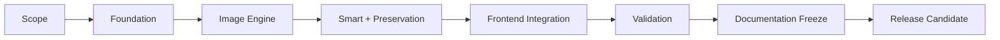
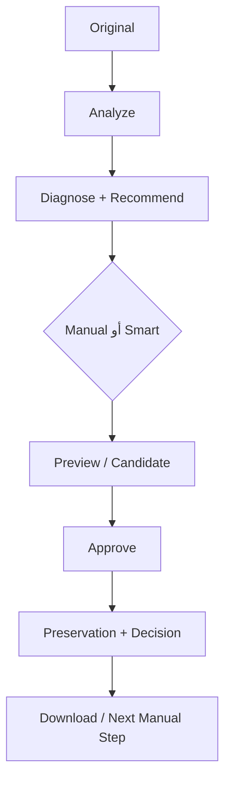
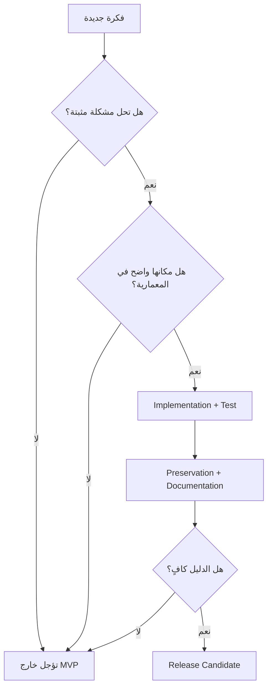
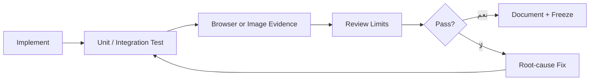

<div dir="rtl" align="right">

# 🗺️ Manuscript Doctor — خارطة الطريق الحالية

> **وظيفة الوثيقة:** توضيح كيف انتقل المشروع من الفكرة إلى النسخة القابلة للتجربة، وما الذي تم إثباته، وما الذي بقي مؤجلاً. هذه ليست قائمة أمنيات ولا بديلاً عن تفاصيل المعمارية أو الاختبارات.

---

## 1. الحالة المختصرة



| الحالة | المعنى |
| --- | --- |
| ✅ مكتمل | نُفذ واختُبر ووُثق في النسخة الحالية |
| 🟡 مستقر مع قيود | يعمل، لكن حدوده معلنة أو يحتاج Corpus أوسع |
| 🔵 قيد التثبيت | أعمال التوثيق والمراجعة النهائية الحالية |
| ⏳ مؤجل | فكرة مستقبلية لم تدخل النسخة الحالية |
| ❌ خارج النطاق | لا ينبغي وصفها كميزة للمشروع |

**الحالة الحالية:** 🟡 **RELEASE CANDIDATE — READY WITH KNOWN LIMITATIONS**.

---

## 2. ما تم إنجازه

| المرحلة | المخرج الفعلي | الحالة |
| --- | --- | --- |
| Scope | فلسفة `Diagnose → Treat → Preserve → Verify` وحدود MVP | ✅ |
| Foundation | Flask، رفع آمن، `image_id`، تخزين الأصل والنتائج | ✅ |
| Examination | Metrics وDiagnosis وPreservation Profile | ✅ |
| Operations | Registry وعمليات OpenCV مستقلة قابلة للاختبار | ✅ |
| Evaluation | معايرة أولية للمخاطر والفوائد على صور متعددة | 🟡 |
| Preservation | Benefit Gate وPreservation Gate وRollback | ✅ |
| Recommendation | توصيات Rule-Based قابلة للتفسير | ✅ |
| Smart Pipeline | مرشح تلقائي واحد مع حماية من التكرار والمخاطر | ✅ |
| Preparation | Boundary Verification وdeskew-only المحافظ | 🟡 |
| Manual Studio | Preview وApprove وManual Chain وCrop وGeometry | ✅ |
| Performance | Canvas للعمليات الخفيفة وJPEG Preview اختيارياً | ✅ |
| Frontend | واجهة RTL مقسمة ومتجاوبة وHeader بالخلفية الحالية | ✅ |
| Validation | Regression وC05 وC06 واختبار حي للواجهة | ✅ |
| Documentation | توحيد وثائق المعمارية والتدفق والتقييم والاختبار | 🔵 |

---

## 3. خط الأساس المثبت



| الدليل | الحالة المثبتة |
| --- | --- |
| Python regression | `333 passed, 16 skipped` |
| JavaScript syntax | نجح لجميع الأجزاء المقسمة |
| C05 | `960×1280`؛ Smart يقبل deskew-only عند الثقة العالية؛ Super Resolution 2× خادمية |
| C06 | Manual Chain وbefore/after وUndo/Redo وCrop تم التحقق منها |
| Local Preview | Rotate وFlip وIntensity وGamma دون طلب `/preview` للمعاينة |
| Heavy Preview | JPEG اختياري، مع بقاء PNG افتراضياً للتوافق |
| Final Artifact | Approve وDownload وVerification عبر Flask/OpenCV |
| Original | ثابت وغير مستبدل بالنتائج |

---

## 4. مراحل التنفيذ المنطقية

### المرحلة A — الأساس والهوية

**الحالة:** ✅ مكتملة.

ثبتت هذه المرحلة اسم المشروع، نطاق MVP، تشغيل Flask المحلي، بنية الملفات، حماية الأصل، وعقد الاستجابات. لا توجد في النسخة الحالية Database أو Authentication أو Docker.

### المرحلة B — محرك الصورة

**الحالة:** ✅ مكتملة.

أصبح لكل عملية موضع مستقل في `processing/ops/`، وسجل موحد في `registry.py`، ومعاملات قابلة للتحقق. يعمل `app.py` كطبقة API ولا يحتوي على خوارزميات OpenCV طويلة.

### المرحلة C — التقييم والمحافظة

**الحالة:** 🟡 مستقرة مع قيود.

تم فصل Benefit عن Preservation، وإضافة Rollback وDecision وWarning. تبقى Metrics وThresholds مؤشرات هندسية تحتاج Corpus أوسع ولا تمثل فهماً لغوياً للنص.

### المرحلة D — Smart Pipeline

**الحالة:** ✅ مكتملة وظيفياً.

يبدأ المسار من الأصل، يختار مرشحاً مؤهلاً، يعيد التحليل، ثم يمر عبر بوابتي المنفعة والمحافظة. تقبل الجولة خطوة تلقائية واحدة فقط، ولا تدخل العمليات اليدوية غير المؤهلة إلى Smart.

### المرحلة E — الاستوديو اليدوي

**الحالة:** ✅ مكتملة وظيفياً.

تدعم الواجهة Preview محلياً أو خادمياً حسب كلفة العملية، ثم Approve واحداً ينشئ Result حقيقية. تُبنى الخطوات اللاحقة من `source_result_id`، وتتنقل before/after وUndo/Redo عبر `manualChain` و`manualActiveIndex`.

### المرحلة F — التحقق والتجميد

**الحالة:** 🔵 قيد التثبيت.

يتم توحيد الوثائق، إزالة الأرقام القديمة، مراجعة الروابط والرسومات، وتثبيت حدود النسخة قبل التغليف. لا تعني هذه المرحلة إضافة خوارزميات جديدة.

---

## 5. سياسة الإضافات الحالية



لا تدخل أي ميزة جديدة إلى النسخة الحالية لمجرد أنها تبدو مفيدة بصرياً؛ يجب أن يكون لها هدف، ومكان، واختبار، وحدود معلنة.

---

## 6. ما هو مؤجل بوضوح

| الميزة | الحالة | سبب التأجيل |
| --- | --- | --- |
| EDSR أو FSRCNN أو Real-ESRGAN | ⏳ | تحتاج أوزاناً وتبعيات وتقييماً مستقلاً |
| OCR أو Text Recognition | ⏳ | يحتاج Metric مثل CER/WER وCorpus موسع |
| Bleed-through Removal مخصص | ⏳ | لا يوجد مسار موثوق مثبت حالياً |
| Queue أو Workers | ⏳ | Smart خادمي لكنه لا يحتاج بنية تشغيلية إضافية في MVP |
| Database وAuthentication | ⏳ | خارج تطبيق الاستخدام المحلي التعليمي |
| Automatic Crop غير المشروط | ❌ | قد يفقد أجزاء الوثيقة عند انخفاض الثقة |
| ادعاء استعادة النص المفقود | ❌ | لا تثبته Super Resolution أو Metrics الحالية |
| تشغيل كل العمليات تلقائياً | ❌ | يخالف سياسة المخاطر وPreservation |

---

## 7. معيار الانتقال



لا تنتقل مرحلة إلى حالة «مكتملة» إلا إذا توفر:

1. تنفيذ قابل للتشغيل.
2. اختبار مناسب للمسار.
3. دليل بصري عند تعلق المشكلة بالواجهة أو الصورة.
4. توثيق يذكر الفائدة والحدود.
5. عدم إضعاف الأصل أو عقود API.

---

## 8. الأولوية عند ضيق الوقت

```text
Correctness
  ↓
Original Preservation
  ↓
API and Chain Integrity
  ↓
Regression Tests
  ↓
Readable UX
  ↓
Documentation Freeze
  ↓
Optional Features
```

تُؤجل الميزة الاختيارية إذا كانت ستؤخر إصلاحاً وظيفياً أو تجعل النتيجة أقل قابلية للتفسير.

---

## 9. خطة ما بعد النسخة الحالية

لا تبدأ هذه الخطة إلا بعد اعتماد التوثيق الحالي:

| الترتيب | العمل | شرط البدء |
| ---: | --- | --- |
| 1 | توسيع Corpus للوثائق الحقيقية | توفر صور مصرح باستخدامها ومعيار تقييم واضح |
| 2 | تحسين Noise Indicator | حالات مرجعية وضوضاء معروفة |
| 3 | تقييم نموذج Super Resolution عميق | مقارنة عادلة مع المسار المحافظ الحالي |
| 4 | إضافة OCR اختيارياً | تعريف CER/WER ومراجعة الخصوصية |
| 5 | دراسة Queue | أكثر من مستخدم أو مهام طويلة مثبتة |

هذه أعمال مستقبلية وليست جزءاً من ادعاء النسخة الحالية.

---

## 10. مراجع التتبع الداخلية

- [`architecture.md`](architecture.md) — الطبقات والعقود.
- [`requirements.md`](requirements.md) — المتطلبات القابلة للتتبع.
- [`workflow.md`](workflow.md) — تدفق المستخدم والنظام.
- [`testing.md`](testing.md) — استراتيجية الاختبار.
- [`e2e-testing.md`](e2e-testing.md) — اختبار المسار الكامل.
- [`operation-evaluation.md`](operation-evaluation.md) — تقييم العمليات.
- [`phase-c-report.md`](phase-c-report.md) — تقرير التكامل.
- [`decisions.md`](decisions.md) — أسباب القرارات الهندسية.

</div>
