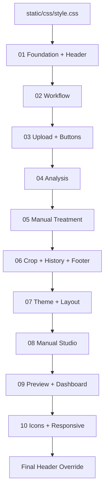
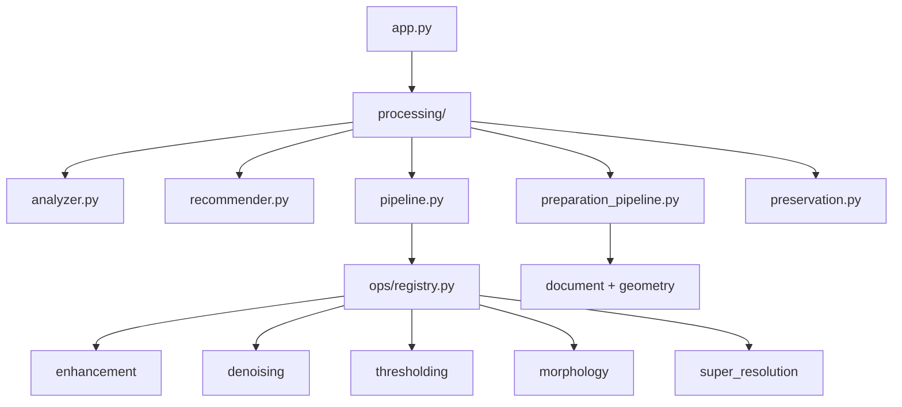
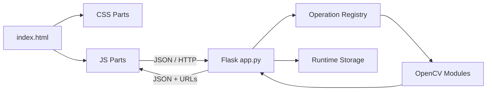

<div dir="rtl" align="right">

# 🧩 Manuscript Doctor — بنية التقسيم

> **غرض الوثيقة:** شرح كيف قُسم المشروع إلى وحدات واضحة مع الحفاظ على عقود Flask وسلوك الواجهة، ولماذا يوجد كل جزء في مكانه الحالي.

هذا الملف يصف **البنية المنفذة**، وليس خطة مستقبلية. التقسيم لا يعني إعادة بناء منطق جديد لكل جزء؛ بل يعني نقل المسؤولية إلى ملفات أصغر مع إبقاء نقطة التشغيل والعقود العامة متوافقة.

---

## 1. قاعدة التقسيم


| القاعدة | التطبيق |
| --- | --- |
| مسؤولية واحدة | كل جزء يركز على مجال واحد مثل الحالة أو الرفع أو المعاينة |
| عقد ثابت | أسماء عناصر HTML ومعرفات الموارد وواجهات Flask لا تتغير بلا سبب |
| لا منطق OpenCV في الواجهة | JavaScript يعرض ويستدعي؛ Python ينفذ ويقرر |
| المصدر المرجعي واضح | `style.css` و`main.js` نقاط توافق، والملفات في `parts/` هي التنفيذ المقسم |
| لا حذف للتاريخ | نسخ `legacy/` تحفظ الشكل السابق للمراجعة ولا تُحمّل في المسار الحالي |
| اختبار بعد التقسيم | كل تغيير يمر باختبارات Python وفحص صياغة JavaScript |

---

## 2. شجرة المشروع المقسمة

```text
image_project_split/
├── app.py
├── requirements.txt
├── pytest.ini
│
├── templates/
│   └── index.html
│
├── static/
│   ├── css/
│   │   ├── style.css                 # نقطة دخول CSS وطبقة التوافق
│   │   ├── legacy/
│   │   │   └── style.original.css    # نسخة مرجعية تاريخية
│   │   └── parts/
│   │       ├── 01-foundation-header.css
│   │       ├── 02-workflow-main.css
│   │       ├── 03-upload-buttons.css
│   │       ├── 04-processing-analysis.css
│   │       ├── 05-treatment-manual.css
│   │       ├── 06-crop-history-footer.css
│   │       ├── 07-theme-layout.css
│   │       ├── 08-manual-studio.css
│   │       ├── 09-preview-dashboard.css
│   │       └── 10-icons-responsive.css
│   │
│   ├── js/
│   │   ├── main.js                  # ملف توافق؛ HTML يحمّل الأجزاء مباشرة
│   │   ├── legacy/
│   │   │   └── main.original.js     # نسخة مرجعية تاريخية
│   │   └── parts/
│   │       ├── 00-state-constants.js
│   │       ├── 01-utilities.js
│   │       ├── 02-upload-api.js
│   │       ├── 03-analysis-dashboard.js
│   │       ├── 04-examination.js
│   │       ├── 05-manual-parameters.js
│   │       ├── 06-manual-preview.js
│   │       ├── 07-manual-execution.js
│   │       ├── 08-smart-pipeline.js
│   │       ├── 09-history-results.js
│   │       ├── 10-theme-quick-tools.js
│   │       └── 11-events-entry.js
│   │
│   └── assets/
│       ├── doctor-logo.svg
│       └── header-workspace-background.png
│
├── processing/
│   ├── analyzer.py
│   ├── recommender.py
│   ├── pipeline.py
│   ├── smart_document_pipeline.py
│   ├── preparation_pipeline.py
│   ├── preparation_verification.py
│   ├── preservation.py
│   └── ops/
│       ├── common.py
│       ├── enhancement.py
│       ├── denoising.py
│       ├── thresholding.py
│       ├── morphology.py
│       ├── document.py
│       ├── geometry.py
│       ├── super_resolution.py
│       └── registry.py
│
├── tests/
├── evaluation/
├── tools/
└── docs/
```

---

## 3. تقسيم CSS

يُستورد `static/css/style.css` كمدخل متوافق، ثم يستورد الأجزاء بترتيب ثابت. أما قواعد صورة Header الكاملة فتوجد في نقطة الدخول النهائية حتى لا تطغى عليها قواعد قديمة لاحقة.



| الجزء | المسؤولية |
| --- | --- |
| `01-foundation-header.css` | المتغيرات والأساس وهوية Header |
| `02-workflow-main.css` | شريط المراحل والتخطيط العام |
| `03-upload-buttons.css` | Drop Zone وأزرار الرفع |
| `04-processing-analysis.css` | لوحات التحليل والنتائج الأولية |
| `05-treatment-manual.css` | بطاقات العمليات اليدوية والمعاملات |
| `06-crop-history-footer.css` | القص، السجل، الأزرار، والفوتر |
| `07-theme-layout.css` | الثيم والتخطيط العام وخلفية Header |
| `08-manual-studio.css` | محرر المعالجة اليدوية ومقارنة before/after |
| `09-preview-dashboard.css` | المعاينة وDashboard والرسومات |
| `10-icons-responsive.css` | الأيقونات وقواعد الشاشات الضيقة |

صورة Header الحالية هي `static/assets/header-workspace-background.png` وتظهر كخلفية كاملة فقط؛ لا توجد صورة Hero مستقلة مكررة في المقدمة.

---

## 4. تقسيم JavaScript

يحمّل `templates/index.html` ملفات `static/js/parts/` بالترتيب الرقمي. يبقى `static/js/main.js` ملف توافق صغيراً ولا يحتوي التنفيذ الفعلي؛ وُجد للحفاظ على أي مرجع قديم للمسار.


| الملف | المسؤولية الأساسية |
| --- | --- |
| `00-state-constants.js` | حالة التطبيق، عناصر DOM، العمليات، والمعاملات |
| `01-utilities.js` | الأدوات المشتركة وتنسيق القيم والرسائل |
| `02-upload-api.js` | الرفع، تصفير الحالة، وتحديث حالة العمل |
| `03-analysis-dashboard.js` | مؤشرات Dashboard والرسم الخطي |
| `04-examination.js` | الفحص وتهيئة واجهة التحليل |
| `05-manual-parameters.js` | حقول المعاملات، Crop، وتنبيهات Super Resolution |
| `06-manual-preview.js` | Preview وCanvas المحلي ومرشح الاعتماد ومخطط الأثر |
| `07-manual-execution.js` | Apply/Approve، السلسلة، before/after، Undo/Redo |
| `08-smart-pipeline.js` | تشغيل Smart Pipeline وعرض القرار والخطوات |
| `09-history-results.js` | قائمة النتائج وحالة الخطوات المعتمدة |
| `10-theme-quick-tools.js` | الثيم وأزرار الاختيار السريع |
| `11-events-entry.js` | ربط الأحداث ونقطة الدخول النهائية |

### قاعدة الحالة

تُحفظ السلسلة في `state.manualChain`، ويحدد `state.manualActiveIndex` الخطوة المعروضة. عند وجود نتيجة سابقة، تستخدم الخطوة الجديدة `source_result_id` بدلاً من افتراض أن الأصل هو مصدرها دائماً.

---

## 5. تقسيم Processing وOpenCV



| الوحدة | مسؤوليتها |
| --- | --- |
| `analyzer.py` | قياس المؤشرات والتشخيص الأولي |
| `recommender.py` | توصيات Rule-Based وأسبابها |
| `ops/common.py` | التحقق المشترك، grayscale، وتطبيق luminance |
| `ops/registry.py` | ربط `operation_id` بالدالة والمعاملات والبيانات |
| `ops/enhancement.py` | CLAHE وGamma وIntensity وHistogram وSharpen |
| `ops/denoising.py` | Median وBilateral وNon-Local Means |
| `ops/thresholding.py` | Global وOtsu وAdaptive Threshold |
| `ops/morphology.py` | Opening وClosing وTop-Hat وBlack-Hat |
| `ops/document.py` | تحسين النص الباهت وقمع الخلفية والبنية |
| `ops/geometry.py` | Crop وDeskew وRotate وFlip |
| `ops/super_resolution.py` | Lanczos + Unsharp Masking مع حماية الحجم |
| `preparation_pipeline.py` | تجهيز الوثيقة واكتشاف الحدود وتصحيح الميل |
| `preparation_verification.py` | قبول أو تأجيل Preparation وفق الثقة |
| `pipeline.py` | ترتيب المرشحات الذكية وBenefit/Preservation Gates |
| `preservation.py` | مقارنة الأصل بالنتيجة ومؤشرات المخاطر |

تظل `processing/operations.py` واجهة توافق عامة حتى تستمر الاختبارات والأدوات القديمة في استخدام `get_operation` و`list_operations` و`apply_operation` دون معرفة التفاصيل الداخلية للتقسيم.

---

## 6. العلاقة بين الواجهة والخادم



الواجهة مسؤولة عن العرض وإدارة الحالة وطلب العمليات، بينما الخادم هو مصدر الحقيقة للتحقق والتحليل والتنفيذ والاعتماد. لا ترسل الواجهة مسار ملف محلياً، ولا ترسل اسم دالة Python.

---

## 7. ملفات التوافق والتاريخ

| الملف | وضعه الحالي |
| --- | --- |
| `static/css/style.css` | مدخل CSS متوافق يستورد الأجزاء ويثبت Header النهائي |
| `static/js/main.js` | مدخل توافق صغير؛ التحميل الفعلي للأجزاء من HTML |
| `static/css/legacy/style.original.css` | نسخة مرجعية قبل التقسيم، لا تُحمّل في المسار الحالي |
| `static/js/legacy/main.original.js` | نسخة مرجعية قبل التقسيم، لا تُحمّل في المسار الحالي |
| `processing/legacy_operations.py` | كود تاريخي مرجعي، وليس registry الحالية |

وجود النسخ القديمة لا يعني أن التطبيق يعتمد عليها. فائدتها المقارنة وفهم نقطة البداية عند مراجعة قرار التقسيم.

---

## 8. قواعد إضافة جزء جديد

لا يُضاف ملف جديد لمجرد تقليل عدد الأسطر. يجب أن يحقق الجزء واحداً من الشروط الآتية:

1. يملك مسؤولية يمكن تسميتها بوضوح.
2. لا يعتمد على ترتيب خفي غير موثق.
3. لا ينشئ حالة مكررة للمتغير نفسه.
4. لا يكرر عقد API أو قاعدة معالجة موجودة.
5. يمكن فحصه أو اختباره بصورة مستقلة.

عند إضافة عملية OpenCV، يضاف التنفيذ إلى وحدة الفئة المناسبة، ثم يسجل في `registry.py`، وتضاف اختبارات المعاملات وعدم تعديل المدخل، ثم يُحدّث تعريف الواجهة والتقييم فقط إذا كانت العملية جاهزة لذلك.

---

## 9. نتيجة التحقق

```bash
PYTHONPATH=. pytest -q tests
for f in static/js/parts/*.js; do node --check "$f"; done
```

النتيجة المرجعية الحالية:

```text
333 passed, 16 skipped
JavaScript syntax check: passed
```

ويجب فحص الصور والواجهة الحية عند تغيير CSS أو JavaScript، لأن نجاح الاختبار البرمجي وحده لا يثبت صحة التخطيط البصري أو تزامن before/after.

---

## 10. الخلاصة

التقسيم الحالي يحافظ على السلوك العام ويجعل مسار التغيير قابلاً للتتبع:

```text
واجهة واضحة
    ↓
ملفات Frontend مسؤولة
    ↓
عقد Flask ثابتة
    ↓
Registry موحدة
    ↓
عمليات OpenCV مستقلة
    ↓
اختبار وتحقق
```

لشرح سبب القرارات، راجع [`architecture.md`](architecture.md) و[`decisions.md`](decisions.md). ولتفاصيل الحالات المرئية، راجع [`frontend-components.md`](frontend-components.md) و[`ui-states.md`](ui-states.md).

</div>
