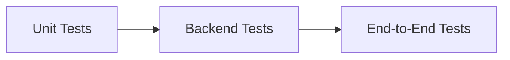
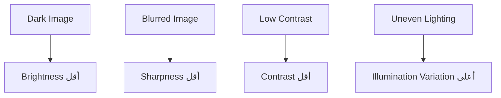
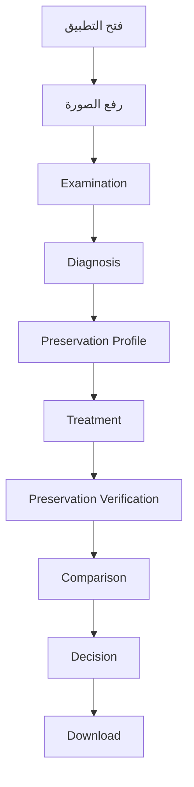

docs/testing.md

<div dir="rtl" align="right">

# 🧪 Manuscript Doctor — خطة الاختبار

> **الغرض من الوثيقة:** تحديد الاختبارات الضرورية لإثبات أن النظام يعمل بصورة صحيحة وآمنة، وأن كل مرحلة من مراحل المعالجة يمكن التحقق منها قبل الاعتماد عليها.

---

## 1. مبدأ الاختبار

لا نعتمد على أن التطبيق:

> "يبدو أنه يعمل"

بل نتحقق من السلوك على ثلاث مستويات:



* **Unit Tests:** اختبار كل وحدة منفصلة.
* **Backend Tests:** اختبار Routes والملفات والـAPI.
* **End-to-End:** اختبار المسار الكامل من المتصفح حتى النتيجة.

---

# 2. ما الذي يجب اختباره؟

| الجزء         | ما نتحقق منه                   |
| ------------- | ------------------------------ |
| Upload        | قبول ورفض الملفات بصورة صحيحة  |
| Analyzer      | صحة البنية واتجاه Metrics      |
| Operations    | صحة الناتج وعدم تعديل Original |
| Recommender   | التوصيات والقواعد              |
| Pipeline      | ترتيب الخطوات وصحة التنفيذ     |
| Preservation  | مقارنة Original وResult        |
| API           | العقود والأخطاء                |
| Frontend      | الحالات والتفاعل               |
| Full Workflow | المسار الكامل للمستخدم         |

---

# 3. مجموعة صور الاختبار

يجب استخدام صور متنوعة، وليس صورة واحدة فقط.

| الصورة                    | الغرض                       |
| ------------------------- | --------------------------- |
| `test_01_normal`          | حالة طبيعية                 |
| `test_02_dark`            | سطوع منخفض                  |
| `test_03_low_contrast`    | تباين منخفض                 |
| `test_04_noisy`           | ضوضاء أو خلفية مزعجة        |
| `test_05_uneven_lighting` | إضاءة غير متجانسة           |
| `test_06_fine_details`    | تفاصيل دقيقة حساسة للمعالجة |

> يفضل أن تكون الصور حقيقية قدر الإمكان، مع إمكانية استخدام صور اصطناعية فقط لاختبار سلوك محدد.

---

# 4. اختبارات Upload

يجب تغطية الحالات التالية:

* [ ] رفع JPG صحيح.
* [ ] رفع JPEG صحيح.
* [ ] رفع PNG صحيح.
* [ ] Request بدون صورة.
* [ ] Filename فارغ.
* [ ] امتداد غير مسموح.
* [ ] ملف نصي باسم `.jpg`.
* [ ] صورة تالفة.
* [ ] ملف أكبر من الحد.
* [ ] صورة ذات أبعاد أكبر من الحد.
* [ ] رفع ملفين بالاسم نفسه ينتج `image_id` مختلفًا.
* [ ] الصورة المحفوظة تطابق Original Bytes.

### النتيجة المطلوبة

أي ملف غير صالح:

```text
Reject
↓
Unified Error Response
↓
No Application Crash
```

---

# 5. اختبارات الهوية والملفات

* [ ] `image_id` فريد.
* [ ] `result_id` فريد.
* [ ] Frontend لا يرسل File Path.
* [ ] لا يمكن استخدام Path Traversal للوصول إلى ملفات أخرى.
* [ ] Original لا يتم الكتابة فوقها.
* [ ] النتائج تحفظ داخل `storage/results`.
* [ ] Runtime Images لا تدخل Git.

---

# 6. اختبارات Analyzer

يجب اختبار:

* [ ] Grayscale.
* [ ] BGR.
* [ ] BGRA.
* [ ] `None`.
* [ ] مصفوفة فارغة.
* [ ] أبعاد الصورة.
* [ ] عدم تعديل Original.

### اتجاهات Metrics

نريد التأكد من أن السلوك منطقي:



> نجاح هذه الاختبارات لا يثبت أن Thresholds النهائية صحيحة؛ العتبات تحتاج تقييمًا على صور واقعية.

---

# 7. اختبارات Diagnosis

لكل Diagnosis Rule:

* [ ] Metric الصحيحة تؤدي إلى Diagnosis المتوقعة.
* [ ] Diagnosis تحتوي `code`.
* [ ] تحتوي `label`.
* [ ] تحتوي `severity`.
* [ ] تحتوي `message`.
* [ ] لا تعتمد على Frontend.
* [ ] Threshold قابلة للتعديل دون تغيير Metric نفسها.

---

# 8. اختبارات Preservation Profile

* [ ] يعيد `low`, `moderate`, أو `high`.
* [ ] يعيد Indicators قابلة للتفسير.
* [ ] يعمل على Original فقط.
* [ ] لا يغير الصورة.
* [ ] لا يدعي وجود "نسبة نص محفوظ".
* [ ] يتغير منطقيًا عندما تتغير المؤشرات التي يعتمد عليها.

---

# 9. اختبارات Operations

كل Operation يجب أن تخضع لنفس القاعدة:

```text
Valid Image
↓
Run Operation
↓
Valid Result
↓
Original Unchanged
```

لكل عملية:

* [ ] تقبل صورة صحيحة.
* [ ] تعيد مصفوفة صورة صحيحة.
* [ ] يمكن حفظ الناتج.
* [ ] لا تعدل المدخل.
* [ ] تتعامل مع نوع الصورة المتوقع.
* [ ] تستخدم Parameters معروفة وموثقة.

العمليات المستهدفة:

* [ ] Grayscale.
* [ ] Median Filter.
* [ ] Gaussian Filter.
* [ ] Histogram Equalization.
* [ ] CLAHE.
* [ ] Sharpening.
* [ ] Canny.
* [ ] Otsu Threshold.
* [ ] Adaptive Threshold.
* [ ] Opening.
* [ ] Closing.

---

# 10. تقييم Operations على صور حقيقية

لا يكفي نجاح Unit Test.

لكل Operation نسجل:

| السؤال                        | ما نبحث عنه         |
| ----------------------------- | ------------------- |
| هل حققت الهدف؟                | مثل تحسين Contrast  |
| هل ظهرت آثار جانبية؟          | Noise أو فقد تفاصيل |
| هل النتيجة مستقرة؟            | على أكثر من صورة    |
| هل تحتاج Parameters أقل/أعلى؟ | معايرة              |
| هل تصلح للـPipeline؟          | نعم / لا / بشروط    |

### قاعدة مهمة

لا نعدل Parameters لتناسب صورة واحدة فقط.

---

# 11. اختبارات Recommender

* [ ] Diagnosis معروفة تنتج Recommendation مناسبة.
* [ ] كل Recommendation لها `operation_id`.
* [ ] يوجد سبب واضح.
* [ ] Preservation Profile تؤثر عند الحاجة.
* [ ] لا يوصي بعملية غير موجودة في Registry.
* [ ] لا يدعي أن المعالجة "الأفضل مطلقًا".

---

# 12. اختبارات Smart Pipeline

يجب التحقق من:

* [ ] تبدأ من Original.
* [ ] الخطوات مرتبة بوضوح.
* [ ] كل خطوة لها سبب.
* [ ] لا تطبق Operations غير ضرورية.
* [ ] Result قابلة للحفظ.
* [ ] Original لا تتغير.
* [ ] فشل Step يعالج بصورة مضبوطة.
* [ ] تمر Result إلى Preservation Verification.

---

# 13. اختبارات Preservation Verification

بعد تنفيذ `preservation.py` يجب اختبار:

* [ ] يحتاج Original وResult معًا.
* [ ] يرفض مدخلات غير صالحة.
* [ ] Metrics قابلة للاختبار مستقلاً.
* [ ] الصور المتطابقة تعطي تغيرًا منخفضًا جدًا.
* [ ] التغيير الكبير يؤدي إلى مؤشرات أعلى.
* [ ] Warning لا تساوي دائمًا Error.
* [ ] Structural Difference لا تعرض كـText Loss.
* [ ] Assessment لا تستخدم صياغات مثل `100% safe`.

---

# 14. اختبارات API

لكل Endpoint:

* [ ] Status Code صحيح.
* [ ] Response تستخدم الشكل الموحد.
* [ ] لا يظهر Stack Trace للمستخدم.
* [ ] IDs غير الصالحة ترفض.
* [ ] Resource غير الموجودة تعيد 404.
* [ ] Operation غير المسجلة ترفض.

الشكل المطلوب:

```json
{
  "success": true,
  "message": "...",
  "data": {},
  "error": null
}
```

---

# 15. اختبارات Frontend

يجب التحقق من:

* [ ] Empty State صحيحة.
* [ ] Local Preview تعمل.
* [ ] أزرار Treatment غير متاحة قبل Upload.
* [ ] Loading State تظهر أثناء الطلب.
* [ ] Processing State واضحة.
* [ ] Verifying State مستقلة.
* [ ] Error تظهر برسالة مفهومة.
* [ ] Warning لا تخفي Result.
* [ ] Download لا يظهر قبل `result_id`.
* [ ] اختيار صورة جديدة يمسح بيانات الصورة السابقة.
* [ ] Desktop يعرض Original وResult بشكل صحيح.
* [ ] Mobile يعرضهما عموديًا.

---

# 16. اختبار المسار الكامل

يجب اختبار هذا السيناريو على كل صورة أساسية:



### النجاح يعني

* لا Crash.
* لا بيانات قديمة.
* Original ثابتة.
* Result صحيحة.
* الرسائل واضحة.
* Download يعمل.

---

# 17. ترتيب إصلاح الأخطاء

الأولوية تكون:

```text
1. التطبيق يتوقف أو ينهار
2. Original تتغير أو الملفات غير آمنة
3. نتائج معالجة أو تشخيص خاطئة
4. API أو State غير متسقة
5. مشكلة UX تمنع الاستخدام
6. تحسينات شكلية
```

لا نصلح التجميل قبل الأخطاء الوظيفية.

---

# 18. سجل الاختبارات

عند اكتشاف مشكلة مهمة، نسجل:

| الحقل   | المحتوى                  |
| ------- | ------------------------ |
| الصورة  | اسم صورة الاختبار        |
| الوظيفة | الجزء الذي اختبر         |
| المتوقع | السلوك الصحيح            |
| الفعلي  | ما حدث                   |
| السبب   | بعد التحليل              |
| الحل    | التعديل المنفذ           |
| الحالة  | Passed / Failed / Retest |

---

# 19. بوابة الجودة قبل الإغلاق

لا تعتبر المرحلة النهائية ناجحة حتى:

* [ ] جميع Unit Tests الأساسية ناجحة.
* [ ] جميع Backend Tests الأساسية ناجحة.
* [ ] المسار الكامل يعمل.
* [ ] تم اختبار صور متنوعة.
* [ ] Thresholds المهمة تمت مراجعتها تجريبيًا.
* [ ] Original لم تتغير في أي اختبار.
* [ ] Preservation Warnings مفهومة.
* [ ] لا توجد مشكلة تمنع العرض.
* [ ] الوثائق تطابق السلوك الفعلي.

---

<div align="center">

### 🧪 Testing Principle

**Test the code.**
**Test the image behavior.**
**Test the complete workflow.**
**Never trust a result because it only looks good.**

</div>

</div>
