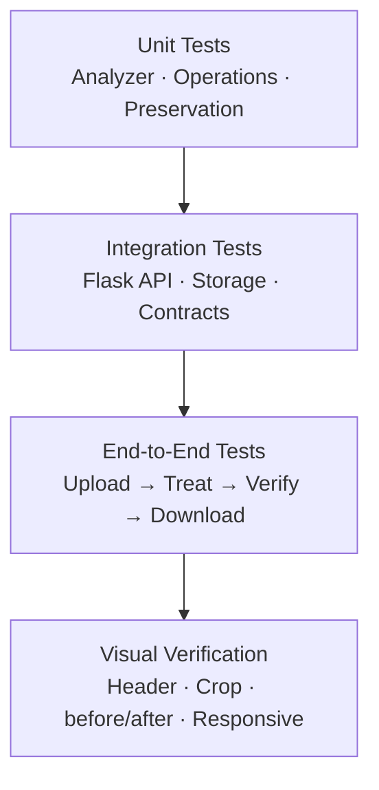
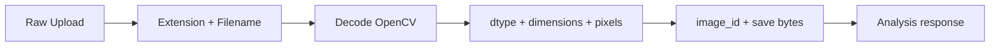
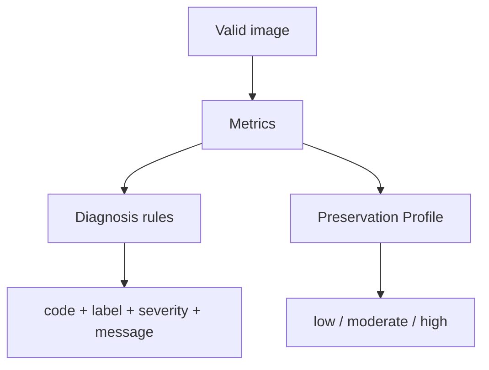
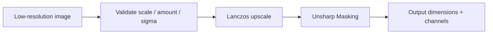
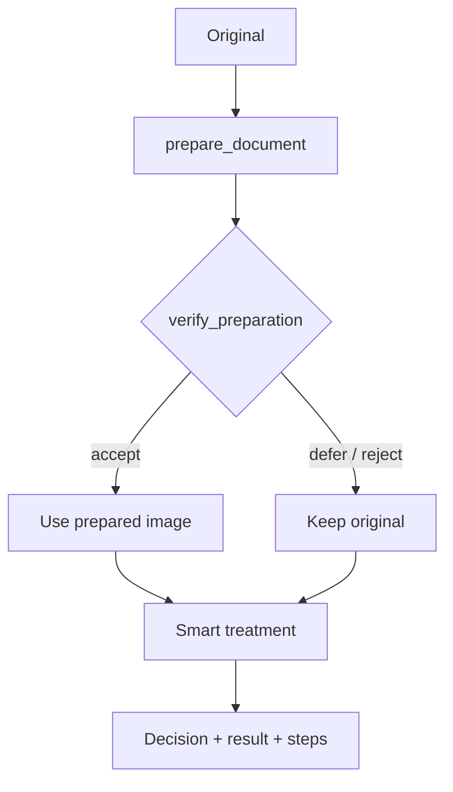
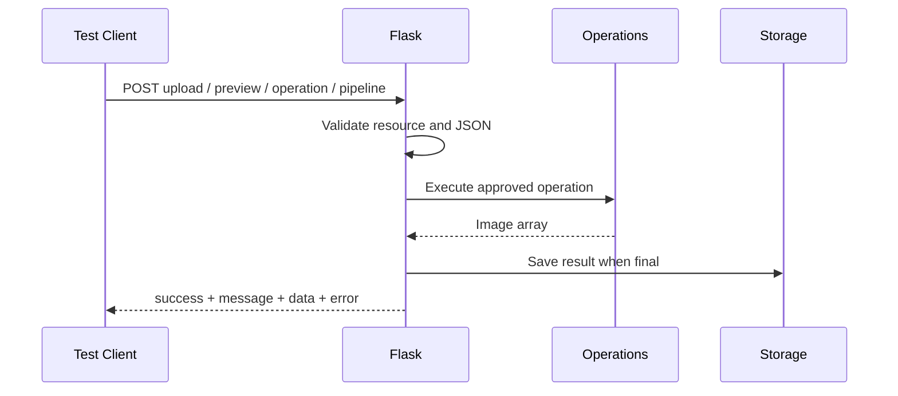
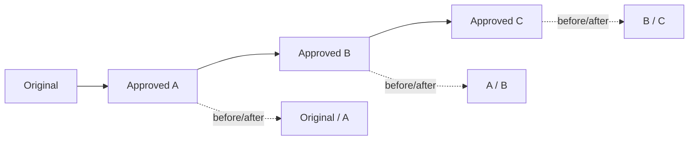

<div dir="rtl" align="right">

# 🧪 Manuscript Doctor — استراتيجية الاختبار

> **غرض الوثيقة:** إثبات أن النظام يعمل وظيفياً، وأن عمليات OpenCV لا تفسد الأصل، وأن واجهة المعاينة والاعتماد والسلسلة تعرض الحالة الصحيحة.
>
> الاختبار هنا ليس لقطة نجاح واحدة؛ بل طبقات مترابطة تشمل الوحدة، API، السلسلة، الصور الفعلية، والواجهة الحية.

---

## 1. هرم الاختبار



| الطبقة | السؤال الذي تجيب عنه |
| --- | --- |
| Unit | هل تنفذ الوحدة الخوارزمية بعقدها ولا تعدل مدخلها؟ |
| Integration | هل تصل الوحدات عبر Flask وتحفظ النتائج بصورة صحيحة؟ |
| End-to-End | هل يستطيع المستخدم إكمال المسار من الرفع حتى التنزيل؟ |
| Visual | هل تظهر الحالة والنتيجة في المكان الصحيح دون تأخر أو قص؟ |

نجاح طبقة لا يعوض فشل طبقة أخرى؛ فقد تنجح دالة OpenCV بينما تكون before/after غير متزامنة في المتصفح.

---

## 2. أوامر التحقق المعتمدة

من جذر المشروع:

```bash
PYTHONPATH=. pytest -q tests

for f in static/js/parts/*.js; do
  node --check "$f"
done
```

النتيجة المرجعية الحالية:

```text
333 passed, 16 skipped
JavaScript syntax check: passed
```

يجب تشغيل الأمرين بعد تعديل Processing أو API أو JavaScript. أما تعديلات CSS فتحتاج بالإضافة إلى ذلك فحصاً بصرياً في المتصفح.

---

## 3. خريطة الاختبارات الموجودة

| الملف | النطاق |
| --- | --- |
| `test_analyzer.py` | المؤشرات والتحليل وأنواع الصور |
| `test_recommender.py` | التوصيات وقواعد الاستبعاد |
| `test_operations.py` | registry والعمليات والمعاملات وSuper Resolution |
| `test_crop_operations.py` | قيم Crop وحدوده |
| `test_orientation_operations.py` | Rotate وFlip |
| `test_document_boundary.py` | اكتشاف حدود الوثيقة |
| `test_document_rectification.py` | التصحيح المنظوري |
| `test_auto_deskew.py` | كشف وتصحيح الميل |
| `test_preparation_pipeline.py` | تجهيز الوثيقة |
| `test_preparation_verification.py` | قبول أو تأجيل Preparation وdeskew-only |
| `test_pipeline.py` | ترتيب المرشحات والسياسة |
| `test_smart_document_pipeline.py` | المسار الذكي وقراراته |
| `test_preservation.py` | مؤشرات المحافظة والتقييم |
| `test_backend_integration.py` | Flask ورفع الصور وPreview وApprove وJPEG |
| `test_app.py` | تكامل التطبيق والاستجابات الأساسية |
| `test_end_to_end.py` | المسار الكامل |
| `test_orientation_api.py` | عقود عمليات الاتجاه عبر API |
| `test_document_preparation_chain.py` | ربط Preparation بالمسار اللاحق |
| `pytest.ini` | حصر الاختبار في مجلد `tests` ومنع تكرار ملفات release |

---

## 4. اختبار الرفع والموارد



يجب أن تغطي الاختبارات:

| الحالة | المتوقع |
| --- | --- |
| JPG أو JPEG أو PNG صالح | `201` و`image_id` وتحليل |
| لا يوجد حقل `image` | `NO_FILE` دون Crash |
| اسم فارغ | `EMPTY_FILENAME` |
| امتداد غير مسموح | `UNSUPPORTED_FILE_TYPE` |
| ملف غير صورة أو تالف | `UNREADABLE_IMAGE` |
| طلب يتجاوز `20 MB` | رفض مضبوط |
| صورة تتجاوز `30,000,000` بكسل | `IMAGE_DIMENSIONS_TOO_LARGE` |
| تكرار اسم ملف | معرفات مستقلة |
| حفظ الأصل | البايتات المحفوظة تطابق الأصل بعد التحقق |
| معرف غير صالح أو ملف مفقود | استجابة خطأ مناسبة دون كشف المسار |

---

## 5. اختبار Analyzer وDiagnosis

يفحص Analyzer الصور Grayscale وBGR وBGRA عبر نسخة عمل مناسبة، دون تعديل المصفوفة الأصلية.



تتضمن التغطية:

```text
None
Empty array
Grayscale
BGR
BGRA
أبعاد وقنوات مختلفة
عدم تعديل المدخل
```

وتراجع الاتجاهات المنطقية على صور اختبار مناسبة:

| التغيير في الصورة | المؤشر المتوقع |
| --- | --- |
| تعتيم الصورة | Brightness أقل |
| خفض التباين | Contrast أقل |
| تمويه الصورة | Sharpness أقل غالباً |
| إضاءة غير متجانسة | Illumination Variation أعلى |
| ضوضاء قوية | Noise Indicator أعلى غالباً |

هذه اختبارات سلوك وليست إثباتاً أن Thresholds مثالية علمياً؛ العتبات الحالية Heuristics قابلة للمعايرة.

---

## 6. اختبار Operation Registry والعمليات

تستخدم كل عملية العقد الآتي:

```text
Image array
  ↓
Validate parameters
  ↓
Apply operation
  ↓
New image array
  ↓
Input unchanged
```

### ما يفحص لكل عملية

| الفحص | الغرض |
| --- | --- |
| معرف مسجل | منع استدعاء دالة غير معلنة |
| صورة صالحة | منع OpenCV من استقبال مدخل غير مناسب |
| معاملات صحيحة | كشف القيم الناقصة أو الخارجة عن الحدود |
| نوع وقنوات النتيجة | منع نتيجة غير قابلة للعرض أو الحفظ |
| عدم تعديل المدخل | الحفاظ على الأصل ومصدر السلسلة |
| حد الحجم | منع انفجار الذاكرة في التكبير |

### فئات العمليات الحالية

```text
Geometry: crop, deskew, rotate, flip
Enhancement: CLAHE, histogram, faded-text, intensity, gamma, illumination, sharpen
Denoising: median, bilateral, non-local-means
Thresholding: global, Otsu, adaptive
Morphology: opening, closing, top-hat, black-hat
Document: background and weak-structure suppression
Detail: super_resolution
```

لا تدرج الاختبارات عملية غير موجودة في registry على أنها منفذة؛ يمكن ذكرها في خطة مستقبلية فقط.

---

## 7. اختبار Super Resolution



يجب إثبات أن:

1. `scale=2` يضاعف العرض والارتفاع ضمن الحد الآمن.
2. `scale=3` يقبل فقط إذا بقي الناتج ضمن حدود الحجم.
3. `amount` و`sigma` يرفضان القيم غير الصالحة.
4. المدخل لا يتغير.
5. العملية تمر عبر registry وFlask مثل أي Manual Operation.
6. العملية لا تُضاف إلى Smart Pipeline تلقائياً.
7. النتيجة تحسن الحواف ظاهرياً دون ادعاء استعادة حروف فقدت بالكامل.

---

## 8. اختبار Crop وOrientation

تستخدم اختبارات Crop إحداثيات المصدر لا إحداثيات الشاشة فقط. يجب أن يثبت الاختبار:

```text
Crop draft
  ↓
x / y / width / height
  ↓
Flask/OpenCV approve
  ↓
Output width / height matches crop
```

وتثبت اختبارات الاتجاه أن:

| العملية | النتيجة |
| --- | --- |
| `rotate_right` | تدوير 90° إلى اليمين |
| `rotate_left` | تدوير 90° إلى اليسار |
| `flip_vertical` | قلب رأسي |
| `flip_horizontal` | قلب أفقي |

تُختبر هذه العمليات أيضاً كخطوات متتابعة حتى لا تختلط نتيجة الخطوة الحالية بمصدر الخطوة السابقة.

---

## 9. اختبار Preparation وSmart Pipeline



| السيناريو | دليل القبول |
| --- | --- |
| حدود موثوقة | يمكن استخدام تجهيز الوثيقة بعد التحقق |
| C05 | يقبل deskew-only عالي الثقة، دون قص أو منظور غير موثوق |
| C06 | لا يفرض deskew-only عند انخفاض الثقة |
| Preparation مرفوضة | تظهر `deferred` أو `review_required` ويبقى الأصل |
| مرشح عالي المخاطر | لا يعتمد تلقائياً |
| Binarization | تظهر كمرشحين مستقلين |
| Super Resolution | لا تدخل Smart تلقائياً |
| كل خطوة | تسجل العملية والمعاملات والسبب والقرار |

لا يتطلب Smart Pipeline زمناً لحظياً؛ الكلفة تشمل Preparation والتحليل والتحقق، بينما هدف السرعة يخص المعاينات اليدوية الخفيفة.

---

## 10. اختبار Preservation Verification

تقارن الوحدة `Original + Processed Result`، ولا تستخدم OCR أو فهماً لغوياً للنص.

| الاختبار | المتوقع |
| --- | --- |
| مدخلات غير صالحة | رفض مضبوط |
| صورة مطابقة | تغير منخفض جداً |
| تغيير بنيوي واضح | مؤشرات أعلى أو Warning |
| Enhancement عادي | لا يفسر اختلاف البكسلات وحده كفقد نص |
| تعذر التقييم | Result قد تبقى مع تحذير، دون `Acceptable` تلقائي |
| Binarization | تقييم محافظ بسبب تغير المظهر العام |
| النتيجة النهائية | `acceptable` أو `caution` أو `high_risk` كمؤشر مساعد |

ممنوع اختبار أو عرض `100% safe` أو «نسبة النص المحفوظ» لأن الوحدة لا تثبت ذلك.

---

## 11. اختبار API والعقود



لكل endpoint يجب فحص:

```text
Status code
Unified response envelope
Invalid ID
Missing resource
Invalid operation
Invalid parameters
Source result mismatch
No traceback leakage
```

وتفحص الاختبارات المسارات الحالية:

```text
POST /api/images
POST /api/images/<id>/preview
POST /api/images/<id>/operations
POST /api/images/<id>/pipeline
GET  /api/images/<id>
GET  /api/results/<id>
GET  /api/results/<id>/download
POST /api/images/<id>/preparation/preview
POST /api/images/<id>/preparation/<preparation_id>/approve
```

ويختبر التكامل اختيارياً `X-Preview-Format: jpeg`، مع بقاء PNG هو السلوك الافتراضي.

---

## 12. اختبار Manual Chain وbefore/after



يجب إثبات:

| الحالة | المتوقع |
| --- | --- |
| قبل أول اعتماد | Candidate فقط، دون `result_id` نهائي |
| اعتماد A | `manualChain` يحوي A والمؤشر عند A |
| اعتماد B | `source_result_id = A` وbefore = A وafter = B |
| Undo | عرض الخطوة السابقة من الكاش أو النتيجة المحفوظة |
| Redo | إعادة عرض الخطوة اللاحقة دون إعادة تنفيذ |
| اعتماد بعد Undo | إزالة الفرع اللاحق وبدء فرع نشط واضح |
| صورة جديدة | تصفير السلسلة والنتائج والتحليل القديم |

هذا الاختبار لا يكتفي بفحص قيم state؛ يجب فحص `src` الفعلي للصورتين في المتصفح.

---

## 13. اختبار Frontend والواجهة الحية

تشمل المراجعة اليدوية:

| العنصر | التحقق |
| --- | --- |
| Header | الصورة كاملة كخلفية فقط، دون Hero مكرر |
| Workflow | ثابت، واضح، وقابل للتمرير ضيقاً |
| Upload | Drop Zone وLocal Preview وتغيير الصورة |
| Dashboard | البطاقات والرسم الخطي للظلال والإضاءات |
| Manual Editor | before/after وChart داخل لوحة العملية |
| Local Preview | العمليات الخفيفة لا ترسل `/preview` |
| Server Preview | العمليات الثقيلة ترسل JPEG اختيارياً |
| Crop | المقابض قابلة للسحب والقيم لا تتجاوز المصدر |
| Approval | زر اعتماد واحد فقط |
| Smart | النتيجة تظهر داخل المحرر نفسه |
| Footer | لا يسبب overflow على الشاشة الضيقة |

---

## 14. سيناريوهات C05 وC06

| الصورة | الاختبارات المطلوبة | النتيجة المرجعية |
| --- | --- | --- |
| C05 `960×1280`، نحو `158 KB` | رفع، Preview، CLAHE، Super Resolution، Smart، Preparation | Smart يقبل deskew-only عند الثقة العالية؛ Super Resolution تضاعف الأبعاد عند اعتماد 2× |
| C06 | رفع، Manual Chain، Crop، Undo/Redo، Smart | لا يُفرض تجهيز غير موثوق؛ before/after والسلسلة يطابقان الخطوة النشطة |

حجم الملف وحده لا يفسر زمن Smart؛ يجب فصل زمن Preview الخفيف عن زمن Preparation والتحليل والتحقق.

---

## 15. سجل العطل وإعادة الاختبار

عند اكتشاف مشكلة، يسجل الفريق:

| الحقل | المحتوى |
| --- | --- |
| الصورة | C05 أو C06 أو صورة أخرى |
| المسار | Upload / Preview / Approve / Smart / UI |
| المتوقع | السلوك الصحيح |
| الفعلي | النتيجة المرصودة |
| السبب | تحليل الكود أو الشبكة أو CSS |
| الإصلاح | الملف والتغيير |
| إعادة الاختبار | الأمر أو السيناريو |
| الحالة | Fixed / Retest / Accepted |

لا تغلق المشكلة بعبارة «يبدو جيداً»؛ يجب تسجيل دليل قابل لإعادة التشغيل.

---

## 16. بوابة الجودة قبل التسليم

لا تعتبر النسخة جاهزة حتى تمر الشروط الآتية:

```text
Python regression passed
JavaScript syntax passed
API contracts passed
Original unchanged
Manual chain correct
before/after correct
Crop dimensions correct
Smart preparation conservative
C05 and C06 checked
Header and responsive layout checked
Documentation matches code
```

النتيجة المرجعية الحالية:

```text
333 passed, 16 skipped
```

</div>
