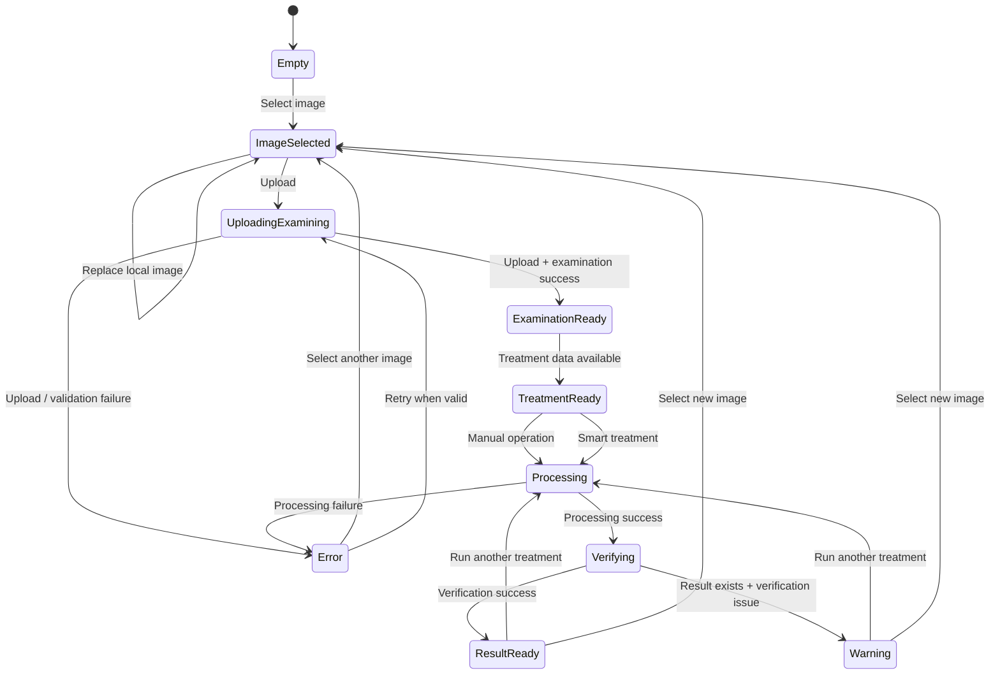

docs/ui-states.md

<div dir="rtl" align="right">

# 🎛️ Manuscript Doctor — حالات واجهة المستخدم

> **الغرض من الوثيقة:** تحديد الحالات التي تمر بها واجهة Manuscript Doctor، وما الذي يظهر أو يختفي أو يتعطل في كل حالة، وكيف تنتقل الواجهة بينها بصورة واضحة ومتوقعة.
> هذه الوثيقة تصف **سلوك الواجهة فقط**؛ أما شكلها البنيوي ففي `wireframes.md`، ومكوناتها في `frontend-components.md`، وتدفق النظام الكامل في `workflow.md`.

---

## 1. المبدأ العام

واجهة Manuscript Doctor لا تعرض جميع الأقسام منذ البداية.

بل تتقدم مع المستخدم حسب حالة النظام:

```text
Empty
   ↓
Image Selected
   ↓
Uploading / Examining
   ↓
Examination Ready
   ↓
Treatment Ready
   ↓
Processing
   ↓
Verifying
   ↓
Result Ready
```

مع حالتين يمكن أن تظهران عند الحاجة:

```text
Warning
Error
```

الهدف هو:

> **إظهار ما يحتاجه المستخدم في اللحظة الحالية، وإخفاء ما لا يمكن استخدامه بعد.**

---

# 2. الحالات الأساسية

| الحالة                              | المعنى                                 | العناصر الأساسية الظاهرة                                  | العناصر غير المتاحة                   |
| ----------------------------------- | -------------------------------------- | --------------------------------------------------------- | ------------------------------------- |
| **State 1 — Empty**                 | لم يتم اختيار صورة                     | Header + Upload Area                                      | جميع أقسام التحليل والمعالجة والنتائج |
| **State 2 — Image Selected**        | تم اختيار صورة محليًا ولم ترفع بعد     | Upload + Local Preview + Filename + زر الرفع              | Examination وما بعدها                 |
| **State 3 — Uploading / Examining** | جاري رفع الصورة والتحقق منها وفحصها    | Preview + Progress State                                  | أزرار الرفع والمعالجة                 |
| **State 4 — Examination Ready**     | انتهى فحص الصورة                       | Original + Examination + Diagnosis + Preservation Profile | Result Sections                       |
| **State 5 — Treatment Ready**       | توجد معلومات كافية لبدء المعالجة       | Recommendation + Smart Treatment + Manual Tools           | Result Sections                       |
| **State 6 — Processing**            | جاري تنفيذ معالجة                      | Processing Indicator                                      | جميع أزرار المعالجة والرفع            |
| **State 7 — Verifying**             | انتهت المعالجة ويجري تقييم أثرها       | Verification Indicator                                    | بدء معالجة أخرى حتى انتهاء التحقق     |
| **State 8 — Result Ready**          | النتيجة والتقييم جاهزان                | Comparison + Verification + Decision + Summary + Download | لا شيء أساسي                          |
| **State 9 — Warning**               | توجد نتيجة لكنها تحتاج انتباه المستخدم | Result + Warning + Assessment                             | لا يمنع عرض Result بالضرورة           |
| **State 10 — Error**                | تعذر إكمال إجراء أساسي                 | Error Message + Recovery Action                           | الأجزاء المرتبطة بالإجراء الفاشل      |

---

# 3. State 1 — Empty

## الحالة

لم يحدد المستخدم أي صورة بعد.

### يظهر

```text
Header
Upload Area
Short Introduction
```

### يخفى

```text
Preview
Examination
Diagnosis
Preservation Profile
Recommendations
Manual Tools
Comparison
Preservation Verification
Decision
Treatment Summary
Download
```

### الإجراء المتاح

> اختيار صورة.

### Wireframe مبسط

```text
┌─────────────────────────────────────┐
│        🩺 Manuscript Doctor         │
├─────────────────────────────────────┤
│                                     │
│       ابدأ برفع صورة مخطوطة        │
│                                     │
│   [ اسحب الصورة أو اختر ملفًا ]    │
│                                     │
└─────────────────────────────────────┘
```

---

# 4. State 2 — Image Selected

## الحالة

اختار المستخدم ملفًا، لكن لم يرسل إلى Backend بعد.

### يظهر

* Local Preview.
* اسم الملف.
* زر **رفع وفحص الصورة**.
* خيار اختيار صورة أخرى.

### لا يحدث بعد

* لا Diagnosis.
* لا Metrics من Backend.
* لا Recommendation.
* لا Processing.

### مهم

Local Preview لا تعني أن الصورة أصبحت معتمدة داخل النظام.

هي مجرد معاينة داخل المتصفح.

```text
Selected File
     ↓
Local Preview Only
     ↓
Not Uploaded Yet
```

---

# 5. الانتقال: Empty → Image Selected

يحدث عندما:

* يضغط المستخدم على منطقة اختيار الصورة.
* أو يسحب صورة إلى Drop Area.

### السلوك المطلوب

1. قراءة الملف داخل المتصفح للمعاينة.
2. عرض الصورة.
3. عرض اسم الملف.
4. تفعيل زر:

> **رفع وفحص الصورة**

### إذا غيّر المستخدم الصورة

يتم استبدال Local Preview السابقة مباشرة قبل بدء الرفع.

---

# 6. State 3 — Uploading / Examining

## الحالة

ضغط المستخدم:

> **رفع وفحص الصورة**

وأصبح الطلب قيد التنفيذ.

### يظهر

```text
Original Preview
+
Loading Indicator
+
"جاري رفع الصورة وفحصها..."
```

### يعطل

* زر رفع الصورة.
* تغيير الصورة أثناء الطلب.
* Manual Operations.
* Smart Treatment.
* أي زر يمكن أن ينشئ Request جديدًا يعتمد على الصورة.

### السبب

منع:

```text
Duplicate Requests
Concurrent Uploads
Inconsistent UI State
```

---

## الرسالة المقترحة

> جاري رفع الصورة والتحقق منها وفحص حالتها...

### لا تستخدم

> جاري تحليل الذكاء الاصطناعي...

لأن النظام لا يستخدم AI في هذه المرحلة.

---

# 7. الانتقال: Image Selected → Uploading / Examining

```text
Image Selected
      ↓
User clicks Upload
      ↓
Disable Interactive Actions
      ↓
Send POST /api/images
      ↓
Uploading / Examining
```

---

# 8. State 4 — Examination Ready

## الحالة

تم:

* رفع الصورة.
* التحقق منها.
* إنشاء `image_id`.
* حفظ Original.
* تنفيذ Examination.

### يظهر

* Original Image.
* Dimensions.
* Visual Metrics.
* Diagnosis.
* Preservation Profile.

### لا يظهر بعد

* Comparison.
* Result.
* Preservation Verification.
* Decision.
* Download.

---

## الترتيب البصري

```text
Original
   ↓
Examination
   ↓
Diagnosis
   ↓
Preservation Profile
```

---

# 9. Examination Display

تعرض الواجهة المؤشرات بطريقة سهلة القراءة.

مثال:

```text
Brightness
Low

Contrast
Moderate

Sharpness
Good
```

إذا كانت القيمة الخام مفيدة يمكن إظهارها كتفصيل إضافي:

```text
Brightness
Low
74.2
```

لكن لا يجب أن تكون الأرقام الخام هي العنصر الأكثر بروزًا.

---

# 10. Diagnosis Display

كل Diagnosis يجب أن تعرض:

```text
Severity
+
Label
+
Message
```

مثال:

```text
⚠ تباين منخفض

تشير القياسات إلى انخفاض التباين في الصورة.
```

ولا تحتاج الواجهة إلى عرض:

```text
code = low_contrast
```

للمستخدم العادي.

---

# 11. Preservation Profile Display

يظهر بعد Diagnosis بصورة مستقلة.

مثال:

```text
🛡️ حساسية المحافظة

MODERATE

توجد مؤشرات تستدعي استخدام معالجة متوازنة
ومراقبة أثرها على التفاصيل.
```

إذا وجدت Indicators:

```text
لماذا؟

• بعض التفاصيل ضعيفة التباين.
• الحواف الحالية تحتاج إلى معالجة حذرة.
```

---

# 12. State 5 — Treatment Ready

## الحالة

أصبحت الصورة جاهزة لاختيار Treatment.

### يظهر

* Recommended Treatment.
* سبب التوصية.
* Smart Treatment button.
* Manual Tools.

### يعتمد على

```text
Examination
+
Diagnosis
+
Preservation Profile
```

---

## إذا لم توجد Recommendation

لا يجب أن تنكسر الواجهة.

يمكن عرض:

> لا توجد معالجة تلقائية محددة لهذه الحالة حاليًا. يمكنك استخدام أدوات المعالجة اليدوية.

---

# 13. الانتقال: Examination Ready → Treatment Ready

قد يحدث مباشرة بعد اكتمال Recommendation.

```text
Examination Ready
        ↓
Recommendation Available
        ↓
Treatment Ready
```

مفاهيميًا هما حالتان مختلفتان، حتى لو ظهرتا للمستخدم خلال نفس الاستجابة بسرعة.

---

# 14. Manual Treatment Ready

الأدوات اليدوية لا تكون قابلة للتنفيذ قبل وجود:

```text
image_id
```

صحيح.

### إذا لم توجد صورة مرفوعة

الأزرار:

```text
Disabled
```

أو القسم:

```text
Hidden
```

والأفضل في الـMVP إخفاؤه حتى يصبح مفيدًا.

---

# 15. Smart Treatment Ready

زر المعالجة التلقائية يظهر أو يتفعل فقط عندما تتوفر البيانات التي تحتاجها Pipeline.

مثال:

```text
[ تشغيل المعالجة المحافظة ]
```

### لا تستخدم

```text
[ AI Enhance ]
[ Magic Fix ]
[ Auto Restore ]
```

لأنها لا تصف حقيقة النظام.

---

# 16. State 6 — Processing

## الحالة

بدأت إحدى العمليات:

```text
Manual Operation
```

أو:

```text
Smart Pipeline
```

### يظهر

```text
⏳ جاري تنفيذ المعالجة...
```

ويمكن إظهار اسم العملية عند الحاجة:

```text
جاري تطبيق CLAHE...
```

أو:

```text
جاري تنفيذ خطة المعالجة المقترحة...
```

---

## أثناء Processing

تعطل:

* جميع Manual Operation Buttons.
* Smart Treatment.
* Upload button.
* أي Control يمكن أن يبدأ معالجة أخرى.

### السبب

منع:

```text
Concurrent Processing
Result Conflicts
Multiple Requests
```

---

# 17. الانتقال: Treatment Ready → Processing

```text
Treatment Ready
      ↓
User selects Treatment
      ↓
Disable treatment controls
      ↓
Send Request
      ↓
Processing
```

---

# 18. State 7 — Verifying

هذه حالة أساسية في Manuscript Doctor.

## الحالة

نجحت المعالجة، لكن النظام لم ينته بعد.

يبدأ:

```text
Original
+
Processed Result
      ↓
Preservation Verification
```

### يظهر

```text
🛡️ جاري فحص أثر المعالجة على التفاصيل...
```

### يظل معطلًا

* بدء Treatment جديدة.
* Download إذا لم يتم تثبيت Result بعد.
* أي Action يعتمد على Preservation Assessment.

---

# 19. لماذا Verifying حالة مستقلة؟

لأن فلسفة المشروع لا تعتبر:

```text
Processing Finished
=
Treatment Accepted
```

بل:

```text
Processing Finished
      ↓
Verification
      ↓
Assessment
```

لذلك يجب أن تعكس الواجهة هذا الفرق.

---

# 20. الانتقال: Processing → Verifying

يحدث إذا:

```text
Processing = Success
```

ثم:

```text
Preservation Verification starts
```

---

# 21. State 8 — Result Ready

## الحالة

تمت المعالجة وانتهى تقييم Result.

### يظهر

* Original.
* Processed Result.
* Preservation Metrics.
* Warnings إن وجدت.
* Assessment.
* Treatment Decision.
* Treatment Summary.
* Download.

---

## ترتيب الأقسام

```text
Comparison
    ↓
Preservation Verification
    ↓
Treatment Decision
    ↓
Treatment Summary
    ↓
Download
```

---

# 22. Comparison State

على Desktop:

```text
┌─────────────────┐   ┌─────────────────┐
│     Original    │   │      Result     │
│                 │   │                 │
│     [IMAGE]     │   │     [IMAGE]     │
│                 │   │                 │
└─────────────────┘   └─────────────────┘
```

على Mobile:

```text
Original
[IMAGE]

   ↓

Result
[IMAGE]
```

---

# 23. Preservation Assessment States

يمكن أن تكون النتيجة:

```text
acceptable
caution
high_risk
```

كل حالة يجب أن تختلف بصريًا ورسائليًا، لكن دون مبالغة.

---

## Acceptable

### المعنى

لم تظهر المؤشرات الحالية تغيرًا بنيويًا قويًا غير مرغوب.

### الرسالة

> لم تظهر مؤشرات قوية على تغير بنيوي غير مرغوب وفق المقاييس المستخدمة.

### لا تقل

> النتيجة آمنة 100%.

---

## Caution

### المعنى

ظهرت بعض المؤشرات التي تستدعي مراجعة Result.

### الرسالة

> توجد مؤشرات تستدعي مراجعة النتيجة قبل اعتمادها.

---

## High Risk

### المعنى

تشير المؤشرات إلى تغير بنيوي مرتفع نسبيًا.

### الرسالة

> تشير بعض المؤشرات إلى تغير بنيوي مرتفع نسبيًا، ويوصى بتجربة معالجة أكثر تحفظًا.

---

# 24. State 9 — Warning

Warning ليست Error.

الفرق:

```text
Error
→ تعذر إكمال وظيفة أساسية

Warning
→ الوظيفة اكتملت لكن توجد ملاحظة مهمة
```

---

## أمثلة Warning

### Preservation Caution

```text
⚠ تحتاج النتيجة إلى مراجعة.
```

### Preservation Verification unavailable

```text
⚠ تم إنشاء النتيجة، لكن تعذر إكمال فحص المحافظة.
```

### High-Risk Result

```text
⚠ المعالجة أحدثت تغيرات بنيوية مرتفعة نسبيًا.
```

---

# 25. Warning مع Result صحيحة

يمكن أن تكون الحالة:

```text
Result
   ✓

Preservation Verification
   ✗
```

الواجهة تعرض:

```text
Processed Result
+
Warning
+
"Preservation Assessment غير متاح"
```

ولا تخفي Result.

### لكن

لا تعرض:

```text
Acceptable
```

إذا لم يكتمل التقييم.

---

# 26. State 10 — Error

## الحالة

فشل إجراء يمنع إكمال المسار الحالي.

### يظهر

```text
Error Title
+
Human-readable Message
+
Recovery Action
```

مثال:

```text
⚠ تعذر رفع الصورة

الملف المحدد لا يمكن قراءته كصورة صالحة.

[ اختيار صورة أخرى ]
```

---

# 27. أنواع أخطاء الرفع

| Code                         | الرسالة المقترحة للمستخدم                       | الإجراء التالي       |
| ---------------------------- | ----------------------------------------------- | -------------------- |
| `NO_FILE`                    | لم يتم اختيار صورة.                             | اختر صورة            |
| `EMPTY_FILENAME`             | لم يتم تحديد ملف صالح.                          | اختر صورة أخرى       |
| `UNSUPPORTED_FILE_TYPE`      | نوع الملف غير مدعوم. استخدم JPG أو JPEG أو PNG. | اختر صيغة مدعومة     |
| `FILE_TOO_LARGE`             | حجم الملف يتجاوز الحد المسموح.                  | اختر ملفًا أصغر      |
| `IMAGE_DIMENSIONS_TOO_LARGE` | أبعاد الصورة أكبر من الحد المسموح.              | اختر صورة بأبعاد أقل |
| `UNREADABLE_IMAGE`           | تعذر قراءة الملف كصورة صالحة.                   | اختر صورة أخرى       |

---

# 28. أخطاء الموارد

| Code                | الرسالة المقترحة                                 |
| ------------------- | ------------------------------------------------ |
| `IMAGE_NOT_FOUND`   | الصورة المطلوبة لم تعد متاحة. أعد رفع الصورة.    |
| `RESULT_NOT_FOUND`  | النتيجة المطلوبة غير موجودة. أعد تنفيذ المعالجة. |
| `INVALID_OPERATION` | عملية المعالجة المطلوبة غير متاحة.               |

---

# 29. أخطاء المعالجة

| Code                        | الرسالة المقترحة                               |
| --------------------------- | ---------------------------------------------- |
| `PROCESSING_FAILED`         | تعذر تنفيذ المعالجة على هذه الصورة.            |
| `PRESERVATION_CHECK_FAILED` | تم إنشاء النتيجة، لكن تعذر إكمال فحص المحافظة. |
| `INTERNAL_ERROR`            | حدث خطأ غير متوقع. حاول مرة أخرى.              |

> `PRESERVATION_CHECK_FAILED` قد يظهر كWarning بدل Error كامل إذا كانت Result نفسها صالحة.

---

# 30. لا تعرض الأخطاء التقنية الخام

ممنوع إظهار:

```text
Traceback
cv2.error(...)
FileNotFoundError
ValueError at line ...
```

للمستخدم النهائي.

هذه المعلومات يمكن تسجيلها أثناء التطوير، لكن الواجهة تعرض رسالة مفهومة فقط.

---

# 31. Recovery Actions

كل Error يجب أن يجيب عن:

> ماذا أفعل الآن؟

| المشكلة           | Recovery Action                         |
| ----------------- | --------------------------------------- |
| صورة غير صالحة    | اختيار صورة أخرى                        |
| الملف كبير        | اختيار ملف أصغر                         |
| الصورة غير موجودة | إعادة رفع الصورة                        |
| فشل Processing    | إعادة المحاولة أو اختيار Treatment أخرى |
| Result غير موجودة | إعادة تنفيذ المعالجة                    |
| خطأ داخلي مؤقت    | إعادة المحاولة                          |

---

# 32. رفع صورة جديدة بعد وجود Result

إذا كان المستخدم في:

```text
Result Ready
```

ثم اختار صورة جديدة:

يجب اعتبارها جلسة معالجة جديدة داخل الواجهة.

المسار:

```text
Result Ready
     ↓
Select New Image
     ↓
Clear Previous Active Result
     ↓
Image Selected
```

### يجب تصفير

* `image_id` الحالي حتى نجاح الرفع الجديد.
* `result_id`.
* Diagnosis القديمة.
* Preservation Profile القديمة.
* Recommendation القديمة.
* Result القديمة.
* Preservation Assessment القديمة.
* Download URL القديم.

---

# 33. تطبيق Treatment جديدة بعد Result Ready

إذا اختار المستخدم Operation أخرى على **نفس Original**:

```text
Result Ready
      ↓
New Treatment
      ↓
Processing
      ↓
Verifying
      ↓
New Result Ready
```

يتم استبدال Result المعروضة حاليًا بالنتيجة الأحدث.

لكن Original لا تتغير.

---

# 34. Download State

زر Download يكون:

```text
Hidden
```

أو:

```text
Disabled
```

حتى وجود Result حقيقية.

الأفضل في التصميم:

> إخفاؤه قبل وجود Result.

بعد Result Ready:

```text
result_id exists
      ↓
Download Enabled
```

---

# 35. حالة Download عند Warning

إذا كانت Result موجودة لكن Preservation Assessment:

```text
caution
```

أو:

```text
high_risk
```

يمكن السماح بالتنزيل.

السبب:

> النظام يقدم Decision Support ولا يمنع المستخدم من الوصول إلى Result.

لكن Warning يجب أن تكون واضحة قبل التنزيل.

---

# 36. سلوك الأزرار حسب الحالة

| الحالة                |   Upload  | Manual Tools | Smart Treatment | Download |
| --------------------- | :-------: | :----------: | :-------------: | :------: |
| Empty                 |     —     |       ❌      |        ❌        |     ❌    |
| Image Selected        |     ✅     |       ❌      |        ❌        |     ❌    |
| Uploading / Examining |     ❌     |       ❌      |        ❌        |     ❌    |
| Examination Ready     |     ✅     |       ⏳      |        ⏳        |     ❌    |
| Treatment Ready       |     ✅     |       ✅      |        ✅        |     ❌    |
| Processing            |     ❌     |       ❌      |        ❌        |     ❌    |
| Verifying             |     ❌     |       ❌      |        ❌        |     ❌    |
| Result Ready          |     ✅     |       ✅      |        ✅        |     ✅    |
| Warning + Result      |     ✅     |       ✅      |        ✅        |     ✅    |
| Error                 | حسب الخطأ |       ❌      |        ❌        |     ❌    |

`⏳` تعني أن العنصر يصبح متاحًا بعد اكتمال البيانات المطلوبة.

---

# 37. حالات Sections

| Section                   | Empty | Examining | Treatment Ready |    Processing   | Result Ready |
| ------------------------- | :---: | :-------: | :-------------: | :-------------: | :----------: |
| Header                    |   ✅   |     ✅     |        ✅        |        ✅        |       ✅      |
| Upload                    |   ✅   |     ✅     |        ✅        |        ✅        |       ✅      |
| Preview                   |   ❌   |     ✅     |        ✅        |        ✅        |       ✅      |
| Examination               |   ❌   |     ❌     |        ✅        |        ✅        |       ✅      |
| Diagnosis                 |   ❌   |     ❌     |        ✅        |        ✅        |       ✅      |
| Preservation Profile      |   ❌   |     ❌     |        ✅        |        ✅        |       ✅      |
| Recommendation            |   ❌   |     ❌     |        ✅        |        ✅        |       ✅      |
| Manual Tools              |   ❌   |     ❌     |        ✅        |        ✅        |       ✅      |
| Comparison                |   ❌   |     ❌     |        ❌        |        ❌        |       ✅      |
| Preservation Verification |   ❌   |     ❌     |        ❌        | أثناء Verifying |       ✅      |
| Decision                  |   ❌   |     ❌     |        ❌        |        ❌        |       ✅      |
| Treatment Summary         |   ❌   |     ❌     |        ❌        |        ❌        |       ✅      |
| Download                  |   ❌   |     ❌     |        ❌        |        ❌        |       ✅      |

---

# 38. عدم حذف البيانات بصريًا أثناء Processing

عند بدء Treatment جديدة لا نحتاج إخفاء:

* Diagnosis.
* Preservation Profile.
* Original.

يمكن إبقاؤها مرئية.

لكن يجب أن يكون واضحًا أن:

```text
New Result is being generated
```

أما Result القديمة فيمكن:

* إبقاؤها مع حالة Disabled/Previous Result.
* أو إخفاؤها مؤقتًا.

للـMVP الأبسط:

> تبقى معلومات Original وDiagnosis، بينما Result Area تدخل Loading State حتى تصل النتيجة الجديدة.

---

# 39. حالات Loading

لا نستخدم Spinner واحدًا لكل شيء دون توضيح.

## Uploading / Examining

> جاري رفع الصورة وفحصها...

## Processing

> جاري تنفيذ المعالجة...

## Verifying

> جاري فحص أثر المعالجة على التفاصيل...

هذا يجعل المستخدم يعرف أين وصل النظام.

---

# 40. منع Double Submission

عند إرسال أي Request:

```text
Request starts
      ↓
Disable triggering control
      ↓
Wait for response
      ↓
Update state
      ↓
Enable valid controls
```

لا يعتمد منع الطلب المكرر على انتظار المستخدم.

---

# 41. Frontend State Data

يحتاج `main.js` مفاهيميًا إلى معرفة القيم الحالية مثل:

```text
selectedFile
imageId
resultId
analysis
diagnoses
preservationProfile
recommendations
currentResult
preservationAssessment
currentState
```

هذه **حالة واجهة داخل Browser**.

وهي ليست بديلًا عن Backend كمصدر للحقيقة.

---

# 42. لا نخزن منطق القرار في UI State

ممنوع:

```text
if brightness < 80:
    showLowBrightness()
```

داخل JavaScript.

الصحيح:

```text
Backend Diagnosis
      ↓
Frontend displays it
```

الواجهة تقرأ النتيجة ولا تعيد اختراع التشخيص.

---

# 43. انتقالات الحالات الكاملة



---

# 44. الحالة الصحيحة عند Preservation Warning

مثال مهم:

```text
Pipeline
   ↓
Result generated
   ↓
Preservation Verification
   ↓
Caution
```

هذه ليست:

```text
Error
```

بل:

```text
Result Ready
+
Warning
```

والواجهة تعرض الاثنين معًا.

---

# 45. الحالة الصحيحة عند Verification Failure

```text
Result generated
      ↓
Verification technical failure
```

تكون:

```text
Result Available
+
Assessment Unavailable
+
Warning
```

ولا تكون:

```text
Result Deleted
```

إلا إذا كان هناك سبب تقني آخر يجعل Result نفسها غير صالحة.

---

# 46. حالة عدم وجود Diagnosis

إذا انتهى Analyzer ولم يجد مشكلة وفق القواعد الحالية:

لا تظهر بطاقة فارغة.

تظهر رسالة مثل:

> لم تكتشف القواعد الحالية مشكلة بصرية واضحة ضمن المؤشرات المستخدمة.

ولا نقول:

> الصورة مثالية.

---

# 47. حالة Preservation Profile منخفض

إذا كان:

```text
level = low
```

لا يعني:

```text
No risk
```

الرسالة الصحيحة:

> لا تظهر المؤشرات الحالية حساسية مرتفعة للمعالجة، مع بقاء التحقق بعد المعالجة ضروريًا.

---

# 48. حالة Recommendation غير متاحة

إذا لم يستطع Recommender تحديد Treatment مناسبة:

```text
Diagnosis Available
+
Recommendation unavailable
```

تظهر:

> لا توجد معالجة تلقائية محددة لهذه الحالة حاليًا.

مع بقاء Manual Tools متاحة إذا كان استخدامها صالحًا.

---

# 49. Desktop وMobile

تظل الحالات نفسها على جميع الأجهزة.

الذي يتغير فقط:

```text
Layout
```

وليس:

```text
Behavior
```

مثال:

### Desktop

```text
Original | Result
```

### Mobile

```text
Original
   ↓
Result
```

لكن كلاهما في:

```text
Result Ready
```

---

# 50. Accessibility Behavior

يجب ألا يعتمد فهم الحالة على اللون وحده.

مثال:

غير كافٍ:

```text
Card turns red
```

الصحيح:

```text
⚠ High Risk
+
Message
+
Visual style
```

أي استخدام:

```text
Icon
+
Text
+
Color
```

معًا.

---

# 51. قواعد الرسائل

كل رسالة حالة يجب أن تكون:

* قصيرة.
* واضحة.
* مرتبطة بما يحدث الآن.
* لا تستخدم تفاصيل تقنية غير ضرورية.
* تخبر المستخدم ماذا يفعل عند وجود خطأ.

### صياغة جيدة

> تعذر قراءة الصورة. اختر ملف JPG أو PNG صالحًا.

### صياغة سيئة

> OpenCV imdecode returned None.

---

# 52. قواعد الواجهة أثناء الأخطاء

عند Error:

لا يجب مسح Local Preview دائمًا.

مثال:

إذا كان الخطأ:

```text
FILE_TOO_LARGE
```

يمكن إبقاء Preview واسم الملف حتى يفهم المستخدم أي ملف سبب المشكلة.

أما بيانات Server القديمة التي لا تخص الملف الجديد فيجب عدم عرضها كأنها مرتبطة به.

---

# 53. إعادة المحاولة

إذا كان الخطأ قابلًا لإعادة المحاولة:

```text
Error
   ↓
Retry
   ↓
Loading State
```

أما إذا كان الملف نفسه غير صالح:

```text
Error
   ↓
Choose Another Image
```

لا نعرض زر Retry غير مفيد.

---

# 54. أولويات تحديث الواجهة

عند استلام Response جديد:

```text
1. Validate response
2. Update IDs
3. Update state data
4. Render relevant sections
5. Update actions
6. Show message
```

ولا نحدث UI جزئيًا بطريقة تترك بيانات قديمة مع Result جديدة.

---

# 55. تنظيف الحالة عند صورة جديدة

عند اختيار Original جديدة يجب تنفيذ Reset منطقي:

```text
resultId = null
analysis = null
diagnoses = []
preservationProfile = null
recommendations = []
currentResult = null
preservationAssessment = null
```

ثم:

```text
currentState = Image Selected
```

حتى لا تختلط بيانات صورتين.

---

# 56. بوابة صحة UI State

يجب أن تكون هذه العلاقات صحيحة دائمًا:

```text
No imageId
→ No Processing

No resultId
→ No Download

Processing
→ Treatment Buttons Disabled

Verifying
→ Final Assessment Not Shown Yet

Result Ready
→ Result Exists

Preservation Check Failed
→ Never show Acceptable automatically

New Image
→ Old Analysis must not remain active
```

---

# 57. جدول الانتقالات النهائي

| من                    | الحدث                   | إلى                   |
| --------------------- | ----------------------- | --------------------- |
| Empty                 | اختيار صورة             | Image Selected        |
| Image Selected        | اختيار صورة أخرى        | Image Selected        |
| Image Selected        | رفع الصورة              | Uploading / Examining |
| Uploading / Examining | نجاح                    | Examination Ready     |
| Uploading / Examining | فشل                     | Error                 |
| Examination Ready     | اكتمال بيانات Treatment | Treatment Ready       |
| Treatment Ready       | Manual Operation        | Processing            |
| Treatment Ready       | Smart Treatment         | Processing            |
| Processing            | نجاح                    | Verifying             |
| Processing            | فشل                     | Error                 |
| Verifying             | نجاح                    | Result Ready          |
| Verifying             | Warning                 | Warning + Result      |
| Result Ready          | Treatment جديدة         | Processing            |
| Warning + Result      | Treatment جديدة         | Processing            |
| Result Ready          | اختيار صورة جديدة       | Image Selected        |
| Error                 | اختيار صورة جديدة       | Image Selected        |

---

# 58. المبدأ النهائي لحالات الواجهة

لا يجب أن تتمكن الواجهة من الوصول إلى حالة غير منطقية مثل:

```text
Download Enabled
+
No Result
```

أو:

```text
Smart Treatment Enabled
+
No image_id
```

أو:

```text
Acceptable
+
Preservation Verification Failed
```

الحالة الصحيحة يجب دائمًا أن تعكس الحقيقة الموجودة في Backend.

---

<div align="center">

## 🩺 Manuscript Doctor

### UI State Principle

**One clear state at a time.**
**One valid next action.**
**No stale data.**
**No hidden processing decision.**

</div>

</div>
