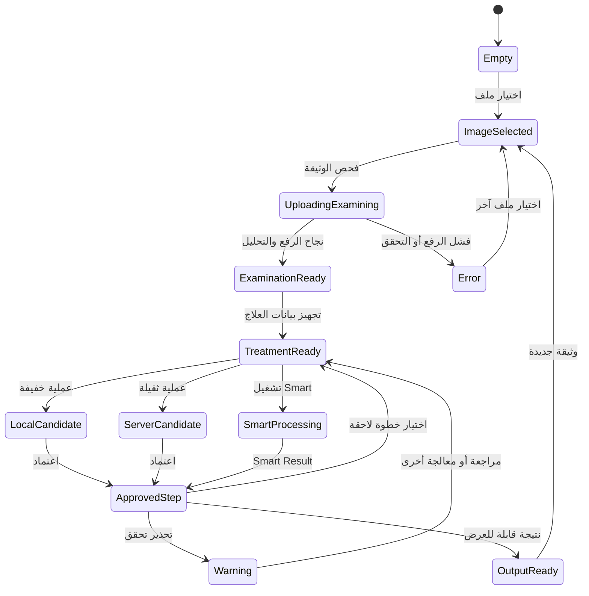
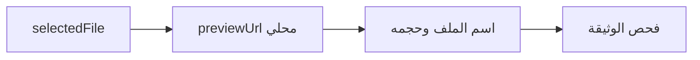
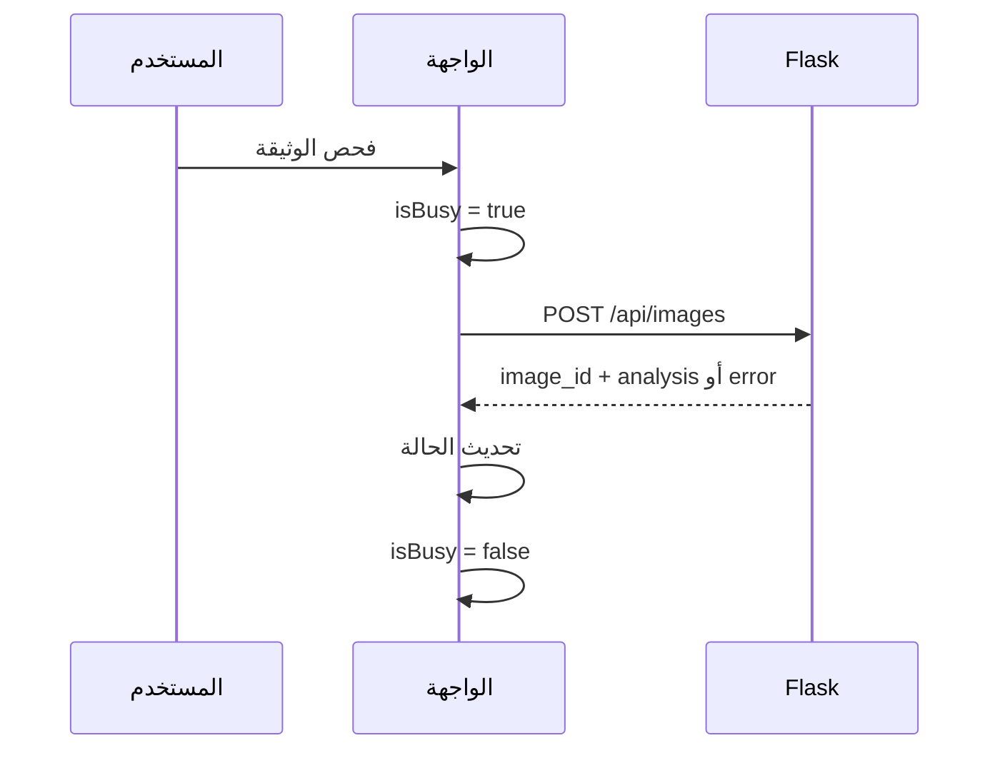
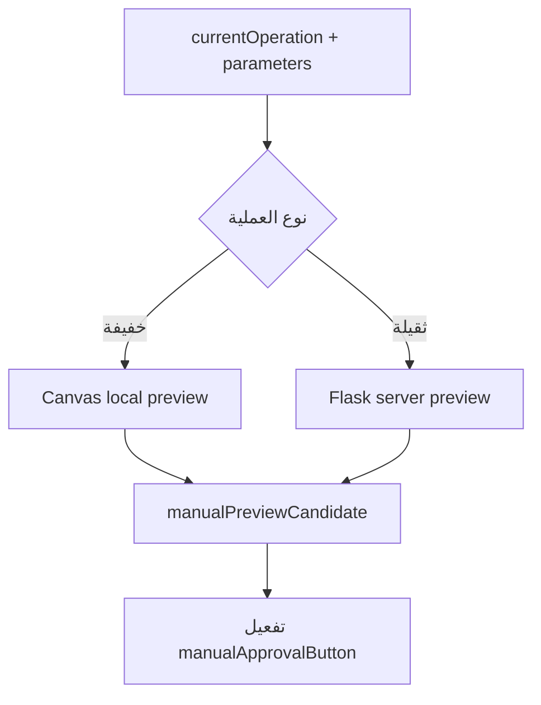
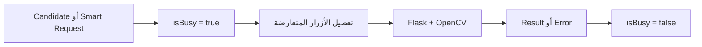
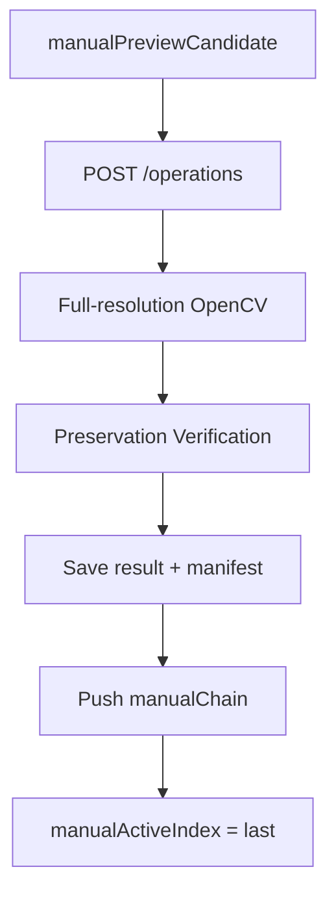
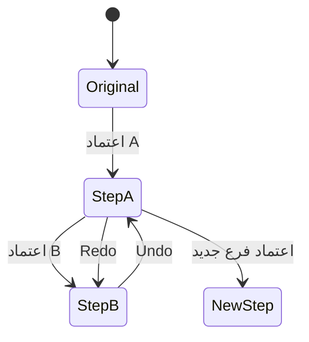
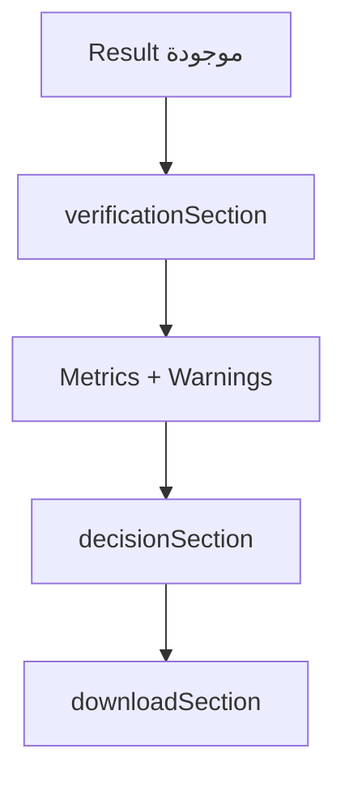
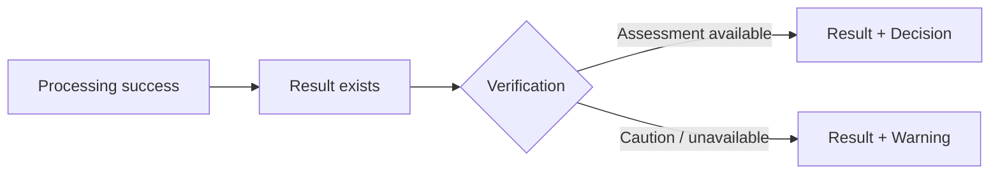
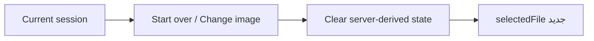

<div dir="rtl" align="right">

# 🎛️ Manuscript Doctor — حالات واجهة المستخدم

> **غرض الوثيقة:** تعريف حالات الواجهة الفعلية، وما يظهر أو يختفي أو يتعطل في كل حالة، وكيف تنتقل الواجهة دون خلط بين المعاينة والنتيجة المعتمدة.
>
> التخطيط البنيوي في [`wireframes.md`](wireframes.md)، وتدفق الاستخدام في [`workflow.md`](workflow.md)، وتقسيم الحالة في `static/js/parts/00-state-constants.js`.

---

## 1. نموذج الحالة



الحالتان `Warning` و`Error` ليستا مرحلة واحدة في المسار: التحذير يعني أن نتيجة ما زالت موجودة وتحتاج مراجعة، أما الخطأ فيعني أن الإجراء الحالي لم يكتمل كما طلب.

---

## 2. مصدر الحقيقة في Browser State

تحتفظ الواجهة بحالة تشغيلية في `state`، لكن Backend يبقى مصدر الحقيقة للمعرفات والنتائج والتحليل.

| المتغير | وظيفته |
| --- | --- |
| `selectedFile` | الملف المختار محلياً قبل الرفع |
| `previewUrl` | معاينة محلية أو رابط الصورة الأصلية |
| `imageId` | هوية صورة الرفع |
| `resultId` | النتيجة الحالية القابلة للعرض أو التنزيل |
| `imageData` | بيانات الصورة الأساسية |
| `analysis` | مؤشرات التحليل |
| `diagnoses` | التشخيصات القادمة من Backend |
| `preservationProfile` | مستوى الحذر قبل المعالجة |
| `recommendations` | التوصيات المبررة |
| `currentResult` | نتيجة المعالجة الحالية |
| `currentOperation` | العملية المختارة حالياً |
| `lastPipeline` | آخر استجابة لـSmart Pipeline |
| `state.manualChain` | النتائج اليدوية المعتمدة بالترتيب |
| `manualActiveIndex` | الخطوة المعروضة في السلسلة |
| `manualWorkingResultId` | المصدر الحالي للخطوة اليدوية التالية |
| `manualPreviewCandidate` | مرشح المعاينة غير المعتمد |
| `isBusy` | وجود طلب رفع أو معالجة أو اعتماد جارٍ |

---

## 3. الحالة الأولى — Empty

### المعنى

لم يختر المستخدم صورة بعد.

### يظهر

```text
Header + خلفيته
Workflow Bar
Upload Entry
Drop Zone
```

### يخفى

```text
Workspace
Dashboard
Treatment Studio
Manual Editor
Verification
Decision
Download
```

### المتاح

اختيار صورة بالسحب والإفلات أو عبر زر اختيار الملف. لا توجد بيانات `imageId` أو `analysis` أو `manualChain`.

---

## 4. الحالة الثانية — Image Selected

### المعنى

اختير ملف محلي، ولم يُرسل إلى Flask بعد.



### يظهر

| العنصر | حالته |
| --- | --- |
| `selectedFile` | اسم الملف وبياناته |
| المعاينة المحلية | ظاهرة داخل منطقة الرفع |
| `removeImageButton` | متاح لتغيير الصورة |
| `startExaminationButton` | متاح إذا كان الملف صالحاً للرفع |

لا تظهر Metrics أو Diagnosis أو Recommendation لأن Backend لم يتحقق من الصورة بعد.

---

## 5. الحالة الثالثة — Uploading / Examining

تبدأ عند الضغط على **فحص الوثيقة**، وتستخدم `isBusy = true` لمنع تضارب الطلبات.



### يظهر

```text
processingStateSection
جارٍ رفع الصورة والتحقق منها وفحصها
المعاينة المحلية أو الصورة الحالية
```

### يتعطل

رفع صورة أخرى، Smart، العمليات اليدوية، وأي زر يمكن أن ينشئ طلباً متداخلاً. لا يعني Spinner أن المعالجة نجحت؛ النجاح لا يثبت إلا من الاستجابة.

---

## 6. الحالة الرابعة — Examination Ready

تصل الواجهة إليها عند وجود `imageId` وتحليل ناجح.

### يظهر

```text
originalPreview
Dimensions
Metrics Dashboard
Diagnosis
Preservation Profile
Treatment Recommendation
```

### لا يظهر كنتيجة بعد

```text
manualChain
resultId
Verification Assessment
Download
```

قد تظهر معلومات الصورة والتحليل في Workspace، لكن لا يسمح النظام بتنزيل نتيجة لم تُنشأ بعد.

---

## 7. الحالة الخامسة — Treatment Ready

تظهر عندما تصبح بيانات المعالجة متاحة. يحتوي `treatmentSection` على مسارين:

| المسار | الزر | الشرط |
| --- | --- | --- |
| Smart | تشغيل المعالجة الذكية | وجود صورة وفحص صالح |
| Manual | ابدأ يدوياً | وجود صورة قابلة للمعالجة |

لا يخترع Frontend توصية جديدة ولا يعيد حساب Thresholds؛ يعرض ما أعاده Backend.

---

## 8. مرشح المعاينة — Preview Candidate

هذه حالة مؤقتة قبل الاعتماد، وليست Result محفوظة.



### العمليات المحلية

```text
rotate_right
rotate_left
flip_horizontal
flip_vertical
intensity_adjust
gamma_correct
```

تظهر النتيجة بسرعة من Canvas، لكنها لا تحصل على `result_id` ولا تدخل `manualChain` حتى يعتمدها المستخدم.

### العمليات الخادمية

تستخدم `/api/images/<image_id>/preview` نسخة عرض مصغرة. يمكن للواجهة إرسال `X-Preview-Format: jpeg` لتقليل النقل. يعاد `verification.status = skipped_for_preview` لأن الفحص النهائي ليس جزءاً من المعاينة.

---

## 9. الحالة الخاصة — Crop Draft

عند اختيار `crop` يظهر `manualCropGuide` فوق `manualLivePreview`.

```text
Crop Selected
    ↓
Frame with approximately 5% margin
    ↓
Move / Resize Handles
    ↓
Update x, y, width, height
    ↓
Preview Candidate
    ↓
Approve only
```

تظل القيم مسودة داخل الواجهة. لا تصبح قصاً نهائياً إلا عندما يرسل زر الاعتماد الطلب إلى Flask/OpenCV.

---

## 10. الحالة الخاصة — Super Resolution

تظهر `super_resolution` ضمن مجموعة التفاصيل كعملية يدوية مستقلة.

| العنصر | السلوك |
| --- | --- |
| المعاينة | خادمية لأنها عملية ثقيلة |
| الاعتماد | Flask/OpenCV على المصدر الكامل |
| الأبعاد | قد تزيد وفق `scale` |
| السلسلة | تدخل بعد الاعتماد فقط |
| Smart Pipeline | لا تدخل تلقائياً |
| الرسالة | تحسين الوضوح لا يستعيد تفاصيل مفقودة بالكامل |

---

## 11. الحالة السادسة — Processing

تبدأ عند تشغيل Smart أو اعتماد مرشح يدوي.



تبقى الصورة الحالية ومعلومات التشخيص قابلة للعرض، لكن لا يسمح ببدء طلب ثانٍ يعتمد على حالة لم تكتمل.

### رسائل الحالة

| النوع | الرسالة |
| --- | --- |
| رفع وفحص | جارٍ رفع الصورة والتحقق منها وفحصها |
| Preview | جارٍ تحديث المعاينة |
| اعتماد يدوي | جارٍ اعتماد العملية وإنشاء النتيجة |
| Smart | جارٍ تنفيذ المعالجة الذكية |
| تحقق | جارٍ فحص أثر المعالجة على التفاصيل |

---

## 12. الحالة السابعة — Approved Step

عند نجاح الاعتماد، يعيد الخادم `result_id` وmetadata وبيانات المحافظة عند توفرها.



### ما يتغير

```text
manualChain
manualWorkingResultId
manualApprovedResult
currentResult
resultId
before / after
history timeline
```

تستخدم الخطوة اللاحقة النتيجة المعتمدة الحالية كمصدر، وليس الأصل تلقائياً.

---

## 13. before/after وUndo/Redo

عند `manualActiveIndex = i`:

| الصورة | المصدر |
| --- | --- |
| before | Original إذا كانت `i = 0`، وإلا نتيجة الخطوة `i - 1` |
| after | نتيجة الخطوة `i` |

تتولى `syncManualChainSelection` تحديث الصورتين معاً. لذلك يجب ألا تعرض الواجهة before من الأصل بعد اعتماد خطوة ثانية.



يغير Undo/Redo المؤشر والعرض من النتائج الموجودة، ولا يعيد إرسال طلب خادمي بلا داعٍ.

---

## 14. الحالة الثامنة — Smart Processing

عند الضغط على تشغيل المعالجة الذكية:

```text
Smart Button
    ↓
POST /api/images/<image_id>/pipeline
    ↓
prepare_document
    ↓
verify_preparation
    ↓
Use prepared image أو keep original
    ↓
Analyze + Smart treatment
    ↓
Decision + Result
```

### حالات Preparation

| الحالة | ما يظهر للمستخدم |
| --- | --- |
| `accepted` | أُدرج تجهيز الوثيقة قبل المعالجة الذكية |
| `deferred` / `review_required` | بقيت الصورة الأصلية ويمكن مراجعة التجهيز يدوياً |
| `deskew-only` | تصحيح ميل محافظ دون قص أو منظور عند الثقة العالية |

تُعرض نتيجة Smart داخل `manualEditor` نفسه، ولا تنشئ صفحة نتائج منفصلة.

---

## 15. الحالة التاسعة — Verification وOutput

بعد إنشاء النتيجة، تعرض الواجهة التحقق والقرار ثم التنزيل.



### Result Ready

| العنصر | الحالة |
| --- | --- |
| before/after | ظاهر حسب الخطوة النشطة |
| History | يعرض النتائج الفعلية |
| Preservation | يعرض المؤشرات والتحذيرات |
| Decision | Acceptable أو Caution أو High Risk |
| Download | فعال عند وجود `result_id` |

---

## 16. Warning ليست Error



إذا تعذر Preservation Verification تقنياً مع بقاء النتيجة صالحة، لا تحذف الواجهة النتيجة، ولا تحولها إلى `Acceptable` تلقائياً. تعرض النتيجة مع تنبيه بأن التقييم غير متاح أو يحتاج مراجعة.

---

## 17. Error State

| المجال | أمثلة |
| --- | --- |
| الرفع | `NO_FILE`، `UNREADABLE_IMAGE`، `IMAGE_DIMENSIONS_TOO_LARGE` |
| العملية | `INVALID_OPERATION`، `INVALID_OPERATION_PARAMETERS` |
| المصدر | `SOURCE_RESULT_NOT_FOUND`، `INVALID_SOURCE_RESULT_KIND` |
| النتيجة | `RESULT_NOT_FOUND` |
| التنفيذ | `PROCESSING_FAILED` |

### شكل الرسالة

```text
عنوان مفهوم
    ↓
ماذا حدث؟
    ↓
ما الإجراء المقترح؟
```

لا تعرض الواجهة Traceback أو `cv2.error` خاماً. عند اختيار ملف جديد، يمكن إبقاء المعاينة المحلية، لكن يجب تصفير بيانات الخادم القديمة حتى لا تختلط صورتان.

---

## 18. Reset عند صورة جديدة



يجب تصفير `imageId` و`resultId` و`analysis` و`diagnoses` و`preservationProfile` و`recommendations` و`currentResult` و`lastPipeline` و`manualChain` و`manualActiveIndex` و`manualPreviewCandidate` قبل ربط الصورة الجديدة.

---

## 19. مصفوفة الأزرار

| الحالة | فحص الوثيقة | Smart | Manual | اعتماد | Undo/Redo | Download |
| --- | :---: | :---: | :---: | :---: | :---: | :---: |
| Empty | — | لا | لا | لا | لا | لا |
| Image Selected | نعم | لا | لا | لا | لا | لا |
| Uploading / Examining | لا | لا | لا | لا | لا | لا |
| Examination Ready | نعم/متاح | حسب البيانات | حسب البيانات | لا | لا | لا |
| Treatment Ready | متاح | نعم | نعم | لا | حسب السلسلة | لا |
| Preview Candidate | لا | لا | لا | نعم | حسب السلسلة | لا |
| Processing | لا | لا | لا | لا | لا | لا |
| Approved Result | متاح | نعم | نعم | حسب المرشح | نعم | نعم |
| Warning + Result | متاح | نعم | نعم | حسب المرشح | نعم | نعم مع تحذير |
| Error | حسب سبب الخطأ | لا | لا | لا | لا | لا |

الشرطة `—` تعني أن الزر غير ذي صلة بالحالة، و`لا` تعني أنه يجب أن يبقى غير فعال، و`حسب البيانات` تعني أن JavaScript يفعله فقط بعد وصول الاستجابة المطلوبة.

---

## 20. Desktop وMobile

تظل الحالات والسلوكيات نفسها على جميع الشاشات؛ الذي يتغير هو التخطيط فقط.

```text
Desktop: Preview | Controls
Mobile:  Preview
          Controls
```

في العرض الضيق:

- يصبح محرر المعالجة عمودياً.
- تصبح صور before/after متتابعة.
- يبقى Workflow قابلاً للتمرير.
- تصغر البطاقات دون إخفاء النص الأساسي.
- تبقى الأزرار قابلة للوصول ولا يحدث overflow مقصود.

---

## 21. قاعدة إدارة الحالة

عند وصول استجابة جديدة، تنفذ الواجهة الترتيب الآتي:

```text
Validate response
    ↓
Update IDs
    ↓
Update state data
    ↓
Render sections
    ↓
Update buttons
    ↓
Show message
```

ولا تُستخدم المعاينة المحلية أو المرشح المتفائل كبديل عن النتيجة الخادمية المعتمدة. المرشح يحسن الاستجابة البصرية، بينما `result_id` هو دليل وجود artifact حقيقي.

</div>
