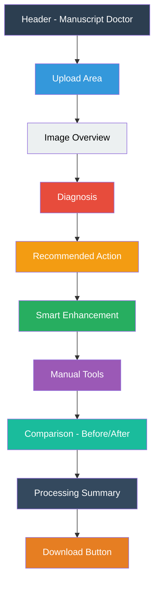
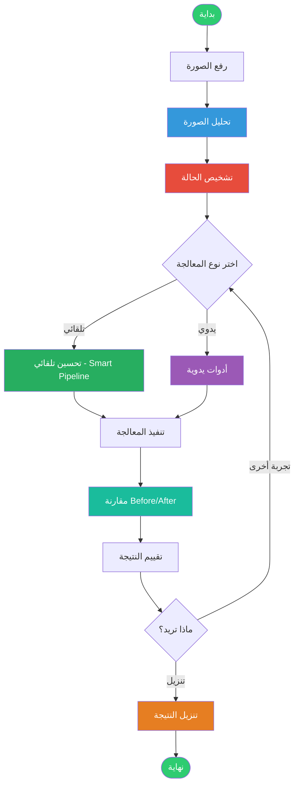
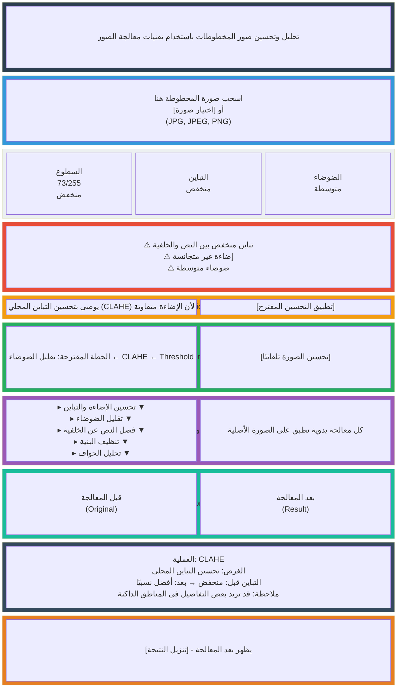
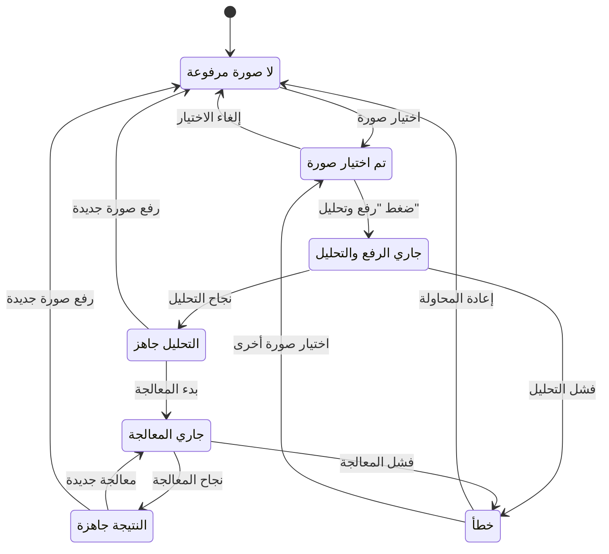
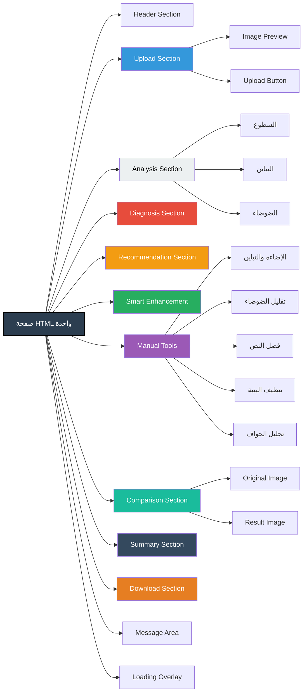
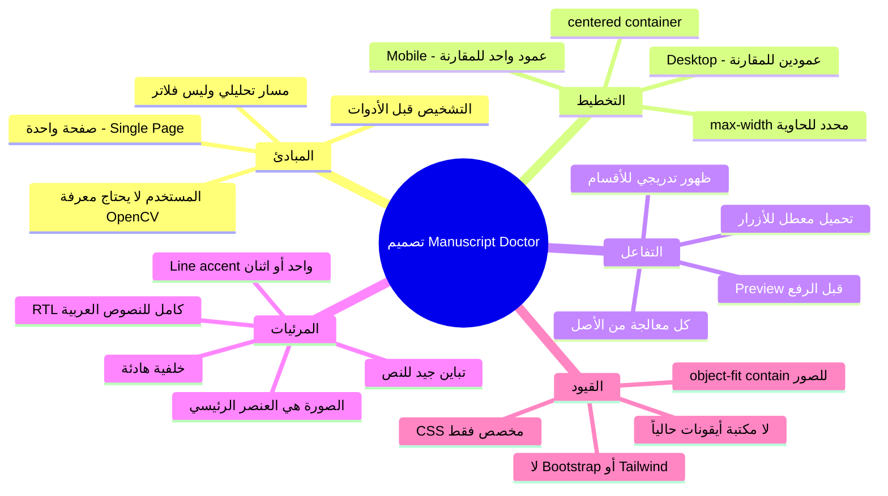

# Wireframes — Manuscript Doctor

## 1. هيكل الصفحة العام (Desktop + Mobile)

## 2. تدفق المستخدم (User Flow)

## 3. Desktop Layout (عرض شاشة الحاسوب)

## 4. Mobile Layout (عرض الهاتف)

```mermaid
block-beta
    columns 1
    
    block:header_m
        columns 1
        h1["Header"]
        h2["Manuscript Doctor"]
        h3["تحليل وتحسين المخطوطات"]
    end
    
    block:upload_m
        columns 1
        u1["Upload Area"]
        u2["اسحب صورة المخطوطة هنا"]
        u3["أو [اختيار صورة]"]
    end
    
    block:analysis_m
        columns 1
        a1["Image Analysis"]
        a2["السطوع: 73/255 - منخفض"]
        a3["التباين: منخفض"]
        a4["الضوضاء: متوسطة"]
        a5["الأبعاد: 1920×1080"]
        a6["القنوات: 3"]
    end
    
    block:diagnosis_m
        columns 1
        d1["Diagnosis"]
        d2["⚠ تباين منخفض"]
        d3["⚠ إضاءة غير متجانسة"]
        d4["⚠ ضوضاء متوسطة"]
    end
    
    block:recommendation_m
        columns 1
        r1["Recommended Action"]
        r2["يوصى بتحسين التباين المحلي"]
        r3["[تطبيق التحسين المقترح]"]
    end
    
    block:smart_m
        columns 1
        s1["Smart Enhancement"]
        s2["الخطة: Denoise → CLAHE → Thr."]
        s3["[تحسين تلقائي]"]
    end
    
    block:manual_m
        columns 1
        m1["Manual Tools"]
        m2["▸ الإضاءة والتباين"]
        m3["▸ تقليل الضوضاء"]
        m4["▸ فصل النص"]
        m5["▸ تنظيف البنية"]
        m6["▸ تحليل الحواف"]
    end
    
    block:comparison_m
        columns 1
        c1["Comparison"]
        c2["قبل المعالجة (Original)"]
        c3["بعد المعالجة (Result)"]
    end
    
    block:summary_m
        columns 1
        sm1["Processing Summary"]
        sm2["العملية: CLAHE"]
        sm3["الغرض: تحسين التباين"]
        sm4["..."]
    end
    
    block:download_m
        columns 1
        dl1["[تنزيل النتيجة]"]
    end
    
    style header_m fill:#2c3e50,color:#fff
    style upload_m fill:#3498db,color:#fff
    style analysis_m fill:#ecf0f1,color:#000
    style diagnosis_m fill:#e74c3c,color:#fff
    style recommendation_m fill:#f39c12,color:#fff
    style smart_m fill:#27ae60,color:#fff
    style manual_m fill:#9b59b6,color:#fff
    style comparison_m fill:#1abc9c,color:#fff
    style summary_m fill:#34495e,color:#fff
    style download_m fill:#e67e22,color:#fff
```

## 5. حالات الواجهة (UI States Transitions)

## 6. مكونات الواجهة (Components Hierarchy)

## 7. ملاحظات التصميم

