<div dir="rtl" align="right">

# 🧩 Manuscript Doctor — Wireframes

> **غرض الوثيقة:** توثيق التخطيط البنيوي للواجهة كما هو منفذ حالياً، مع توضيح مواقع الصور واللوحات والحالات الرئيسية دون الدخول في تفاصيل CSS الدقيقة.
>
> المصطلحات هنا تصف **مكان العنصر وعلاقته بالعناصر الأخرى**. السلوك الزمني في [`workflow.md`](workflow.md)، والحالات في [`ui-states.md`](ui-states.md)، وتقسيم الملفات في [`split-structure.md`](split-structure.md).

---

## 1. مبدأ التخطيط

الواجهة عبارة عن **Single-Page Progressive Workspace**: صفحة واحدة تتكشف أقسامها حسب حالة الصورة، مع بقاء شريط المراحل ثابتاً ليسهل التنقل.

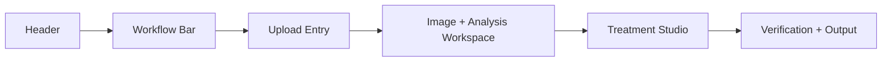

الأولوية البصرية ليست لعرض أكبر عدد من الأدوات، بل لهذا الترتيب:

```text
الصورة
  ↓
ما الذي فُحص؟
  ↓
ما المعالجة المناسبة؟
  ↓
ما أثرها؟
  ↓
هل أعتمدها أو أنزلها؟
```

---

## 2. التخطيط العام للصفحة

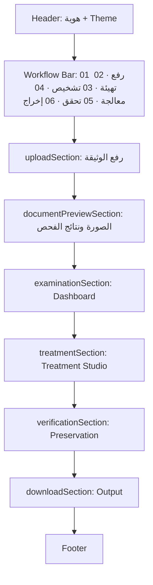

لا تظهر الأقسام التحليلية والمعالجة والنتيجة قبل نجاح الرفع والفحص. عند اختيار صورة جديدة، تصفر الواجهة النتائج السابقة وتعود إلى حالة الرفع والفحص.

---

## 3. Header وشريط المراحل

### Header

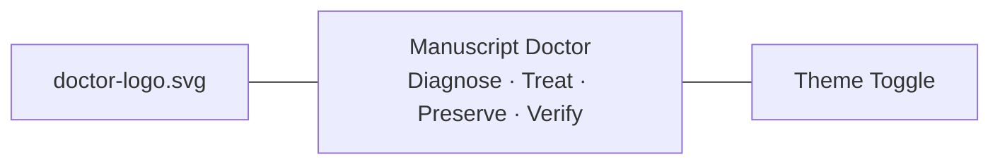

يستخدم Header الصورة:

```text
static/assets/header-workspace-background.png
```

كخلفية كاملة فقط. لا توجد صورة before/after مستقلة داخل المقدمة، ولا عنصر Hero مكرر. يحافظ التخطيط على تكوين الصورة العريضة داخل مساحة الرأس دون قص جانبي مقصود.

### Workflow Bar

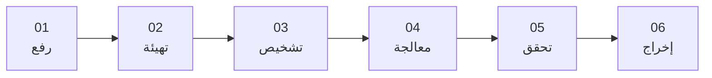

شريط المراحل `#workflow` ثابت أثناء التمرير، وتنتقل الروابط إلى الأقسام ذات الصلة. في العرض الضيق يسمح الشريط بالتمرير الأفقي بدلاً من تكسير العناصر أو إخفائها.

---

## 4. منطقة الرفع

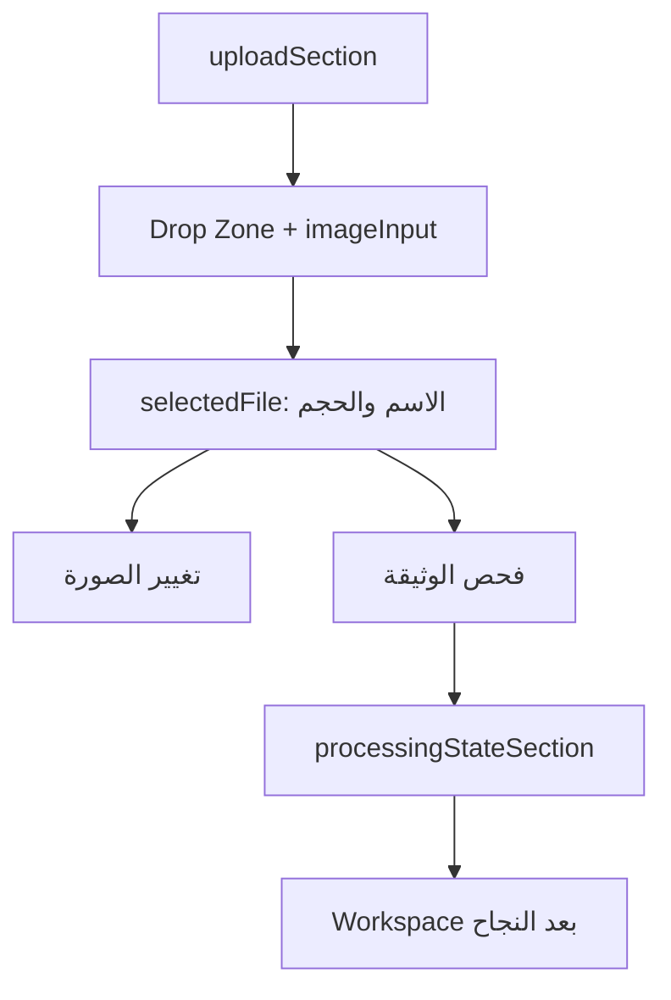

في الحالة الأولى يظهر Drop Zone وزر اختيار الصورة. بعد الاختيار تظهر بطاقة الملف وزرا **تغيير الصورة** و**فحص الوثيقة**. لا تظهر Dashboard أو أدوات المعالجة قبل نجاح الرفع والتحقق.

---

## 5. مساحة الصورة ونتائج الفحص

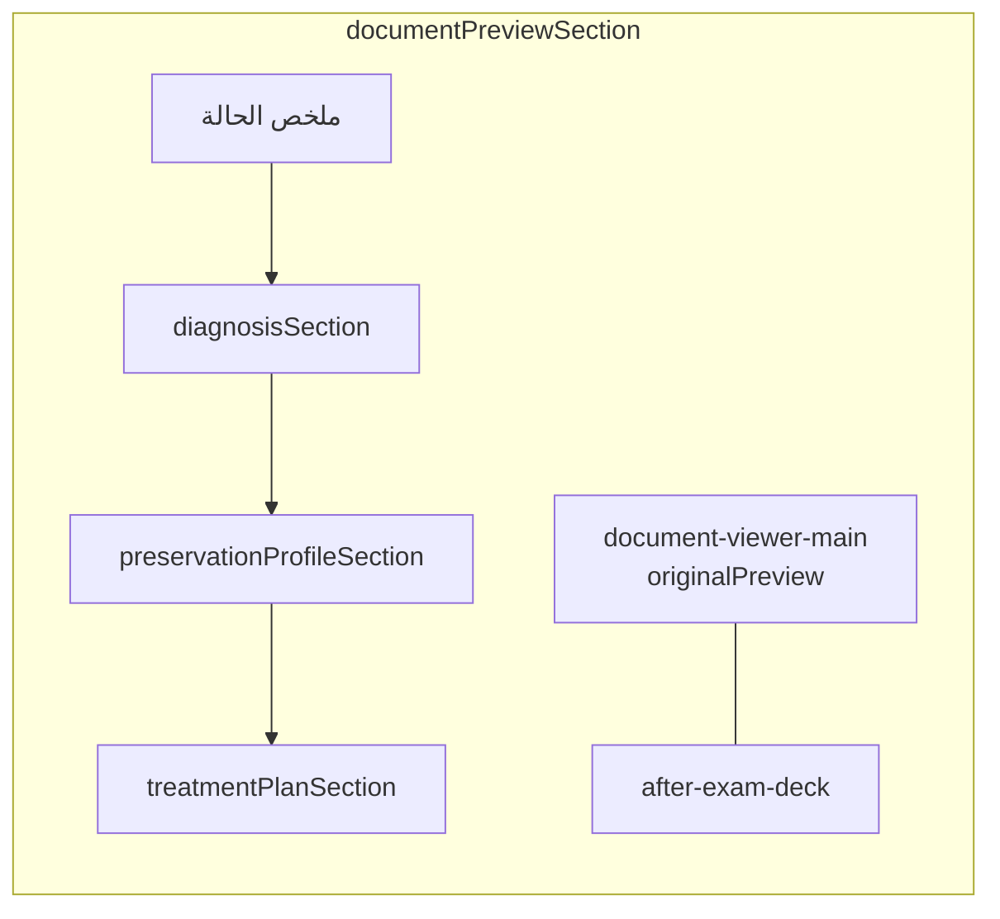

تعرض `originalPreview` الصورة المرفوعة، بينما تعرض المنطقة الجانبية أو اللاحقة ملخص الحالة والتشخيص وPreservation Profile والتوصية. يظل التشخيص منفصلاً عن ملف المحافظة؛ الأول يصف المشكلة، والثاني يحدد مستوى الحذر.

### Dashboard

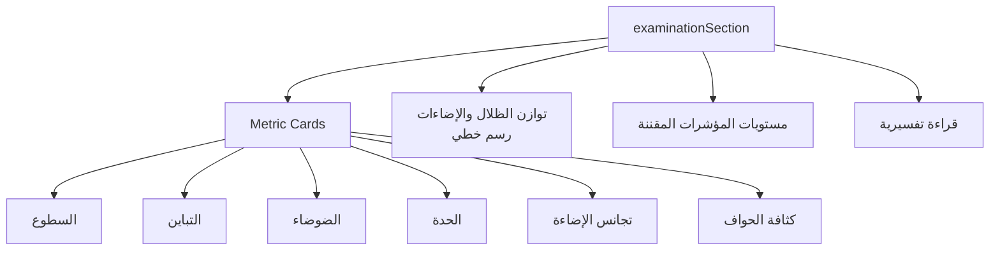

يعرض الرسم الخطي لتوازن الظلال والإضاءات على أنه قراءة لنطاقات الصورة، وليس بديلاً عن المؤشرات الرقمية أو Histogram كاملاً.

---

## 6. Treatment Studio

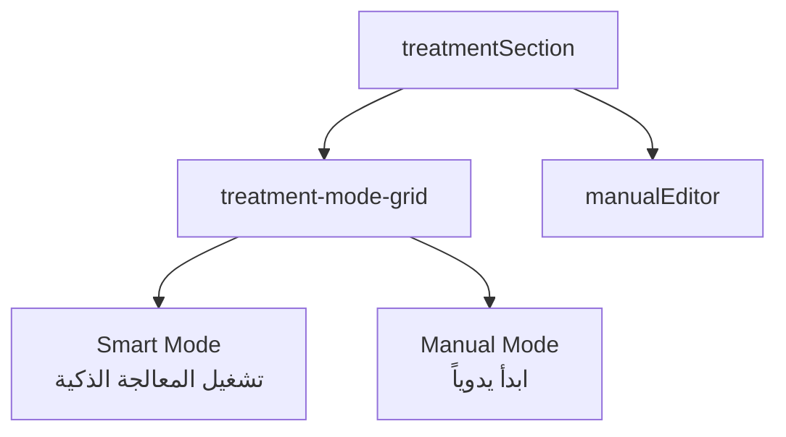

تظهر بطاقتا Smart وManual داخل Treatment Studio. زر Smart يرسل طلب المسار الذكي بعد توفر صورة صالحة، بينما تنقل بطاقة Manual إلى المحرر اليدوي.

---

## 7. محرر المعالجة اليدوية

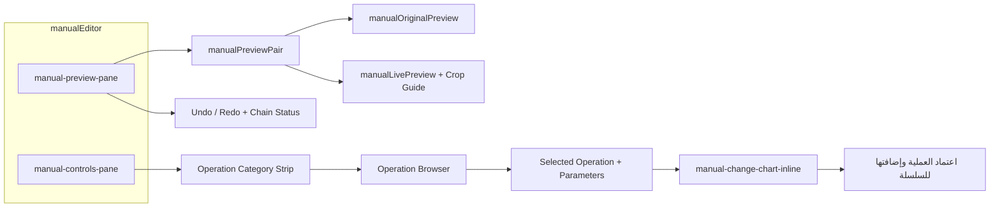

### المعاينة

المحرر هو قلب التجربة، ويقسم إلى:

| المنطقة | الوظيفة |
| --- | --- |
| `manual-preview-pane` | عرض before/after، حالة المعاينة، Undo/Redo |
| `manualOriginalPreview` | الصورة السابقة للخطوة النشطة |
| `manualLivePreview` | المرشح أو النتيجة الحالية؛ وتُحفظ الخطوات في `state.manualChain` ويحدد `manualActiveIndex` الخطوة المعروضة |
| `manualCropGuide` | إطار القص ومقابضه عند اختيار Crop |
| `manual-controls-pane` | مجموعات العمليات والعملية المختارة ومعاملاتها |
| `manual-change-chart-inline` | أثر المعاينة داخل لوحة العملية نفسها |
| `manualApprovalButton` | نقطة الاعتماد الوحيدة |
| `manualManualDownloadButton` | تنزيل النتيجة اليدوية عند توفرها |

يُستخدم زر اعتماد واحد فقط لإضافة المرشح إلى السلسلة، ولا يظهر إجراء تنفيذ إضافي موازٍ. وجود مرشح صالح هو الذي يفعّل زر الاعتماد.

### مجموعات العمليات

```text
تجهيز الوثيقة
الإضاءة
التباين
الضوضاء
التفاصيل
فصل النص
البنية
الخلفية
```

يظهر **تجهيز الوثيقة** أول مجموعة، ويضم تصحيح الميل والاقتصاص اليدوي وأزرار الاتجاه. تظهر العملية `super_resolution` داخل مجموعة التفاصيل بوصفها خياراً خادمياً متقدماً.

---

## 8. Crop Wireframe

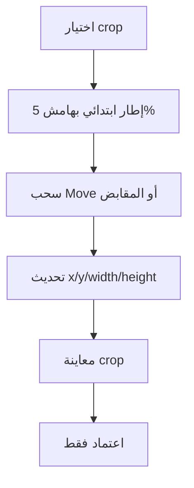

يظهر `manualCropGuide` فوق `manualLivePreview`، وتعمل المقابض للحواف والزوايا مع إمكانية تحريك الإطار. يجب أن تبقى النتيجة المرئية داخل حدود الصورة وأن تطابق النتيجة المعتمدة القيم المرسلة إلى Flask/OpenCV.

---

## 9. Smart Pipeline داخل التخطيط

لا تُعرض نتيجة Smart في صفحة منفصلة. بعد نجاح المسار، تُعرض النتيجة داخل مساحة المعالجة نفسها ويمكن إضافة عمليات يدوية فوقها.

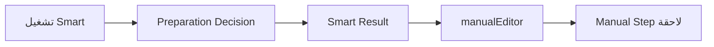

إذا قبل التحقق تجهيز الوثيقة، يظهر في الملخص كخطوة `document_prepare` مقبولة. وإذا كان القرار `deferred`، تبقى الصورة الأصلية مرجعاً للمسار ولا تعرض الواجهة قصاً أو منظوراً غير موثوق.

---

## 10. النتيجة والتحقق والتنزيل

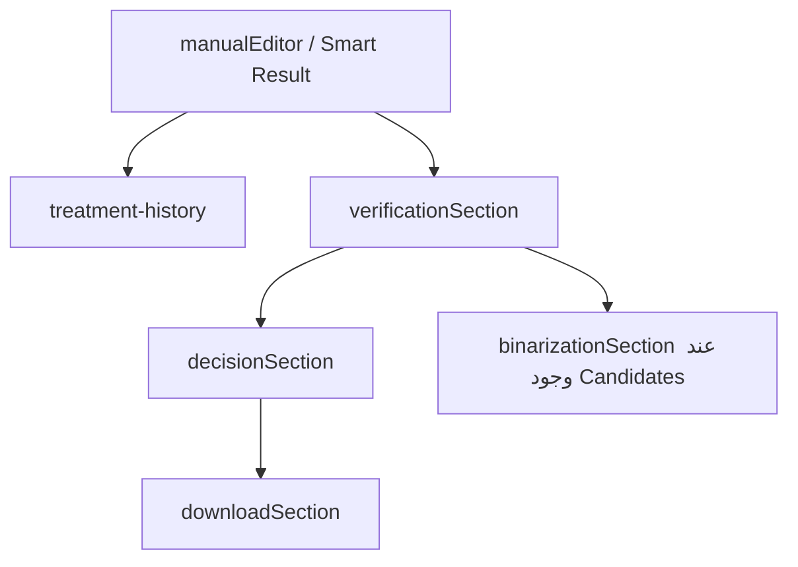

### مناطق النتائج

| المنطقة | محتواها |
| --- | --- |
| `treatment-history` | الخطوات والنتائج التي أنشأها النظام فعلياً |
| `verificationSection` | Edge Retention وComponent Retention والتشابه البنيوي وEdge Inflation والتحذيرات |
| `decisionSection` | Acceptable أو Caution أو High Risk ورسالة القرار |
| `binarizationSection` | مرشحو فصل النص في مسار مستقل |
| `downloadSection` | تنزيل النتيجة الحالية أو بدء وثيقة جديدة |

لا يظهر زر التنزيل كإجراء فعال قبل وجود `result_id` حقيقي محفوظ.

---

## 11. الحالات البصرية الأساسية

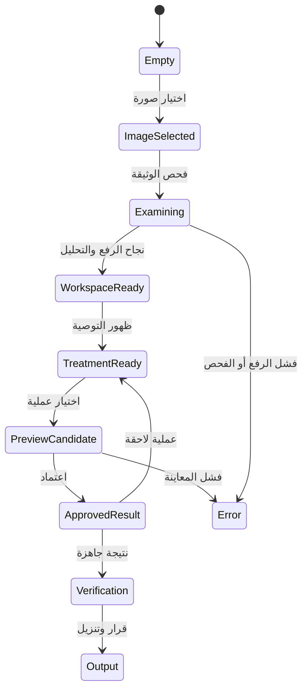

التفاصيل الدقيقة للحالات الانتقالية في [`ui-states.md`](ui-states.md).

---

## 12. التخطيط المتجاوب

### Desktop

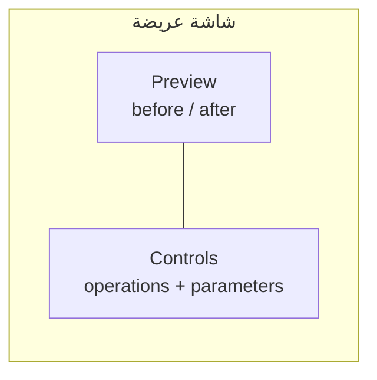

في الشاشة العريضة، يحتفظ المحرر بالمعاينة في مساحة أكبر من لوحة التحكم، مع ظهور العملية المختارة والرسم داخل لوحة التحكم. تعرض المقارنة الأصل والنتيجة جنباً إلى جنب.

### Mobile

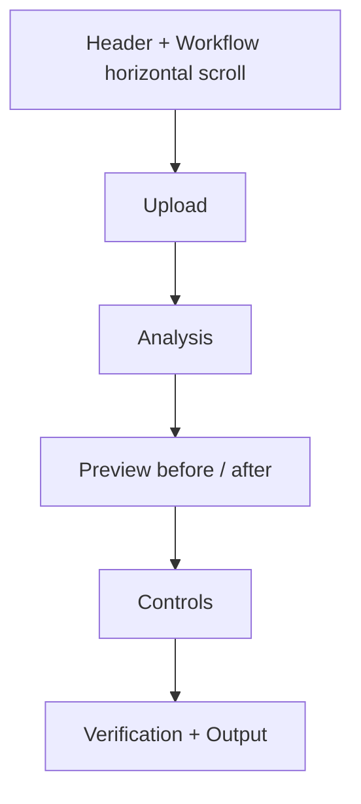

في العرض الضيق تصبح مناطق المحرر عمودية، وتتحول المقارنة إلى صفوف متتابعة، وتُصغر البطاقات مع إبقاء النص والأزرار قابلين للقراءة. يبقى Workflow قابلاً للتمرير، ولا يسمح التخطيط بخروج الأزرار أو الفوتر خارج الشاشة.

---

## 13. قاعدة التحقق البصري

عند تعديل HTML أو CSS يجب فحص هذه النقاط:

| النقطة | المتوقع |
| --- | --- |
| Header | الخلفية كاملة ولا توجد صورة Hero مكررة |
| Workflow | ثابت وقابل للتمرير في العرض الضيق |
| Manual Editor | before/after ظاهر ومنظم |
| Crop | المقابض قابلة للإمساك ولا تتجاوز الصورة |
| Chart | داخل selected-operation panel |
| Approval | زر اعتماد واحد فقط |
| Smart Result | يظهر داخل المحرر نفسه |
| Footer | متجاوب ولا يخفي المحتوى |

</div>
