docs/wireframes.md

<div dir="rtl" align="right">

# 🧩 Manuscript Doctor — Wireframes

> **الغرض من الوثيقة:** اعتماد المخطط البنيوي الرسمي لواجهة Manuscript Doctor قبل كتابة `index.html` و`style.css` و`main.js`.
> تركز الوثيقة على **ترتيب المكونات، العلاقات بينها، ظهورها حسب حالة النظام، ومسار المستخدم**.
> لا تحدد هذه الوثيقة الهوية اللونية النهائية أو التفاصيل الجمالية الدقيقة.

---

## 1. فلسفة الواجهة

واجهة Manuscript Doctor ليست محرر صور تقليديًا يبدأ بقائمة من الفلاتر.

يجب أن تعكس الواجهة من أول لحظة فلسفة النظام:

<div align="center">

### Diagnose → Treat → Preserve → Verify

</div>

```mermaid
flowchart LR
    A["رفع الصورة"] --> B["فحص الصورة"]
    B --> C["التشخيص"]
    C --> D["Preservation Profile"]
    D --> E["خطة المعالجة"]
    E --> F["المعالجة"]
    F --> G["Preservation Verification"]
    G --> H["المقارنة"]
    H --> I["القرار"]
    I --> J["التنزيل"]

    classDef primary fill:#eef6ff,stroke:#2563eb,stroke-width:2px,color:#111827;
    classDef preserve fill:#ecfdf5,stroke:#059669,stroke-width:2px,color:#111827;
    classDef result fill:#fff7ed,stroke:#ea580c,stroke-width:2px,color:#111827;

    class A,B,C,E,F primary;
    class D,G preserve;
    class H,I,J result;
```

---

# 2. النموذج العام للصفحة

الواجهة الأساسية:

**Single-Page Progressive Workflow**

أي أن جميع الوظائف الرئيسية موجودة في صفحة واحدة، لكن لا تظهر كلها في اللحظة نفسها.

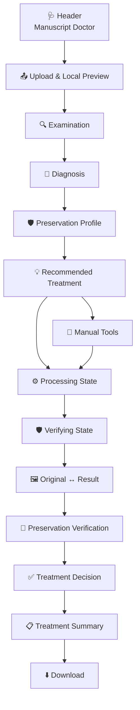

---

# 3. التقسيم البصري الأساسي

يتم تقسيم الصفحة إلى أربع مناطق منطقية رئيسية:

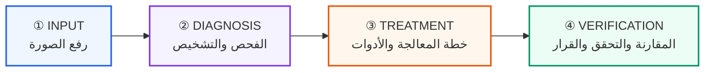

---

# 4. Wireframe الكامل — Desktop

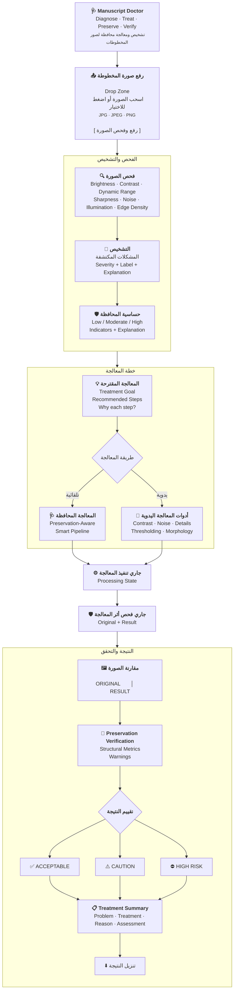

---

# 5. ترتيب الأقسام داخل الصفحة

يعتمد ترتيب الـDOM النهائي مبدئيًا على البنية التالية:

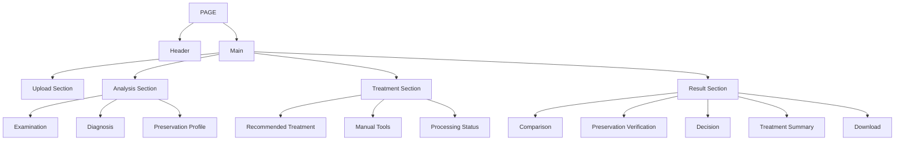

---

# 6. Header

الـHeader يجب أن يكون بسيطًا ولا يستهلك مساحة كبيرة.

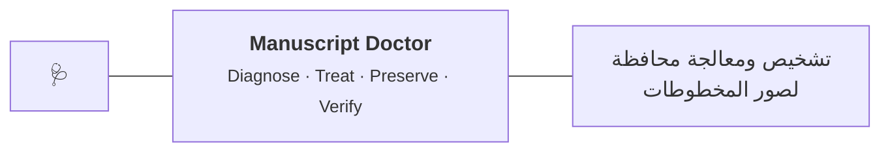

### يحتوي على

* هوية المشروع.
* الجملة المختصرة.
* وصف وظيفي قصير.

### لا يحتوي على

* Sidebar.
* Login.
* Profile.
* Navigation متعددة.
* عناصر Dashboard غير مستخدمة.

---

# 7. Upload Area — الحالة الأولية

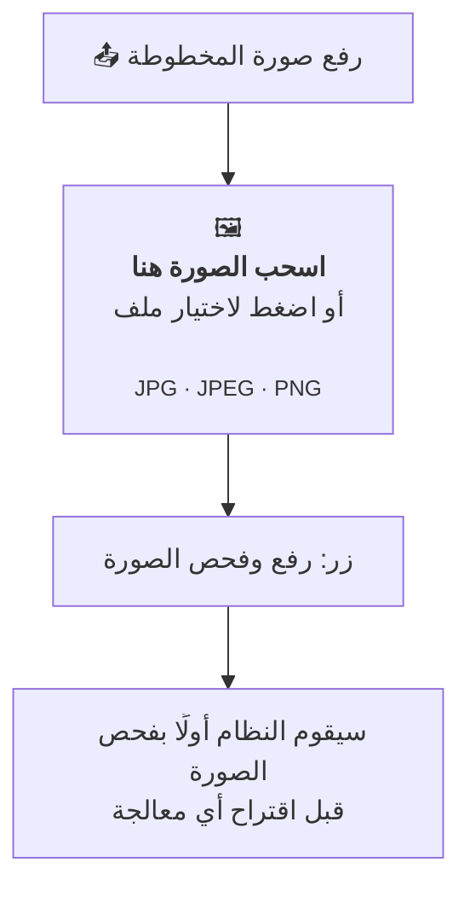

---

# 8. Upload Area — بعد اختيار الصورة

بعد اختيار المستخدم صورة محليًا:

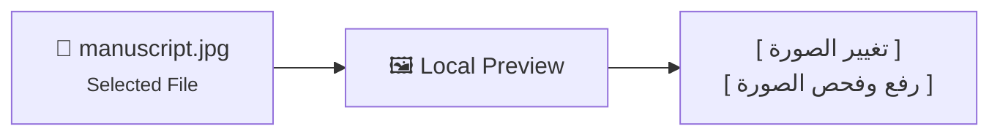

### مهم

المعاينة المحلية:

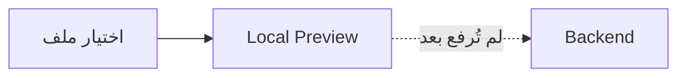

لا تعني أن Backend قبل الصورة.

---

# 9. حالة الرفع والفحص

بعد الضغط على زر الرفع:

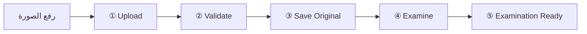

ويعرض للمستخدم:

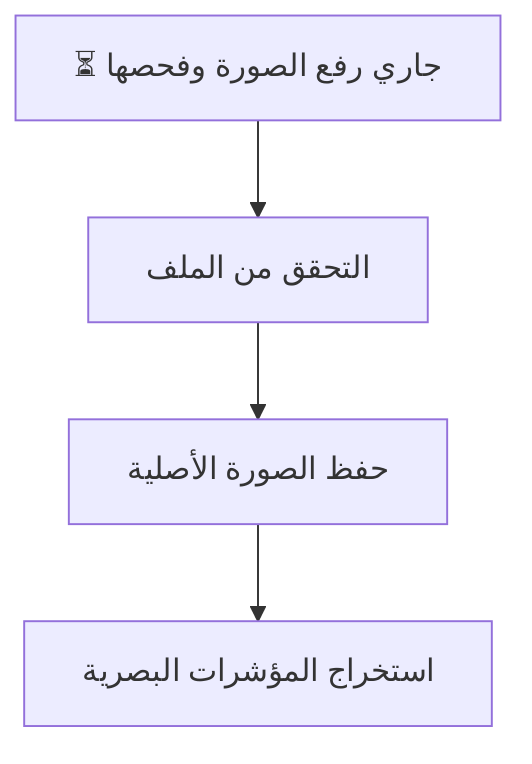

---

# 10. Examination Dashboard

الهدف من القسم عرض أهم المؤشرات دون تحويل الواجهة إلى شاشة أرقام معقدة.

```mermaid
flowchart TB

    EX["🔍 فحص الصورة"]

    subgraph ROW1[""]
        direction LR

        B["☀️<br/><b>Brightness</b><br/>Low<br/><small>74.2</small>"]

        C["◐<br/><b>Contrast</b><br/>Low<br/><small>31.6</small>"]

        S["🔎<br/><b>Sharpness</b><br/>Normal<br/><small>83.5</small>"]
    end

    subgraph ROW2[""]
        direction LR

        N["◌<br/><b>Noise</b><br/>Moderate"]

        I["💡<br/><b>Illumination</b><br/>Uneven"]

        E["〽️<br/><b>Edge Density</b><br/>Moderate"]
    end

    EX --> ROW1
    ROW1 --> ROW2
```

### تسلسل المعلومات داخل كل Metric

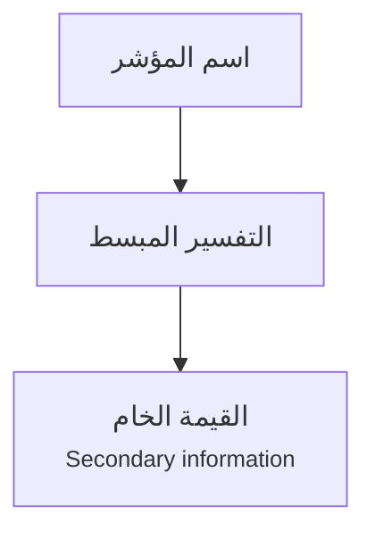

أي:

> المعنى أولًا، والرقم ثانيًا.

---

# 11. Diagnosis Section

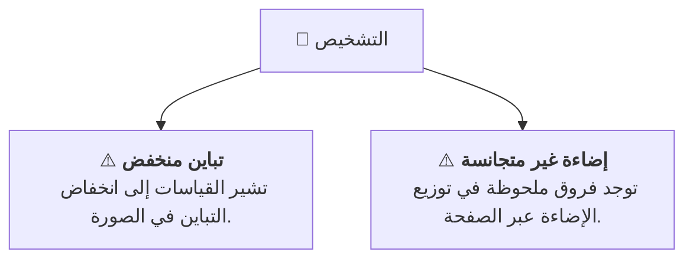

كل Diagnosis Card تعرض:

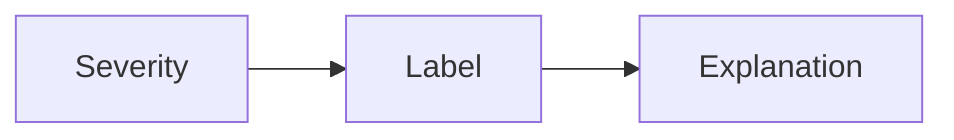

ولا تعرض `code` التقني للمستخدم العادي.

---

# 12. حالة عدم وجود مشكلة واضحة

لا نظهر Diagnosis Section فارغة.

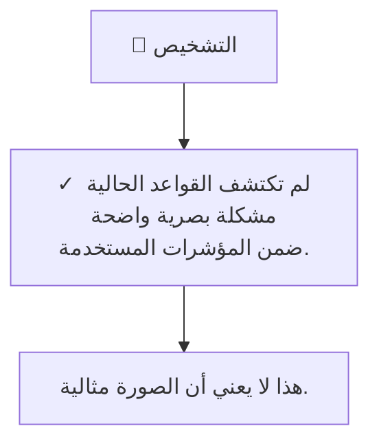

---

# 13. Preservation Profile

هذا القسم يجب أن يكون مرئيًا بوضوح لأنه يميز Manuscript Doctor عن محرر الصور التقليدي.

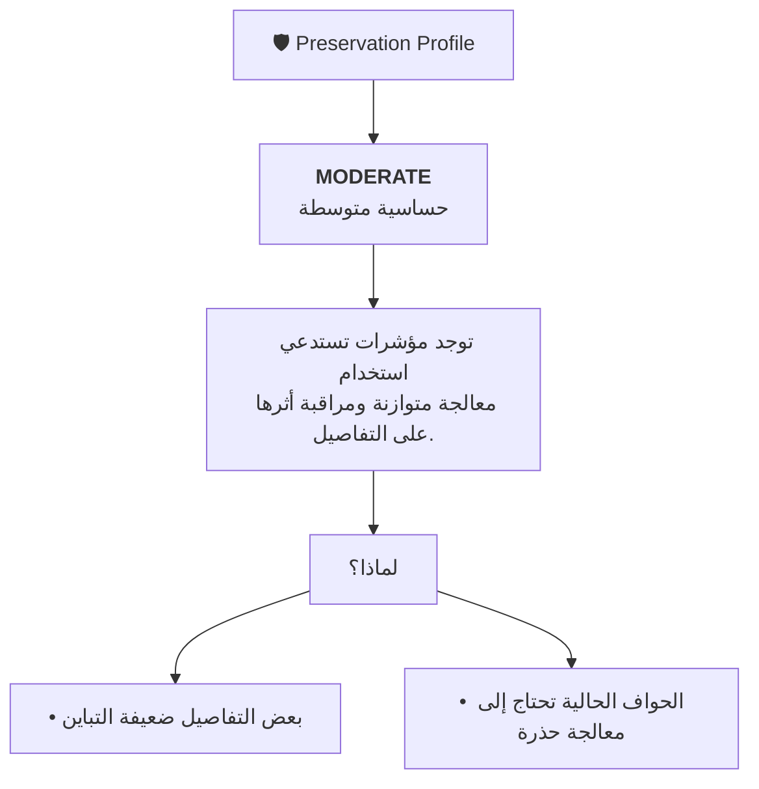

---

# 14. الفرق البصري بين Diagnosis وPreservation Profile

يجب عدم دمجهما في بطاقة واحدة.

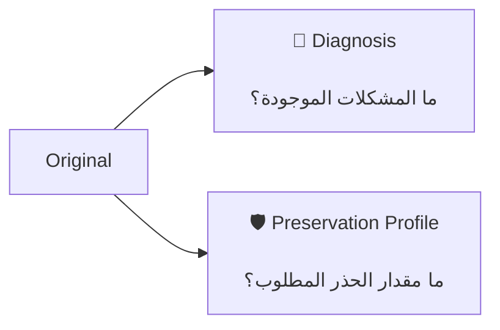

---

# 15. Recommended Treatment

هذه المنطقة تمثل نقطة التحول من الفحص إلى العلاج.

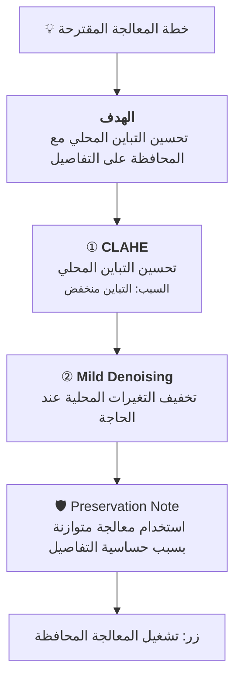

---

# 16. العلاقة بين التشخيص والتوصية

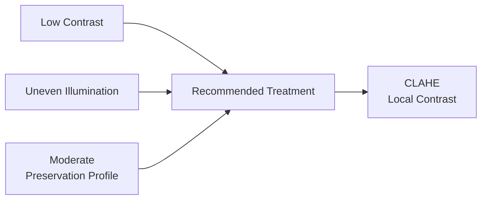

الواجهة تعرض **سبب التوصية**، وليس اسم العملية فقط.

---

# 17. اختيار وضع المعالجة

```mermaid
flowchart TD

    READY["Treatment Ready"]

    MODE{"اختر طريقة المعالجة"}

    AUTO["🩺 المعالجة المحافظة<br/><small>Smart Pipeline</small>"]

    MANUAL["🧰 أدوات يدوية<br/><small>Manual Operations</small>"]

    READY --> MODE

    MODE --> AUTO
    MODE --> MANUAL
```

يجب أن تكون المعالجة التلقائية الخيار الأكثر بروزًا، بينما الأدوات اليدوية خيار ثانوي للتجربة والتحكم.

---

# 18. Manual Tools

تعرض العمليات على شكل مجموعات منطقية، وليس قائمة طويلة من أسماء الخوارزميات.

```mermaid
flowchart TD

    MANUAL["🧰 أدوات المعالجة اليدوية"]

    MANUAL --> A["☀️ الإضاءة والتباين"]
    MANUAL --> B["◌ إزالة الضوضاء"]
    MANUAL --> C["🔎 تحسين التفاصيل"]
    MANUAL --> D["◐ فصل النص والخلفية"]
    MANUAL --> E["⬡ العمليات المورفولوجية"]
    MANUAL --> F["〽️ أدوات التحليل"]

    A --> A1["CLAHE"]
    A --> A2["Histogram Equalization"]

    B --> B1["Median Filter"]
    B --> B2["Gaussian Filter"]

    C --> C1["Sharpening"]

    D --> D1["Otsu Threshold"]
    D --> D2["Adaptive Threshold"]

    E --> E1["Opening"]
    E --> E2["Closing"]

    F --> F1["Grayscale"]
    F --> F2["Canny"]
```

---

# 19. نموذج بطاقة Manual Operation

```mermaid
flowchart LR

    ICON["◐"]

    NAME["<b>CLAHE</b><br/><small>تحسين التباين المحلي</small>"]

    ACTION["تطبيق"]

    ICON --- NAME --- ACTION
```

يجب أن يفهم المستخدم وظيفة الأداة حتى إذا لم يعرف معنى اسمها التقني.

---

# 20. Processing State

عند بدء المعالجة:

```mermaid
flowchart TD

    STATE["⚙️ <b>جاري تنفيذ المعالجة</b>"]

    LOAD["◌"]

    MESSAGE["يتم تطبيق المعالجة<br/>على الصورة الأصلية"]

    LOCK["🔒 Treatment Controls Disabled"]

    STATE --> LOAD --> MESSAGE --> LOCK
```

### أثناء هذه الحالة

```mermaid
flowchart LR

    UPLOAD["Upload"] -. Disabled .-> LOCK["Request in progress"]
    MANUAL["Manual Tools"] -. Disabled .-> LOCK
    SMART["Smart Treatment"] -. Disabled .-> LOCK
```

---

# 21. Verifying State

بعد نجاح Processing لا تظهر النتيجة كأنها معتمدة مباشرة.

```mermaid
flowchart TD

    PROCESS["✓ انتهت المعالجة"]

    VERIFY["🛡️ <b>جاري فحص أثر المعالجة</b>"]

    ORIGINAL["Original"]

    RESULT["Processed Result"]

    CHECK["Structural Preservation Assessment"]

    PROCESS --> VERIFY

    VERIFY --> ORIGINAL
    VERIFY --> RESULT

    ORIGINAL --> CHECK
    RESULT --> CHECK
```

---

# 22. لماذا توجد حالة Verifying؟

```mermaid
flowchart LR

    A["Processing Finished"]

    B["Result Exists"]

    C["Preservation Verification"]

    D["Treatment Decision"]

    A --> B --> C --> D
```

وليست:

```mermaid
flowchart LR

    A["Processing Finished"]

    B["Automatically Accepted"]

    A --> B
```

---

# 23. Comparison Section — Desktop

يكون الأصل والنتيجة متساويين بصريًا في الأهمية.

```mermaid
flowchart LR

    subgraph ORIGINAL["الصورة الأصلية"]
        O["🖼️<br/><br/>Original Image<br/><br/>Immutable"]
    end

    subgraph RESULT["نتيجة المعالجة"]
        R["🖼️<br/><br/>Processed Result<br/><br/>Current Treatment"]
    end

    ORIGINAL <--> RESULT
```

### القاعدة

```text
50% Original  |  50% Result
```

تقريبًا على الشاشات العريضة.

لا تعطى Result مساحة أكبر تجعل المستخدم ينسى المرجع الأصلي.

---

# 24. Comparison Section — Mobile

على الشاشات الصغيرة:

```mermaid
flowchart TD

    O["🖼️ الصورة الأصلية"]

    R["🖼️ نتيجة المعالجة"]

    O --> R
```

بدل محاولة ضغط الصورتين أفقيًا.

---

# 25. Preservation Verification Section

هذا القسم يجيب عن سؤال:

> ما أثر المعالجة على البنية الأصلية؟

```mermaid
flowchart TD

    HEADER["🔬 Preservation Verification"]

    METRICS["Structural Indicators"]

    M1["Edge Retention"]
    M2["Fine Detail Retention"]
    M3["Component Changes"]
    M4["Structural Change"]

    WARN["Warnings"]

    ASSESS["Assessment"]

    HEADER --> METRICS

    METRICS --> M1
    METRICS --> M2
    METRICS --> M3
    METRICS --> M4

    M1 --> WARN
    M2 --> WARN
    M3 --> WARN
    M4 --> WARN

    WARN --> ASSESS
```

> أسماء Metrics النهائية تعتمد على ما يتم اعتماده بعد تنفيذ `preservation.py` وتقييمه.

---

# 26. Treatment Decision

قرار النتيجة يجب أن يكون أحد أوضح العناصر بعد المقارنة.

```mermaid
flowchart TD

    VERIFY["Preservation Assessment"]

    STATUS{"ما حالة النتيجة؟"}

    A["✅ ACCEPTABLE<br/><small>لا توجد مؤشرات قوية على تغير غير مرغوب</small>"]

    B["⚠️ CAUTION<br/><small>توجد مؤشرات تستدعي المراجعة</small>"]

    C["⛔ HIGH RISK<br/><small>تشير المؤشرات إلى تغير بنيوي مرتفع نسبيًا</small>"]

    VERIFY --> STATUS

    STATUS --> A
    STATUS --> B
    STATUS --> C
```

---

# 27. حالة Acceptable

```mermaid
flowchart TD

    ICON["✅"]

    STATUS["<b>ACCEPTABLE</b>"]

    MESSAGE["لم تظهر مؤشرات قوية على تغير بنيوي<br/>غير مرغوب وفق المقاييس المستخدمة."]

    NOTE["التحقق مؤشر مساعد وليس ضمانًا مطلقًا."]

    ICON --> STATUS --> MESSAGE --> NOTE
```

---

# 28. حالة Caution

```mermaid
flowchart TD

    ICON["⚠️"]

    STATUS["<b>CAUTION</b>"]

    MESSAGE["ظهرت بعض المؤشرات التي تستدعي<br/>مراجعة النتيجة قبل اعتمادها."]

    ACTION["يمكن تجربة معالجة أكثر تحفظًا"]

    ICON --> STATUS --> MESSAGE --> ACTION
```

---

# 29. حالة High Risk

```mermaid
flowchart TD

    ICON["⛔"]

    STATUS["<b>HIGH RISK</b>"]

    MESSAGE["تشير المؤشرات إلى تغير بنيوي مرتفع نسبيًا."]

    ACTION["يوصى بعدم اعتماد هذه النتيجة مباشرة<br/>وتجربة Treatment أكثر تحفظًا."]

    ICON --> STATUS --> MESSAGE --> ACTION
```

---

# 30. Treatment Summary

يجب أن يعطي المستخدم ملخصًا سريعًا دون إعادة كل تفاصيل الصفحة.

```mermaid
flowchart LR

    PROBLEM["🩻<br/><b>المشكلة</b><br/>Low Contrast"]

    TREAT["🧰<br/><b>المعالجة</b><br/>CLAHE"]

    WHY["💡<br/><b>السبب</b><br/>Local Contrast"]

    PRES["🛡️<br/><b>التقييم</b><br/>Acceptable"]

    PROBLEM --> TREAT --> WHY --> PRES
```

---

# 31. Download Area

```mermaid
flowchart TD

    RESULT["Result Ready"]

    ASSESS["Assessment Displayed"]

    DOWNLOAD["⬇️ تنزيل النتيجة"]

    RESULT --> ASSESS --> DOWNLOAD
```

زر Download لا يصبح متاحًا قبل وجود `result_id`.

---

# 32. Warning مع Result صحيحة

بعض التحذيرات لا تعني فشل المعالجة.

```mermaid
flowchart TD

    PROCESS["Processing"]

    RESULT["✓ Result Created"]

    VERIFY["Preservation Verification"]

    FAIL["⚠️ Verification Unavailable"]

    DISPLAY["عرض Result<br/>+ Warning<br/>+ Assessment غير متاح"]

    PROCESS --> RESULT --> VERIFY --> FAIL --> DISPLAY
```

ولا يعرض النظام:

```mermaid
flowchart LR

    FAIL["Verification Failed"] -.-> WRONG["✅ Acceptable"]
```

---

# 33. Error State

الخطأ يجب أن يحتوي دائمًا على:

```mermaid
flowchart LR

    ICON["⚠️"]

    TITLE["ما المشكلة؟"]

    MESSAGE["ماذا حدث؟"]

    ACTION["ماذا أفعل الآن؟"]

    ICON --> TITLE --> MESSAGE --> ACTION
```

مثال:

```mermaid
flowchart TD

    ERROR["⚠️ تعذر رفع الصورة"]

    WHY["الملف المحدد لا يمكن قراءته<br/>كصورة JPG أو PNG صالحة."]

    ACTION["زر: اختيار صورة أخرى"]

    ERROR --> WHY --> ACTION
```

---

# 34. Progressive Disclosure

الصفحة لا تعرض كل شيء منذ البداية.

```mermaid
flowchart TD

    EMPTY["① EMPTY<br/><br/>Header<br/>Upload"]

    SELECTED["② IMAGE SELECTED<br/><br/>Preview<br/>Upload Action"]

    EXAM["③ EXAMINATION READY<br/><br/>Metrics<br/>Diagnosis<br/>Preservation Profile"]

    TREAT["④ TREATMENT READY<br/><br/>Recommendation<br/>Manual Tools"]

    RESULT["⑤ RESULT READY<br/><br/>Comparison<br/>Verification<br/>Decision<br/>Download"]

    EMPTY --> SELECTED --> EXAM --> TREAT --> RESULT
```

---

# 35. Empty State

```mermaid
flowchart TD

    LOGO["🩺 Manuscript Doctor"]

    MESSAGE["ابدأ برفع صورة مخطوطة"]

    DESC["سيقوم النظام بفحص الصورة<br/>قبل اقتراح أي معالجة."]

    UPLOAD["📤 اختيار صورة"]

    LOGO --> MESSAGE --> DESC --> UPLOAD
```

لا تعرض Metrics فارغة أو بطاقات نتائج غير مستخدمة في هذه الحالة.

---

# 36. حالات الأقسام

```mermaid
stateDiagram-v2

    [*] --> Empty

    Empty --> ImageSelected: اختيار صورة

    ImageSelected --> Uploading: رفع وفحص

    Uploading --> ExaminationReady: نجاح الفحص
    Uploading --> Error: فشل

    ExaminationReady --> TreatmentReady: اكتمال التوصية

    TreatmentReady --> Processing: Manual
    TreatmentReady --> Processing: Smart Pipeline

    Processing --> Verifying: نجاح المعالجة
    Processing --> Error: فشل المعالجة

    Verifying --> ResultReady: التحقق مكتمل
    Verifying --> Warning: Result موجودة + مشكلة تحقق

    ResultReady --> Processing: معالجة جديدة
    Warning --> Processing: معالجة جديدة

    ResultReady --> ImageSelected: صورة جديدة
    Warning --> ImageSelected: صورة جديدة

    Error --> ImageSelected: اختيار صورة أخرى
```

---

# 37. ظهور الأقسام حسب الحالة

```mermaid
flowchart LR

    A["Empty"]

    B["Image Selected"]

    C["Examination Ready"]

    D["Treatment Ready"]

    E["Processing"]

    F["Verifying"]

    G["Result Ready"]

    A --> B --> C --> D --> E --> F --> G
```

| القسم                | Empty | Selected | Examination | Treatment | Processing | Verifying | Result |
| -------------------- | :---: | :------: | :---------: | :-------: | :--------: | :-------: | :----: |
| Header               |   ✅   |     ✅    |      ✅      |     ✅     |      ✅     |     ✅     |    ✅   |
| Upload               |   ✅   |     ✅    |      ✅      |     ✅     |      ✅     |     ✅     |    ✅   |
| Preview              |   ❌   |     ✅    |      ✅      |     ✅     |      ✅     |     ✅     |    ✅   |
| Examination          |   ❌   |     ❌    |      ✅      |     ✅     |      ✅     |     ✅     |    ✅   |
| Diagnosis            |   ❌   |     ❌    |      ✅      |     ✅     |      ✅     |     ✅     |    ✅   |
| Preservation Profile |   ❌   |     ❌    |      ✅      |     ✅     |      ✅     |     ✅     |    ✅   |
| Recommendation       |   ❌   |     ❌    |      ⏳      |     ✅     |      ✅     |     ✅     |    ✅   |
| Manual Tools         |   ❌   |     ❌    |      ❌      |     ✅     |      ✅     |     ✅     |    ✅   |
| Comparison           |   ❌   |     ❌    |      ❌      |     ❌     |      ❌     |     ⏳     |    ✅   |
| Verification         |   ❌   |     ❌    |      ❌      |     ❌     |      ❌     |     ✅     |    ✅   |
| Decision             |   ❌   |     ❌    |      ❌      |     ❌     |      ❌     |     ❌     |    ✅   |
| Summary              |   ❌   |     ❌    |      ❌      |     ❌     |      ❌     |     ❌     |    ✅   |
| Download             |   ❌   |     ❌    |      ❌      |     ❌     |      ❌     |     ❌     |    ✅   |

---

# 38. تفاعل صورة جديدة مع نتيجة قديمة

عند اختيار صورة أخرى يجب التخلص من حالة Result القديمة داخل الواجهة.

```mermaid
flowchart TD

    OLD["Result Ready<br/>Image A"]

    NEW["Select Image B"]

    RESET["Reset Active State"]

    CLEAR["Clear:<br/>result_id<br/>analysis<br/>diagnosis<br/>profile<br/>recommendation<br/>assessment"]

    SELECTED["Image B Selected"]

    OLD --> NEW --> RESET --> CLEAR --> SELECTED
```

---

# 39. تطبيق معالجة أخرى على الصورة نفسها

```mermaid
flowchart TD

    ORIGINAL["Original Image"]

    RESULT_A["Current Result A"]

    NEW["اختيار Treatment أخرى"]

    PROCESS["Processing"]

    RESULT_B["New Result B"]

    ORIGINAL --> RESULT_A

    RESULT_A --> NEW
    ORIGINAL --> PROCESS
    NEW --> PROCESS

    PROCESS --> RESULT_B
```

النقطة المهمة:

```mermaid
flowchart LR

    RESULT_A["Result A"] -. "ليس مدخلًا" .-> RESULT_B["Result B"]

    ORIGINAL["Original"] --> RESULT_B
```

---

# 40. Responsive Layout

## Desktop

```mermaid
flowchart LR

    O["Original Image"]

    R["Processed Result"]

    O <--> R
```

---

## Mobile

```mermaid
flowchart TD

    O["Original Image"]

    R["Processed Result"]

    O --> R
```

---

# 41. Grid المقترح للصفحة

على Desktop يمكن التفكير في الصفحة بهذا النظام:

```mermaid
flowchart TB

    HEADER["Header — 12 Columns"]

    UPLOAD["Upload — 12 Columns"]

    ANALYSIS["Analysis — 12 Columns"]

    subgraph CARDS["Metrics"]
        direction LR
        M1["Metric"]
        M2["Metric"]
        M3["Metric"]
        M4["Metric"]
    end

    DIAG["Diagnosis — 6 Columns"]

    PROFILE["Preservation Profile — 6 Columns"]

    PLAN["Treatment Plan — 8 Columns"]

    TOOLS["Manual Tools — 4 Columns"]

    ORIGINAL["Original — 6 Columns"]

    RESULT["Result — 6 Columns"]

    VERIFY["Verification — 12 Columns"]

    DEC["Decision — 12 Columns"]

    HEADER --> UPLOAD --> ANALYSIS --> CARDS

    CARDS --> DIAG
    CARDS --> PROFILE

    DIAG --> PLAN
    PROFILE --> PLAN

    PLAN --> TOOLS

    TOOLS --> ORIGINAL
    TOOLS --> RESULT

    ORIGINAL --> VERIFY
    RESULT --> VERIFY

    VERIFY --> DEC
```

هذا مخطط مفاهيمي وليس إلزامًا باستخدام CSS Grid بـ12 عمودًا حرفيًا.

---

# 42. الأولوية البصرية

```mermaid
flowchart TD

    P1["🔴 PRIMARY<br/><br/>Upload<br/>Diagnosis<br/>Treatment Recommendation<br/>Comparison<br/>Preservation Assessment<br/>Decision"]

    P2["🟠 SECONDARY<br/><br/>Examination Metrics<br/>Preservation Profile<br/>Treatment Summary"]

    P3["⚪ ADVANCED<br/><br/>Manual Tools<br/>Raw Metrics<br/>Technical Details"]

    P1 --> P2 --> P3
```

الهدف منع البيانات الثانوية من منافسة القرار الأساسي بصريًا.

---

# 43. الأقسام القابلة للطي

القسم الأنسب للـAccordion هو:

```mermaid
flowchart TD

    TOOLS["🧰 Manual Tools"]

    A["▸ الإضاءة والتباين"]

    B["▸ إزالة الضوضاء"]

    C["▸ تحسين التفاصيل"]

    D["▸ Thresholding"]

    E["▸ Morphology"]

    F["▸ Analysis Tools"]

    TOOLS --> A
    TOOLS --> B
    TOOLS --> C
    TOOLS --> D
    TOOLS --> E
    TOOLS --> F
```

ولا نضع Diagnosis أو Preservation Assessment داخل Accordion مخفي.

---

# 44. Information Hierarchy داخل النتيجة

بعد المعالجة يجب أن تكون القراءة بهذا الترتيب:

```mermaid
flowchart TD

    A["① ماذا تغير بصريًا؟<br/>Original vs Result"]

    B["② هل ظهرت مشكلة Preservation؟"]

    C["③ ما تقييم النظام؟"]

    D["④ ماذا تم تطبيقه ولماذا؟"]

    E["⑤ تنزيل النتيجة"]

    A --> B --> C --> D --> E
```

---

# 45. Optional Structural Change Map

إذا تمت إضافتها مستقبلًا:

```mermaid
flowchart TD

    COMPARE["Original vs Result"]

    VERIFY["Preservation Verification"]

    MAP["🗺️ Structural Change Map<br/><small>Optional</small>"]

    DECISION["Treatment Decision"]

    COMPARE --> VERIFY

    VERIFY --> MAP
    VERIFY --> DECISION

    MAP --> DECISION
```

لا تدخل في تصميم الـMVP الأساسي حاليًا.

---

# 46. Optional Treatment Report

```mermaid
flowchart TD

    RESULT["Treatment Result"]

    SUMMARY["Treatment Summary"]

    REPORT["📄 Generate Treatment Report<br/><small>Optional</small>"]

    RESULT --> SUMMARY --> REPORT
```

لا تحل محل Summary الموجود داخل الصفحة.

---

# 47. مكونات غير موجودة في الواجهة

يتم استبعاد هذه العناصر عمدًا:

```mermaid
flowchart LR

    UI["MVP UI"]

    UI -.-> A["✗ Login"]
    UI -.-> B["✗ Sidebar Dashboard"]
    UI -.-> C["✗ Chatbot"]
    UI -.-> D["✗ Filter Gallery"]
    UI -.-> E["✗ History System"]
    UI -.-> F["✗ AI Assistant"]
    UI -.-> G["✗ Parameter Sliders لكل شيء"]
```

الهدف هو إبقاء المسار واضحًا ومباشرًا.

---

# 48. العلاقة بين الـWireframe والملفات النهائية

```mermaid
flowchart LR

    WIREFRAME["wireframes.md"]

    HTML["index.html<br/>Structure"]

    CSS["style.css<br/>Visual Design"]

    JS["main.js<br/>Behavior"]

    STATES["ui-states.md<br/>State Rules"]

    COMPONENTS["frontend-components.md<br/>Component Definitions"]

    WIREFRAME --> HTML
    WIREFRAME --> CSS

    STATES --> JS
    COMPONENTS --> HTML
    COMPONENTS --> CSS
    COMPONENTS --> JS
```

---

# 49. الهيكل النهائي الذي سيترجم إلى HTML

```mermaid
flowchart TD

    MAIN["main"]

    UPLOAD["section#upload"]

    ANALYSIS["section#analysis"]

    TREATMENT["section#treatment"]

    RESULTS["section#results"]

    MAIN --> UPLOAD
    MAIN --> ANALYSIS
    MAIN --> TREATMENT
    MAIN --> RESULTS

    ANALYSIS --> EX["examination"]
    ANALYSIS --> DG["diagnosis"]
    ANALYSIS --> PP["preservation-profile"]

    TREATMENT --> REC["recommendation"]
    TREATMENT --> MAN["manual-tools"]
    TREATMENT --> STATUS["processing-status"]

    RESULTS --> CMP["comparison"]
    RESULTS --> VER["preservation-verification"]
    RESULTS --> DEC["decision"]
    RESULTS --> SUM["treatment-summary"]
    RESULTS --> DOWN["download"]
```

الأسماء النهائية للـIDs وClasses تحدد عند كتابة HTML، لكن هذا هو التقسيم المسؤولياتي المعتمد.

---

# 50. المخطط النهائي المعتمد

```mermaid
flowchart TD

    START(["فتح Manuscript Doctor"])

    UPLOAD["📤 رفع صورة"]

    EXAM["🔍 Examination"]

    DIAG["🩻 Diagnosis"]

    PROFILE["🛡️ Preservation Profile"]

    REC["💡 Treatment Recommendation"]

    MODE{"Treatment Mode"}

    MAN["🧰 Manual Operation"]

    AUTO["🩺 Preservation-Aware Pipeline"]

    PROCESS["⚙️ Processing"]

    VERIFY["🔬 Preservation Verification"]

    RESULT["🖼️ Original vs Result"]

    DECISION{"Treatment Decision"}

    OK["✅ Acceptable"]

    CAUTION["⚠️ Caution"]

    RISK["⛔ High Risk"]

    SUMMARY["📋 Treatment Summary"]

    DOWNLOAD["⬇️ Download"]

    START --> UPLOAD
    UPLOAD --> EXAM
    EXAM --> DIAG
    DIAG --> PROFILE
    PROFILE --> REC
    REC --> MODE

    MODE --> MAN
    MODE --> AUTO

    MAN --> PROCESS
    AUTO --> PROCESS

    PROCESS --> VERIFY

    VERIFY --> RESULT

    RESULT --> DECISION

    DECISION --> OK
    DECISION --> CAUTION
    DECISION --> RISK

    OK --> SUMMARY
    CAUTION --> SUMMARY
    RISK --> SUMMARY

    SUMMARY --> DOWNLOAD

    classDef input fill:#eff6ff,stroke:#2563eb,stroke-width:2px,color:#111827;
    classDef analysis fill:#f5f3ff,stroke:#7c3aed,stroke-width:2px,color:#111827;
    classDef preserve fill:#ecfdf5,stroke:#059669,stroke-width:2px,color:#111827;
    classDef treatment fill:#fff7ed,stroke:#ea580c,stroke-width:2px,color:#111827;
    classDef warning fill:#fff1f2,stroke:#e11d48,stroke-width:2px,color:#111827;

    class UPLOAD input;
    class EXAM,DIAG analysis;
    class PROFILE,VERIFY preserve;
    class REC,MODE,MAN,AUTO,PROCESS treatment;
    class RISK warning;
```

---

# 51. قواعد الاعتماد عند تنفيذ الواجهة

يعتبر Wireframe مطبقًا بصورة صحيحة عندما تتحقق الشروط التالية:

* [ ] تبدأ الواجهة برفع الصورة، وليس بالأدوات.
* [ ] لا تظهر أدوات المعالجة قبل وجود صورة مرفوعة.
* [ ] Examination منفصل بصريًا عن Diagnosis.
* [ ] Diagnosis منفصل عن Preservation Profile.
* [ ] Treatment Recommendation تظهر قبل Manual Tools.
* [ ] المعالجة التلقائية أكثر بروزًا من الأدوات اليدوية.
* [ ] حالة Processing واضحة.
* [ ] حالة Verifying مستقلة وواضحة.
* [ ] Original تبقى مرئية عند عرض Result.
* [ ] Original وResult متساويتان تقريبًا في المساحة على Desktop.
* [ ] Preservation Verification تظهر بعد Result.
* [ ] Treatment Decision واضحة بصريًا.
* [ ] Assessment لا تعتمد على اللون وحده.
* [ ] Download لا يظهر قبل Result.
* [ ] Mobile يعرض Original فوق Result.
* [ ] لا توجد معلومات قديمة من صورة سابقة عند رفع صورة جديدة.
* [ ] لا توجد عناصر لا تخدم مسار المستخدم الأساسي.

---

# 52. المبدأ البصري النهائي

```mermaid
flowchart LR

    A["See the image"]

    B["Understand the problem"]

    C["Understand the treatment"]

    D["See the result"]

    E["Understand its risk"]

    A --> B --> C --> D --> E
```

<div align="center">

## 🩺 Manuscript Doctor

### Wireframe Principle

**Diagnosis before tools.**
**Treatment before decoration.**
**Original beside result.**
**Verification before trust.**

</div>

</div>
