<div dir="rtl" align="right">

# 🔄 Manuscript Doctor — تدفق العمل

> **غرض الوثيقة:** توضيح رحلة المستخدم وحركة البيانات من اختيار الصورة حتى اعتماد النتيجة وتنزيلها.
>
> هذه الوثيقة تشرح **متى** تحدث كل خطوة. العقود في [`architecture.md`](architecture.md)، والمتطلبات في [`requirements.md`](requirements.md)، وحالات الواجهة في [`ui-states.md`](ui-states.md).

---

## 1. التدفق العام

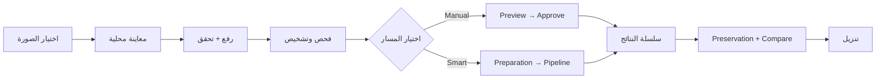

المبدأ التنفيذي هو:

```text
Diagnose → Treat → Preserve → Verify
```

ولا تُعد المعاينة نتيجة نهائية؛ الاعتماد هو النقطة التي تنشئ artifact محفوظاً من خلال Flask/OpenCV.

---

## 2. اختيار الصورة ورفعها

### 2.1 اختيار محلي

يختار المستخدم صورة من جهازه أو يسحبها إلى Drop Zone. تعرض الواجهة معاينة محلية قبل الإرسال، ولا ترسل مسار الملف المحلي إلى الخادم.

```text
Empty
  ↓ اختيار ملف
Image Selected
  ↓ معاينة
Local Preview
  ↓ ضغط زر الرفع
Upload Request
```

### 2.2 التحقق الخادمي

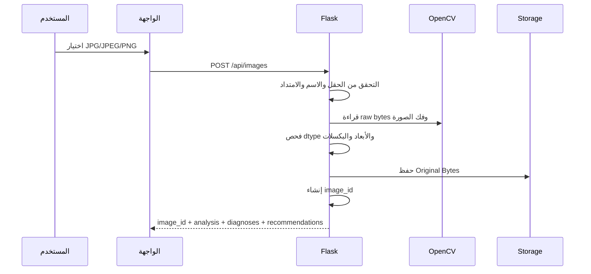

يرفض الخادم الملف إذا كان فارغاً، أو غير قابل للقراءة، أو خارج الامتدادات المسموحة، أو تجاوز `20 MB`، أو تجاوز `30,000,000` بكسل بعد فك الصورة.

### 2.3 بعد نجاح الرفع

تنتقل الواجهة إلى حالة **Examination Ready** وتعرض:

| المخرج | مكانه في التجربة |
| --- | --- |
| الصورة الأصلية | مساحة المعاينة |
| Dimensions وChannels | معلومات الصورة |
| Metrics | Dashboard |
| Diagnoses | لوحة التشخيص |
| Preservation Profile | مستوى الحذر |
| Recommendations | اقتراحات المعالجة |

---

## 3. الفحص والتشخيص

يعمل `analyzer.py` على الصورة المقروءة بعد نجاح التحقق. يحسب مؤشرات السطوع والتباين والنطاق الديناميكي والحدة والضوضاء وتفاوت الإضاءة وكثافة الحواف.

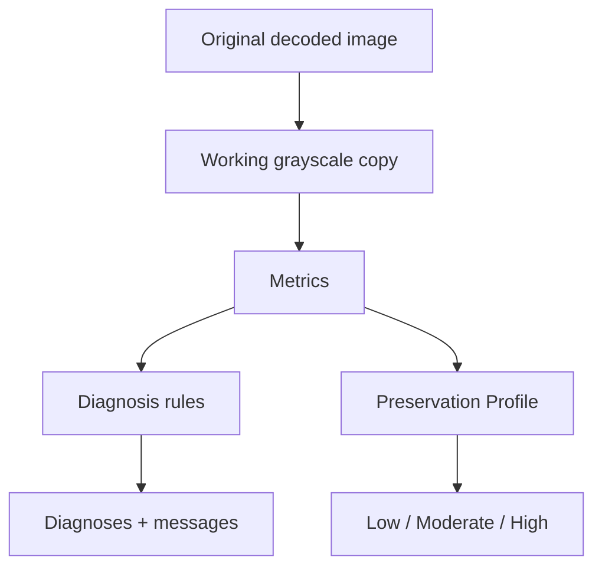

لا يغير التحليل الأصل، ولا ينفذ عملية معالجة، ولا يقرر وحده أن عملية معينة يجب اعتمادها. يحول `recommender.py` النتائج إلى توصيات Rule-Based تحتوي العملية والسبب والأولوية والمخاطر.

---

## 4. اختيار مسار المعالجة

بعد ظهور التشخيص والتوصية، يختار المستخدم:

| المسار | يستخدم عندما | طبيعة التنفيذ |
| --- | --- | --- |
| Manual | يريد التحكم في العملية والمعاملات | خطوة يراجعها المستخدم ثم يعتمدها |
| Smart Pipeline | يريد قراراً محافظاً مبنياً على التحليل | تجهيز وتحليل ومرشح والتحقق |

لا تدخل `super_resolution` تلقائياً في المسار الذكي، لأنها عملية يدوية مستقلة. كما لا يُفرض القص التلقائي إذا لم يسمح `verify_preparation` بذلك.

---

## 5. المعالجة اليدوية

### 5.1 تحديد المصدر الحالي

يبدأ أول اختيار من الأصل، لكن بعد اعتماد خطوة يدوية تصبح النتيجة المعتمدة هي مصدر الخطوة التالية:

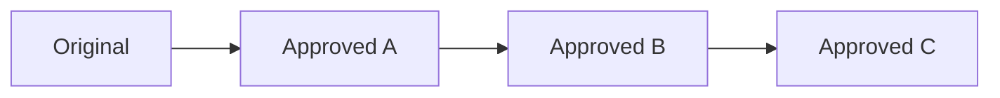

يُرسل `source_result_id` عند وجود نتيجة سابقة. يتحقق Flask من أن النتيجة تخص `image_id` نفسه وأنها نتيجة معتمدة صالحة للسلسلة.

### 5.2 المعاينة

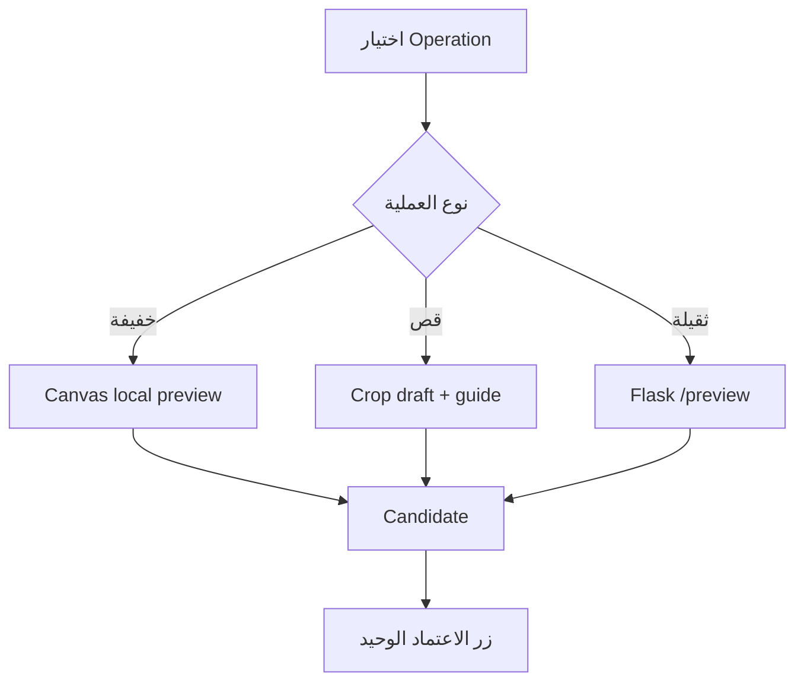

العمليات الخفيفة الحالية للمعاينة المحلية هي `rotate_right` و`rotate_left` و`flip_horizontal` و`flip_vertical` و`intensity_adjust` و`gamma_correct`. أما CLAHE وSuper Resolution وبقية العمليات الثقيلة فتستخدم Preview خادمياً على نسخة عرض.

في Preview الخادمي:

1. يحدد الخادم المصدر الحالي.
2. يصغر الصورة للعرض، باستثناء معالجة Crop قبل تصغير النتيجة.
3. يطبق العملية على نسخة المعاينة.
4. يعيد Preview بصيغة PNG افتراضياً أو JPEG عند إرسال `X-Preview-Format: jpeg`.
5. يتخطى Preservation Verification النهائي لأن الصورة ما زالت مرشحاً.

### 5.3 الاقتصاص اليدوي

يظهر إطار القص بهامش ابتدائي تقريبي 5%، وتتحرك مقابضه لتعديل `x` و`y` و`width` و`height`. لا تصبح القيم نتيجة محفوظة إلا بعد الاعتماد.

```text
Crop Guide
   ↓ سحب المقبض
Crop Parameters
   ↓ معاينة
Candidate
   ↓ اعتماد
Flask/OpenCV Crop Result
```

يجب أن تطابق أبعاد النتيجة النهائية قيم الإطار المعتمدة، مع بقاء الأصل دون تعديل.

### 5.4 Super Resolution

يختارها المستخدم عندما يكون النص صغيراً أو الصورة منخفضة الدقة. تستخدم حالياً تكبير Lanczos ثم Unsharp Masking بمعاملات `scale` و`amount` و`sigma`. وقد تزيد قابلية القراءة، لكنها لا تستعيد حروفاً فُقدت بالكامل.

### 5.5 الاعتماد

زر **اعتماد العملية وإضافتها للسلسلة** هو نقطة التنفيذ النهائية:

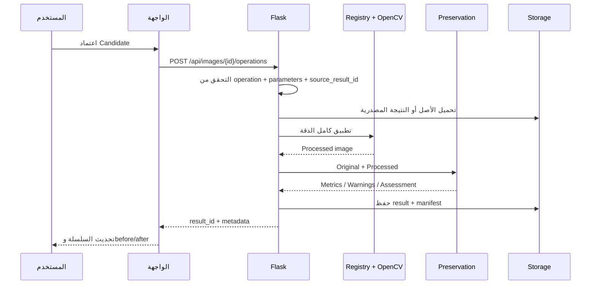

لا يوجد زر مستقل باسم «تنفيذ العملية الحالية». وجود Candidate قابل للاعتماد هو الذي يحدد جاهزية الزر الوحيد.

---

## 6. before/after وسجل الخطوات

عند عرض الخطوة النشطة، تكون الصورة السابقة هي مصدرها المباشر، والصورة اللاحقة هي نتيجتها:

| الخطوة النشطة | before | after |
| --- | --- | --- |
| الأولى | Original | Result A |
| الثانية | Result A | Result B |
| الثالثة | Result B | Result C |

تُحفظ الخطوات المعتمدة في `state.manualChain`، ويُحدد `manualActiveIndex` الخطوة النشطة، وتستخدم الواجهة `syncManualChainSelection` لتحديث الصورتين معاً. لا تعتمد الواجهة على تحميل الصورة الأصلية مكان before بعد كل اعتماد، لأن ذلك يعيد مشكلة التأخر خطوة واحدة.

### Undo وRedo

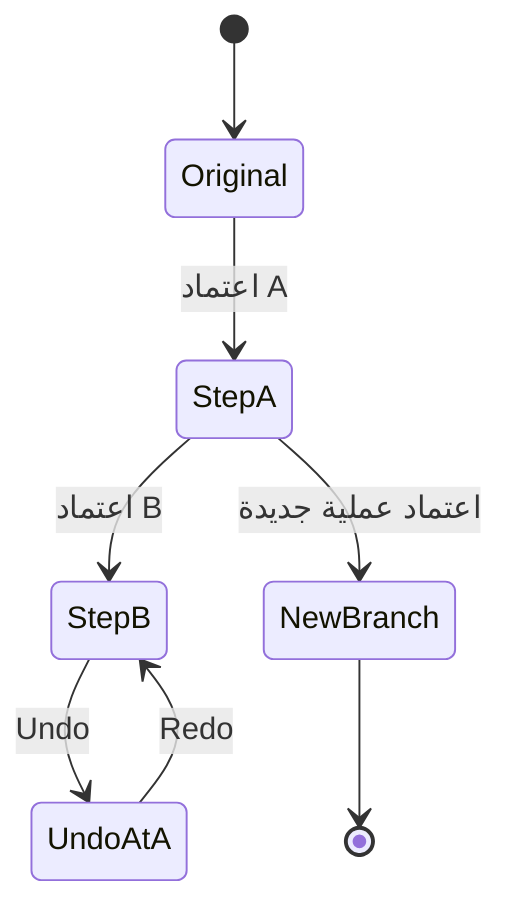

التراجع والإعادة يغيران المؤشر النشط ويعيدان عرض النتائج المحفوظة أو المؤقتة دون إعادة تنفيذ العملية بلا حاجة. إذا اعتمد المستخدم خطوة جديدة بعد التراجع، تزال الفروع اللاحقة غير النشطة من المسار الحالي.

---

## 7. Smart Pipeline وتجهيز الوثيقة

يبدأ Smart Pipeline من الصورة الأصلية، ولا يستخدم النتيجة اليدوية السابقة تلقائياً. قبل خطوات العلاج، يجرب تجهيز الوثيقة ثم يتحقق منه.

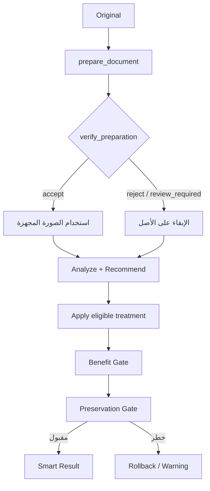

### سياسة Preparation

| الحالة | السلوك |
| --- | --- |
| حدود موثوقة | يمكن استخدام التصحيح المنظوري والقص الآمن عند نجاح التحقق |
| حدود غير موثوقة + deskew عالي الثقة | يقبل `deskew-only` ويحافظ على الإطار دون قص |
| ثقة منخفضة | يؤجل التجهيز أو يرفضه ويستمر من الأصل |

يعرض الرد خطوة `document_prepare` بحالة `accepted` أو `deferred`، و`method_used` عند توفرها. لا تعني `deferred` فشل Smart Pipeline كله؛ تعني فقط أن Preparation لم تكن آمنة تلقائياً.

### خطوات Smart

يعيد المسار الذكي الخطوات والقرار والتوصيات ونتيجة المحافظة، وقد يعيد Binarization Candidates مستقلة للمراجعة. لا تدخل Super Resolution في هذه السلسلة.

---

## 8. التحقق والمقارنة

بعد تنفيذ العملية أو Smart Pipeline، تقارن وحدة Preservation الأصل بالنتيجة. قد تعرض:

```text
acceptable
caution
high_risk
```

هذه حالات إرشادية، وليست فهماً لغوياً للنص أو ضماناً تاريخياً لحفظ كل حرف. تعرض الواجهة before/after، ملخص ما حدث، وسبب القرار أو التحذير.

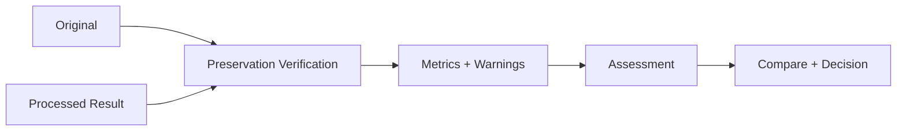

---

## 9. التنزيل

لا يصبح زر التنزيل فعالاً إلا عند وجود `result_id` محفوظ:

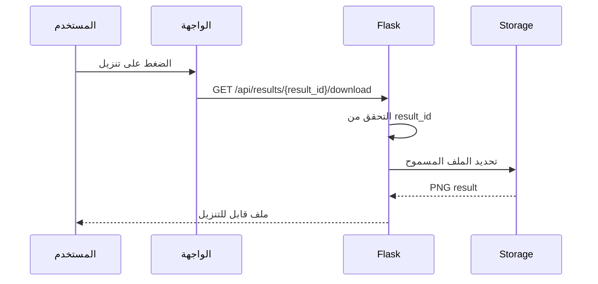

لا يرسل المستخدم مساراً محلياً أو مساراً نسبياً؛ يستخدم `result_id` فقط.

---

## 10. تدفق الأخطاء

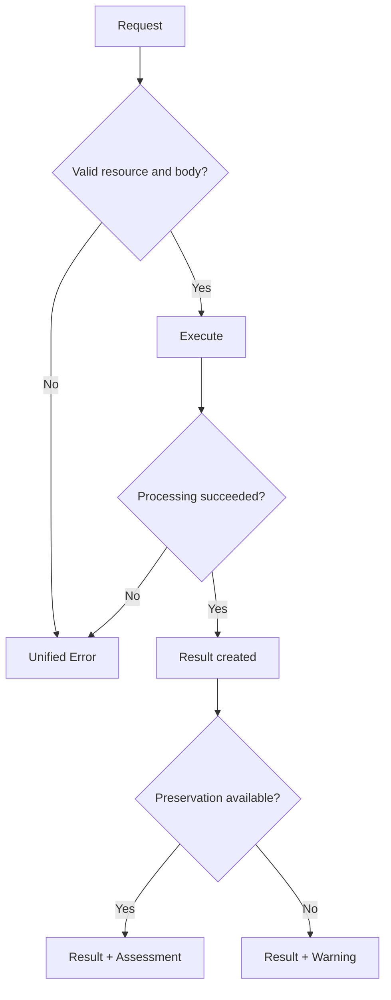

| الخطأ | السلوك |
| --- | --- |
| ملف أو معرف غير صالح | يتوقف الطلب برسالة عربية واضحة |
| Operation غير مسجلة | لا تستدعى أي دالة Python |
| Parameters غير صالحة | يعاد خطأ 400 مضبوط |
| مصدر نتيجة غير صالح | لا تضاف خطوة إلى السلسلة |
| فشل OpenCV | لا تُعرض النتيجة كمعتمدة |
| تعذر Preservation | يمكن إبقاء نتيجة المعالجة مع تحذير، دون وصفها بأنها آمنة |

---

## 11. التدفق المختصر المعتمد

| المرحلة | مدخلها | مخرجها |
| --- | --- | --- |
| Select | ملف محلي | Local Preview |
| Upload | صورة قابلة للقراءة | `image_id` |
| Examine | الأصل المفكوك | Metrics |
| Diagnose | Metrics | Diagnoses |
| Recommend | Diagnoses + Profile | خطة مبررة |
| Treat | Operation أو Smart request | Candidate أو Result |
| Preserve | Original + Result | Assessment |
| Compare | before + after | قرار مفهوم |
| Download | `result_id` | PNG result |

---

## 12. قاعدة إضافة مسار جديد

لا يضاف أي تدفق جديد إلى الواجهة قبل تحديد:

```text
متى يبدأ؟
  ↓
ما المصدر؟
  ↓
ما المعاينة؟
  ↓
ما نقطة الاعتماد؟
  ↓
ما النتيجة المحفوظة؟
  ↓
كيف يؤثر على Preservation؟
```

</div>
