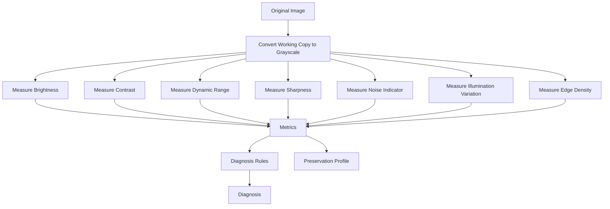
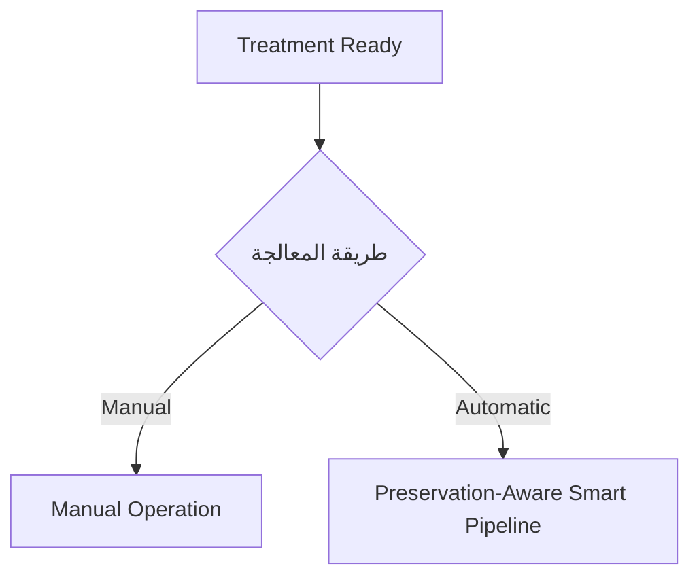
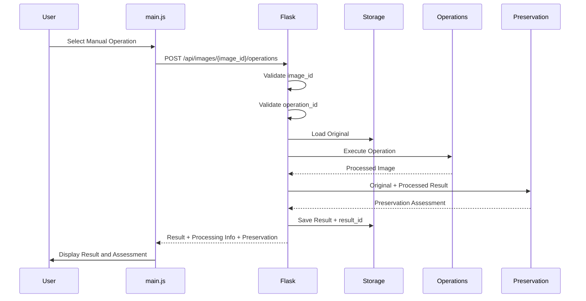
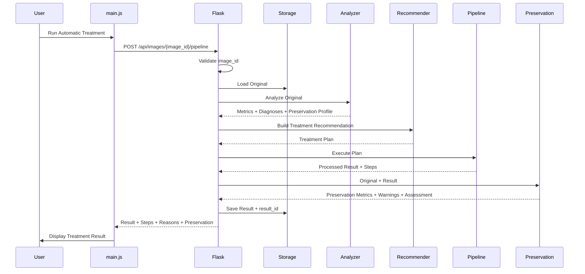
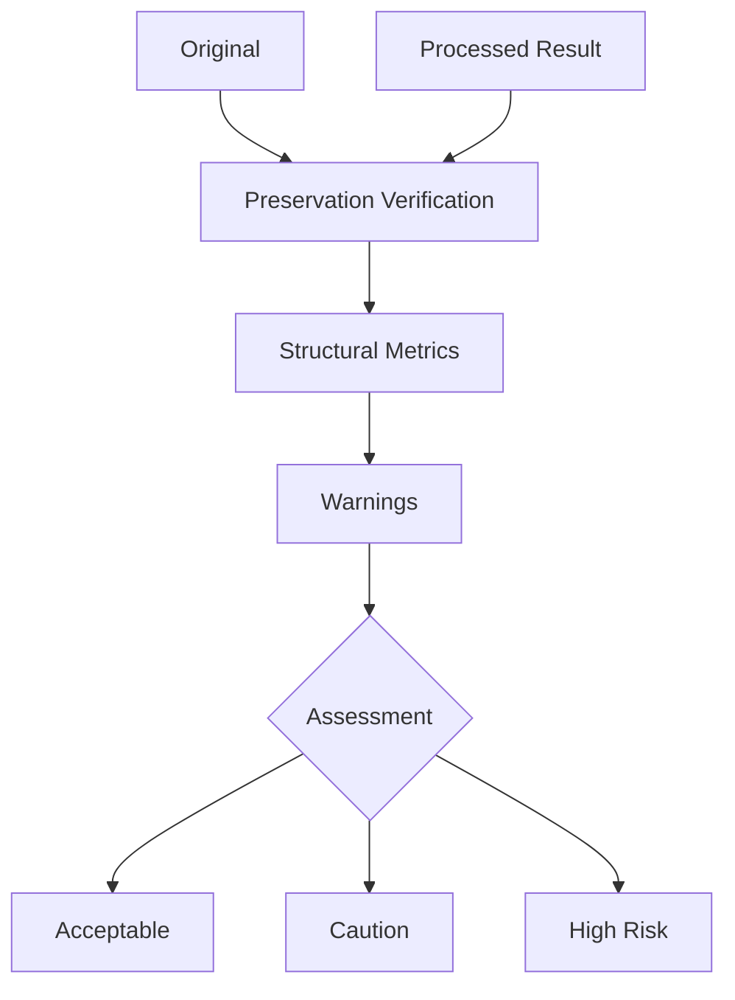
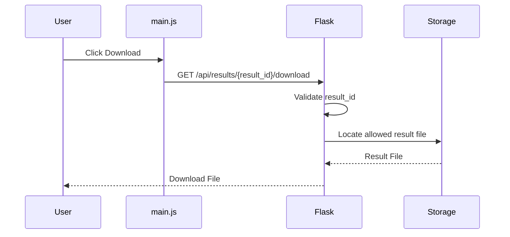
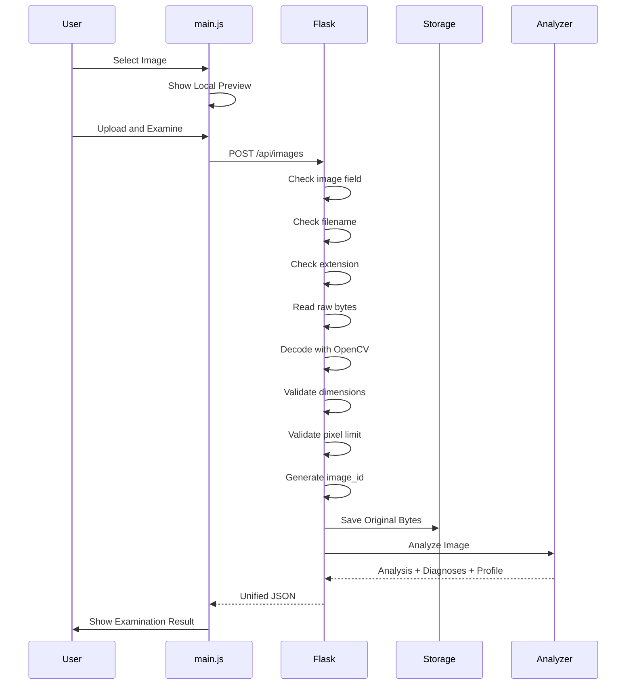
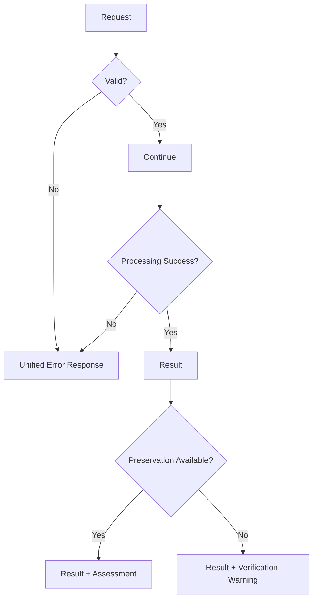
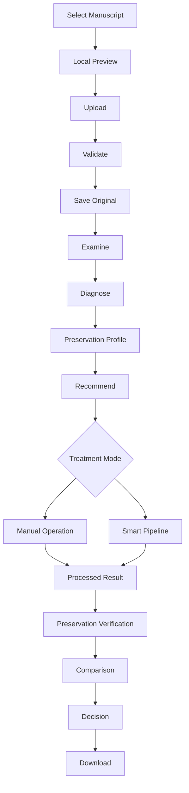

docs/workflow.md

<div dir="rtl" align="right">

# 🔄 Manuscript Doctor — تدفق العمل

> **الغرض من الوثيقة:** توثيق تسلسل عمل المستخدم والنظام خطوة بخطوة، من لحظة اختيار صورة المخطوطة حتى مقارنة النتيجة وتنزيلها.
> **هذه الوثيقة تصف التدفق فقط؛ أما المتطلبات ففي `requirements.md`، والعقود في `architecture.md`، وأسباب القرارات في `decisions.md`.**

---

## 🧭 الفكرة العامة للتدفق

يعتمد Manuscript Doctor على مسار واضح وثابت:

```text id="wf-core"
رفع الصورة
    ↓
التحقق منها
    ↓
فحصها
    ↓
تشخيص حالتها
    ↓
تقدير حساسية التفاصيل
    ↓
اقتراح المعالجة
    ↓
تنفيذ المعالجة
    ↓
فحص المحافظة
    ↓
مقارنة الأصل بالنتيجة
    ↓
عرض القرار
    ↓
تنزيل النتيجة
```

<div align="center">

### Diagnose → Treat → Preserve → Verify

</div>

---

# 1. تدفق المستخدم الأساسي

## 1.1 اختيار الصورة

1. يفتح المستخدم التطبيق.
2. يختار صورة مخطوطة من جهازه.
3. تعرض JavaScript معاينة محلية للصورة.
4. لا يتم إرسال الصورة إلى Backend حتى يضغط المستخدم زر الرفع.

### النتيجة المتوقعة

```text id="wf-select"
Image Selected
+
Local Preview
```

---

## 1.2 رفع الصورة وفحصها

بعد الضغط على زر:

> **رفع وفحص الصورة**

يحدث التالي:

1. ترسل الصورة إلى Backend.
2. يتحقق Backend من وجود الملف.
3. يتحقق من اسم الملف.
4. يتحقق من الامتداد.
5. يقرأ Raw Bytes.
6. يحاول فك الصورة باستخدام OpenCV.
7. يتحقق من أبعاد الصورة.
8. يتحقق من حد عدد Pixels.
9. يولد `image_id`.
10. يحفظ Original Bytes دون إعادة ترميز.
11. يبدأ Examination على الصورة الأصلية.

### النتيجة المتوقعة

```text id="wf-upload-result"
Original Saved
+
image_id
+
Examination Results
```

---

# 2. Examination Workflow

بعد نجاح الرفع يبدأ النظام بفحص الصورة الأصلية.



### المخرجات

```text id="wf-exam-output"
Dimensions
+
Metrics
+
Diagnoses
+
Preservation Profile
```

---

# 3. Diagnosis Workflow

بعد حساب Metrics يتم تطبيق قواعد التشخيص.

المبدأ:

```text id="wf-diagnosis"
Metric
   ↓
Threshold / Rule
   ↓
Diagnosis
```

مثال:

```text id="wf-diagnosis-example"
Brightness منخفض
      ↓
Diagnosis:
إضاءة منخفضة
```

التشخيص لا يحدد العملية العلاجية مباشرة.

---

# 4. Preservation Profile Workflow

Preservation Profile يتم تكوينه **قبل المعالجة**.

هدفه الإجابة تقريبًا عن:

> ما مقدار الحذر المطلوب عند معالجة هذه الصورة؟

```text id="wf-profile"
Original Metrics
      ↓
Sensitivity Indicators
      ↓
Preservation Profile
      ↓
Low / Moderate / High
```

### مهم

Preservation Profile:

* لا يقيس مقدار النص المحفوظ.
* لا يقارن Original مع Result.
* لا يمثل ضمانًا لسلامة المعالجة.

المقارنة الفعلية تأتي لاحقًا في Preservation Verification.

---

# 5. Recommendation Workflow

بعد اكتمال Diagnosis وPreservation Profile:

```text id="wf-recommendation"
Diagnosis
+
Preservation Profile
      ↓
Recommender
      ↓
Treatment Recommendation
```

كل Recommendation يجب أن توضح:

* العملية المقترحة.
* سبب الاختيار.
* Priority عند الحاجة.
* أي Warning متعلق بالحساسية.

### مثال

```text id="wf-rec-example"
Diagnosis:
Low Contrast

Preservation Profile:
Moderate

        ↓

Recommendation:
CLAHE

Reason:
تحسين التباين المحلي بصورة أكثر تحفظًا من بعض المعالجات العالمية.
```

---

# 6. اختيار طريقة المعالجة

بعد عرض Recommendation يستطيع المستخدم اختيار أحد مسارين:



---

# 7. Manual Processing Workflow

## القاعدة الأساسية

كل Manual Operation تبدأ من:

> **Original Image**

ولا تبدأ من Result سابقة.

```text id="wf-manual-rule"
Original
   ↓
Operation A
   ↓
Result A
```

ثم عند اختيار Operation B:

```text id="wf-manual-second"
Original
   ↓
Operation B
   ↓
Result B
```

وليس:

```text id="wf-manual-wrong"
Original
   ↓
Operation A
   ↓
Result A
   ↓
Operation B
```

---

## التدفق الكامل



---

# 8. Preservation-Aware Smart Pipeline Workflow

Smart Pipeline ليست سلسلة ثابتة لجميع الصور.

المسار الصحيح:

```text id="wf-pipeline-core"
Analysis
+
Diagnosis
+
Preservation Profile
        ↓
Recommendation
        ↓
Treatment Plan
        ↓
Pipeline
        ↓
Processed Result
        ↓
Preservation Verification
```

---

## التدفق الكامل



---

# 9. Preservation Verification Workflow

Preservation Verification يحدث **بعد المعالجة**.

مدخلاته:

```text id="wf-pres-input"
Original
+
Processed Result
```

ثم:



### الهدف

اكتشاف مؤشرات على تغيرات مثل:

* فقد تفاصيل دقيقة.
* تغير واضح في الحواف.
* تفتت مكونات.
* اندماج مكونات.
* تغير بنيوي غير مرغوب.

### لا يعني

```text id="wf-pres-no"
Structural Change
≠
Text Loss Confirmed
```

---

# 10. Treatment Decision Workflow

بعد Preservation Verification تعرض الواجهة Decision مفهومة.

مثال:

```text id="wf-decision-ok"
Assessment:
Acceptable

Message:
تحسنت الصورة دون ظهور مؤشرات قوية على تغير بنيوي غير مرغوب وفق المقاييس المستخدمة.
```

أو:

```text id="wf-decision-warning"
Assessment:
Caution

Message:
تحسنت بعض الخصائص، لكن ظهرت مؤشرات تستدعي مراجعة النتيجة قبل اعتمادها.
```

أو:

```text id="wf-decision-risk"
Assessment:
High Risk

Message:
تشير المؤشرات إلى تغير بنيوي مرتفع نسبيًا، ويوصى باستخدام معالجة أكثر تحفظًا.
```

---

# 11. Comparison Workflow

بعد اكتمال المعالجة والتقييم:

```text id="wf-comparison"
Original
    │
    ├──────────────┐
    │              │
    ▼              ▼
Original View    Result View
    │              │
    └──────┬───────┘
           ↓
Preservation Assessment
           ↓
Treatment Summary
```

في الـMVP الأساسي:

```text id="wf-comparison-mvp"
Original
+
Result
+
Assessment
```

أما:

```text id="wf-optional-map"
Structural Change Map
```

فهي ميزة اختيارية لاحقة.

---

# 12. Treatment Summary Workflow

بعد كل Result يجب أن تستطيع الواجهة عرض:

```text id="wf-summary"
Detected Problem
+
Treatment Applied
+
Why It Was Chosen
+
Preservation Assessment
+
Final Message
```

الغرض من Summary ليس عرض تفاصيل تقنية كثيرة، بل جعل النتيجة قابلة للتفسير.

---

# 13. Download Workflow

لا يظهر Download كوظيفة فعالة إلا بعد وجود Result حقيقية.



### قاعدة أمان

لا يرسل المستخدم:

```text id="wf-download-bad"
C:\file.png
../results/file.png
```

بل يرسل Backend Resource ID فقط.

---

# 14. التدفق التقني الكامل للرفع



---

# 15. ترتيب المسؤوليات داخل Backend

المسار المطلوب عند اكتمال جميع الوحدات:

```text id="wf-backend-order"
Request
   ↓
Flask Validation
   ↓
Resource Resolution
   ↓
Specialized Processing Module
   ↓
Preservation Verification عند الحاجة
   ↓
Storage
   ↓
Unified JSON Response
```

### غير مسموح

```text id="wf-backend-wrong"
Request
↓
app.py
↓
كل الخوارزميات داخله
```

---

# 16. تدفق الأخطاء

أي خطأ متوقع يجب أن يتوقف عند أقرب نقطة صحيحة.



---

# 17. أخطاء الرفع

| الحالة                 | Code                         | السلوك               |
| ---------------------- | ---------------------------- | -------------------- |
| لا يوجد ملف            | `NO_FILE`                    | إيقاف الطلب          |
| Filename فارغ          | `EMPTY_FILENAME`             | إيقاف الطلب          |
| Extension غير مسموح    | `UNSUPPORTED_FILE_TYPE`      | رفض الملف            |
| ملف أكبر من الحد       | `FILE_TOO_LARGE`             | رفض الطلب            |
| أبعاد مفرطة            | `IMAGE_DIMENSIONS_TOO_LARGE` | رفض الصورة           |
| الملف غير قابل للقراءة | `UNREADABLE_IMAGE`           | عدم حفظه كصورة صالحة |

---

# 18. أخطاء المعالجة

| الحالة                 | Code                        | السلوك                                                     |
| ---------------------- | --------------------------- | ---------------------------------------------------------- |
| `image_id` غير موجود   | `IMAGE_NOT_FOUND`           | لا تنفذ المعالجة                                           |
| Operation غير مسجلة    | `INVALID_OPERATION`         | لا تستدعَ أي Function                                      |
| فشل Operation          | `PROCESSING_FAILED`         | لا تعتبر Result ناجحة                                      |
| Result غير موجودة      | `RESULT_NOT_FOUND`          | لا يتم التنزيل                                             |
| فشل Preservation Check | `PRESERVATION_CHECK_FAILED` | يمكن إعادة Result مع Warning إذا كانت المعالجة نفسها ناجحة |

---

# 19. فشل Preservation Check

هذه حالة خاصة.

```text id="wf-pres-fail"
Processing
    ✓ Success

Preservation
    ✗ Failed
```

لا نريد تحويلها تلقائيًا إلى:

```text id="wf-pres-fail-wrong"
Everything Failed
```

إذا كانت Result نفسها صحيحة:

```text id="wf-pres-fail-correct"
Result Available
+
Preservation Assessment Unavailable
+
Warning
```

لكن:

> لا يجوز اعتبار Result آمنة بسبب غياب التقييم.

---

# 20. حالات الواجهة أثناء التدفق

```text id="wf-ui-states"
Empty
   ↓
Image Selected
   ↓
Uploading / Examining
   ↓
Examination Ready
   ↓
Treatment Ready
   ↓
Processing
   ↓
Verifying
   ↓
Result Ready
```

الحالات غير الخطية:

```text id="wf-ui-extra"
Warning
Error
```

تفاصيل كل حالة توجد في:

```text id="wf-ui-doc"
docs/ui-states.md
```

---

# 21. User Workflow المختصر

|  #  | المرحلة                  | ما يراه المستخدم                 |
| :-: | ------------------------ | -------------------------------- |
|  1  | **Select**               | اختيار صورة                      |
|  2  | **Preview**              | معاينة محلية                     |
|  3  | **Upload**               | رفع الصورة                       |
|  4  | **Examine**              | مؤشرات الحالة البصرية            |
|  5  | **Diagnose**             | المشكلات المكتشفة                |
|  6  | **Preservation Profile** | مقدار الحذر المقترح              |
|  7  | **Recommend**            | خطة المعالجة وسببها              |
|  8  | **Treat**                | Manual أو Smart Pipeline         |
|  9  | **Verify**               | فحص أثر المعالجة                 |
|  10 | **Compare**              | Original مقابل Result            |
|  11 | **Decision**             | Acceptable / Caution / High Risk |
|  12 | **Download**             | تنزيل Result                     |

---

# 22. المسار النهائي للنظام



---

# 23. قاعدة التدفق الأساسية

أي ميزة جديدة يجب أن تجد مكانًا منطقيًا داخل هذا التدفق.

إذا لم نستطع تحديد:

```text id="wf-feature-check"
متى تبدأ؟
↓
ما مدخلاتها؟
↓
ما مخرجاتها؟
↓
ما الوحدة المسؤولة عنها؟
↓
كيف تؤثر على Preservation؟
```

فلا يتم إدخالها مباشرة إلى الـMVP.

---

<div align="center">

## 🩺 Manuscript Doctor

### Workflow Principle

**Examine before treating.**
**Explain before applying.**
**Verify before trusting.**

</div>

</div>
