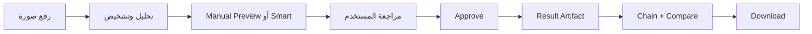
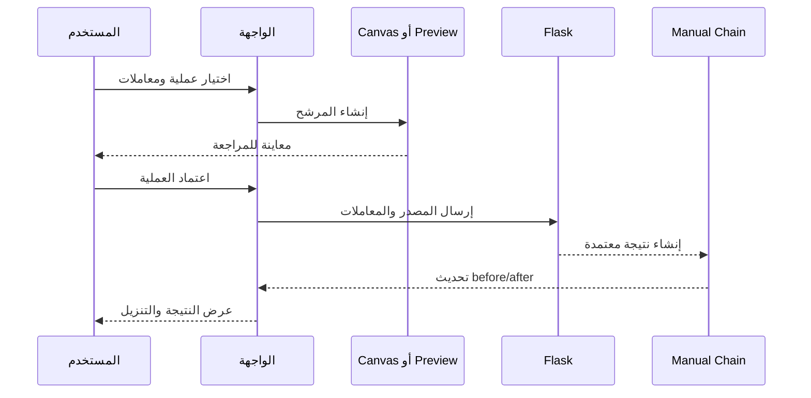
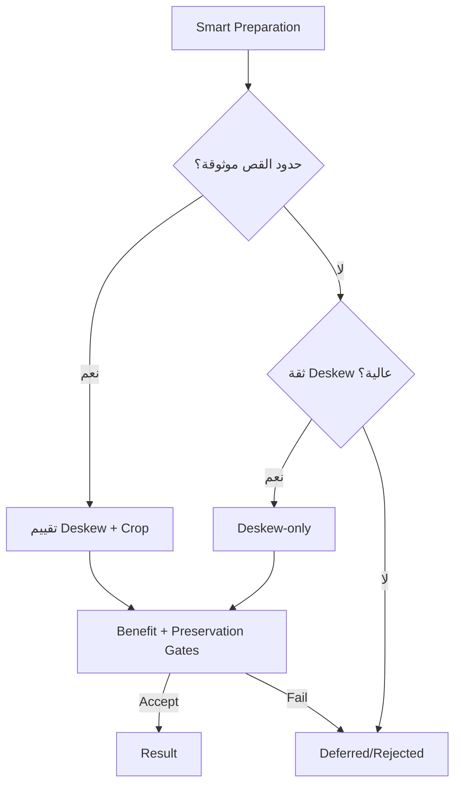

<div dir="rtl" align="right">

# تقرير الاختبار اليدوي وضمان الجودة

> يوثق هذا التقرير الجولة الحالية من التحقق اليدوي والتكاملـي لتطبيق **طبيب الوثائق (Manuscript Doctor)**. لا تُستخدم نتائج الجولات القديمة بوصفها نتيجة الإصدار الحالي.

## 1. نطاق التحقق

ركزت الجولة على المسارات التي قد تتأثر بتقسيم الواجهة وتحسين المعاينة والسلسلة اليدوية، إضافة إلى تجهيز الوثيقة الذكي، الاقتصاص اليدوي، Super Resolution، صورة Header، وسلامة الحزمة والاختبارات. الهدف ليس إثبات أن كل صورة تنتج النتيجة نفسها، بل إثبات أن التدفق الصحيح يعمل، وأن النتيجة المعتمدة تأتي من Flask/OpenCV، وأن الحالات غير الآمنة لا تُقبل تلقائياً.



## 2. معايير القبول والنتيجة

| المجال | معيار القبول | النتيجة الحالية |
| --- | --- | --- |
| المعاينة الخفيفة | استخدام Canvas محلياً دون طلب `/preview` أثناء المعاينة | **ناجح** |
| الاعتماد النهائي | إنشاء artifact حقيقي عبر Flask/OpenCV | **ناجح** |
| before/after | عرض مصدر الخطوة ونتيجتها نفسها دون تأخر خطوة | **ناجح** |
| Undo/Redo | تغيير المؤشر والصور المعروضة دون إعادة تنفيذ غير لازم | **ناجح** |
| الاقتصاص | إطار قابل للسحب، وقيم معتمدة تطابق الأبعاد النهائية | **ناجح** |
| Smart Preparation | قبول deskew-only عند الثقة العالية فقط | **ناجح** |
| Super Resolution | عملية يدوية مستقلة بتكبير محدود وحماية لحجم الناتج | **ناجح** |
| الواجهة | زر اعتماد واحد وعدم وجود زر تنفيذ مكرر | **ناجح** |
| Header | ظهور الصورة الجديدة كخلفية للـHeader فقط | **ناجح** |
| Regression | اختبارات Python وصياغة JavaScript | **ناجح** |

## 3. المعاينة اليدوية والأداء الملحوظ

أصبحت العمليات الخفيفة التالية تعرض مرشحاً محلياً على Canvas: `rotate_right` و`rotate_left` و`flip_vertical` و`flip_horizontal` و`intensity_adjust` و`gamma_correct`. في اختبار C05 ظهرت معاينة `rotate_right` خلال نحو `121ms`، وظهرت معاينة `intensity_adjust` خلال نحو `81ms`، ولم يُسجل طلب جديد إلى `/preview` أثناء سلسلة العمليات المحلية المتتابعة.

أما العمليات الثقيلة، مثل CLAHE وSuper Resolution، فتستخدم مسار Flask للمعاينة. يدعم المسار JPEG اختيارياً لتقليل النقل، بينما يبقى PNG هو التنسيق الافتراضي. هذه القياسات تخص جلسات وصوراً محددة؛ ولا تعني أن Smart Pipeline أو كل العمليات أصبحت فورية.

| المسار | مكان المعاينة | مكان النتيجة النهائية |
| --- | --- | --- |
| عملية خفيفة | Canvas في المتصفح | Flask/OpenCV عند الاعتماد |
| عملية ثقيلة | `/api/images/<id>/preview`، PNG أو JPEG اختياري | Flask/OpenCV عند الاعتماد |
| Smart Pipeline | تحليل وتحقق خادميان | Flask/OpenCV بعد القرار والبوابات |

## 4. الاعتماد والسلسلة اليدوية

أزيل مسار التنفيذ المستقل من الواجهة، وأصبح زر **اعتماد العملية وإضافتها للسلسلة** هو المسار الوحيد الذي يحفظ العملية. يظل Canvas وسيلة عرض فقط، بينما ينفذ Flask/OpenCV العملية بدقة عند الاعتماد ويعيد metadata وartifact قابلين للتنزيل.



اختُبرت سلسلة من خطوتين على C06. بعد اعتماد `intensity_adjust` ثم `rotate_right` ظهر before بمعرف نتيجة الخطوة الأولى وafter بمعرف نتيجة الخطوة الثانية، وكان المؤشر النشط `activeIndex=1`. استخدمت الخطوة الثانية `source_result_id` للنتيجة السابقة، وبقيت الصورة الأصلية غير معدلة.

## 5. Undo وRedo

أعيد اختبار Undo ثم Redo على السلسلة نفسها. أعاد Undo المؤشر إلى الخطوة الأولى وطابق after المعاينة المحلية للخطوة الأولى، ثم أعاد Redo المؤشر إلى الخطوة الثانية وطابق after المعاينة المحلية للخطوة الثانية. لم يُطلب تنفيذ خادمي جديد لمجرد تغيير الحالة المعروضة؛ وهذا يفصل بين سرعة التنقل وصحة artifact المعتمد.

## 6. الاقتصاص اليدوي

يبدأ إطار Crop بهامش `5%` من أبعاد مصدر الصورة، ثم يمكن سحب مقابضه في المحرر. في الاختبار الفعلي تغير الإطار من:

```text
x=64, y=48, width=1152, height=864
```

إلى:

```text
x=140, y=124, width=1076, height=788
```

بعد الاعتماد أرسل التطبيق هذه القيم إلى Flask/OpenCV، وأعاد الخادم صورة بأبعاد `1076×788`، وهي مطابقة للإطار المعتمد. لا يوجد زر تنفيذ منفصل للقص؛ الاعتماد هو الخطوة التي تثبت النتيجة في السلسلة.

## 7. Smart Preparation: C05 وC06

اختُبرت سياسة تجهيز الوثيقة على حالتين مختلفتين لتجنب تعميم قبول غير آمن.

| الصورة | المعطيات | القرار |
| --- | --- | --- |
| C05 | ثقة deskew تقارب `0.8683`، زاوية تقارب `-34°`، وresidual skew قريب من `-0.04°`، دون حدود قص موثوقة | قبول `deskew-only` مع الحفاظ على الإطار الكامل |
| C06 | ثقة deskew تقارب `0.6849`، وهي غير كافية للقبول المحافظ | `document_prepare` مؤجلة أو مرفوضة، دون deskew؛ ثم يمكن قبول خطوة مؤهلة أخرى مثل `illumination_normalize` |



## 8. Super Resolution

أضيفت `super_resolution` كعملية يدوية مستقلة. ينفذ المسار الحالي تكبيراً بـLanczos ثم Unsharp Masking على luminance فقط، مع `scale=2/3`، و`amount=0..1`، و`sigma=0.5..3`، وحد أقصى يبلغ 60 مليون بكسل للناتج. لا تدخل العملية في Smart Pipeline، وليست DNN أو Real-ESRGAN، ولا تدعي استعادة معلومات فُقدت بالكامل.

في اختبار C05، اكتملت المعاينة الخادمية بصيغة JPEG بأبعاد `720×960`، ثم اعتُمدت النتيجة عبر Flask/OpenCV خلال نحو `357ms`. أضيفت خطوة إلى السلسلة، وأعاد الخادم نتيجة بأبعاد `1920×2560` من مصدر `960×1280`، وهو تكبير 2× صحيح. كما ظهر تنبيه الواجهة الذي يوضح أن التحسين قد يزيد قابلية القراءة دون ضمان استعادة الحروف غير الموجودة في المصدر.

## 9. اختبار Header والواجهة

بعد إعادة تحميل التطبيق ظهر artwork الجديد داخل `.app-header` فقط. تحقق الاختبار من عدم وجود `.hero-transformation-visual` ومن عدم وجود عناصر صور تستخدم الصورة القديمة في المقدمة. كما ظهرت بطاقة `super_resolution` مرة واحدة، وظهر خيارها في `#manualOperation`.

الصورة المستخدمة هي `static/assets/header-workspace-background.png` بأبعاد `1575×484`. بعد تثبيت override النهائي أصبح CSS المحسوب في المتصفح يستخدم `background-size: 100% 100%, 100% 100%`، وبقيت الخلفية واضحة داخل Header دون عنصر Hero منفصل.

كما تحقق الاختبار من بقاء مخطط **أثر المعاينة** داخل لوحة العملية الحالية، ومن عدم وجود زر مستقل باسم تنفيذ العملية الحالية، ومن استمرار زري Undo وRedo والتنزيل.

## 10. الاختبارات الآلية الداعمة

شُغلت اختبارات Python بالأمر التالي:

```bash
PYTHONPATH=/home/ubuntu/image_project_split pytest -q
```

والنتيجة الحالية:

```text
333 passed, 16 skipped
```

وشُغل فحص صياغة JavaScript لجميع الملفات المقسمة:

```bash
node --check static/js/parts/*.js
```

وقد نجح الفحص لجميع الملفات. تتضمن تغطية Super Resolution اختبارات التكبير، الحفاظ على alpha، رفض المعاملات غير الآمنة، وحد الناتج، إضافة إلى اختبار التكامل عبر Flask.

## 11. ملاحظات وحدود QA

هذه الجولة تثبت المسارات التي جُربت والقرارات التي تحمي الصور من القبول غير الآمن. لا تثبت أن كل عملية مناسبة لكل صورة، ولا أن Smart Pipeline فوري، ولا أن Super Resolution تضيف معلومات جديدة إلى مصدر منخفض الجودة. كما أن أزمنة C05 وC06 هي قياسات محلية مرتبطة بحجم الصورة وبيئة التشغيل.

لا يتضمن هذا الإصدار OCR، أو تدريب Deep Learning، أو Generative Restoration، أو Queue خلفية، أو قاعدة بيانات، أو حسابات مستخدمين. وجود هذه العناصر في تقارير تاريخية لا يعني أنها وظائف منفذة حالياً.

## 12. الحكم النهائي

**حالة الاختبار: ناجح للإصدار الحالي ضمن النطاق المحدد.** تحقق المسار الأساسي من الرفع إلى المعاينة ثم الاعتماد والسلسلة والتنزيل، مع نجاح فصل المعاينة عن artifact النهائي. كما نجحت حماية Smart Preparation في C05 وC06، ونجح Crop القابل للسحب، وSuper Resolution اليدوية، وتحديث Header، واختبارات regression الحالية.

</div>
