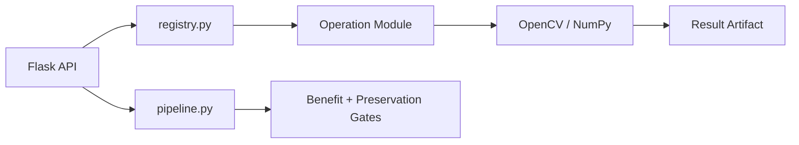

# طبقة المعالجة

يحتوي هذا المجلد على منطق تحليل الصور وتطبيق عمليات OpenCV وNumPy في **Manuscript Doctor**. الواجهة لا تنفذ النتيجة النهائية بنفسها؛ عند الاعتماد يمر الطلب عبر Flask ثم هذه الطبقة لإنشاء artifact قابل للتنزيل والتحقق.

## البنية

| المسار | المسؤولية |
| --- | --- |
| `analyzer.py` | استخراج مؤشرات مثل السطوع والتباين والحدة والضوضاء وتفاوت الإضاءة والحواف |
| `recommender.py` | توصيات Rule-based قابلة للشرح اعتماداً على التحليل |
| `pipeline.py` | Smart Pipeline، العمليات المؤهلة، البوابات، وحدود المحاولات |
| `preparation_pipeline.py` | تنفيذ تجهيز الوثيقة عند استيفاء شروط القبول |
| `preparation_verification.py` | التحقق المحافظ من المرشح، بما في ذلك سياسة deskew-only |
| `preservation.py` | قياس أثر المعالجة والمحافظة على بنية الصورة |
| `ops/registry.py` | السجل المركزي للعمليات والمعاملات والتصنيف والسياسة |
| `ops/*.py` | تطبيق العمليات الفئوية، ومنها الهندسة والإضاءة والضوضاء والتفاصيل وSuper Resolution |
| `operations.py` | وظائف توافق أو وظائف مشتركة متبقية؛ لا يُقرأ كقائمة وحيدة لكل العمليات الحالية |

## Manual وSmart

في المسار اليدوي يختار المستخدم العملية والمعاملات، يراجع Preview، ثم يعتمدها. تبدأ الخطوة الأولى من الصورة الأصلية، وتستخدم الخطوات اللاحقة النتيجة المعتمدة السابقة عبر `source_result_id`.

أما Smart Pipeline فله سياسة مستقلة: لا تُقبل العملية إلا إذا اجتازت التحقق والبوابات. يمكن قبول `deskew-only` عند ثقة عالية حتى لو لم تكن حدود القص موثوقة، بينما تبقى الحالات منخفضة الثقة مؤجلة أو مرفوضة بأمان.

## Super Resolution

توجد `ops/super_resolution.py` كعملية يدوية مستقلة. تنفذ Lanczos upscale ثم Unsharp Masking على luminance، مع `scale=2/3`، وحدود للمعاملات وحماية من تجاوز 60 مليون بكسل. لا تُعد DNN ولا تدخل Smart Pipeline ولا تستعيد معلومات مفقودة بالكامل.

## قواعد المساهمة

أي عملية جديدة يجب أن تسجل في `ops/registry.py`، وتحدد معاملاتها وحدودها وتصنيفها، وتضيف اختبارات سلوكية مناسبة. لا يكفي أن تعيد الدالة صورة؛ يجب التحقق من الأبعاد والقنوات والأثر المتوقع وعدم تعديل المصدر الأصلي.

