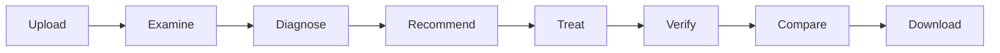

project-plan.md

<div dir="rtl" align="right">

# ✅ Manuscript Doctor — خطة التنفيذ الرسمية

> **وظيفة هذا الملف:** المصدر الرسمي لتتبع تنفيذ المشروع.
> لا يتم وضع `[x]` إلا بعد **التنفيذ الفعلي + الاختبار + المراجعة**.

---

## فلسفة المشروع

<div align="center">

### Diagnose → Treat → Preserve → Verify

**تشخيص الصورة → اختيار المعالجة → المحافظة على التفاصيل → التحقق من النتيجة**

</div>

---

# المرحلة 0 — تثبيت المشكلة والنطاق

### الهدف

تثبيت ما الذي يبنيه المشروع وما الذي لا يبنيه.

* [ ] اعتماد تعريف Manuscript Doctor النهائي.
* [ ] تثبيت وظائف الـMVP الأساسية.
* [ ] تثبيت الحدود العلمية للمشروع.
* [ ] توثيق ما هو خارج النطاق.
* [ ] مراجعة عدم وجود تعارض بين الفكرة والمتطلبات.

### بوابة الإغلاق

* [ ] المشكلة واضحة.
* [ ] القيمة واضحة.
* [ ] الـMVP محدد.

---

# المرحلة 1 — Workspace & Git

* [ ] إنشاء هيكل المشروع.
* [ ] إنشاء مجلدات Backend وFrontend وTests وStorage.
* [ ] إعداد `.gitignore`.
* [ ] تهيئة Git.
* [ ] التأكد من استبعاد Runtime Images.
* [ ] إنشاء أول Commit نظيف.

---

# المرحلة 2 — Python Environment

* [ ] إنشاء Virtual Environment.
* [ ] تثبيت Flask.
* [ ] تثبيت OpenCV.
* [ ] تثبيت NumPy.
* [ ] تثبيت pytest.
* [ ] إنشاء `requirements.txt`.
* [ ] اختبار تشغيل البيئة من جديد.

---

# المرحلة 3 — UX Design

### المخرجات المرجعية

* [ ] مراجعة `docs/workflow.md`.
* [ ] اعتماد `docs/wireframes.md`.
* [ ] اعتماد `docs/ui-states.md`.
* [ ] اعتماد `docs/frontend-components.md`.
* [ ] التأكد أن الواجهة تعكس المسار التشخيصي وليس Filter Gallery.

---

# المرحلة 4 — Architecture & API Contracts

* [ ] تثبيت مسؤولية كل Module.
* [ ] اعتماد Resource IDs.
* [ ] اعتماد Operation Registry.
* [ ] تثبيت Unified JSON Response.
* [ ] تثبيت API Endpoints.
* [ ] تثبيت Error Codes.
* [ ] تثبيت قاعدة Original Immutability.
* [ ] مراجعة `docs/architecture.md`.

---

# المرحلة 5 — Flask Backend Foundation

### الهدف

بناء الأساس الآمن الذي ستعتمد عليه جميع المراحل التالية.

* [ ] إنشاء Flask App.
* [ ] إنشاء الصفحة الأساسية `/`.
* [ ] تنفيذ `POST /api/images`.
* [ ] التحقق من وجود الملف.
* [ ] التحقق من الامتداد.
* [ ] قراءة Raw Bytes.
* [ ] التحقق من الصورة بواسطة OpenCV.
* [ ] تطبيق حد حجم الملف.
* [ ] تطبيق حد أبعاد الصورة.
* [ ] توليد `image_id`.
* [ ] حفظ Original دون الكتابة فوقها.
* [ ] تنفيذ `GET /api/images/<image_id>`.
* [ ] إضافة Placeholder للعمليات غير المنفذة.
* [ ] اختبار Upload Errors.
* [ ] اختبار IDs.
* [ ] اختبار حفظ Original.

### بوابة الإغلاق

```text
Upload → Validate → Save Original → Return image_id
```

يعمل بالكامل.

---

# المرحلة 6 — Examination & Diagnosis Engine

### الملف الرئيسي

`processing/analyzer.py`

### Metrics

* [ ] Dimensions.
* [ ] Brightness.
* [ ] Contrast.
* [ ] Dynamic Range.
* [ ] Sharpness.
* [ ] Noise Indicator.
* [ ] Illumination Variation.
* [ ] Edge Density.

### Diagnosis

* [ ] إنشاء Diagnosis Rules الأولية.
* [ ] استخدام Thresholds أولية موثقة كـHeuristics.
* [ ] إرجاع Severity.
* [ ] إرجاع Label.
* [ ] إرجاع Message.

### Preservation Profile

* [ ] إنشاء مستوى `low`.
* [ ] إنشاء مستوى `moderate`.
* [ ] إنشاء مستوى `high`.
* [ ] إرجاع Indicators.
* [ ] الفصل الكامل عن Preservation Verification.

### الاختبارات

* [ ] Grayscale.
* [ ] BGR.
* [ ] BGRA.
* [ ] Invalid Image.
* [ ] Original unchanged.
* [ ] Dark → Brightness أقل.
* [ ] Blur → Sharpness أقل.
* [ ] Low Contrast → Contrast أقل.
* [ ] Uneven Lighting → Variation أعلى.
* [ ] جميع Unit Tests ناجحة.

---

# المرحلة 7 — Image Processing Operations

### الملف الرئيسي

`processing/operations.py`

### العمليات

* [ ] Grayscale.
* [ ] Median Filter.
* [ ] Gaussian Filter.
* [ ] Histogram Equalization.
* [ ] CLAHE.
* [ ] Sharpening.
* [ ] Canny.
* [ ] Otsu Threshold.
* [ ] Adaptive Threshold.
* [ ] Opening.
* [ ] Closing.

### القواعد

* [ ] كل Function مستقلة.
* [ ] لا تتعامل مع HTTP.
* [ ] لا تقرأ ملفات مباشرة.
* [ ] لا تعدل Original.
* [ ] Parameters واضحة.
* [ ] جميع العمليات قابلة للاختبار.

---

# المرحلة 8 — Operation Evaluation & Tuning

### الهدف

فهم سلوك العمليات قبل إدخالها إلى النظام الذكي.

لكل Operation:

* [ ] اختبارها على أكثر من صورة.
* [ ] قياس الفائدة.
* [ ] تسجيل الآثار الجانبية.
* [ ] اختبار أكثر من Parameter عند الحاجة.
* [ ] مقارنة Original وResult.
* [ ] تقييم تأثيرها على Fine Details.
* [ ] اعتماد Parameter أولية مبررة.
* [ ] رفض أي Operation غير مستقرة.

---

# المرحلة 9 — Preservation Verification Engine

### الملف الرئيسي

`processing/preservation.py`

### المدخل

```text
Original + Processed Result
```

### التنفيذ

* [ ] تحديد Structural Metrics النهائية الأولية.
* [ ] قياس Edge Retention.
* [ ] قياس Fine Detail Changes عند اعتماد الطريقة.
* [ ] قياس Component Changes عند اعتماد الطريقة.
* [ ] إنشاء Warnings.
* [ ] إنشاء Assessment.

### الحالات

* [ ] Acceptable.
* [ ] Caution.
* [ ] High Risk.

### التحقق

* [ ] Original = Result يعطي تغيرًا منخفضًا جدًا.
* [ ] معالجة معتدلة قابلة للتمييز.
* [ ] معالجة مفرطة تنتج Warning واضحًا.
* [ ] عدم استخدام مصطلح Text Loss دون دليل.

---

# المرحلة 10 — Recommendation Engine

### الملف الرئيسي

`processing/recommender.py`

* [ ] قراءة Diagnosis.
* [ ] الاستفادة من Metrics.
* [ ] الاستفادة من Preservation Profile.
* [ ] اختيار Operation مناسبة.
* [ ] إرجاع السبب.
* [ ] إرجاع Priority عند الحاجة.
* [ ] إرجاع Preservation Note.
* [ ] منع التوصية بعملية غير مسجلة.
* [ ] اختبار جميع القواعد الأساسية.

---

# المرحلة 11 — Preservation-Aware Smart Pipeline

### الملف الرئيسي

`processing/pipeline.py`

* [ ] بناء Treatment Plan من حالة الصورة.
* [ ] استخدام الخطوات الضرورية فقط.
* [ ] تنفيذ الخطوات بالتسلسل المقصود.
* [ ] تسجيل اسم كل Step.
* [ ] تسجيل سبب كل Step.
* [ ] الحفاظ على Original.
* [ ] إرجاع Result النهائية.
* [ ] إرسال Result إلى Preservation Verification.
* [ ] معالجة فشل أي Step بصورة واضحة.

### قاعدة

لا يوجد Pipeline ثابت مثل:

```text
Grayscale → Denoise → Contrast → Threshold → Morphology
```

لكل الصور.

---

# المرحلة 12 — Backend Integration

* [ ] ربط Analyzer بالرفع.
* [ ] ربط Recommender.
* [ ] ربط Manual Operations.
* [ ] ربط Smart Pipeline.
* [ ] ربط Preservation Verification.
* [ ] حفظ Results باستخدام `result_id`.
* [ ] تنفيذ Result Endpoint.
* [ ] تنفيذ Download Endpoint.
* [ ] توحيد الأخطاء.
* [ ] اختبار API كاملة.

---

# المرحلة 13 — Frontend

### الملفات الرئيسية

```text
templates/index.html
static/css/style.css
static/js/main.js
```

### التنفيذ

* [ ] Header.
* [ ] Upload Area.
* [ ] Local Preview.
* [ ] Examination Panel.
* [ ] Diagnosis Panel.
* [ ] Preservation Profile.
* [ ] Treatment Recommendation.
* [ ] Manual Tools.
* [ ] Processing State.
* [ ] Verifying State.
* [ ] Comparison Viewer.
* [ ] Preservation Verification Panel.
* [ ] Decision Panel.
* [ ] Treatment Summary.
* [ ] Download.
* [ ] Error / Warning Messages.

---

# المرحلة 14 — Frontend ↔ Backend Integration

* [ ] رفع الصورة من Frontend.
* [ ] حفظ `image_id`.
* [ ] عرض Analysis.
* [ ] عرض Diagnosis.
* [ ] عرض Preservation Profile.
* [ ] تشغيل Manual Operation.
* [ ] تشغيل Smart Pipeline.
* [ ] حفظ `result_id`.
* [ ] عرض Result.
* [ ] عرض Preservation Assessment.
* [ ] تنزيل Result.
* [ ] Reset كامل عند اختيار صورة جديدة.

---

# المرحلة 15 — End-to-End Testing

اختبار المسار الكامل:



* [ ] Normal Image.
* [ ] Dark Image.
* [ ] Low Contrast.
* [ ] Noisy.
* [ ] Uneven Lighting.
* [ ] Fine Details.
* [ ] Invalid Upload.
* [ ] Missing Resource.
* [ ] Processing Failure.
* [ ] Preservation Warning.

---

# المرحلة 16 — Scientific Validation

* [ ] مراجعة Analyzer Metrics.
* [ ] مراجعة Diagnosis Thresholds.
* [ ] مراجعة Operation Parameters.
* [ ] مراجعة Preservation Metrics.
* [ ] مراجعة Assessment Thresholds.
* [ ] البحث عن False Warnings.
* [ ] البحث عن False Diagnoses.
* [ ] توثيق Known Limitations.
* [ ] منع أي Claim لا تدعمه التجارب.

---

# المرحلة 17 — UX/UI Polish

بعد استقرار جميع الوظائف:

* [ ] ضبط RTL.
* [ ] تحسين Typography.
* [ ] تحسين Responsive Layout.
* [ ] تحسين Comparison.
* [ ] تحسين Status Cards.
* [ ] تحسين Loading States.
* [ ] تحسين Errors.
* [ ] مراجعة Accessibility.
* [ ] إضافة Animations خفيفة فقط إذا كانت مفيدة.

---

# المرحلة 18 — Optional High-Value Features

> لا تبدأ قبل استقرار الـCore.

* [ ] Structural Change / Lost Detail Map.
* [ ] Treatment Report.
* [ ] Candidate Comparison.
* [ ] Automatic Candidate Selection.
* [ ] Preservation Sensitivity Map.
* [ ] Region-Aware Processing.

كل ميزة اختيارية تعتمد فقط إذا رفعت قيمة المشروع فعليًا.

---

# المرحلة 19 — Documentation & Academic Explanation

* [ ] مراجعة `README.md`.
* [ ] مراجعة جميع ملفات `docs/`.
* [ ] تحديث Architecture حسب الكود النهائي.
* [ ] تحديث Requirements إذا تغير شيء فعليًا.
* [ ] تحديث Decisions.
* [ ] توثيق Thresholds النهائية.
* [ ] توثيق Parameters النهائية.
* [ ] توثيق Known Limitations.
* [ ] التأكد من عدم وجود تناقض بين الوثائق والكود.

---

# المرحلة 20 — Final Release & Demo

* [ ] تشغيل جميع Tests.
* [ ] Fresh Installation Test.
* [ ] تنظيف Repository.
* [ ] مراجعة `.gitignore`.
* [ ] حذف Debug Files.
* [ ] اختبار المشروع على شاشة مختلفة.
* [ ] اختبار سيناريو العرض الكامل.
* [ ] تجهيز صور Demo.
* [ ] إنشاء Release Tag.
* [ ] تجهيز النسخة النهائية للتسليم.

---

# قاعدة إغلاق أي مرحلة

لا يتم تحويل:

```text
[ ] → [x]
```

إلا بعد تحقق الأربعة:

```text
Implementation
+
Testing
+
Review
+
Documentation Update
```

---

# قاعدة الأولوية

إذا تعارض الوقت مع عدد الميزات:

```text
Correct Core
↓
Preservation Verification
↓
Testing
↓
Clear UX
↓
Documentation
↓
Optional Features
```

---

<div align="center">

## 🩺 Manuscript Doctor

**Build carefully.
Test before trusting.
Preserve before polishing.**

</div>

</div>
