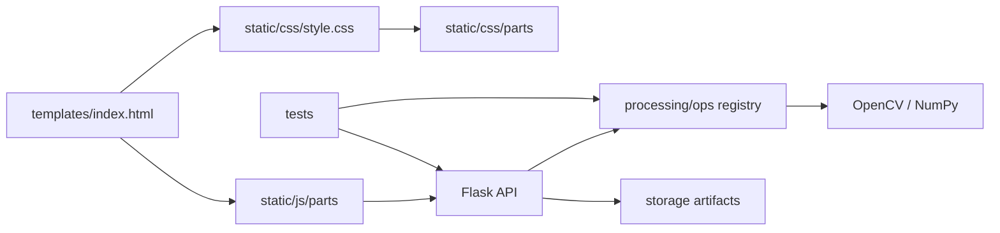
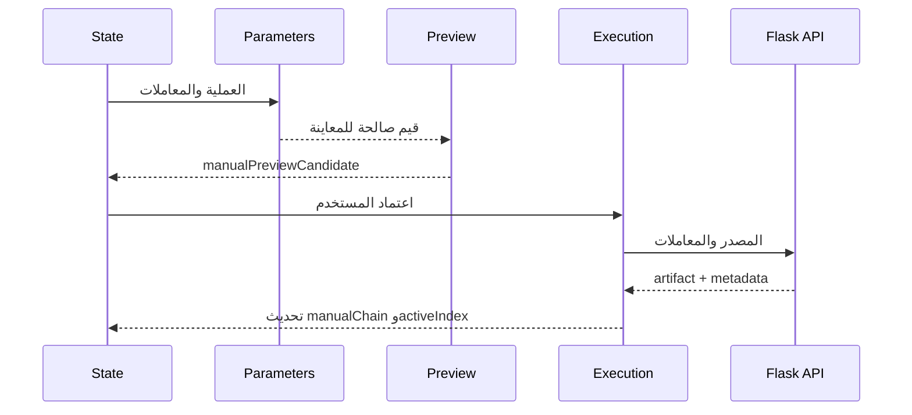
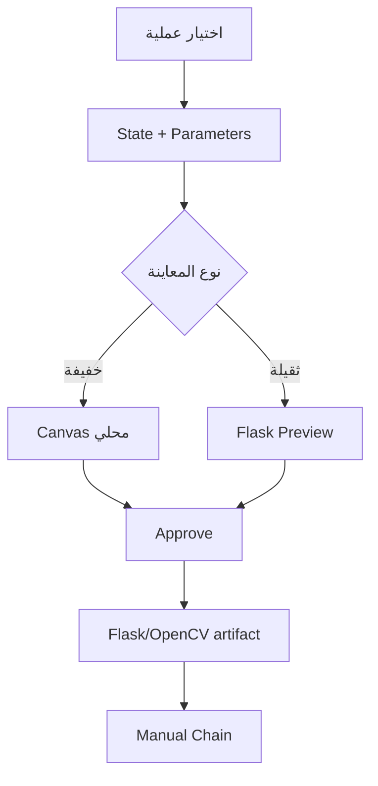

<div dir="rtl" align="right">

# تدقيق تقسيم المشروع

> **نطاق الوثيقة:** توثق هذه الصفحة قرار تقسيم المشروع وأثره على قابلية الصيانة والاختبار. أما وصف السلوك الحالي بالتفصيل فيوجد في `docs/architecture.md` و`docs/split-structure.md` و`docs/current-baseline.md`.

## 1. تنبيه تاريخي

كانت النسخة الأصلية تعتمد ملف HTML كبيراً، وملف CSS واحداً، وملف JavaScript مركزياً، وطبقة عمليات واسعة. لذلك تظهر بعض الفقرات التاريخية في هذا الملف بصيغة «سيتم التقسيم» أو تشير إلى `processing/operations.py` و`static/js/main.js`. هذه الصياغة تصف نقطة البداية أو خطة التقسيم، ولا تصف البنية المنفذة حالياً.

## 2. البنية الحالية المؤكدة

| الطبقة | الوضع الحالي | نقطة الدخول أو التجميع |
| --- | --- | --- |
| Flask | إنشاء التطبيق ومسارات الرفع والتحليل والمعاينة والاعتماد وSmart Pipeline | `app.py` مع `create_app` |
| القالب | قالب HTML رئيسي بواجهات العمل والمعاينة والمعاملات والنتائج | `templates/index.html` |
| CSS | أجزاء مسؤولة عن الأساس، سير العمل، الرفع، التحليل، المعالجة، القص والسجل، الثيم، الاستوديو، لوحة النتائج، والاستجابة | `static/css/style.css` يستورد `static/css/parts/*.css` |
| JavaScript | أجزاء للحالة والثوابت، المعاملات، المعاينة، التنفيذ والاعتماد، مع ربط الأحداث في الواجهة | `static/js/parts/*.js` |
| العمليات | وحدات OpenCV مستقلة وسجل عمليات موحد وسياسة Smart منفصلة | `processing/ops/` و`processing/pipeline.py` |
| الاختبارات | اختبارات وحدات وتكامل تغطي العمليات وFlask والتحقق والمحافظة | `tests/` |
| التخزين | ملفات تشغيلية للصور والنتائج والمعاينات، وليست مصدر المشروع | `storage/` |



## 3. تقسيم CSS

أصبح `static/css/style.css` نقطة تجميع قصيرة، وليس ملفاً ضخماً يحتوي كل قواعد التصميم. يستورد الأجزاء بالترتيب التالي:

```text
01-foundation-header.css
02-workflow-main.css
03-upload-buttons.css
04-processing-analysis.css
05-treatment-manual.css
06-crop-history-footer.css
07-theme-layout.css
08-manual-studio.css
09-preview-dashboard.css
10-icons-responsive.css
```

ويحتوي ملف التجميع على override نهائي لخلفية Header حتى تبقى الصورة العريضة كاملة داخل مساحة الرأس. هذا الموضع مقصود لأنه يعالج ترتيب الأولوية بعد استيراد أجزاء الثيم والتخطيط، ولا يعني وجود صورة Hero مستقلة.

## 4. تقسيم JavaScript

لا يُعد `static/js/main.js` حالياً مصدر السلوك الفعلي؛ الملف القديم فارغ/متروك للتوافق التاريخي، بينما التنفيذ موزع في `static/js/parts/`. التقسيم الحالي يفصل المسؤوليات التالية:

| الجزء | المسؤولية الأساسية |
| --- | --- |
| `00-state-constants.js` | الحالة، عناصر DOM، العمليات، والمعاملات العامة |
| `05-manual-parameters.js` | بناء حقول المعاملات، Crop margin، المزامنة والسحب، وتنبيه Super Resolution |
| `06-manual-preview.js` | Canvas Preview، العرض، مصدر الصورة، ومخطط أثر المعاينة |
| `07-manual-execution.js` | Flask Preview، الاعتماد، السلسلة اليدوية، `source_result_id`، Undo/Redo |
| بقية الأجزاء | الرفع، التحليل، الرسوم، التحضير، Smart Pipeline، التصدير، والثيم وربط الأحداث |



## 5. تقسيم المعالجة

استُبدل التركيز التاريخي على `processing/operations.py` بوحدات عملية داخل `processing/ops/` وسجل مركزي في `registry.py`. يحدد السجل اسم العملية ومعاملاتها وتصنيفها وسياسة استخدامها، ثم يمر التنفيذ عبر عقد موحد بدلاً من ربط كل زر بدالة منفردة داخل Flask.

| الوحدة | الدور |
| --- | --- |
| `registry.py` | تعريف العمليات وتصنيفها والمعاملات الافتراضية وحدودها |
| `operations.py` | توافق أو وظائف مشتركة متبقية حيث يلزم، وليس وصفاً لكل العمليات الحالية |
| `pipeline.py` | Smart Pipeline والعمليات المؤهلة والبوابات ومحاولات التشغيل |
| `preparation_verification.py` | قرار قبول تجهيز الوثيقة، بما في ذلك deskew-only المحافظ |
| `ops/super_resolution.py` | Super Resolution اليدوية: Lanczos + Unsharp على luminance |
| وحدات `ops/` الأخرى | تطبيق العمليات الفئوية عبر OpenCV وNumPy |

## 6. قاعدة التوافق وعدم كسر الربط

حافظ التقسيم على العقود المهمة بدلاً من نسخ منطق قديم كما هو. بقيت أسماء عناصر HTML ومسارات API اللازمة للواجهة، مع نقل السلوك إلى الأجزاء الجديدة. لا تُعتبر المعاينة المحلية نتيجة نهائية؛ عند الاعتماد يعود التنفيذ إلى Flask/OpenCV ويُنشأ artifact يدخل السلسلة.



## 7. ما الذي لم يُنقل أو لم يُضف

لم تُضف Docker أو قاعدة بيانات أو Queue أو threading لمجرد استكمال الشكل المعماري؛ هذه العناصر خارج النطاق الحالي. كما لا يجوز اعتبار كل العمليات المذكورة في وثيقة التدقيق التاريخية منفذة تلقائياً. المرجع الحاسم هو وجود العملية في `processing/ops/registry.py` ووجود اختبار أو دليل QA مناسب لها.

## 8. أثر التقسيم على الاختبار

أصبح بالإمكان اختبار العمليات، والـregistry، وSmart Pipeline، وواجهات Flask، وحالة الواجهة بصورة أكثر تحديداً. يدعم ذلك نتيجة regression الحالية `333 passed, 16 skipped`، إضافة إلى نجاح `node --check static/js/parts/*.js`. لا تعني النتيجة أن كل صورة وكل عملية مناسبة لكل حالة، بل تثبت أن العقود الأساسية ومسارات الاستخدام المختبرة تعمل.

## 9. خلاصة التدقيق

التقسيم الحالي **منفذ ومترابط**: CSS له نقطة تجميع واضحة وأجزاء موضوعية، JavaScript موزع حسب المسؤولية والحالة، وعمليات OpenCV منظمة حول registry ومسارات Smart وManual منفصلة. بقيت ملفات التوافق أو الأسماء التاريخية فقط حيث تساعد على عدم كسر الربط؛ ولا ينبغي تفسيرها على أنها مركز التنفيذ الحالي.

</div>
