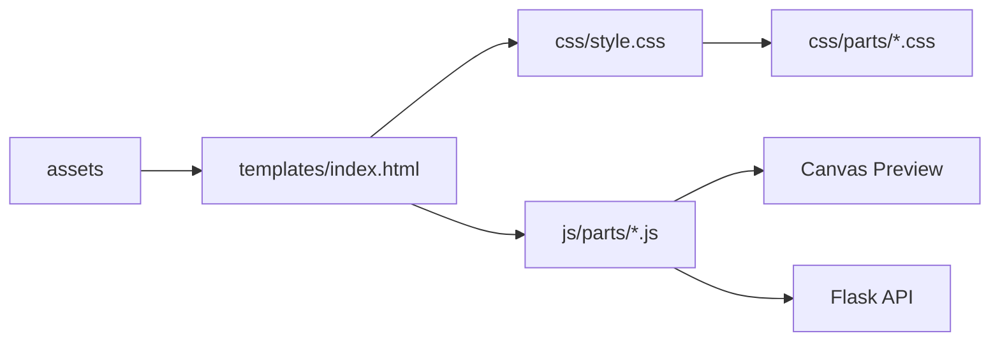

<div dir="rtl" align="right">

# الواجهة الثابتة

يحتوي `static/` على أصول واجهة Manuscript Doctor: ملفات CSS المقسمة، وحدات JavaScript، والصور والأيقونات. الواجهة HTML/CSS/Vanilla JavaScript عربية RTL، بينما تبقى المعالجة النهائية في Flask/OpenCV.

## البنية

| المسار | المسؤولية |
| --- | --- |
| `css/style.css` | نقطة تجميع أجزاء CSS والـoverride النهائي للـHeader |
| `css/parts/` | أجزاء التصميم حسب المنطقة والمسؤولية والاستجابة |
| `js/parts/` | الحالة، المعاملات، المعاينة، التنفيذ، Smart، السجل، والتحليلات |
| `assets/` | الشعار وصورة Header والأصول الصغيرة اللازمة للواجهة |
| `js/main.js` | ملف توافق تاريخي وليس مصدر السلوك الحالي |



## التدفق الحالي

تُستخدم Canvas لمعاينة العمليات الخفيفة مثل التدوير والقلب وبعض تعديلات الشدة والجاما. لا تُحفظ هذه المعاينة كنتيجة نهائية؛ عند الاعتماد يرسل العميل المصدر والمعاملات إلى Flask، ثم تُضاف نتيجة OpenCV إلى السلسلة.

العمليات الثقيلة، ومنها CLAHE وSuper Resolution، تستخدم Preview خادمية. يدعم المسار JPEG اختيارياً، مع بقاء PNG افتراضياً للتوافق.

## قواعد التعديل

عند تعديل الواجهة، يجب الحفاظ على IDs وعقود API اللازمة، وعدم وضع Diagnosis Rules أو Preservation Rules داخل JavaScript. كل حالة تعتمد على `state` الحالي، وخصوصاً `manualChain` و`manualActiveIndex` و`manualPreviewCandidate` و`isBusy`.

للتأكد من سلامة ملفات JavaScript:

```bash
node --check static/js/parts/*.js
```

</div>
