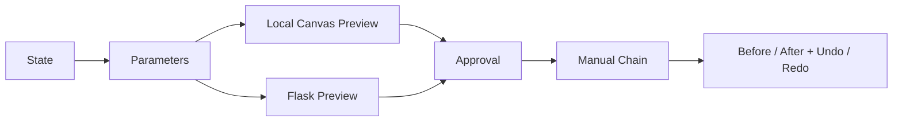

<div dir="rtl" align="right">

# طبقة JavaScript

تحتوي `static/js/parts/` على سلوك الواجهة Vanilla JavaScript. الهدف من التقسيم هو فصل الحالة والمعاملات والمعاينة والتنفيذ عن إدارة الرفع والتحليل والرسوم دون نقل قواعد التشخيص أو المحافظة إلى المتصفح.

## الأجزاء الرئيسية

| الجزء | المسؤولية |
| --- | --- |
| `00-state-constants.js` | الحالة، عناصر DOM، تعريف العمليات، والمعاملات العامة |
| `01-upload-examination.js` | الرفع والفحص الأولي وعرض المؤشرات |
| `02-analysis-dashboard.js` | Dashboard والرسوم والتحليلات |
| `03-smart-pipeline.js` | طلب Smart Pipeline وعرض القرار والنتيجة |
| `05-manual-parameters.js` | الحقول، Crop margin، السحب، وSuper Resolution |
| `06-manual-preview.js` | Canvas Preview، مصدر الصورة، ومخطط أثر المعاينة |
| `07-manual-execution.js` | Flask Preview، الاعتماد، السلسلة، Undo/Redo والتنزيل |
| الأجزاء اللاحقة | التصدير، الثيم، الاستجابة، وربط الأحداث |



## قاعدة المعاينة والاعتماد

تستخدم العمليات الخفيفة Canvas لعرض مرشح سريع، لكن لا يُحفظ المرشح المحلي كنتيجة نهائية. عند الاعتماد يرسل JavaScript العملية والمصدر الحالي إلى Flask، ثم تعرض الواجهة artifact الناتج وتضيفه إلى `manualChain`.

تستخدم الخطوة اللاحقة `source_result_id` للنتيجة السابقة، بينما تبقى `manualActiveIndex` مسؤولة عن الحالة المعروضة. لا ينبغي تنفيذ العملية نفسها مرة أخرى عند Undo أو Redo لمجرد تغيير المؤشر.

## قواعد المحافظة على العقد

يجب الحفاظ على IDs وعقود API الموجودة في `templates/index.html`. لا تضع داخل JavaScript قواعد Diagnosis أو Recommendation أو Preservation؛ هذه القرارات تأتي من Backend. يمكن للواجهة فقط عرض الحالة، بناء المعاملات، وتقديم Preview للمراجعة.

## التحقق

```bash
node --check static/js/parts/*.js
```

الملف `static/js/main.js` ليس مصدر السلوك الحالي؛ التنفيذ الفعلي موجود في الأجزاء المقسمة.

</div>
